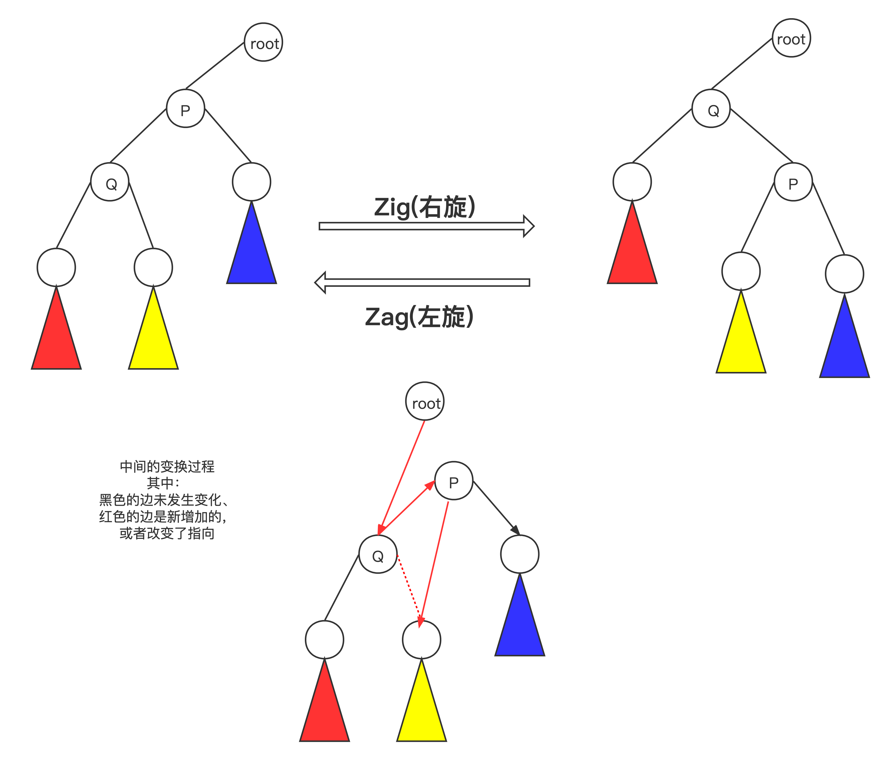

# 基本操作

## 左旋右旋


```cpp
// 右旋
void zig(Node *&p) {
    Node *q = p->left;
    p->left = q->right;
    q->right = p;
    p = q;
    pushUp(p->right);
    pushUp(p);
}

// 左旋
void zag(Node *&q) {
    Node *p = q->right;
    q->right = p->left;
    p->left = q;
    q = p;
    pushUp(q->left);
    pushUp(q);
}
```





# 红黑树

## 红黑树的性质

1. 性质1：每个节点要么是黑色，要么是红色。
2. 性质2：根节点是黑色。
3. 性质3：每个叶子节点（NIL）是黑色。
4. 性质4：每个红色结点的两个子结点一定都是黑色。
5. 性质5：任意一结点到每个叶子结点的路径都包含数量相同的黑结点。

**当然红黑树也必须是二叉搜索树。**


总结后的精华就是下面两点：

1. **红黑树的性质是每条路径的黑色节点数目相同**;
2. **红黑树保证最长路径不超过最短路径的二倍，因而近似平衡**;


# AVL


## 四种情况


## 添加步骤


## 删除步骤


```cpp
//
// Created by SongyangJi on 2020/11/16.
//


/**
 *
 *  这个例子仅仅演示了AVL的基本操作，没有用泛型，只有键，没有值，
 *  并且假定所有数据都不相同。
 *
 */
#include <algorithm>

using namespace std;

#include "binaryTree/BinarySearchTree.h"
#include <vector>
#include <queue>
#include <iostream>

using namespace std;

class AVL {
private:
    
    // 内部节点
    struct Node {
        int value;
        Node *left, *right;
        int height = 1; // 高度

        Node(int value, Node *left = nullptr, Node *right = nullptr)
                : value(value), left(left), right(right) {}
    };

    Node *root = nullptr;


public:

    AVL() {}

    bool query(int value) {
        return query(root, value);
    }

    void insert(int value) {
        insert(root, value);
    }

    void remove(int value) {
        remove(root, value);
    }

    //  层次遍历，用来简单的检查
    void displayLayerOrder() {
        cout << "层次遍历:" << endl;
        queue<Node *> q;
        q.push(root);
        while (!q.empty()) {
            int size = q.size();
            while (size--) {
                Node *p = q.front();
                q.pop();
                if (p == nullptr) continue;
                cout << p->value << "   ";
                q.push(p->left);
                q.push(p->right);
            }
            cout << endl;
        }
        cout << endl;
    }

    vector<int> getInOrder() {
        vector<int> res;
        inOrder(root, res);
        return res;
    }

    int getHeight() {
        return h(root);
    }


    virtual ~AVL() {
        helperDestructor(root);
    }

private:

//    // 求高度, 规定只有一个节点的高度为 1， 用于求平衡因子
//    int height(Node* t){
//        if(t == nullptr) return 0;
//        return max(height(t->left),height(t->right))+1;
//    }

    int h(Node *t) {
        return t ? t->height : 0;
    }

    // 平衡因子
    int balance_factor(Node *t) {
        if (t == nullptr) return 0;
        return h(t->left) - h(t->right);
    }

    // 更新 p 操作
    void pushUp(Node *p) {
        if (p == nullptr) return;
        p->height = max(h(p->left), h(p->right)) + 1;
    }

    // 右旋
    void zig(Node *&p) {
        Node *q = p->left;
        p->left = q->right;
        q->right = p;
        p = q;
        pushUp(p->right);
        pushUp(p);
    }

    // 左旋
    void zag(Node *&q) {
        Node *p = q->right;
        q->right = p->left;
        p->left = q;
        q = p;
        pushUp(q->left);
        pushUp(q);
    }

  
    /*
  	 * 下面为 AVL树的四种情况
     */
  
    // LL型,右旋 左子树的左子树插入节点
    void LL(Node *&t) {
        zig(t);
    }

    // RR,左旋 右子树的右子树插入节点
    void RR(Node *&t) {
        zag(t);
    }

    // LR，先左旋后右旋, 新节点位于t的左子树的右子树
    void LR(Node *&t) {
        zag(t->left);
        zig(t);
    }

    // RL, 先右旋后左旋, 新节点位于t的右子树的左子树
    void RL(Node *&t) {
        zig(t->right);
        zag(t);
    }
  
    // 插入操作，不仅要找到插入的位置，还要进行旋转进行高度的平衡
    void insert(Node *&t, int value) {
        if (t == nullptr) {
            t = new Node(value);
            return;
        }
        // 插入完成之后，自下而上的进行调整高度

        if (value < t->value) { // 向左插入
            insert(t->left, value);


            int leftH = h(t->left);
            int rightH = h(t->right);
            // 向左边插入，只有可能是 leftH > rightH
            if (leftH - rightH > 1) {
                // LL 型
                if (value <= t->left->value) {
                    LL(t);
                    // LR 型
                } else if (value > t->left->value) {
                    LR(t);
                }
            }


        } else if (value > t->value) { // 向右插入
            insert(t->right, value);

            int leftH = h(t->left);
            int rightH = h(t->right);
						// 向右边插入，只有可能是 rightH > leftH 
            if (rightH - leftH > 1) {
                // RR型
                if (value >= t->right->value) {
                    RR(t);
                    // RL型
                } else if (value < t->right->value) {
                    RL(t);
                }

            }

        }
        // 自底向上更新 t 的高度
        pushUp(t);
    }


    void remove(Node *&p, int value) {
        if (p == nullptr) return;
        if (value < p->value) {

            remove(p->left, value);
            // 删除左子树的节点，唯一可能导致"失衡" 的情况是 bf由 -1 变成-2
            int bf = balance_factor(p);
            if (bf < -1) {
                if (h(p->right->right) >= h(p->right->left)) {
                    RR(p);
                } else {
                    RL(p);
                }
            }

        } else if (value > p->value) {

            remove(p->right, value);
            // 删除右子树的节点，唯一可能导致"失衡" 的情况是 bf由 1 变成 2
            int bf = balance_factor(p);
            if (bf > 1) {
                if (h(p->left->left) >= h(p->left->right)) {
                    LL(p);
                } else {
                    LR(p);
                }
            }

        } else {
            // 下面细分成 3种情况 (左右子树都为空，一棵为空另一棵不为空，都不为空)

            if (p->left == nullptr && p->right == nullptr) {
                delete p;
                p = nullptr;
            } else if (p->left != nullptr && p->right == nullptr) {
                Node *temp = p->left;
                delete p;
                p = temp;
            } else if (p->left == nullptr && p->right != nullptr) {
                Node *temp = p->right;
                delete p;
                p = temp;
            } else {
                // 用前驱的值代替（后继也是一样）
                Node *cur = p->left;
                while (cur->right != nullptr) {
                    cur = cur->right;
                }

                p->value = cur->value;

                remove(p->left, cur->value);

                // 这个地方仍然要有形态的调整

                // 删除左子树的节点，唯一可能导致"失衡" 的情况是 bf由 -1 变成-2
                int bf = balance_factor(p);
                if (bf < -1) {
                    if (h(p->right->right) >= h(p->right->left)) {
                        RR(p);
                    } else {
                        RL(p);
                    }
                }

            }
            // 自底向上更新 t 的高度
            pushUp(p);
        }
    }


    bool query(Node *p, int value) {
        if (p == nullptr) return false;
        if (value < p->value) {
            return query(p->left, value);
        } else if (value > p->value) {
            return query(p->right, value);
        } else {
            return true;
        }
    }

    void helperDestructor(Node *node) {
        if (node == nullptr) return;
        helperDestructor(node->left);
        helperDestructor(node->right);
        delete node;
    }

    void inOrder(Node *node, vector<int> &v) {
        if (node == nullptr) return;

        inOrder(node->left, v);
        v.push_back(node->value);
        inOrder(node->right, v);
    }


};

int main() {
    AVL avl;
    for (int x = 1; x <= 15; x++) {
        avl.insert(x);
    }
    vector<int> v = {11,14,13,15,9,2,3,1,6,5,7};

    for(int x:v){
        avl.remove(x);
        avl.displayLayerOrder();
    }
    return 0;
}

```


> 参考链接
>
> [红黑树(一)之 原理和算法详细介绍](https://www.cnblogs.com/skywang12345/p/3245399.html)

