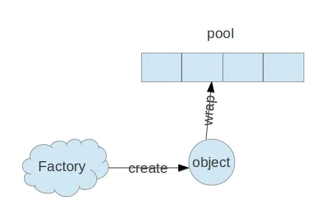
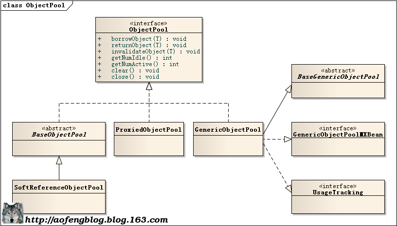
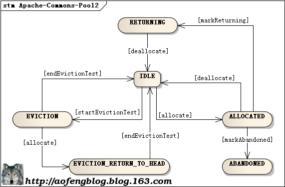
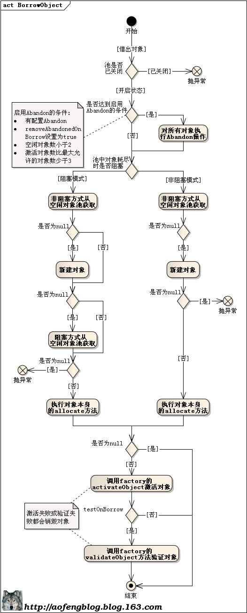
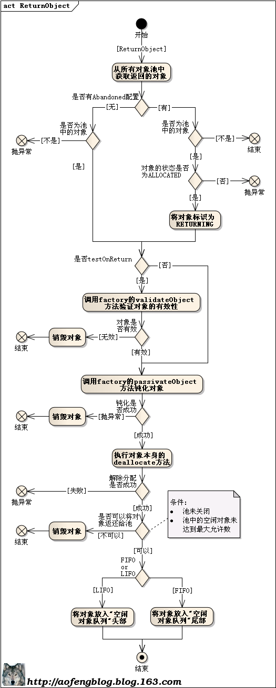

## 安装

## 项目介绍

> 创建新的对象并初始化的操作，可能会消耗很多的时间。在这种对象的初始化工作包含了一些费时的操作（例如，从一台位于20,000千米以外的主机上读出一些数据）的时候，尤其是这样。在需要大量生成这样的对象的时候，就可能会对性能造成一些不可忽略的影响。要缓解这个问题，除了选用更好的硬件和更棒的虚拟机以外，适当地采用一些能够减少对象创建次数的编码技巧，也是一种有效的对策。对象池化技术（Object Pooling）就是这方面的著名技巧，而Jakarta Commons Pool组件则是处理对象池化的得力外援。

Commons Pool组件提供了一整套用于实现对象池化的框架，以及若干种各具特色的对象池实现，可以有效地减少处理对象池化时的工作量，为其它重要的工作留下更多的精力和时间

Apache Common-pool2完全重写了的对象池的实现，显著的提升了性能和可伸缩性，特别是在高并发加载的情况下。2.0 版本包含可靠的实例跟踪和池监控。


### Maven 依赖

```xml
<properties>
  <commons-pool2.version>2.11.1</commons-pool2.version>
</properties>

<dependency>
  <groupId>org.apache.commons</groupId>
  <artifactId>commons-pool2</artifactId>
  <version>${commons-pool2.version}</version>
</dependency>
```


## 接口设计

`Apache Commons Pool`实现了**对象池**的功能。定义了对象的生成、销毁、激活、钝化等操作及其状态转换，并提供几个默认的对象池实现。
在讲述其实现原理前，先提一下其中有几个重要的对象：

+ Object Pool（对象池）。

+ PooledObject（池对象）。

+ PooledObjectFactory（池对象工厂）。

  

三种之间的关系图：




下面分别详细讲解它们的实现。


（以下三个均为接口，位于 org.apache.commons.pool2）

### ObjectPool

Object Pool负责管理PooledObject，如：借出对象，返回对象，校验对象，有多少激活对象，有多少空闲对象。

以下为类图结构，有几个默认的实现类可以直接使用。

+ GenericObjectPool。
+ ProsiedObjectPool。

+ SoftReferenceObjectPool。


 


| 方法             | 描述                                                         |
| :--------------- | :----------------------------------------------------------- |
| borrowObject     | 从池中借出一个对象。要么调用PooledObjectFactory.makeObject方法创建，要么对一个空闲对象使用PooledObjectFactory.activeObject进行激活，然后使用PooledObjectFactory.validateObject方法进行验证后再返回 |
| returnObject     | 将一个对象返还给池。根据约定：对象必须 是使用borrowObject方法从池中借出的 |
| invalidateObject | 废弃一个对象。根据约定：对象必须 是使用borrowObject方法从池中借出的。通常在对象发生了异常或其他问题时使用此方法废弃它 |
| addObject        | 使用工厂创建一个对象，**钝化**并且将它放入空闲对象池         |
| getNumberIdle    | 返回池中空闲的对象数量。有可能是池中可供借出对象的近似值。如果这个信息无效，返回一个负数 |
| getNumActive     | 返回从借出的对象数量。如果这个信息不可用，返回一个负数       |
| clear            | 清除池中的所有空闲对象，释放其关联的资源（可选）。清除空闲对象必须使用PooledObjectFactory.destroyObject方法，池可用。 |
| close            | 关闭池并释放关联的资源，池不可用。                           |


### PooledObject

用于封装对象（如：线程、数据库连接、TCP连接），将其包裹成可被池管理的对象。

此类的实现必须是线程安全的。

提供了两个默认的池对象实现：

+ DefaultPoolObject。用于非软引用的普通对象。
+ PooledSoftReference。用于软引用的对象。


在开发连接池、线程池等组件时，需要根据实际情况重载5个方法：startEvictionTest、endEvictionTest、allocate、deallocate和invalidate，用于在不同的场景下修改被包裹对象的内部状态。 


此接口的重要的方法：

```java
// 获得目标对象
T getObject();
// 获取PooledObject的状态
PooledObjectState getState();

boolean startEvictionTest();

boolean endEvictionTest(Deque<PooledObject<T>> idleQueue);

// 分配对象。 如果原始状态为 IDLE, 则返回 true
boolean allocate(); 


// 如果当前已ALLOCATED ，则取消分配对象并将其设置为IDLE 。
// 如果状态为ALLOCATED则为true 。
boolean deallocate();

void invalidate();


PooledObjectState getState();

void markAbandoned();

void markReturning();

/*
... 省略其他方法
*/
```


PooledObject有多种状态，在不同的环节或经过处理后状态会发生变化。

```java
package org.apache.commons.pool2;

public enum PooledObjectState {
    IDLE, // 	位于队列中，未使用
  
    ALLOCATED, // 已被分配，正在使用
  
    EVICTION,  // 位于队列中，当前正在测试，可能会被回收到队列
  
    EVICTION_RETURN_TO_HEAD, // 不在队列中，目前正在测试是否可能被驱逐。 
  
    VALIDATION, // 位于队列中，当前正在验证
  
    VALIDATION_PREALLOCATED, // 不在队列中，当前正在验证。当对象从池中被借出，在配置了testOnBorrow的情况下，对象从队列移除和进行预分配的时候会进行验证
  
    VALIDATION_RETURN_TO_HEAD, // 不在队列中，正在进行验证。从池中借出对象时，从队列移除对象时会先进行测试。返回到队列头部的时候应该做一次完整的验证
  
    INVALID, // 	回收或验证失败，【即将/已经】 销毁
  
    ABANDONED, // 视为放弃，无效
  
    RETURNING // 返还到池中
}
```

状态转换如下图：




### PooledObjectFactory

一个定义生命周期方法的接口，用于由ObjectPool提供服务的实例。

PooledObjectFactory必须实现线程安全。

Commons pool2 定义了抽象工厂`BasePooledObjectFactory`，使用者应该继承这个抽象类实现自己的池化工厂。


| 方法            | 描述                                                         |
| :-------------- | :----------------------------------------------------------- |
| makeObject      | 每当需要新实例时都会调用makeObject 。                        |
| activateObject  | 每一个钝化（passivated）的ObjectPool实例从池中借出（borrowed）前调用。 |
| validateObject  | 可能用于从池中借出对象时，对处于激活（activated）状态的ObjectPool实例进行测试确保它是有效的。也有可能在ObjectPool实例返还池中进行钝化前调用进行测试是否有效。它只对处于激活状态的实例调用。 |
| passivateObject | 当实例返还池中的时候调用。                                   |
| destroyObject   | 当实例从池中被清理出去丢弃的时候调用。                       |


## 常用的实现类

### GenericObjectPool

### `borrowObject`

下面是GenericObjectPool中borrowObject方法的逻辑实现，有阻塞式和非阻塞式两种获取对象的模式。
默认情况下是阻塞的（你可以传入配置类更改这一行为）。




### `returnObject`

下面是GenericObjectPool中returnObject方法的逻辑实现，在这里实现的FIFO（先进先出）和LIFO（后进先出）。





### DefaultPooledObject


## 使用介绍

```java
Object obj = null;
  
   try {
       obj = pool.borrowObject();
       try {
           //...use the object...
       } catch (Exception e) {
           // invalidate the object
           pool.invalidateObject(obj);
           // do not return the object to the pool twice
           obj = null;
       } finally {
           // make sure the object is returned to the pool
           if (null != obj) {
               pool.returnObject(obj);
          }
       }
   } catch(Exception e) {
         // failed to borrow an object
   }
```


## 参考链接

[Apache Commons Pool](http://commons.apache.org/proper/commons-pool/)

[Apache Commons Pool2 源码分析](http://aofengblog.com/2014/08/06/Apache-Commons-Pool2-%E6%BA%90%E7%A0%81%E5%88%86%E6%9E%90/)

注：插图来源于[http://aofengblog.com/](http://aofengblog.com/2014/08/06/Apache-Commons-Pool2-%E6%BA%90%E7%A0%81%E5%88%86%E6%9E%90/)
