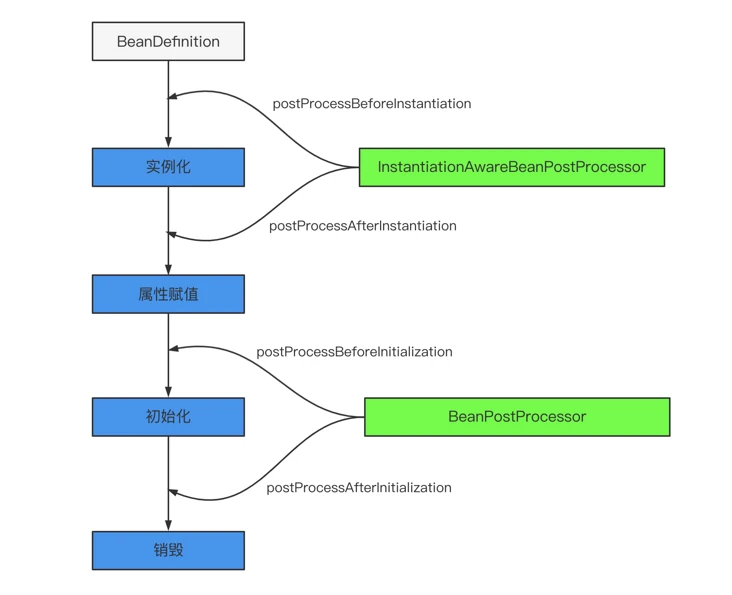
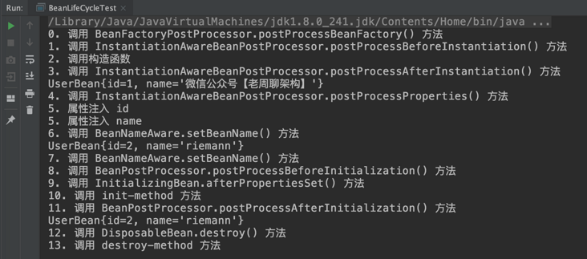

## 一张图解释

对于 Spring Bean 的生命周期来说：

+ 实例化 Instantiation
+ 属性赋值 Populate
+ 初始化 Initialization
+ 销毁 Destruction

## Spring Bean 的生命周期的扩展点

Spring Bean 的生命周期的扩展点超级多，老周这里不可能全部列出来，只说核心的扩展点。这也就是为什么 Spring 的扩展性很好的原因，开了很多的口子，尽可能让某个功能高内聚松耦合，用户需要哪个功能就用哪个，而不是直接来一个大而全的东西。

**3.1 Bean 自身的方法**

比如构造函数、getter/setter 以及 init-method 和 destory-method 所指定的方法等，

也就对应着上文说的实例化 -> 属性赋值 -> 初始化 -> 销毁四个阶段。

**3.2 容器级的方法（BeanPostProcessor 一系列接口）**

主要是后处理器方法，比如下图的 `InstantiationAwareBeanPostProcessor`、`BeanPostProcessor` 接口方法。这些接口的实现类是独立于 Bean 的，并且会注册到 Spring 容器中。在 Spring 容器创建任何 Bean 的时候，这些后处理器都会发生作用。

DEMO

> 1、Bean自身的方法：这个包括了Bean本身调用的方法和通过配置文件中<bean>的init-method和destory-method指定的方法。
> 2、Bean级生命周期接口方法：这个包括了BeanNameAware、BeanFactoryAware、InitializingBean和DisposableBean等接口方法。
> 3、容器级生命周期接口方法：这个包括了InstantiationAwareBeanPostProcessor和BeanPostProcessor这两个接口实现，一般称它们的实现类为”后处理器“。
> 4、工厂后置处理接口方法：BeanFactoryPostProcessor,BeanDefinitionRegistryPostProcessor,等等非常有用的工厂后处理器接口的方法。工厂后处理器也是容器级的。在应用上下文装配配置文件之后立即调用。

## Bean的后置处理器

> https://stackoverflow.com/questions/9862127/what-is-the-difference-between-beanpostprocessor-and-init-destroy-method-in-spri
>
> https://www.cnblogs.com/duanxz/p/3750725.html

### BeanFactoryPostProcessor、BeanPostProcessor

在容器实际实例化任何其它的bean之前读取配置元数据，并有可能修改它。

**区别**：BeanFactoryPostProcessor 仅仅对 bean definitions 发生关系，不能对bean instances 交互，对bean instances 的交互，由BeanPostProcessor的实现来处理。

**执行顺序**：

BeanFactoryPostProcessor的回调比BeanPostProcessor要早。

### BeanPostProcessor、InitializingBean

**区别**：

BeanPostProcessor针对的多个bean的后置处理逻辑，而InitializingBean#afterPropertiesSet、@PostConstruct、@init-method都是针对单个bean的后置处理。

**执行顺序**：

如上图，指定的先后顺序如下：

1. BeanPostProcessor#postProcessBeforeInitialization

2. + @PostConstruct

   + InitializingBean#afterPropertiesSet

   + init-method defined in XML
3. BeanPostProcessor#postProcessAfterInitialization

>参考
>[一文读懂 Spring Bean 的生命周期](https://segmentfault.com/a/1190000040365130)

