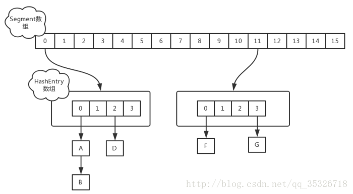
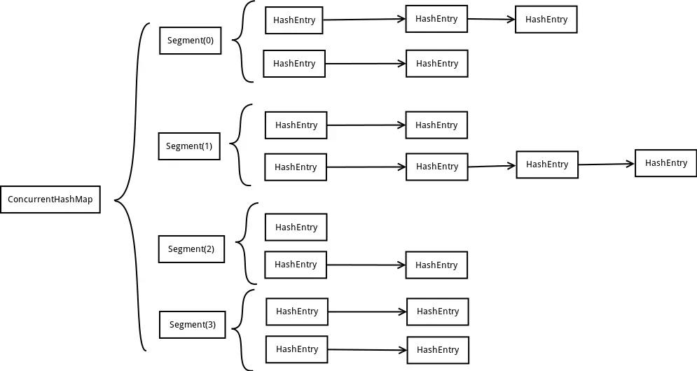

本篇文章将要介绍的 ConcurrentHashMap 是 HashMap 的并发版本，它是线程安全的，并且在高并发的情境下，性能优于 Hashtable 很多。


## 历史版本的演变


> *一句话总结*
>
> 从JDK7版本的ReentrantLock+Segment+HashEntry，到JDK8版本中synchronized+CAS+HashEntry+红黑树。


### JDK7的ConcurrentHashMap

JDK7 采用**分段锁技术**，**整个 Hash 表被分成多个段（默认为16段），每个段中会对应一个 Segment 段锁**，**段与段之间可以并发访问，但是多线程想要操作同一个段是需要获取锁的**。所有的 put，get，remove 等方法都是根据键的 hash 值对应到相应的段中，然后尝试获取锁进行访问。

相当于通过增加锁的数量来降低锁的粒度（能支持 N 个 Segment 这么多次数的并发）。




下图为JDK7的数据结构。




Segment 是 ConcurrentHashMap 的一个内部类，主要的组成如下：

```java
static final class Segment<K,V> extends ReentrantLock implements Serializable {
       private static final long serialVersionUID = 2249069246763182397L;
       
       // 和 HashMap 中的 HashEntry 作用一样，真正存放数据的桶
       transient volatile HashEntry<K,V>[] table;
       transient int count;
       transient int modCount;
       transient int threshold;
       final float loadFactor;
       
}
```


原理上来说：ConcurrentHashMap 采用了分段锁技术，其中 Segment 继承于 ReentrantLock。不会像 HashTable 那样不管是 put 还是 get 操作都需要做同步处理，理论上 ConcurrentHashMap 支持 CurrencyLevel (Segment 数组数量)的线程并发。每当一个线程占用锁访问一个 Segment 时，不会影响到其他的 Segment。

下面也来看看核心的 `put`、`get` 方法。

```java
public V put(K key, V value) {
    Segment<K,V> s;
    if (value == null)
        throw new NullPointerException();
    int hash = hash(key);
    int j = (hash >>> segmentShift) & segmentMask;
    if ((s = (Segment<K,V>)UNSAFE.getObject          // nonvolatile; recheck
         (segments, (j << SSHIFT) + SBASE)) == null) //  in ensureSegment
        s = ensureSegment(j);
    return s.put(key, hash, value, false);
}
```

首先是通过 key 定位到 Segment，之后在对应的 Segment 中进行具体的 put。


```java
final V put(K key, int hash, V value, boolean onlyIfAbsent) {
    HashEntry<K,V> node = tryLock() ? null :
        scanAndLockForPut(key, hash, value); // 尝试获取锁，如果获取失败肯定就有其他线程存在竞争
    V oldValue;
    try {
        HashEntry<K,V>[] tab = table;
        int index = (tab.length - 1) & hash;
        HashEntry<K,V> first = entryAt(tab, index);
        for (HashEntry<K,V> e = first;;) {
            if (e != null) {
                K k;
                if ((k = e.key) == key ||
                    (e.hash == hash && key.equals(k))) {
                    oldValue = e.value;
                    if (!onlyIfAbsent) {
                        e.value = value;
                        ++modCount;
                    }
                    break;
                }
                e = e.next;
            }
            else {
                if (node != null)
                    node.setNext(first);
                else
                    node = new HashEntry<K,V>(hash, key, value, first);
                int c = count + 1;
                if (c > threshold && tab.length < MAXIMUM_CAPACITY)
                    rehash(node);
                else
                    setEntryAt(tab, index, node);
                ++modCount;
                count = c;
                oldValue = null;
                break;
            }
        }
    } finally {
        unlock();
    }
    return oldValue;
}
```

`scanAndLockForPut`为第一步操作：获取锁，尝试自旋获取锁（try lock），如果重试的次数达到了 `MAX_SCAN_RETRIES` 则改为阻塞锁（lock）获取，保证能获取成功。


再结合图看看 put 的流程。

1. 将当前 Segment 中的 table 通过 key 的 hashcode 定位到 HashEntry。
2. 遍历该 HashEntry，如果不为空则判断传入的 key 和当前遍历的 key 是否相等，相等则覆盖旧的 value。
3. 不为空则需要新建一个 HashEntry 并加入到 Segment 中，同时会先判断是否需要扩容。
4. 最后会解除在 1 中所获取当前 Segment 的锁。


`get`的逻辑比价简单：

只需要将 Key 通过 Hash 之后定位到具体的 Segment ，再通过一次 Hash 定位到具体的元素上。

由于 HashEntry 中的 value 属性是用 volatile 关键词修饰的，保证了内存可见性，所以每次获取时都是最新值。

ConcurrentHashMap 的 get 方法是非常高效的，**因为整个过程都不需要加锁**。


### JDK8的ConcurrentHashMap

J**DK8 取消了基于 Segment 的分段锁思想**，**改用 CAS + synchronized 控制并发操作**，在某些方面提升了性能。

**并且追随 1.8 版本的 HashMap 底层实现，使用数组+链表+红黑树进行数据存储**。本篇主要介绍 1.8 版本的 ConcurrentHashMap 的具体实现。

### put流程

+ 根据 key 计算出 hashcode 。
+ 判断是否需要进行初始化。
+ `f` 即为当前 key 定位出的 Node，**如果为空表示当前位置可以写入数据，利用 CAS 尝试写入，失败则自旋保证成功**。
+ 如果当前位置的 `hashcode == MOVED == -1`,则需要进行扩容。
+ 如果都不满足，则利用 synchronized 锁写入数据。
+ 如果数量大于 `TREEIFY_THRESHOLD` 则要转换为红黑树。


有关其之前版本的实现情况，这里推荐几篇文章：

[谈谈ConcurrentHashMap1.7和1.8的不同实现](http://www.jianshu.com/p/e694f1e868ec)
[ConcurrentHashMap在jdk1.8中的改进](https://www.cnblogs.com/everSeeker/p/5601861.html)
[ConcurrentHashMap原理分析（1.7与1.8）](https://www.cnblogs.com/study-everyday/p/6430462.html)


### JDK7与JDK8的区别

1. **底层数据结构**：**取消了Segment分段锁的数据结构**，取而代之的是Node数组+链表+红黑树的结构，从而实现了对每一行数据进行加锁，进一步减少并发冲突的概率。

> Node类成员变量Node的元素val和指针next都标注volatile，目的是在多线程环境下**线程A修改结点的val或者新增节点的时候是对线程B可见的**。

> ConcurrentHashMap有成员变量transient volatile Node<K,V>[] table，此volatile的目的是**为了使Node数组在扩容的时候对其他线程具有可见性**。（例如：volatile int array[10]是指array的地址是volatile的而不是数组元素的值是volatile的.）

2. **保证线程安全机制**：JDK7采用segment的分段锁机制实现线程安全，其中segment继承自ReentrantLock。**JDK8采用CAS(读)+Synchronized(写)保证线程安全**。
3. **锁的粒度**：原来是对需要进行数据操作的Segment加锁**，JDK8调整为对每个数组元素加锁（Node）**。
4. **链表转化为红黑树**：定位结点的hash算法简化会带来弊端，Hash冲突加剧，因此在链表节点数量大于8时，会将链表转化为红黑树进行存储。
5. **查询时间复杂度**：从原来的遍历链表O(n)，变成遍历红黑树O(logN)。


### Collections.synchronizedMap、Hashtable、ConcurrentHashMap区别


> 参考文章
>
> [为并发而生的 ConcurrentHashMap（Java 8）](https://www.cnblogs.com/yangming1996/p/8031199.html)
>
> [解读Java8中ConcurrentHashMap是如何保证线程安全的](https://juejin.cn/post/6844903813892014087)
>
> [HashMap? ConcurrentHashMap? 相信看完这篇没人能难住你！](https://crossoverjie.top/2018/07/23/java-senior/ConcurrentHashMap/)

