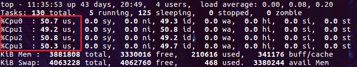
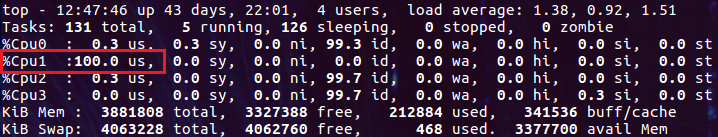
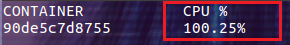
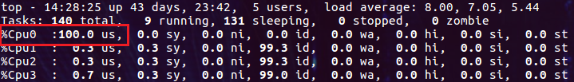
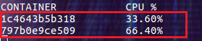

# 压测工具

使用ubuntu的`stress` 作为压测工具，并制作镜像

```dockerfile
FROM ubuntu:latest

RUN apt-get update && \
        apt-get install stress
```
shell命令
```shell
docker build -t u-stress:latest .
```


# 限制CPU资源
## 限制CPU核心个数（百分比）
在 docker 1.13 及更高的版本上，能够很容易的限制容器可以使用的主机 CPU 核心个数。
只需要通过 --cpus 选项指定容器可以使用的 CPU 个数就可以了，并且还可以指定如 1.5 之类的小数。（为什么还可以是小数呢，后面解释）

通过下面的命令创建容器，--cpus=2 表示容器最多可以使用主机上两个 CPU：

```shell
docker run -it --rm --cpus=2 u-stress:latest /bin/bash
```
然后由 stress 命令创建四个繁忙的进程消耗 CPU 资源：
```shell
stress -c 4
```
使用`docker stats`查看容状态，发现容器 CPU 的负载为 200%左右，它的含义为单个 CPU 负载的两倍。我们也可以把它理解为有两颗 CPU核心在 100% 的为它工作。


再让我们通过 top 命令看看主机 CPU 的真实负载情况：




实际的情况并不是两个 CPU 负载 100%，而另外两个负载 0%。四个 CPU 的负载都是 50%，加起来容器消耗的 CPU 总量就是两个 CPU 100% 的负载。


**所以对于进程来说是没有 CPU 个数这一概念的**，内核只能通过进程消耗的 CPU 时间片来统计出进程占用 CPU 的百分比。这也是我们看到的各种工具中都使用百分比来说明 CPU 使用率的原因。
并且 --cpus 选项支持设为小数也从侧面说明了对 CPU 的计量只能是百分比。


## 指定固定的 CPU集
通过 --cpus 选项我们无法让容器始终在一个或某几个 CPU 上运行，但是通过`--cpuset-cpus` 选项却可以做到！这是非常有意义的，因为现在的多核系统中每个核心都有自己的缓存，如果频繁的调度进程在不同的核心上执行势必会带来缓存失效等开销。下面我们就演示如何设置容器使用固定的 CPU，下面的命令为容器设置了 --cpuset-cpus 选项，指定运行容器的 CPU 编号为 1：(编号从0开始)
```shell
docker run -it --rm --cpuset-cpus="1" u-stress:latest /bin/bash
```


再启动压力测试命令：

```shell
stress -c 4
```

然后查看主机 CPU 的负载情况：





这次只有 Cpu1 达到了 100%，其它的 CPU 并未被容器使用。我们还可以反复的执行 stress -c 4 命令，但是始终都是 Cpu1 在干活。
再看看容器的 CPU 负载，也是只有 100%：





-cpuset-cpus 选项还可以一次指定多个 CPU：
比如：

```shell
docker run -it --rm --cpuset-cpus="1,3" u-stress:latest /bin/bash
```
--cpuset-cpus 选项的一个缺点是必须指定 CPU 在操作系统中的编号，这对于动态调度的环境(无法预测容器会在哪些主机上运行，只能通过程序动态的检测系统中的 CPU 编号，并生成 docker run 命令)会带来一些不便。

## 设置使用 CPU 的权重
当 CPU 资源充足时，设置 CPU 的权重是没有意义的。只有在容器争用 CPU 资源的情况下， CPU 的权重才能让不同的容器分到不同的 CPU 用量。--cpu-shares 选项用来设置 CPU 权重，它的默认值为 1024。我们可以把它设置为 2 表示很低的权重，但是设置为 0 表示使用默认值 1024。
下面我们分别运行两个容器，指定它们都使用 Cpu0，并分别设置 --cpu-shares 为 512 和 1024：

```shell
$ docker run -it --rm --cpuset-cpus="0" --cpu-shares=512 u-stress:latest /bin/bash
$ docker run -it --rm --cpuset-cpus="0" --cpu-shares=1024 u-stress:latest /bin/bash
```

在两个容器中都运行 stress -c 4 命令。

此时主机 Cpu0 的负载为 100%：



容器中 CPU 的负载为：




两个容器分享一个 CPU，所以总量应该是 100%。具体每个容器分得的负载则取决于 --cpu-shares 选项的设置！我们的设置分别是 512 和 1024，则它们分得的比例为 1:2。在本例中如果想让两个容器各占 50%，只要把 --cpu-shares 选项设为相同的值就可以了。


参考：

https://sanhe-dev-exp-share.readthedocs.io/03-Docker/03-Restrict-CPU-Memory-and-GPU/README.html