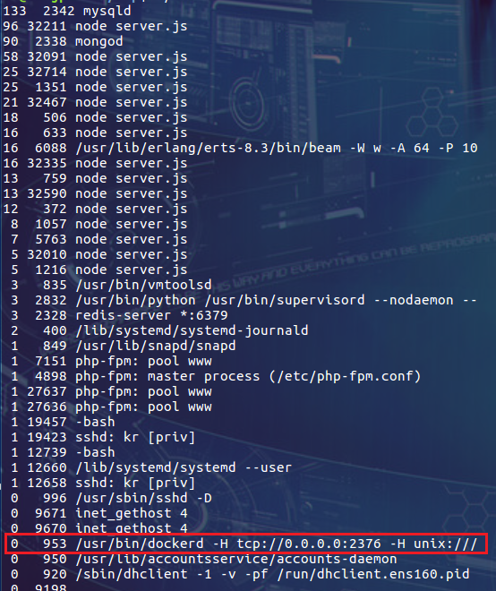
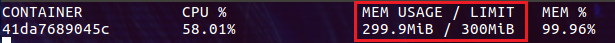
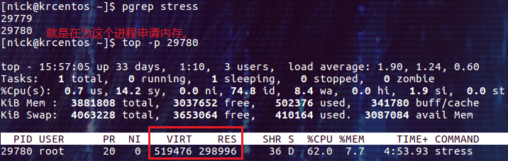
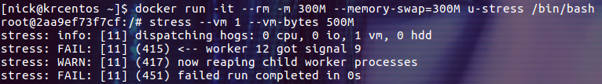

> 默认情况下容器使用的资源是不受限制的。也就是可以使用主机内核调度器所允许的最大资源。但是在容器的使用过程中，经常需要对容器可以使用的主机资源进行限制，本文介绍如何限制容器可以使用的主机内存。


# 压测工具

使用ubuntu的`stress` 作为压测工具，并制作镜像

```dockerfile
FROM ubuntu:latest

RUN apt-get update && \
        apt-get install stress
```
shell命令
```shell
docker build -t u-stress:latest .
```


# 为什么要限制容器对内存的使用？

限制容器不能过多的使用主机的内存是非常重要的。对于 linux 主机来说，一旦内核检测到没有足够的内存可以分配，就会扔出 OOME(Out Of Memmory Exception)，并开始杀死一些进程用于释放内存空间。糟糕的是任何进程都可能成为内核猎杀的对象，包括 docker daemon 和其它一些重要的程序。更危险的是如果某个支持系统运行的重要进程被干掉了，整个系统也就宕掉了！这里我们考虑一个比较常见的场景，大量的容器把主机的内存消耗殆尽，OOME 被触发后系统内核立即开始杀进程释放内存。如果内核杀死的第一个进程就是 docker daemon 会怎么样？结果是没有办法管理运行中的容器了，这是不能接受的！
针对这个问题，docker 尝试通过调整 docker daemon 的 OOM 优先级来进行缓解。内核在选择要杀死的进程时会对所有的进程打分，直接杀死得分最高的进程，接着是下一个。当 docker daemon 的 OOM 优先级被降低后(注意容器进程的 OOM 优先级并没有被调整)，docker daemon 进程的得分不仅会低于容器进程的得分，还会低于其它一些进程的得分。这样 docker daemon 进程就安全多了。


我们可以通过下面的脚本直观的看一下当前系统中所有进程的得分情况：

```shell
#!/bin/bash
number=$1
for proc in $(find /proc -maxdepth 1 -regex '/proc/[0-9]+'); do
    printf "%2d %5d %s\n" \
        "$(cat $proc/oom_score)" \
        "$(basename $proc)" \
        "$(cat $proc/cmdline | tr '\0' ' ' | head -c 50)"
done 2>/dev/null | sort -nr | head -n "$number"
```


此脚本输出得分最高的 40 个进程，并进行了排序：



第一列显示进程的得分，mysqld 排到的第一名。显示为 node server.js 的都是容器进程，排名普遍比较靠前。红框中的是 docker daemon 进程，非常的靠后，都排到了 sshd 的后面。

有了上面的机制后是否就可以高枕无忧了呢！不是的，docker 的官方文档中一直强调这只是一种缓解的方案，并且为我们提供了一些降低风险的建议：

+ 通过测试掌握应用对内存的需求
+ 保证运行容器的主机有充足的内存
+ 限制容器可以使用的内存
+ 为主机配置 swap

其实就是说：通过限制容器使用的内存上限，可以降低主机内存耗尽时带来的各种风险。


# 限制Memory

/Users/jisongyang/go/pkg/mod/github.com/docker/docker@v20.10.15+incompatible/api/types/container/host_config.go

## 限制内存使用上限
使用`-m(--memory=)`可以限制容器使用的最大内存。

```shell
docker run -it -m 300M --memory-swap -1 --name con1 u-stress /bin/bash
```


下面的 stress 命令会创建一个进程并通过 malloc 函数分配内存：

```shell
stress --vm 1 --vm-bytes 500M
```

通过 docker stats 命令查看实际情况：



上面的 docker run 命令中通过 -m 选项限制容器使用的内存上限为 300M。同时设置 memory-swap 值为 -1，它表示容器程序使用内存的受限，而可以使用的 swap 空间使用不受限制(宿主机有多少 swap 容器就可以使用多少)。
下面我们通过 top 命令来查看 stress 进程内存的实际情况：



上面的截图中先通过 pgrep 命令查询 stress 命令相关的进程，进程号比较大的那个是用来消耗内存的进程，我们就查看它的内存信息。VIRT 是进程虚拟内存的大小，所以它应该是 500M。RES 为实际分配的物理内存数量，我们看到这个值就在 300M 上下浮动。看样子我们已经成功的限制了容器能够使用的物理内存数量。


## 限制可用的 swap 大小
强调一下 --memory-swap 是必须要与 --memory 一起使用的。

正常情况下， --memory-swap 的值包含容器可用内存和可用 swap。所以 --memory="300m" --memory-swap="1g" 的含义为：
容器可以使用 300M 的物理内存，并且可以使用 700M(1G -300M) 的 swap。--memory-swap 是容器可以使用的物理内存和可以使用的 swap 之和。

把 --memory-swap 设置为 0 和不设置是一样的，此时如果设置了 --memory，容器可以使用的 swap 大小为 --memory 值的两倍。（也就是说缺省情况下swap空间刚好为1倍的memory）

**如果 --memory-swap 的值和 --memory 相同，则容器不能使用 swap**。下面的 demo 演示了在没有 swap 可用的情况下向系统申请大量内存的场景：
```shell
$ docker run -it --rm -m 300M --memory-swap=300M u-stress /bin/bash
# stress --vm 1 --vm-bytes 500M
```



demo 中容器的物理内存被限制在 300M，但是进程却希望申请到 500M 的物理内存。在没有 swap 可用的情况下，进程直接被 OOM kill 了。如果有足够的 swap，程序至少还可以正常的运行。

我们可以通过 --oom-kill-disable 选项强行阻止 OOM kill 的发生，但是最好不要。


# 总结
通过限制容器可用的物理内存，可以避免容器内服务异常导致大量消耗主机内存的情况(此时让容器重启是较好的策略)，因此可以降低主机内存被耗尽带来的风险。


https://sanhe-dev-exp-share.readthedocs.io/03-Docker/03-Restrict-CPU-Memory-and-GPU/README.html