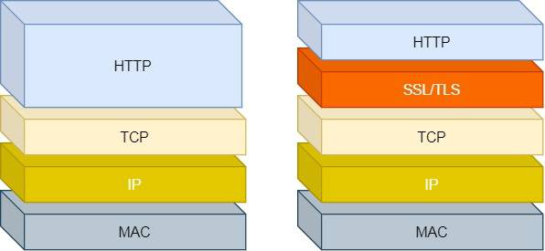
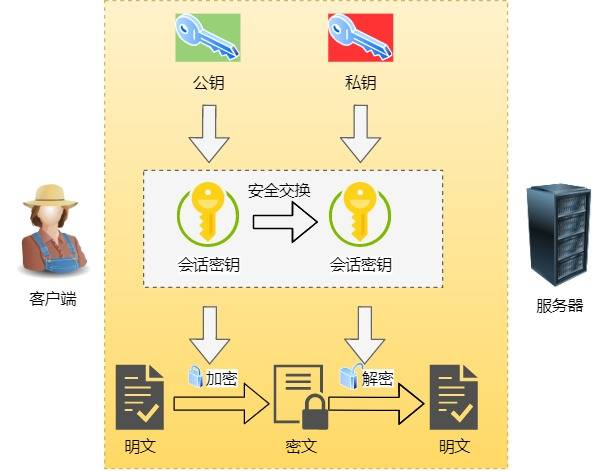
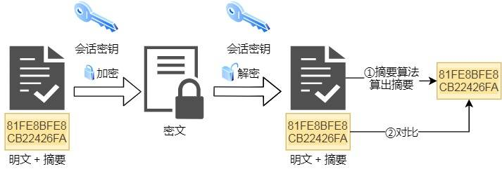
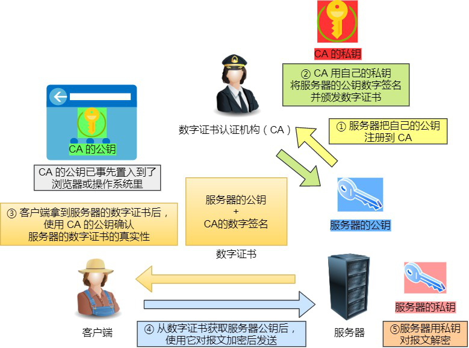
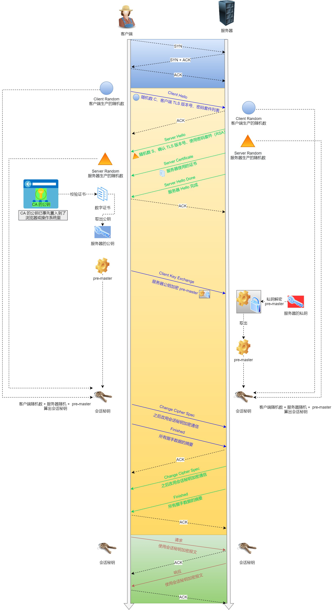
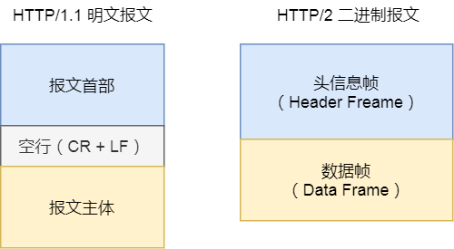
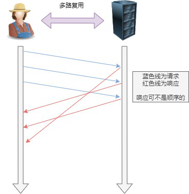
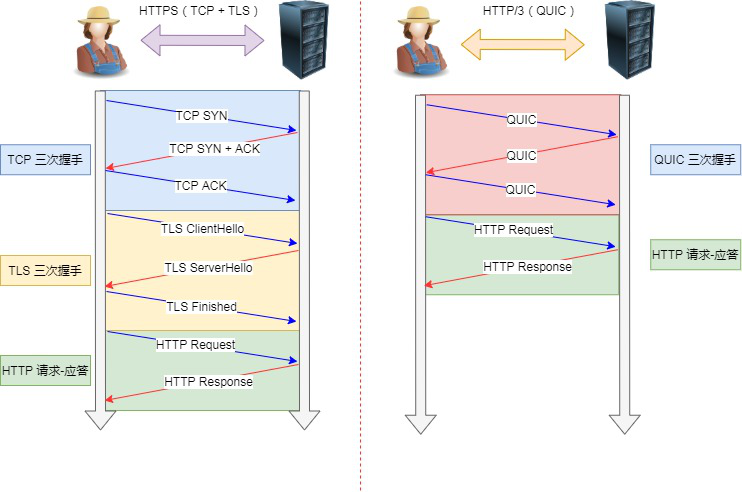
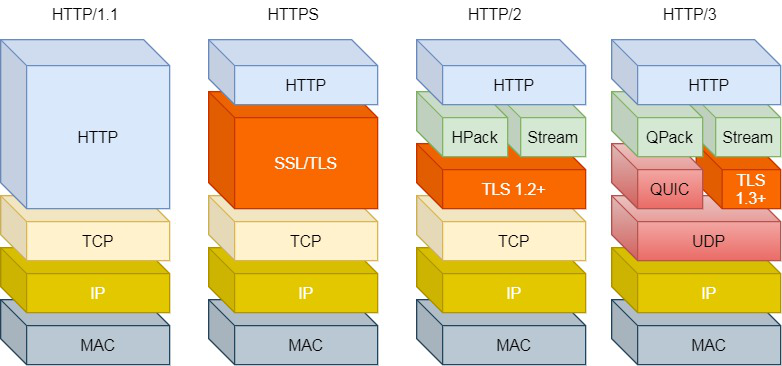
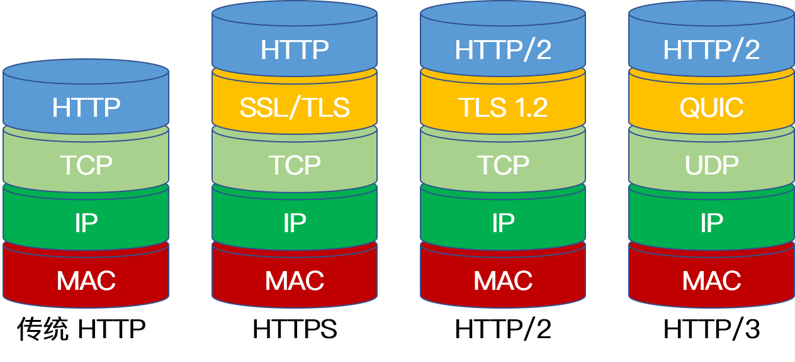

一个不错的网站可以学习：

https://developer.mozilla.org/zh-CN/docs/Web/HTTP


# HTTP

**一个HTTP请求报文由四个部分组成：请求行、请求头部、空行、请求数据。**

## HTTP头部

参考文章：

https://developer.mozilla.org/zh-CN/docs/Web/HTTP/Headers


HTTP 头部本质上是一个传递额外重要信息的键值对。

主要分为：通用头部，请求头部，响应头部和实体头部。


1. 通用头：是客户端和服务器都可以使用的头部，可以在客户端、服务器和其他应用程序之间提供一些非常有用的通用功能，如Date头部。
2. 请求头：请求报文特有的，它们为服务器提供了一些额外信息，比如客户端希望接收什么类型的数据，如Accept头部。
3. 响应头：响应报文特有的，比如，客服端在与哪种类型的服务器进行交互，如Server头部。
4. 实体头：实体首部字段是包含在请求报文和响应报文中的实体部分使用的首部，用于补充内容的更新时间等与实体相关的信息。

### 通用头部


<table>
<thead>
<tr>
<th>协议头</th>
<th>说明</th>
<th>举例</th>
</tr>
</thead>
<tbody>
<tr>
<td>Cache-Control</td>
<td>用来指定当前的请求/回复中是否使用缓存机制</td>
<td>Cache-Control: no-store</td>
</tr>
<tr>
<td>Connection</td>
<td>客户端（浏览器）想要优先使用的连接类型</td>
<td>Connection: keep-alive (Upgrade)</td>
</tr>
<tr>
<td>Date</td>
<td>报文创建时间</td>
<td>Date: Dec, 26 Dec 2015 17: 30: 00 GMT</td>
</tr>
<tr>
<td>Trailer</td>
<td>会实现说明在报文主体后记录哪些首部字段，该首部字段可以使用在 HTTP/1.1 版本分块传输编码时</td>
<td>Trailer: Expiress</td>
</tr>
<tr>
<td>Transfer-Encoding</td>
<td>用来改变报文格式</td>
<td>Transfer-Encoding: chunked</td>
</tr>
<tr>
<td>Upgrade</td>
<td>要求服务器升级到一个高版本协议</td>
<td>Upgrade: HTTP/2.0, SHTTP/1.3, IRC/6.9, RTA/x11</td>
</tr>
<tr>
<td>Via</td>
<td>告诉服务器，这个请求是由哪些代理发出的</td>
<td>Via: 1.0 fred, 1.1 <a href="http://itbilu.com.com" target="_blank">itbilu.com.com</a> (Apache/1.1)</td>
</tr>
<tr>
<td>Warning</td>
<td>一个一般性的警告，表示在实体内容中可能存在错误</td>
<td>Warning: 199 Miscellaneous warning</td>
</tr>
</tbody>
</table>


比较重要的有 `Cache-Control`、`Connection`。


### 请求头部


<table>
<thead>
<tr>
<th>协议头</th>
<th>说明</th>
<th>举例</th>
</tr>
</thead>
<tbody>
<tr>
<td>Accept</td>
<td>告诉服务器自己允许哪些媒体类型</td>
<td>Accept: text/plain</td>
</tr>
<tr>
<td>Accept-Charset</td>
<td>浏览器申明可接受的字符集</td>
<td>Accept-Charset: utf-8</td>
</tr>
<tr>
<td>Accept-Encoding</td>
<td>浏览器申明自己接收的编码方法</td>
<td>Accept-Encoding: gzip, deflate</td>
</tr>
<tr>
<td>Accept-Language</td>
<td>浏览器可接受的响应内容语言列表</td>
<td>Accept-Language: en-US</td>
</tr>
<tr>
<td>Authorization</td>
<td>用于表示 HTTP 协议中需要认证资源的认证信息</td>
<td>Authorization: Basic OSdjJGRpbjpvcGVul ANIc2SdDE==</td>
</tr>
<tr>
<td>Expect</td>
<td>表示客户端要求服务器做出特定的行为</td>
<td>Expect: 100-continue</td>
</tr>
<tr>
<td>From</td>
<td>发起此请求的用户的邮件地址</td>
<td>From: <a href="mailto:user@itbilu.com" target="_blank">user@itbilu.com</a></td>
</tr>
<tr>
<td>Host</td>
<td>表示服务器的域名以及服务器所监听的端口号</td>
<td>Host: <a href="http://www.itbilu.com:80" target="_blank">www.itbilu.com:80</a></td>
</tr>
<tr>
<td>If-XXX</td>
<td>条件请求</td>
<td>If-Modified-Since: Dec, 26 Dec 2015 17:30:00 GMT</td>
</tr>
<tr>
<td>Max-Forwards</td>
<td>限制该消息可被代理及网关转发的次数</td>
<td>Max-Forwards: 10</td>
</tr>
<tr>
<td>Range</td>
<td>表示请求某个实体的一部分，字节偏移以 0 开始</td>
<td>Range: bytes=500-999</td>
</tr>
<tr>
<td>Referer</td>
<td>表示浏览器所访问的前一个页面，可以认为是之前访问页面的链接将浏览器带到了当前页面</td>
<td>Referer: <a href="http://itbilu.com/nodejs" target="_blank">http://itbilu.com/nodejs</a></td>
</tr>
<tr>
<td>User-Agent</td>
<td>浏览器的身份标识字符串</td>
<td>User-Agent: Mozilla/……</td>
</tr>
</tbody>
</table>


比较重要的有`Referer`、`User-Agent`、`Range`。


### 响应头部


<table>
<thead>
<tr>
<th>协议头</th>
<th>说明</th>
<th>举例</th>
</tr>
</thead>
<tbody>
<tr>
<td>Accept-Ranges</td>
<td>字段的值表示可用于定义范围的单位</td>
<td>Accept-Ranges: bytes</td>
</tr>
<tr>
<td>Age</td>
<td>创建响应的时间</td>
<td>Age：5744337</td>
</tr>
<tr>
<td>ETag</td>
<td>唯一标识分配的资源</td>
<td>Etag：W/"585cd998-7c0f"</td>
</tr>
<tr>
<td>Location</td>
<td>表示重定向后的 URL</td>
<td>Location: <a href="http://www.zcmhi.com/archives/94.html" target="_blank">http://www.zcmhi.com/archives/94.html</a></td>
</tr>
<tr>
<td>Retry-After</td>
<td>告知客户端多久后再发送请求</td>
<td>Retry-After: 120</td>
</tr>
<tr>
<td>Server</td>
<td>告知客户端服务器信息</td>
<td>Server: Apache/1.3.27 (Unix) (Red-Hat/Linux)</td>
</tr>
<tr>
<td>Vary</td>
<td>缓存控制</td>
<td>Vary: Origin</td>
</tr>
</tbody>
</table>


比较重要的有`Accept-Ranges`、`Location`


### 实体头部

<table>
<thead>
<tr>
<th>协议头</th>
<th>说明</th>
<th>举例</th>
</tr>
</thead>
<tbody>
<tr>
<td>Allow</td>
<td>对某网络资源的有效的请求行为，不允许则返回405</td>
<td>Allow: GET, HEAD</td>
</tr>
<tr>
<td>Content-encoding</td>
<td>返回内容的编码方式</td>
<td>Content-Encoding: gzip</td>
</tr>
<tr>
<td>Content-Length</td>
<td>返回内容的字节长度</td>
<td>Content-Length: 348</td>
</tr>
<tr>
<td>Content-Language</td>
<td>响应体的语言</td>
<td>Content-Language: en,zh</td>
</tr>
<tr>
<td>Content-Location</td>
<td>请求资源可替代的备用的另一地址</td>
<td>Content-Location: /index.htm</td>
</tr>
<tr>
<td>Content-MD5</td>
<td>返回资源的MD5校验值</td>
<td>Content-MD5: Q2hlY2sgSW50ZWdyaXR5IQ==</td>
</tr>
<tr>
<td>Content-Range</td>
<td>在整个返回体中本部分的字节位置</td>
<td>Content-Range: bytes 21010-47021/47022</td>
</tr>
<tr>
<td>Content-Type</td>
<td>返回内容的MIME类型</td>
<td>Content-Type: text/html; charset=utf-8</td>
</tr>
<tr>
<td>Expires</td>
<td>响应过期的日期和时间</td>
<td>Expires: Thu, 01 Dec 2010 16:00:00 GMT</td>
</tr>
<tr>
<td>Last-Modified</td>
<td>请求资源的最后修改时间</td>
<td>Last-Modified: Tue, 15 Nov 2010 12:45:26 GMT</td>
</tr>
</tbody>
</table>


比较重要的有`Content-encoding`、`Content-Length`、`Content-Type`、`Content-MD5`、`Content-Range`


## 常用头部

从hertz的`pkg/protocol/consts/headers.go` 里面列出了bytedancer认为的一些比较常用的header。


```go
const (
	HeaderAuthorization = "Authorization"
	HeaderHost          = "Host"
	HeaderReferer       = "Referer"
	HeaderContentType   = "Content-Type"
	HeaderUserAgent     = "User-Agent"
	HeaderExpect        = "Expect"
	HeaderConnection    = "Connection"
	HeaderContentLength = "Content-Length"
	HeaderCookie        = "Cookie"

	HeaderServer           = "Server"
	HeaderServerLower      = "server"
	HeaderSetCookie        = "Set-Cookie"
	HeaderSetCookieLower   = "set-cookie"
	HeaderTransferEncoding = "Transfer-Encoding"
	HeaderDate             = "Date"

	HeaderRange        = "Range"
	HeaderAcceptRanges = "Accept-Ranges"
	HeaderContentRange = "Content-Range"

	HeaderIfModifiedSince = "If-Modified-Since"
	HeaderLastModified    = "Last-Modified"

	// Message body information
	HeaderContentEncoding = "Content-Encoding"
	HeaderAcceptEncoding  = "Accept-Encoding"

	// Redirects
	HeaderLocation = "Location"
  
  // ... 
)

```


## HTTP状态码
HTTP 状态码由三个十进制数字组成，第一个数字定义了状态码的类型，后两个并没有起到分类的作用。HTTP 状态码共有 5 种类型：


| 分类 | 描述                                                         |
| ---- | ------------------------------------------------------------ |
| 1XX  | 指示信息--表示请求正在处理                                   |
| 2XX  | **成功**--表示请求已被成功处理完毕                           |
| 3XX  | **重定向**--要完成的请求需要进行附加操作                     |
| 4XX  | **客户端错误**--请求有语法错误或者请求无法实现，服务器无法处理请求 |
| 5XX  | **服务器端错误**--服务器处理请求出现错误                     |


下面是常用的状态码分类：


### 1xx

1xx 类状态码属于提示信息，是协议处理中的⼀种中间状态，实际⽤到的⽐较少。

### 2xx

2xx 类状态码表示服务器成功处理了客户端的请求，也是我们最愿意看到的状态。

「**200 OK**」是最常⻅的成功状态码，表示⼀切正常。如果是⾮ HEAD 请求，服务器返回的响应头都会有 body

数据。

「**204 No Content**」也是常⻅的成功状态码，与 200 OK 基本相同，但响应头没有 body 数据。

「**206 Partial Content**」是应⽤于 HTTP 分块下载或断点续传，表示响应返回的 body 数据并不是资源的全部，⽽是其中的⼀部分，也是服务器处理成功的状态。

### 3xx

3xx 类状态码表示客户端请求的资源发送了变动，需要客户端⽤新的 URL 重新发送请求获取资源，也就是重定

向。

「**301 Moved Permanently**」表示永久重定向，说明请求的资源已经不存在了，需改⽤新的 URL 再次访问。

「**302 Found**」表示临时重定向，说明请求的资源还在，但暂时需要⽤另⼀个 URL 来访问。

301 和 302 都会在响应头⾥使⽤字段 Location ，指明后续要跳转的 URL，浏览器会⾃动重定向新的 URL。 

「**304 Not Modified**」不具有跳转的含义，表示资源未修改，重定向已存在的缓冲⽂件，也称缓存重定向，⽤于缓存控制。


> 重定向有两种：一种是302响应，称为临时重定向，一种是301响应，称为永久重定向。两者的区别是，如果服务器发送301永久重定向响应，浏览器会缓存`/hi`到`/hello`这个重定向的关联，下次请求`/hi`的时候，浏览器就直接发送`/hello`请求了。

### 4xx

4xx 类状态码表示客户端发送的报⽂有误，服务器⽆法处理，也就是错误码的含义。

「**400 Bad Request**」表示客户端请求的报⽂有错误，但只是个笼统的错误。

「**403 Forbidden**」表示服务器禁⽌访问资源，并不是客户端的请求出错。

「**404 Not Found**」表示请求的资源在服务器上不存在或未找到，所以⽆法提供给客户端。

### 5xx

5xx 类状态码表示客户端请求报⽂正确，但是服务器处理时内部发⽣了错误，属于服务器端的错误码。

「**500 Internal Server Error**」与 400 类型，是个笼统通⽤的错误码，服务器发⽣了什么错误，我们并不知道。

「**501 Not Implemented**」表示客户端请求的功能还不⽀持，类似“即将开业，敬请期待”的意思。

「**502 Bad Gateway**」通常是服务器作为⽹关或代理时返回的错误码，表示服务器⾃身⼯作正常，访问后端服务器

发⽣了错误。

「**503 Service Unavailable**」表示服务器当前很忙，暂时⽆法响应服务器，类似“⽹络服务正忙，请稍后᯿试”的意思。


## HTTP方法

HTTP/0.9 只定义了一种方法: GET。

HTTP/1.0 定义了三种请求方法：GET, POST 和 HEAD 方法。

HTTP/1.1 增加了六种请求方法：OPTIONS, PUT, PATCH, DELETE, TRACE 和 CONNECT 方法。


<table>
<thead>
<tr>
<th>方法</th>
<th>描述</th>
</tr>
</thead>
<tbody>
<tr>
<td>GET</td>
<td>请求指定的页面信息，并返回具体内容，通常只用于读取数据。</td>
</tr>
<tr>
<td>HEAD</td>
<td>类似于 GET 请求，只不过返回的响应中没有具体的内容，用于获取报头。</td>
</tr>
<tr>
<td>POST</td>
<td>向指定资源提交数据进行处理请求（例如提交表单或者上传文件）。数据被包含在请求体中。POST 请求可能会导致新的资源的建立或已有资源的更改。</td>
</tr>
<tr>
<td>PUT</td>
<td>替换指定的资源，没有的话就新增。</td>
</tr>
<tr>
<td>DELETE</td>
<td>请求服务器删除 URL 标识的资源数据。</td>
</tr>
<tr>
<td>CONNECT</td>
<td>将服务器作为代理，让服务器代替用户进行访问。</td>
</tr>
<tr>
<td>OPTIONS</td>
<td>向服务器发送该方法，会返回对指定资源所支持的 HTTP 请求方法。</td>
</tr>
<tr>
<td>TRACE</td>
<td>回显服务器收到的请求数据，即服务器返回自己收到的数据，主要用于测试和诊断。</td>
</tr>
<tr>
<td>PATCH</td>
<td>是对 PUT 方法的补充，用来对已知资源进行局部更新。</td>
</tr>
</tbody>
</table>


用的最多的自然是`GET`、`POST`了， 甚至有一种观点认为只需要使用POST就够了。


### GET 和 POST 的区别


+ get 提交的数据会放在 URL 之后，并且**请求参数会被完整的保留在浏览器的记录**里，由于**参数直接暴露在 URL 中**，可能会存在安全问题，因此往往用于获取资源信息。GET上要在url之外带一些参数就只能依靠url上附带querystring。
+ 编码格式： get 请求只支持 URL 编码，post 请求支持多种编码格式。
+ 字符集：get 只支持 ASCII 字符格式的参数，而 post 方法没有限制。
+ 数据大小：get 提交的数据大小有限制（这里所说的**限制是浏览器带来的**，一般都限制在几千），而 post 方法提交的数据没限制
+ get 方式需要使用 queryString 来取得变量的值，而 post 方式通过将body解析成实体类来获取（当然还有其他的方式）。
+ TCP数据包：get 方法产生一个 TCP 数据包，post 方法产生两个（**并不是所有的浏览器中都产生两个**）。


## 特点（优点和缺点）


## HTTP 如何保存状态

因为一个 HTTP 服务器并不保存关于客户机的任何信息，所以我们说 HTTP 是一个无状态协议。

通常有两种解决方案：

① **基于 Session 实现的会话保持**

在客户端第一次向服务器发送 HTTP 请求后，**服务器会创建一个 Session 对象并将客户端的身份信息以键值对的形式存储下来**，然后**分配一个会话标识（SessionId）给客户端**，这个**会话标识一般保存在客户端 Cookie 中**，之后每次该浏览器**发送 HTTP 请求都会带上 Cookie 中的 SessionId 到服务器**，服务器根据会话标识就可以将之前的状态信息与会话联系起来，从而实现会话保持。

+ 优点：**安全性高**，因为状态信息保存在服务器端。

+ **缺点**：**水平拓展差，由于大型网站往往采用的是分布式服务器，浏览器发送的 HTTP 请求一般要先通过负载均衡器才能到达具体的后台服务器，倘若同一个浏览器两次 HTTP 请求分别落在不同的服务器上时，基于 Session 的方法就不能实现会话保持了。

【解决方法：**采用中间件**，例如 Redis，我们通过**将 Session 的信息存储在 Redis 中**，使得每个服务器都可以访问到之前的状态信息】


② **基于 Cookie 实现的会话保持**

当服务器发送响应消息时，在 HTTP 响应头中设置 Set-Cookie 字段，用来存储客户端的状态信息。客户端解析出 HTTP 响应头中的字段信息，并根据其生命周期创建不同的 Cookie，这样一来每次浏览器发送 HTTP 请求的时候都会带上 Cookie 字段，从而实现状态保持。

**基于 Cookie 的会话保持与基于 Session 实现的会话保持最主要的区别是前者完全将会话状态信息存储在浏览器 Cookie 中。**

**优点**：**服务器无状态**， 减轻服务器存储压力，同时便于服务端做水平拓展。

**缺点**：该**方式不够安全**，因为状态信息存储在客户端，这意味着不能在会话中保存机密数据。除此之外，浏览器每次发起 HTTP 请求时都需要发送额外的 Cookie 到服务器端，会**占用更多带宽**。


**拓展：Cookie被禁用了怎么办？**

若遇到 Cookie 被禁用的情况，则可以通过重写 URL 的方式将会话标识放在 URL 的参数里，也可以实现会话保持。

> **URL重写**（英语：URL Rewriting）是一种REST的相关技术，它可以在Web Server中，针对用户所提供的URL进行转换后，再传入Web Server中的程序处理器。
>
> 如果浏览器不支持Cookie或用户阻止了所有Cookie，可以把会话ID附加在HTML页面中所有的URL上，这些页面作为响应发送给客户。这样，当用户单击URL时，会话ID被自动作为请求行的一部分而不是作为头行发送回服务器。这种方法称为URL重写(URL rewriting)。

详细参考[URL重写](https://zh.wikipedia.org/wiki/URL%E9%87%8D%E5%AF%AB)


# HTTP 与 HTTPs

HTTPS 采用对称加密和非对称加密相结合的方式，首先使用 SSL/TLS 协议进行加密传输，为了弥补非对称加密的缺点，HTTPS **①采用证书来进一步加强非对称加密的安全性**，**②使用非对称加密交换后面通信传输用到的*会话密钥***，**③后续的所有信息都通过使用该对称秘钥进行加密解密**，完成整个 HTTPS 的流程。


## HTTP 与 HTTPS的区别
1. **HTTP 是超⽂本传输协议，信息是明⽂传输**，存在安全⻛险的问题。HTTPS 则解决 HTTP 不安全的缺陷，在TCP 和 HTTP ⽹络层之间加⼊了*SSL/TLS*安全协议，使得**报⽂能够加密传输**。
2. HTTP 连接建⽴相对简单， TCP 三次握⼿之后便可进⾏ HTTP 的报⽂传输。⽽ **HTTPS 在 TCP 三次握⼿之后，还需进⾏ SSL/TLS 的握⼿过程**，才可进⼊加密报⽂传输。
3. HTTP 的端⼝号是 80，HTTPS 的端⼝号是 443。
4. HTTPS 协议需要**向 CA（证书权威机构）申请数字证书**，来保证服务器的身份是可信的。


> SSL 是 “*Secure Sockets Layer* 的缩写，中⽂叫做「安全套接层」。它是在上世纪 90 年代中期，由⽹景公司
>
> 设计的。
>
> 到了1999年，SSL 因为应⽤⼴泛，已经成为互联⽹上的事实标准。IETF 就在那年把 SSL 标准化。标准化之后的名
>
> 称改为 TLS（是 “*Transport Layer Security*” 的缩写），中⽂叫做 「传输层安全协议」。
>
> 很多相关的⽂章都把这两者并列称呼（SSL/TLS），因为这两者可以视作同⼀个东⻄的不同阶段。


## HTTPS 解决了 HTTP 的哪些问题

HTTP 由于是明⽂传输，所以安全上存在以下三个⻛险：

1. 窃听⻛险，⽐如通信链路上可以获取通信内容；

2. 篡改⻛险，⽐如强制植⼊垃圾⼴告；

3. 冒充⻛险，⽐如冒充淘宝⽹站。





HTTP**S** 在 HTTP 与 TCP 层之间加⼊了 SSL/TLS 协议，可以很好的解决了上述的⻛险：

信息加密：交互信息⽆法被窃取。

校验机制：⽆法篡改通信内容，篡改了就不能正常显示。

身份证书：证明淘宝是真的淘宝⽹。


> HTTPS 是如何解决上⾯的三个⻛险的？


+ **混合加密**的⽅式实现信息的**机密性**，解决了窃听的⻛险。

+ **摘要算法**的⽅式来实现**完整性**，它能够为数据⽣成独⼀⽆⼆的*指纹*，指纹⽤于校验数据的完整性，解决

了篡改的⻛险。

+ 将服务器公钥放⼊到**数字证书**中，解决了**冒充⻛险**。


> 这部分内容可以参考 [数字签名是什么？](http://www.ruanyifeng.com/blog/2011/08/what_is_a_digital_signature.html)


### 1. 混合加密





HTTPS 采⽤的是对称加密和⾮对称加密结合的**混合加密**⽅式：

+ 在通信建⽴前采⽤⾮对称加密的⽅式交换**会话秘钥**，后续就不再使⽤⾮对称加密。

+ 在通信过程中全部使⽤对称加密的**会话秘钥**加密明⽂数据。

采⽤「混合加密」的⽅式的原因：

+ **对称加密只使⽤⼀个密钥，运算速度快**，密钥必须保密，**但⽆法做到安全的密钥交换**。

+ **⾮对称加密使⽤两个密钥**：公钥和私钥，公钥可以任意分发⽽私钥保密，**解决了密钥交换问题但速度慢**。


### 2. 摘要算法

**摘要算法**⽤来实现完整性，能够为数据⽣成独⼀⽆⼆的*指纹*，**⽤于校验数据的完整性**，解决了篡改的⻛险。




客户端在发送明⽂之前会通过摘要算法算出明⽂的「指纹」，发送的时候把「指纹 + 明⽂」⼀同加密成密⽂后，发

送给服务器，服务器解密后，⽤相同的摘要算法算出发送过来的明⽂，通过⽐较客户端携带的「指纹」和当前算出

的「指纹」做⽐较，若「指纹」相同，说明数据是完整的。


### 3. 数字证书

客户端先向服务器端索要公钥，然后⽤公钥加密信息，服务器收到密⽂后，⽤⾃⼰的私钥解密。

这就存在些问题，如何保证公钥不被篡改和信任度？

所以这⾥就需要借助第三⽅权威机构 CA （certificate authority  数字证书认证机构），**将服务器公钥放在数字证书**（由数字证书认证机构颁发）中，只要证书是可信的，公钥就是可信的。





通过数字证书的⽅式保证服务器公钥的身份，解决冒充的⻛险。


### 名词总结

1. 秘钥：某个用来完成加密、解密、完整性验证等密码学应用的秘密信息。在对称加密中加密解密使用的是同一个秘钥；在非对称加密中，又分为公钥和私钥。
2. 摘要：根据一定的运算规则对原数据进行某种形式的提取，这种提取就是摘要。可以用于数据完整性验证。由于摘要算法不可逆，理论上无法通过反向运算取得原数据内容。摘要算法有MD5等。
3. 数字签名：一种功能类似写在纸上的普通签名、但是使用了*公钥加密* 领域的技术，以用于鉴别数字信息的方法。数字签名算法是依靠*公钥加密技术*来实现的。RSA等算法可以实现数字签名。
4. 数字证书：由证书中心（Certificate Authority）颁发的用于标志通讯各方身份信息的一个数字认证。在SSL中，①服务器将自己的公钥和自身的其他信息向CA注册，②CA再用自己的私钥加密成数字证书颁发给，③然后客户端再用CA的公钥去解密数字证书，如果合法就可以得到可靠的服务器的公钥。


### 客户端为什么信任第三方证书

1. 没有CA的私钥无法篡改签名
   **假设中间人篡改了证书原文，由于他没有 CA 机构的私钥，所以无法得到此时加密后的签名，因此无法篡改签名。**客户端浏览器收到该证书后会发现原文和签名解密后的值不一致，则说明证书被中间人篡改，证书不可信，从而终止向服务器传输信息。

2. 替换证书但是域名不一致
   上述过程说明证书无法被篡改，我们考虑更严重的情况，例如中间人拿到了 CA 机构认证的证书，它想窃取网站 A 发送给客户端的信息，于是它成为中间人拦截到了 A 传给客户端的证书，然后将其替换为自己的证书。此时客户端浏览器收到的是被中间人掉包后的证书，但由于证书里包含了客户端请求的网站信息，因此客户端浏览器只需要把证书里的域名与自己请求的域名比对一下就知道证书有没有被掉包了。

CA之所以是CA，就是因为它是普遍被大家接受的权威结构，里面罗列着一些普遍被大家认可的证书，而这些通常会内置在浏览器中。

如果CA不被信任或者CA带头作恶，那相当于法官带头犯罪，什么手段都规避不了。


## HTTP 与 HTTPs 的工作方式（建立连接的过程）


### HTTP

HTTP 使用 TCP（而不是 UDP）作为它的支撑运输层协议。其默认工作在 TCP 协议 80 端口，HTTP 客户机发起一个与服务器的 TCP 连接，一旦连接建立，浏览器和服务器进程就可以通过套接字接口访问 TCP。客户机从套接字接口发送 HTTP 请求报文和接收 HTTP 响应报文。类似地，服务器也是从套接字接口接收 HTTP 请求报文和发送 HTTP 响应报文。其通信内容以明文的方式发送，不通过任何方式的数据加密。当通信结束时，客户端与服务器关闭连接。


### HTTPS

HTTPS 协议基本流程：

1. 客户端**向服务器索要并验证服务器的公钥**。

2. **双⽅协商⽣产「会话秘钥」**。

3. **双⽅采⽤「会话秘钥」进⾏加密通信**。


####  SSL/TLS 建立过程

前两步也就是 SSL/TLS 的建⽴过程，也就是握⼿阶段。

SSL/TLS 的「握⼿阶段」涉及四次通信，可⻅下图：





SSL/TLS 协议建⽴的详细流程：

1. **ClientHello**

⾸先，由客户端向服务器发起加密通信请求，也就是 ClientHello 请求。

在这⼀步，客户端主要向服务器发送以下信息：

（1）客户端⽀持的 SSL/TLS 协议版本，如 TLS 1.2 版本。

（2）客户端⽣产的随机数（ **Client Random** ），后⾯⽤于⽣产「会话秘钥」。

（3）客户端⽀持的密码套件列表，如 RSA 加密算法。

2. **SeverHello**

服务器收到客户端请求后，向客户端发出响应，也就是 SeverHello 。服务器回应的内容有如下内容：

（1）确认 SSL/ TLS 协议版本，如果浏览器不⽀持，则关闭加密通信。

（2）服务器⽣产的随机数（ **Server Random** ），后⾯⽤于⽣产「会话秘钥」。

（3）确认的密码套件列表，如 RSA 加密算法。

（4）**服务器的数字证书**。

3. **客户端回应**

客户端收到服务器的回应之后，**⾸先通过浏览器或者操作系统中的 CA 公钥，确认服务器的数字证书的真实性**。

如果证书没有问题，客户端会**从数字证书中取出服务器的公钥**，然后**使⽤它加密报⽂**，向服务器发送如下信息：

（1）**⼀个随机数（ pre-master key ）**。该随机数会被服务器公钥加密。

（2）**加密通信算法改变通知，表示随后的信息都将⽤「会话秘钥」加密通信。**

（3）客户端握⼿结束通知，表示客户端的握⼿阶段已经结束。这⼀项同时**把之前所有内容的发⽣的数据做个摘**

**要，⽤来供服务端校验**。


上⾯第⼀项的随机数是整个握⼿阶段的第三个随机数，这样**服务器和客户端就同时有三个随机数**，接着就⽤**双⽅协商的加密算法，各⾃⽣成本次通信的「会话秘钥」**。


4. **服务器的最后回应**

服务器收到客户端的**第三个随机数（ pre-master key ）**之后，通过协商的加密算法，计算出**本次通信的「会话秘钥」**。然后，向客户端发⽣最后的信息：

（1）**加密通信算法改变通知，表示随后的信息都将⽤「会话秘钥」加密通信。**

（2）服务器握⼿结束通知，表示服务器的握⼿阶段已经结束。这⼀项同时**把之前所有内容的发⽣的数据做个摘**

**要，⽤来供客户端校验**。

⾄此，整个 SSL/TLS 的握⼿阶段全部结束。接下来，客户端与服务器进⼊加密通信，就完全是使⽤普通的 HTTP

协议，只不过⽤「会话秘钥」加密内容。


> 简洁版
>
> TLS握手协议 
>
> 1. 客户端发出一个 client hello 消息，携带的信息包括：所支持的 SSL/TLS 版本列表；支持的与加密算法；所支持的数据压缩方法；随机数 A。
> 2. 服务端响应一个 server hello 消息，携带的信息包括：协商采用的 SSL/TLS 版本号；会话 ID；随机数 B；服务端数字证书 serverCA；由于双向认证需求，服务端需要对客户端进行认证，会同时发送一个 client certificate request，表示请求客户端的证书。
> 3. 客户端校验服务端的数字证书；校验通过之后发送随机数 C，该随机数称为 pre-master-key，使用数字证书中的公钥加密后发出；由于服务端发起了 client certificate request，客户端使用私钥加密一个随机数 clientRandom 随客户端的证书 clientCA 一并发出。
> 4. 服务端校验客户端的证书，并成功将客户端加密的随机数 clientRandom 解密；根据随机数 A/随机数 B/随机数 C（pre-master-key） 产生动态密钥 master-key，加密一个 finish 消息发至客户端。
> 5. 客户端根据同样的随机数和算法生成 master-key，加密一个 finish 消息发送至服务端。
> 6. 服务端和客户端分别解密成功，至此握手完成，之后的数据包均采用 master-key 进行加密传输。


# HTTP/1.1、HTTP/2、HTTP/3 演变


## HTTP/1.1 和 HTTP/1.0 的区别


1. **缓存处理**：在 HTTP/1.0 中主要使用 header 里的 if-modified-Since, Expries 来做缓存判断的标准。而 HTTP/1.1 请求头中添加了更多与缓存相关的字段，从而支持更为灵活的缓存策略，例如 `Entity-tag`,` If-Unmodified-Since`, `If-Match`,` If-None-Match` 等可供选择的缓存头来控制缓存策略。

2. **分片传输**： 当客户端请求某个资源时，HTTP/1.0 默认将该资源相关的整个对象传送给请求方，但很多时候可能客户端并不需要对象的所有信息。而在 **HTTP/1.1 的请求头中引入了 range 头域**，它允许只请求部分资源，其使得开发者可以多线程请求某一资源，从而充分的利用带宽资源，实现高效并发。


3. **长连接**：HTTP/1.0 默**认浏览器和服务器之间保持短暂连接**，**浏览器的每次请求都需要与服务器建立一个 TCP 连接，服务器完成后立即断开 TCP 连接**。HTTP/1.1 默认使用的是持久连接，其支持在同一个 TCP 请求中传送多个 HTTP 请求和响应。此之前的 HTTP 版本的默认连接都是使用非持久连接，如果想要在旧版本的 HTTP 协议上维持持久连接，则需要指定 Connection 的首部字段的值为 Keep-Alive。

4. **管道（pipeline）⽹络传输**，只要第⼀个请求发出去了，不必等其回来，就可以发第⼆个请求出去，可以减少整体的响应时间。

5. 错误通知的管理：HTTP/1.1 在 1.0 的基础上新增了 24 个错误状态响应码，例如 414 表示客户端请求中所包含的 URL 地址太长，以至于服务器无法处理；410 表示所请求的资源已经被永久删除。

6. Host 请求头：早期 HTTP/1.0 中认为每台服务器都绑定一个唯一的 IP 地址并提供单一的服务，请求消息中的 URL 并没有传递主机名。而随着虚拟主机的出现，**一台物理服务器上可以存在多个虚拟主机，并且它们共享同一个 IP 地址**。为了支持虚拟主机，HTTP/1.1 中添加了 host 请求头，请求消息和响应消息中应声明这个字段，若请求消息中缺少该字段时服务端会响应一个 404 错误状态码。


## HTTP/1.X 和 HTTP/2.0 的区别


但 HTTP/1.1 还是有性能瓶颈 : 

+ 请求 / 响应头部（Header）未经压缩就发送，⾸部信息越多延迟越⼤。只能压缩 Body 的部分；

+ 发送冗⻓的⾸部。每次互相发送相同的⾸部造成的浪费较多；

+ 服务器是按请求的顺序响应的，如果服务器响应慢，会招致客户端⼀直请求不到数据，也就是**队头阻塞；**

+ 请求只能从客户端开始，**服务器只能被动响应**。


HTTP/2 协议是基于 HTTPS 的，所以 HTTP/2 的安全性也是有保障的。

### 1. 头部压缩
HTTP/2 会压缩头（Header）**如果你同时发出多个请求，他们的头是⼀样的或是相似的，那么，协议会帮你消除重复的部分**。
这就是所谓的 HPACK 算法：**在客户端和服务器同时维护⼀张头信息表，所有字段都会存⼊这个表，⽣成⼀个索引号，以后就不发送同样字段了，只发送索引号**，这样就提⾼速度了。

### 2. ⼆进制格式
HTTP/2 不再像 HTTP/1.1 ⾥的纯⽂本形式的报⽂，⽽是全⾯采⽤了⼆进制格式，头信息和数据体都是⼆进制，并且统称为帧（frame）：头信息帧和数据帧。




这样虽然对⼈不友好，但是对计算机⾮常友好，因为计算机只懂⼆进制，那么收到报⽂后，⽆需再将明⽂的报⽂转
成⼆进制，⽽是直接解析⼆进制报⽂，这**增加了数据传输的效率**。


### 3. 数据流
HTTP/2 的数据包不是按顺序发送的，同⼀个连接⾥⾯连续的数据包，可能属于不同的回应。因此，必须要对数据包做标记，指出它属于哪个回应。
每个请求或回应的所有数据包，称为⼀个数据流（ Stream ）。每个数据流都标记着⼀个独⼀⽆⼆的编号，其中规定客户端发出的数据流编号为奇数， 服务器发出的数据流编号为偶数

客户端还可以**指定数据流的优先级**。优先级⾼的请求，服务器就先响应该请求。


### 4. 多路复⽤


HTTP/2 是可以**在⼀个连接中并发多个请求或回应，⽽不⽤按照顺序⼀⼀对应**。

**移除了 HTTP/1.1 中的串⾏请求**，不需要排队等待，也就**解决了「队头阻塞」问题（一定程度上），降低了延迟**，⼤幅度提⾼

了连接的利⽤率。

举例来说，在⼀个 TCP 连接⾥，服务器收到了客户端 A 和 B 的两个请求，如果发现 A 处理过程⾮常耗时，于是就

回应 A 请求已经处理好的部分，接着回应 B 请求，完成后，再回应 A 请求剩下的部分。





### 5. 服务器推送

HTTP/2 还在⼀定程度上改善了传统的「请求 - 应答」⼯作模式，服务不再是被动地响应，也可以主动向客户端发

送消息。举例来说，在浏览器刚请求 HTML 的时候，就提前把可能会⽤到的 JS、CSS ⽂件等静态资源主动发给客户端，减少延时的等待，也就是服务器推送（Server Push，也叫 Cache Push）。


## HTTP/2.0 和 HTTP/3.0 的区别

HTTP/2 主要的问题在于，多个 HTTP 请求在复⽤⼀个 TCP 连接，下层的 TCP 协议是不知道有多少个 HTTP 请求
的。所以⼀旦发⽣了丢包现象，就会触发 TCP 的重传机制，这样在⼀个 TCP 连接中的所有的 HTTP 请求都必须等待这个丢了的包被重传回来。

+ **队头阻塞问题**：HTTP/1.1 中的管道（ pipeline）传输中如果有⼀个请求阻塞了，那么队列后面请求也统统被阻塞住了
+ **复用TCP的丢包问题**：HTTP/2 多个请求复⽤⼀个TCP连接，⼀旦发⽣丢包，就会阻塞住所有的 HTTP 请求。


这都是基于 TCP 传输层的问题，所以 HTTP/3 把 HTTP 下层的 TCP 协议改成了 UDP！





> ⼤家都知道 UDP 是不可靠传输的，但基于 UDP 的 **QUIC** 协议 可以实现类似 TCP 的可靠性传输。
>
> QUIC 有⾃⼰的⼀套机制可以保证传输的可靠性的。当某个流发⽣丢包时，只会阻塞这个流，其他流不会受到
>
> 影响。
>
> TLS3 升级成了最新的 1.3 版本，头部压缩算法也升级成了 QPack 。
>
> HTTPS 要建⽴⼀个连接，要花费 6 次交互，先是建⽴三次握⼿，然后是 TLS/1.3 的三次握⼿。QUIC 直接
>
> 把以往的 TCP 和 TLS/1.3 的 6 次交互合并成了 **3** 次，减少了交互次数。
>
> 所以， **QUIC 是⼀个在 UDP 之上的伪 TCP + TLS + HTTP/2 的多路复⽤**的协议。
>
> 
>
> QUIC 是新协议，对于很多⽹络设备，根本不知道什么是 QUIC，只会当做 UDP，这样会出现新的问题。所以
>
> HTTP/3 现在普及的进度⾮常的缓慢，不知道未来 UDP 是否能够逆袭 TCP。


## 了解HTTP3


### HTTP/2 存在的问题

我们知道，传统 Web 平台的数据传输都基于 TCP 协议，而 TCP 协议在创建连接之前不可避免的需要三次握手，如果需要提高数据交互的安全性，即增加传输层安全协议（TLS），还会增加更多的握手次数。

 HTTP 从 1.0 到 2.0，其传输层都是基于 TCP 协议的。即使是带来巨大性能提升的 HTTP/2，也无法完全解决 TCP 协议存在的固有问题（慢启动，拥塞窗口尺寸的设置等）。

**此外，HTTP/2 多路复用只是减少了连接数，其队头的拥塞问题并没有完全解决**，倘若 TCP 丢包率过大，则 HTTP/2 的表现将不如 HTTP/1.1。

### QUIC 协议

QUIC（Quick UDP Internet Connections），直译为**快速 UDP 网络连接**，是谷歌制定的一种基于 UDP 的低延迟传输协议。其主要目的是解决采用传输层 TCP 协议存在的问题，同时满足传输层和应用层对多连接、低延迟等的需求。该协议融合了 TCP, TLS, HTTP/2 等协议的特性，并基于 UDP传输。该协议带来的主要提升有：

低延迟连接。当客户端第一次连接服务器时，QUIC 只需要 1 RTT（Round-Trid Time）延迟就可以建立安全可靠的连接（采用 TLS 1.3 版本），相比于 TCP + TLS 的 3 次 RTT 要更加快捷。之后，客户端可以在本地缓存加密的认证信息，当再次与服务器建立连接时可以实现 0 RTT 的连接建立延迟。

QUIC 复用了 HTTP/2 协议的多路复用功能，由于 QUIC 基于 UDP，所以也避免了 HTTP/2存在的队头阻塞问题。

基于 UDP 协议的 QUIC 运行在用户域而不是系统内核，这使得 QUIC 协议可以快速的更新和部署，从而很好地解决了 TPC 协议部署及更新的困难。

QUIC 的报文是经过加密和认证的，除了少量的报文，其它所有的 QUIC 报文头部都经过了认证，报文主体经过了加密。只要有攻击者篡改 QUIC 报文，接收端都能及时发现。

具有向前纠错机制，每个数据包携带了除了本身内容外的部分其他数据包的内容，使得在出现少量丢包的情况下，尽量地减少其它包的重传次数，其通过牺牲单个包所携带的有效数据大小换来更少的重传次数，这在丢包数量较小的场景下能够带来一定程度的性能提升。

### HTTP/3

**HTTP/3 是在 QUIC 基础上发展起来的，其底层使用 UDP 进行数据传输**，上层仍然使用 HTTP/2。

**在 UDP 与 HTTP/2 之间存在一个 QUIC 层**，**其中 TLS 加密过程在该层进行处理**。

HTTP/3 主要有以下几个特点：

① **使用 UDP 作为传输层进行通信**；

② **在 UDP 之上的 QUIC 协议保证了 HTTP/3 的安全性**。QUIC 在建立连接的过程中就完成了 TLS 加密握手；

③ 建立连接快，正常只需要 1 RTT 即可建立连接。如果有缓存之前的会话信息，则直接验证和建立连接，此过程 0 RTT。建立连接时，也可以带有少量业务数据；

④ 不和具体底层连接绑定，QUIC 为每个连接的两端分别分配了一个唯一 ID，上层连接只认这对逻辑 ID。网络切换或者断连时，只需要继续发送数据包即可完成连接的建立；

⑤ 使用 QPACK 进行头部压缩，因为 在 HTTP/2 中的 HPACK 要求传输过程有序，这会导致队头阻塞，而 QPACK 不存在这个问题。


> **tcp的慢**
>
> 1. 握手次数过多(TCP以及SSL/TLS的握手)
> 2. 防止拥塞的**慢启动**
> 3. **丢包导致的队头阻塞**
>
> **quic为啥快**
>
> 1. **减少往返次数RTT**,缩短连接建立时间： 缓存对方的信息
> 2. 连接多路复用，**且采用独立数据流避免丢包阻塞**
> 3. 使用前行纠错恢复丢失的包，减少超时重传
> 4. 连接保存连接标志符，网络迁移连接快


## 总结

如下为HTTP协议族的网络协议层架构：





最后我们使用一张图来清晰的表示出 HTTP 协议的发展变化：




# 参考链接


[超文本传输协议 - 维基百科，自由的百科全书](https://zh.wikipedia.org/wiki/%E8%B6%85%E6%96%87%E6%9C%AC%E4%BC%A0%E8%BE%93%E5%8D%8F%E8%AE%AE)

[HTTP 协议入门](https://www.ruanyifeng.com/blog/2016/08/http.html)

[数字签名是什么？](http://www.ruanyifeng.com/blog/2011/08/what_is_a_digital_signature.html)

[nginx配置ssl证书实现https ](https://www.cnblogs.com/zhoudawei/p/9257276.html)
