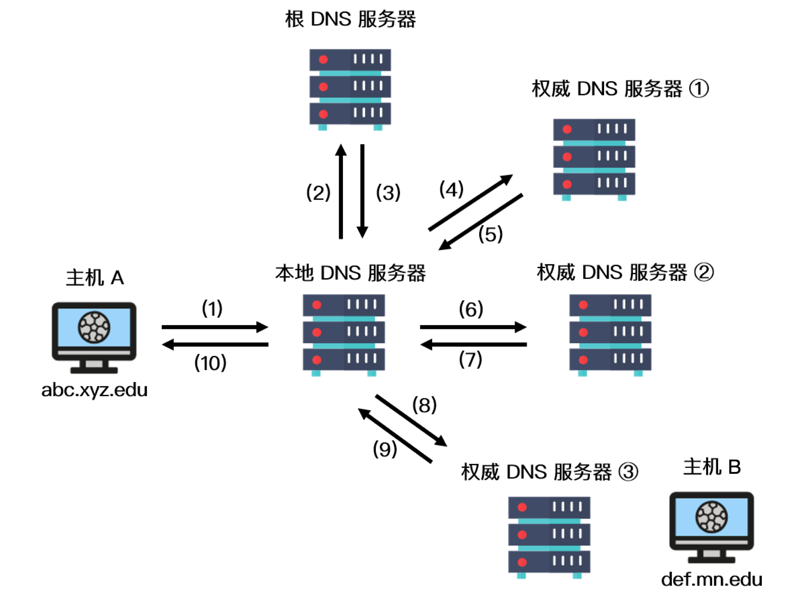
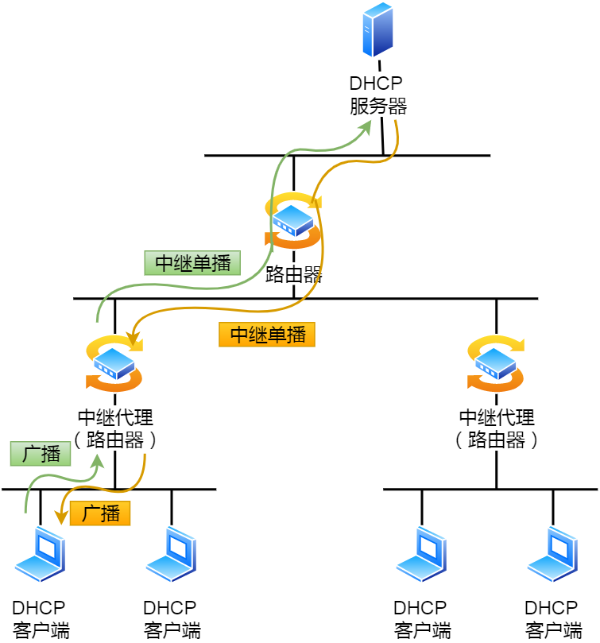

# DNS

> 注意DNS是应用层的协议，不是网络层的协议。
>

## DNS简介

DNS（Domain Name System）是域名系统的英文缩写，是一种组织成域层次结构的计算机和网络服务命名系统，用于 TCP/IP 网络。

## DNS 作用

通常我们有两种方式识别主机：通过主机名或者 IP 地址。人们喜欢便于记忆的主机名表示，而路由器则喜欢定长的、有着层次结构的 IP 地址。为了满足这些不同的偏好，我们就需要一种能够进行主机名到 IP 地址转换的目录服务，**域名系统作为将域名和 IP 地址相互映射的一个分布式数据库**，能够使人更方便地访问互联网。

## DNS 域名解析原理

DNS 采用了分布式的设计方案，其域名空间采用一种树形的层次结构：

上图展示了 DNS 服务器的部分层次结构，从上到下依次为**根域名服务器**、**顶级域名服务器**和**权威域名服务器**。

1. 域名服务器在因特网上有13个，大部分位于北美洲。

2. 第二层为顶级域服务器，这些服务器负责顶级域名（如 com、org、net、edu）和所有国家的顶级域名（如uk、fr、ca 和 jp）。

3. 在第三层为权威 DNS 服务器，因特网上具有公共可访问主机（例如 Web 服务器和邮件服务器）的每个组织机构必须提供公共可访问的 DNS 记录，这些记录由组织机构的权威 DNS 服务器负责保存，这些记录将这些主机的名称映射为 IP 地址。

所以域名的层级关系类似⼀个树状结构：

+ 根 DNS 服务器

+ 顶级域 DNS 服务器（com）

+ 权威 DNS 服务器（server.com）

除此之外，还有一类重要的 DNS 服务器，叫做**本地 DNS 服务器**。本地 DNS 服务器严格来说不在 DNS 服务器的层次结构中，但它对 DNS 层次结构是很重要的。

一般来说，**每个网络服务提供商（ISP） 都有一台本地 DNS 服务器**。**当主机与某个 ISP 相连时，该 ISP 提供一台主机的 IP 地址，该主机具有一台或多台其本地 DNS 服务器的 IP 地址**。主机的本地 DNS 服务器通常和主机距离较近，**当主机发起 DNS 请求时，该请求被发送到本地 DNS 服务器，它起着代理的作用，并将该请求转发到 DNS 服务器层次结构中**。

## 举例

我们以一个例子来了解 DNS 的工作原理，假设主机 A（IP 地址为 abc.xyz.edu） 想知道主机 B 的 IP 地址 （def.mn.edu）。

1. 主机 A 首先**向它的本地 DNS 服务器发送一个 DNS 查询报文**。该查询报文含有被转换的主机名 def.mn.edu
2. 本地 DNS 服务器**将该报文转发到根 DNS 服务器**；
3. 根 DNS 服务器注意到查询的 IP 地址前缀为 edu 后向本地 DNS 服务器**返回负责 edu 的顶级域名服务器的 IP 地址列表**。
4. 该本地 DNS 服务器则再次向这些顶级域名服务器发送查询报文。该顶级域名服务器注意到 mn.edu 的前缀，并**用权威域名服务器的 IP 地址进行响应**。
5. 通常情况下，顶级域名服务器并不总是知道每台主机的权威 DNS 服务器的 IP 地址，而只知道中间的某个服务器，该中间 DNS 服务器依次能找到用于相应主机的 IP 地址，我们假设中间经历了权威服务器 ① 和 ②，最后**找到了负责 def.mn.edu 的权威 DNS 服务器** ③
6. 之后，**本地 DNS 服务器直接向该服务器发送查询报文**从而获得主机 B 的IP 地址。

在上图中，IP 地址的查询其实经历了两种查询方式，分别是递归查询和迭代查询。

**域名解析查询的两种方式**

DNS查询有两种方式：**递归**和**迭代**。

+ DNS客户端设置使用的DNS服务器一般都是递归服务器，它负责全权处理客户端的DNS查询请求，直到返回最终结果。

+ DNS服务器之间一般采用迭代查询方式。

## DNS 为什么用 UDP

### 综合使用TCP和UDP
更正确的答案是 DNS 既使用 TCP 又使用 UDP。

当进行区域传送（**主域名服务器向辅助域名服务器传送变化的那部分数据**）时会使用 TCP，因为数据同步传送的数据量比一个请求和应答的数据量要多，而 TCP 允许的报文长度更长，因此为了保证数据的正确性，会使用基于可靠连接的 TCP。（DNS服务器与服务器之间用TCP）

udp适用于小包，无上下文的情况，好处是开销小。很容易理解，udp查询就是一问一答，url和ip地址都是很短的字符串，都不会超过一个包。

当客户端向 DNS 服务器查询域名 ( 域名解析) 的时候，一般返回的内容不会超过 **DNS 报文的最大长度，即 512 字节**。用 UDP 传输时，不需要经过 TCP 三次握手的过程，从而大大提高了响应速度，但这要求域名解析器和域名服务器都必须自己处理超时和重传从而保证可靠性。

### 历史发展
当年内容贫乏，硬件性能低下。认为主机查询的动作频次低，数据量少。用TCP短连结握手和挥手的开销比查询还高。用长连接服务器又承受不住。UDP是很好的选择。

互联网起来后DNS频率急剧增加，所以又加上了TCP版本。

随着恶意的DNS污染出现后，DNS又升级了TLS版本。

### 无需TCP的可靠传输（省去握手挥手开销）
1. 第一，传输包的大小。首先我们知道tcp要做的事很简单，就是要保证一个可靠及高效的服务。所谓可靠，那就是比如说，本要发的包丢了，那就重传，目的尽量保证这个包到达对端。但是你如果包很大，你每次都整体重传，那肯定不满足高效的原则了（tcp做的很大一部分工作也就是把需要丢的包重传而不是每次整体重传）。基于此，dns查询的包基本大小就是固定的，就是一个包的大小，如果丢了那就再传一次就得了，根本不需要tcp的这种可靠传输。
2. 第二，如果只是传输一个包大小，再来几个握手来几个挥手，就太得不偿失了。
3. 第三，dns查询，本身一个查询，对端就会给一个回复，这个回复就可以当做是一个响应。已经能满足dns查询的这种需求了。

[[DNS劫持如何避免和解决?](https://segmentfault.com/a/1190000039759438)](https://segmentfault.com/a/1190000039759438)

# ARP 地址解析协议

地址解析协议（英语：Address Resolution Protocol，缩写：ARP）是一个通过解析网络层地址来找寻数据链路层地址的网络传输协议，它在IPv4中极其重要。

在IPv6中[邻居发现协议](https://zh.wikipedia.org/wiki/邻居发现协议)（NDP）用于代替地址解析协议（ARP）。

## 基本功能

在[以太网](https://zh.wikipedia.org/wiki/以太网)协议中规定，**同一局域网中的一台主机要和另一台主机进行直接通信，必须要知道目标主机的MAC地址**。而在TCP/IP协议中，网络层和传输层只关心目标主机的IP地址。

这就导致在以太网中使用IP协议时，数据链路层的以太网协议接到上层IP协议提供的数据中，只包含目的主机的IP地址。于是需要一种方法，**根据目的主机的IP地址，获得其[MAC地址](https://zh.wikipedia.org/wiki/MAC地址)。这就是ARP协议要做的事情**。所谓**地址解析（address resolution）**就是主机在发送帧前将目标IP地址转换成目标MAC地址的过程。

另外，当发送主机和目的主机不在同一个[局域网](https://zh.wikipedia.org/wiki/局域网)中时，即便知道对方的MAC地址，两者也不能直接通信，必须经过[路由](https://zh.wikipedia.org/wiki/路由)转发才可以。所以**此时，发送主机通过ARP协议获得的将不是目的主机的真实MAC地址，而是一台可以通往局域网外的路由器的MAC地址**。于是此后发送主机发往目的主机的所有帧，都将发往该路由器，通过它向外发送。这种情况称为委托ARP或**ARP代理（ARP Proxy）**。

在[点对点链路](https://zh.wikipedia.org/wiki/点对点协议)中不使用ARP，实际上在**点对点网络**中也不使用MAC地址，因为在此类网络中分别已经获取了对端的IP地址。

## 数据包结构

为了把IP地址映射到48位以太网地址用于传输，需要一个体现地址转换协议的包格式。

### 以太网链路层

+ 目标以太网地址：目标MAC地址。FF:FF:FF:FF:FF:FF （二进制全1）为广播地址。
+ 源以太网地址：发送方MAC地址。
+ 帧类型：以太类型，ARP为0x0806。

### 以太网报文数据
+ 硬件类型：如以太网（0x0001）、[分组无线网](https://zh.wikipedia.org/wiki/封包無線電)。
+ 协议类型：如[网际协议](https://zh.wikipedia.org/wiki/网际协议)(IP)（0x0800）、[IPv6](https://zh.wikipedia.org/wiki/IPv6)（0x86DD）。
+ 硬件地址长度：每种硬件地址的字节长度，一般为6（以太网）。
+ 协议地址长度：每种协议地址的字节长度，一般为4（IPv4）。
+ 操作码：1为ARP请求，2为ARP应答，3为[RARP](https://zh.wikipedia.org/wiki/逆地址解析协议)请求，4为RARP应答。
+ **源硬件地址**：n个字节，n由硬件地址长度得到，一般为发送方MAC地址。
+ **源协议地址**：m个字节，m由协议地址长度得到，一般为发送方IP地址。
+ **目标硬件地址**：n个字节，n由硬件地址长度得到，一般为目标MAC地址。
+ **目标协议地址**：m个字节，m由协议地址长度得到，一般为目标IP地址。

<table class="wikitable" style="text-align:center;">
<tbody><tr>
<th>长度(位)</th>
<th>48</th>
<th>48</th>
<th>16</th>
<th>16</th>
<th>16</th>
<th>8</th>
<th>8</th>
<th>16</th>
<th>48</th>
<th>32</th>
<th>48</th>
<th>32
</th></tr>
<tr>
<td style="min-height:60px;"><b>数据类型</b></td>
<td style="width:96px;">目标以太网地址</td>
<td style="width:96px;">源以太网地址</td>
<td style="width:32px;">帧类型</td>
<td style="width:32px;">硬件类型</td>
<td style="width:32px;">协议类型</td>
<td style="width:16px;">硬件地址长度</td>
<td style="width:16px;">协议地址长度</td>
<td style="width:32px;">操作码</td>
<td style="width:96px;">源硬件地址</td>
<td style="width:64px;">源协议地址</td>
<td style="width:96px;">目标硬件地址</td>
<td style="width:64px;">目标协议地址
</td></tr>
<tr>
<td><b>组成</b></td>
<td colspan="3">14字节 以太网首部</td>
<td colspan="9">28字节 ARP请求/应答
</td></tr></tbody></table>

## 实现原理

在每台安装有TCP/IP协议的电脑或路由器里都有一个**ARP缓存表，表里的IP地址与MAC地址是一对应的**。

以主机A（192.168.38.10）向主机B（192.168.38.11）发送数据为例。

1. 当发送数据时，主机A会**先在自己的ARP缓存表中寻找是否有目标IP地址**。如果找到就知道目标MAC地址为（00-BB-00-62-C2-02），直接把目标MAC地址写入帧里面发送就可。
2. 如果在ARP缓存表中没有找到相对应的IP地址，**主机A就会在网络上发送一个广播（ARP request），目标MAC地址是“FF.FF.FF.FF.FF.FF”**，这表示向同一网段内的所有主机发出这样的询问：“192.168.38.11的MAC地址是什么？”
3. **网络上其他主机并不响应ARP询问，只有主机B接收到这个帧时，才向主机A做出这样的回应**（ARP response）：“192.168.38.11的MAC地址是00-BB-00-62-C2-02”，此回应以单播方式。这样，主机A就知道主机B的MAC地址，它就可以向主机B发送信息。同时它**还更新自己的ARP高速缓存**（ARP cache），下次再向主机B发送信息时，直接从ARP缓存表里查找就可。

ARP缓存表采用老化机制，在一段时间内如果表中的某一行没有使用，就会被删除，这样可减少缓存表的长度，加快查询速度。

## 免费ARP（gratuitous ARP）
主机发送ARP查询（广播）自己的IP地址，当ARP功能被开启或者是端口初始配置完成，主机向网络发送免费ARP来**查询自己的IP地址确认地址唯一可用**。

作用：

1. **确定网络中是否有其他主机使用了IP地址**，如果有应答则产生错误消息。
2. **免费ARP可以做更新ARP缓存用**，网络中的其他主机收到该广播则在缓存中更新条目，收到该广播的主机无论是否存在与IP地址相关的条目都会强制更新，如果存在旧条目则会将MAC更新为广播包中的MAC。

> 也就是主动告诉其他主机自己的IP和Mac地址的对应关系，以供更新之用。

> 参考
> [ARP](https://zh.wikipedia.org/wiki/%E5%9C%B0%E5%9D%80%E8%A7%A3%E6%9E%90%E5%8D%8%E8%AE%AE)

# NAT（网络地址转换）

NAT（Network Address Translation），即**网络地址转换**，它是一种把内部私有网络地址翻译成公有网络 IP 地址的技术。该技术不仅能解决 IP 地址不足的问题，而且还能隐藏和保护网络内部主机，从而避免来自外部网络的攻击。

NAT 的实现方式主要有三种：

+ 静态转换（Basic NAT）：**内部私有 IP 地址和公有 IP 地址是一对一的关系**，并且不会发生改变。通过静态转换，可以实现外部网络对内部网络特定设备的访问，这种方式原理简单，但当某一共有 IP 地址被占用时，跟这个 IP 绑定的内部主机将无法访问 Internet。
+ 动态转换：采用动态转换的方式时，**私有 IP 地址每次转化成的公有 IP 地址是不唯一的**。当私有 IP 地址被授权访问 Internet 时会被随机转换成一个合法的公有 IP 地址。当 ISP 通过的合法 IP 地址数量略少于网络内部计算机数量时，可以采用这种方式。
+ **端口多路复用**（NAPT）：该方式将外出数据包的源端口进行端口转换，**通过端口多路复用的方式，实现内部网络所有主机共享一个合法的外部 IP 地址进行 Internet 访问**，从而最大限度地节约 IP 地址资源。同时，该方案可以隐藏内部网络中的主机，从而有效避免来自 Internet 的攻击。

NAPT维护一个带有IP以及端口号的NAT表，结构如下。

|      内网IP       |        外网IP        |
| :---------------: | :------------------: |
| 192.168.1.55:5566 | 219.152.168.222:9200 |
|  192.168.1.59:80  | 219.152.168.222:9201 |
| 192.168.1.59:4465 | 219.152.168.222:9202 |

支持端口转换的NAT可以分为两类：**源地址转换**和**目的地址转换**。

前一种情形下发起连接的计算机的IP地址将会被重写，使得内网主机发出的数据包能够到达外网主机。

后一种情况下被连接计算机的IP地址将被重写，使得外网主机发出的数据包能够到达内网主机。

实际上，**以上两种方式通常会一起被使用以支持双向通信**。

如何支持这样的一对多的映射关系呢？就是利用发送端的源端口来进行的。

# DHCP

**动态主配置协议**（英语：**D**ynamic **H**ost **C**onfiguration **P**rotocol，缩写：**DHCP**），是一个用于[IP](https://zh.wikipedia.org/wiki/网际协议)网络的[网络协议](https://zh.wikipedia.org/wiki/网络协议)，位于[OSI模型](https://zh.wikipedia.org/wiki/OSI模型)的[应用层](https://zh.wikipedia.org/wiki/应用层)，使用[UDP](https://zh.wikipedia.org/wiki/用户数据报协议)协议工作，主要有两个用途：

+ **用于内部网或网络服务供应商自动分配IP地址给用户**；
+ 用于内部网管理员对所有电脑作中央管理。

>  我们的电脑通常都是通过 DHCP 动态获取 IP 地址，⼤⼤省去了配 IP 信息繁琐的过程。

## DHCP工作步骤

1. **发现** ：客户端⾸先发起 **DHCP** 发现报⽂（**DHCP DISCOVER**） 的 IP 数据报，由于客户端没有 IP 地址，也不知道

DHCP 服务器的地址，所以使⽤的是 UDP ⼴播通信，其使⽤的⼴播⽬的地址是 255.255.255.255（端⼝

67） 并且使⽤ 0.0.0.0（端⼝ 68） 作为源 IP 地址。DHCP 客户端将该 IP 数据报传递给链路层，链路层然后

将帧⼴播到所有的⽹络中设备。

2. **提供** ：DHCP 服务器收到 DHCP 发现报⽂时，⽤ **DHCP** 提供报⽂（**DHCP OFFER**） 向客户端做出响应。该报⽂仍然使⽤ IP ⼴播地址 255.255.255.255，该报⽂信息携带服务器提供可租约的 IP 地址、⼦⽹掩码、默认⽹关、DNS 服务器以及 **IP** 地址租⽤期。

3. **请求** ：客户端收到⼀个或多个服务器的 DHCP 提供报⽂后，从中选择⼀个服务器，并向选中的服务器发送 **DHCP** 请求报⽂（**DHCP REQUEST**进⾏响应，回显配置的参数。

4. **确认** ：最后，服务端⽤ **DHCP ACK** 报⽂对 DHCP 请求报⽂进⾏响应，应答所要求的参数。

⼀旦客户端收到 DHCP ACK 后，交互便完成了，并且**客户端能够在租⽤期内使⽤ DHCP 服务器分配的 IP 地址**。

**如果租约的 DHCP IP 地址快到期时，客户端会向服务器发送 DHCP 请求报⽂**：

+ 服务器如果同意继续租⽤，则⽤ DHCP ACK 报⽂进⾏应答，客户端就会延⻓租期。

+ 服务器如果不同意继续租⽤，则⽤ DHCP NACK 报⽂，客户端就要停⽌使⽤租约的 IP 地址。

可以发现，DHCP 交互中，全程都是使⽤ **UDP** ⼴播通信。

## DHCP中继

>  如果 DHCP 服务器和客户端不是在同⼀个局域⽹内，路由器⼜不会转发⼴播包，那不是每个⽹络都要配⼀个 DHCP 服务器？

所以，为了解决这⼀问题，就出现了 **DHCP中继代理**。有了 DHCP 中继代理以后，对不同⽹段的 **IP** 地址分配也可以由⼀个 **DHCP** 服务器统⼀进⾏管理。DHCP 客户端会向 DHCP 中继代理发送 DHCP 请求包，⽽ **DHCP 中继代理在收到这个⼴播包以后，再以单播的形式发给 DHCP 服务器**。

服务器端收到该包以后再向 DHCP 中继代理返回应答，并由 DHCP 中继代理将此包⼴播给 DHCP 客户端 。

因此，DHCP 服务器即使不在同⼀个链路上也可以实现统⼀分配和管理IP地址。

# ICMP

**ICMP**（Internet Control Message Protocol）是**因特网控制报文协议**，主要是实现 IP 协议中未实现的部分功能，是一种网络层协议。

**该协议并不传输数据，只传输控制信息来辅助网络层通信**。

路由器严密监视Internet的操作，当路由器处理一个数据包发生意外的时候，可通过Internet控制消息协议向数据包的源端报告有关事件。

其主要的功能是验证网络是否畅通（确认接收方是否成功接收到 IP 数据包）以及辅助 IP 协议实现可靠传输（若发生 IP 丢包，ICMP 会通知发送方 IP 数据包被丢弃的原因，之后发送方会进行相应的处理）。

最重要的消息类型：

1. 目的地不可达：数据包无法传递，原因如不能定位一个目标，或者设置了DF但却遇到了小数据包网络；
2. 超时：当TTL达到0而被丢弃时，路由器发送超时消息；
3. 参数问题：在头字段中检测到一个非法字段；
4. 源抑制：抑制包，可以用于拥塞控制（但现在很少使用）；
5. 重定向：一个数据包被错误的路由；
6. 响应请求与应答：检查一台机器是否存活；
7. 请求/应答时间戳：与上面类似不过要求带上时间戳。

## ICMP应用

+ Ping
  Ping（Packet Internet Groper），即**因特网包探测器**，是一种工作在网络层的服务命令，主要用于测试网络连接量。本地主机通过向目的主机发送 ICMP Echo 请求报文，目的主机收到之后会发送 Echo 响应报文，Ping 会根据时间和成功响应的次数估算出数据包往返时间以及丢包率从而推断网络是否通畅、运行是否正常等。

+ TraceRoute
  TraceRoute 是 ICMP 的另一个应用，其**主要用来跟踪一个分组从源点耗费最少 TTL 到达目的地的路径**。TraceRoute 通过逐渐增大 TTL 值并重复发送数据报来实现其功能，首先，TraceRoute 会发送一个 TTL 为 1 的 IP 数据报到目的地，当路径上的第一个路由器收到这个数据报时，它将 TTL 的值减 1，此时 TTL = 0，所以路由器会将这个数据报丢掉，并返回一个差错报告报文，之后源主机会接着发送一个 TTL 为 2 的数据报，并重复此过程，直到数据报能够刚好到达目的主机。此时 TTL = 0，因此目的主机要向源主机发送 ICMP 终点不可达差错报告报文，之后源主机便知道了到达目的主机所经过的路由器 IP 地址以及到达每个路由器的往返时间。

