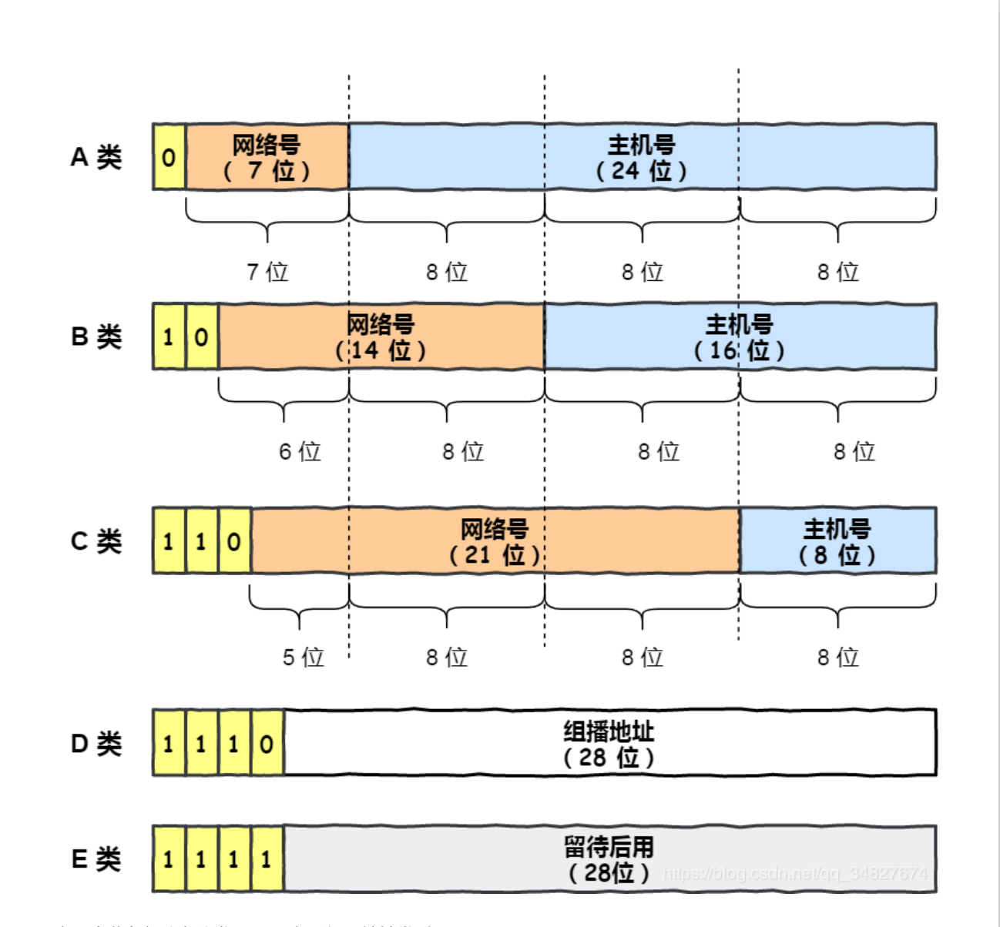
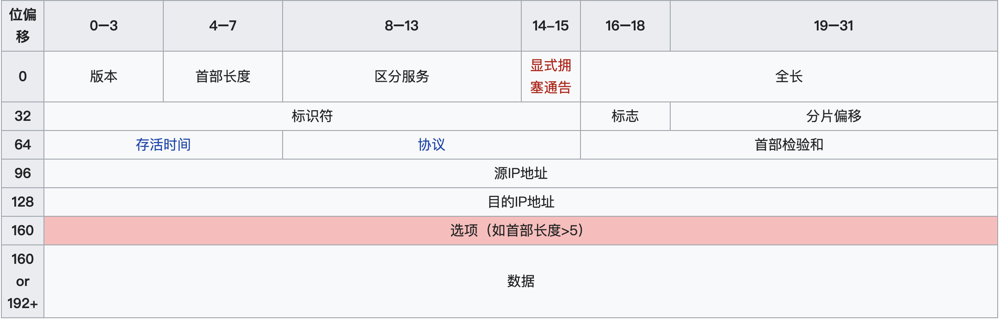

互联网协议提供了“不可靠的”数据包传输机制（也称“尽力而为”或“尽最大努力交付”）；

也就是说，它不保证数据能准确的传输。数据包在到达的时候可能已经

1.损坏，2.顺序错乱，3.产生冗余包，或者 4.直接丢失。如果应用需要保证可靠性，一般需要采取其他的方法，例如利用IP的上层协议控制。

网络层和传输层协议的区别：网络层协议负责提供主机间的逻辑通信；运输层协议负责提供进程间的逻辑通信。

> UDP和IP的区别
>
> （1）IP是提供主机到主机的服务，如果有多个应用，数据应该交给谁？
>
> IP提供主机到主机的服务，[UDP](https://so.csdn.net/so/search?q=UDP&spm=1001.2101.3001.7020)提供应用到应用的服务，通过端口号进行区分。
>
> （2）IP协议只校验头部，UDP除了头部还校验数据部分。

# IP 协议的定义和作用

IP 协议（Internet Protocol）又称互联网协议，是支持网间互联的数据包协议。该协议工作在网络层，主要目的就是为了提高网络的可扩展性，和传输层 TCP 相比，IP 协议提供一种无连接/不可靠、尽力而为的数据报传输服务，其与TCP协议（传输控制协议）一起构成了TCP/IP 协议族的核心。IP 协议主要有以下几个作用：

+ **寻址和路由**：在IP 数据包中会携带源 IP 地址和目的 IP 地址来标识该数据包的源主机和目的主机。IP 数据报在传输过程中，每个**中间节点（IP 网关、路由器）**只根据网络地址进行转发，如果中间节点是路由器，则路由器会根据路由表选择合适的路径。**IP 协议根据路由选择协议提供的路由信息对 IP 数据报进行转发，直至抵达目的主机**。

+ **分段与重组**：IP 数据包在传输过程中可能会经过不同的网络，**在不同的网络中数据包的最大长度限制是不同的**，IP 协议通过**给每个 IP 数据包分配一个标识符以及分段与组装的相关信息**，**使得数据包在不同的网络中能够传输**，被分段后的 IP 数据报可以独立地在网络中进行转发，在到达目的主机后由目的主机完成重组工作，恢复出原来的 IP 数据包。

### 路由器和交换机的区别

+ 交换机：交换机用于局域网，利用主机的物理地址（MAC 地址）确定数据转发的目的地址，它工作于数据链路层。
+ 路由器：路由器通过数据包中的目的 IP 地址识别不同的网络从而确定数据转发的目的地址，网络号是唯一的。路由器根据路由选择协议和路由表信息从而确定数据的转发路径，直到到达目的网络，它工作于网络层。

# IPV4

Pv4是一种无连接的协议，操作在使用[分组交换](https://zh.wikipedia.org/wiki/分组交换)的链路层（如[以太网](https://zh.wikipedia.org/wiki/以太网)）上。此协议会尽最大努力交付数据包，意即它不保证任何数据包均能送达目的地，也不保证所有数据包均按照正确的顺序无重复地到达。这些方面是由上层的传输协议（如[传输控制协议](https://zh.wikipedia.org/wiki/传输控制协议)）处理的。

## IP地址

IP地址最初被描述为包含两部分：网络地址和主机地址。这种区分在IP网络里的路由中使用。

### 私有IP和公有IP

IP地址分公有 IP 地址和私有 IP 地址。

+ 公有地址(Public Address)由Inter NIC（Internet Network Information Center）负责。这些IP地址分配给注册并向Inter NIC提出申请的组织机构。通过它直接访问互联网。

+ 私有IP就是在本地局域网上的IP 与之对应的是公有IP（在互联网上的IP）
随着私有IP网络的发展，为节省可分配的注册IP地址，有一组IP地址被拿出来专门用于私有IP网络，称为私有IP地址。

私有ip属于非注册地址，专门为组织机构内部使用。RFC1918定义了私有IP地址范围：

<table class="wikitable">
<tbody><tr>
<th>名字</th>
<th>地址范围</th>
<th>地址数量</th>
<th>有类别的描述</th>
<th>最大的CIDR地址块
</th></tr>
<tr>
<td>24位块</td>
<td>10.0.0.0–10.255.255.255</td>
<td>16,777,216</td>
<td>一个A类</td>
<td>10.0.0.0/8
</td></tr>
<tr>
<td>20位块</td>
<td>172.16.0.0–172.31.255.255</td>
<td>1,048,576</td>
<td>连续的16个B类</td>
<td>172.16.0.0/12
</td></tr>
<tr>
<td>16位块</td>
<td>192.168.0.0–192.168.255.255</td>
<td>65,536</td>
<td>连续的256个C类</td>
<td>192.168.0.0/16
</td></tr></tbody></table>

这些地址是不会被Internet分配的，它们在Internet上也不会被路由，虽然它们不能直接和Internet网连接，但通过技术手段仍旧可以和 Internet通讯（**NAT技术**）。我们可以根据需要来选择适当的地址类，在内部局域网中将这些地址像公用IP地址一样地使用。

>  在Internet上，有些不需要与 Internet通讯的设备，如打印机、可管理集线器集线器)等也可以使用这些地址，以节省IP地址资源。

### IP地址的常规分类

> 此种划分方式早已过时，目前使用的是CIDR（无类域间路由）

<table class="wikitable mw-collapsible mw-made-collapsible">
<caption>IPv4地址分类
<a class="mw-collapsible-text">折叠</a></caption>
<tbody><tr>
<th>
</th>
<th><b>A类IPv4地址</b>
</th>
<th><b>B类IPv4地址</b>
</th>
<th><b>C类IPv4地址</b>
</th>
<th><b>D类IPv4地址</b>
</th>
<th><b>E类IPv4地址</b>
</th></tr>
<tr>
<th><b>网络标志位</b>
</th>
<td>0
</td>
<td>10
</td>
<td>110
</td>
<td>1110
</td>
<td>11110
</td></tr>
<tr>
<th><b>IP地址范围</b>
</th>
<td>0.0.0.0~127.255.255.255
</td>
<td>128.0.0.0~191.255.255.255
</td>
<td>192.0.0.0~223.255.255.255
</td>
<td>224.0.0.0~239.255.255.255
</td>
<td>240.0.0.0~255.255.255.255
</td></tr>
<tr>
<th><b>可用IP地址范围</b>
</th>
<td>1.0.0.1~127.255.255.254
</td>
<td>128.0.0.1~191.255.255.254
</td>
<td>192.0.0.1~223.255.255.254
</td>
<td>
</td>
<td>
</td></tr>
<tr>
<th><b>是否可以分配给主机使用</b>
</th>
<td>是
</td>
<td>是
</td>
<td>是
</td>
<td>否
</td>
<td>否
</td></tr>
<tr>
<th><b>网络数量（个）</b>
</th>
<td>126   (27-2)
</td>
<td>16384   (214)
</td>
<td>2097152   (221)
</td>
<td>---
</td>
<td>---
</td></tr>
<tr>
<th><b>每个网络中可容纳主机数（个）</b>
</th>
<td>16777214   (224-2)
</td>
<td>65534   (216-2)
</td>
<td>254   (28-2)
</td>
<td>---
</td>
<td>---
</td></tr>
<tr>
<th><b>适用范围</b>
</th>
<td>大量主机的大型网络
</td>
<td>中等规模主机数的网络
</td>
<td>小型局域网
</td>
<td>留给Internet体系结构委员会(IAB)使用

<a href="/wiki/%E7%B5%84%E6%92%AD" class="mw-redirect" title="组播">组播</a>地址

</td>
<td>保留，仅作为搜索、Internet的实验和开发用
</td></tr>
<tr>
<th>备注
</th>
<td>0.0.0.0为特殊地址，表示本网主机
</td>
<td>
</td>
<td>
</td>
<td>
</td>
<td>255.255.255.255为特殊地址，用于定向广播
</td></tr></tbody></table>

IP地址一共分为5类，即A～E，它们分类的依据是其net-id所占的字节长度以及网络号前几位。

+ A类地址:网络号占1个字节。网络号的第一位固定为0。
+ B类地址：网络号占2个字节。网络号的前两位固定为10。
+ C类地址：网络号占3个字节。网络号的前三位固定位110。
+ D类地址：前四位是1110，用于多播(multicast)，即一对多通信。
+ E类地址：前四位是1111，保留为以后使用。

其中，ABC三类地址为单播地址（unicast),用于一对一通信，是最常用的。

**说明**
1. D类与E类IPv4地址不区分网络地址与主机地址

2. 为什么要减 2 呢？因为在 IP 地址中，有两个 IP 是特殊的，分别是主机号全为 1 和 全为 0 地址。

   **主机号全为 1 指定某个⽹络下的所有主机，⽤于⼴播**;  **主机号全为 0 指定某个⽹络**。

### 特殊IP地址

<table class="wikitable">
<caption>特殊IP地址
</caption>
<tbody><tr>
<th>网络号
</th>
<th>主机号
</th>
<th>是否可以作为源地址
</th>
<th>是否可以作为目的地址
</th>
<th>备注/描述
</th></tr>
<tr>
<td>全为0
</td>
<td>全为0
</td>
<td>允许
</td>
<td>禁止
</td>
<td>本网络上的本机（其实，更好的理解是“未指定（即无效的，无意义的）地址”，用作无法使用具体IP情况下的占位符）
</td></tr>
<tr>
<td>全为0
</td>
<td>Host ID
</td>
<td>允许
</td>
<td>禁止
</td>
<td>本地网络的主机（同上）
</td></tr>
<tr>
<td>全为1
</td>
<td>全为1
</td>
<td>禁止
</td>
<td>允许
</td>
<td>在本地网络广播（发到该地址的数据包不能转发到源地址所在网络之外）
</td></tr>
<tr>
<td>127
</td>
<td>任意合法的值
</td>
<td>允许
</td>
<td>允许
</td>
<td>回环地址，用于本地测试（永远都不能出现在主机外部的网络中）
</td></tr>
<tr>
<td>Network ID
</td>
<td>全为1
</td>
<td>禁止
</td>
<td>允许
</td>
<td>在远程网络广播
</td></tr></tbody></table>

### CIDR

**无类别域间路由**（Classless Inter-Domain Routing、**CIDR**）是一个用于给用户分配IP地址以及在互联网上有效地路由IP数据包的，对IP地址进行归类的方法。

无类别域间路由是基于**可变长子网掩码（VLSM）**来进行任意长度的前缀的分配的。CIDR包括：

+ 指定任意长度的前缀的可变长子网掩码技术。遵从CIDR规则的地址有一个后缀说明**前缀的位数**，例如：192.168.0.0/16。这使得对日益缺乏的IPv4地址的使用更加有效。
+ 将多个连续的前缀聚合成超网。以及在互联网中，只要有可能，就显示为一个聚合的网络，因此在总体上可以减少路由表的表项数目。这个过程叫**路由聚合**。
+ 根据机构的实际需要和短期预期需要而不是分类网络中所限定的过大或过小的地址块来管理IP地址的分配的过程。

### IPV4 地址不够如何解决

1. **DHCP：动态主机配置协议**。动态分配 IP 地址，只给接入网络的设备分配IP地址，因此同一个 MAC 地址的设备，每次接入互联网时，得到的IP地址不一定是相同的，**该协议使得空闲的 IP 地址可以得到充分利用**。
2. **CIDR**：无类别域间路由。CIDR 消除了传统的 A 类、B 类、C 类地址以及划分子网的概念，因而**更加有效的分配 IPv4 的地址空间**，但无法从根本上解决地址耗尽问题。
3. **NAT：网络地址转换协议**。我们知道属于不同局域网的主机可以使用相同的 IP 地址，从而一定程度上缓解了 IP 资源枯竭的问题。然而主机在局域网中使用的 IP 地址是不能在公网中使用的，当局域网主机想要与公网进行通信时， NAT 方法可以将该主机 IP 地址转换成全球 IP 地址。该协议能够有效解决 IP 地址不足的问题。
4. **IPv6** ：作为接替 IPv4 的下一代互联网协议，其可以实现 2 的 128 次方个地址，而这个数量级，即使是给地球上每一颗沙子都分配一个IP地址，该协议能够从根本上解决 IPv4 地址不够用的问题。

## IP报文结构

IP报文包含IP首部和数据部分

IPv4报文的首部包含14个字段，其中13个是必须的，第14个是可选的（红色标出），并命名为：“选项”字段。

如下图

+ 版本（Version）

  版本字段占4bit，通信双方使用的版本必须一致。对于IPv4，字段的值是4。

+ 首部长度（Internet Header Length， IHL）

  占4bit，首部长度说明首部有多少32位字（4字节）。由于IPv4首部可能包含数目不定的选项，这个字段也用来确定数据的偏移量。这个字段的最小值是5（二进制0101），相当于5*4=20字节（[RFC 791](https://tools.ietf.org/html/rfc791)），最大十进制值是15。

+ 区分服务（Differentiated Services，DS）

  占6bit，最初被定义为**服务类型**字段，实际上并未使用，但1998年被IETF重定义为区分服务RFC 2474。只有在使用区分服务时，这个字段才起作用，在一般的情况 下都不使用这个字段。

+ 显式拥塞通告（ Explicit Congestion Notification，ECN）

  在RFC 3168中定义，允许在不丢弃报文的同时通知对方网络拥塞的发生。**ECN是一种可选的功能，仅当两端都支持并希望使用，且底层网络支持时才被使用**。

+ 全长（Total Length）

  这个16位字段定义了报文总长，包含首部和数据，单位为字节。这个字段的最小值是20（20字节首部+0字节数据），最大值是$2^{16}-1=65,535$。**IP规定所有主机都必须支持最小576字节的报文**，这是假定上层数据长度512字节，加上最长IP首部60字节，加上4字节富裕量，得出576字节，但大多数现代主机支持更大的报文。**当下层的数据链路协议的最大传输单元（MTU）字段的值小于IP报文长度时，报文就必须被分片**，详细见下个标题。

+ 标识符（Identification）

  占16位，**这个字段主要被用来唯一地标识一个报文的所有分片**，因为分片不一定按序到达，所以在重组时需要知道分片所属的报文。每产生一个数据报，计数器加1，并赋值给此字段。一些实验性的工作建议将此字段用于其它目的，例如增加报文跟踪信息以协助探测伪造的源地址。

+ 标志 （Flags）（**分片相关**）

  这个3位字段用于控制和识别分片，它们是：位0：保留，必须为0；位1：**禁止分片**（Don’t Fragment，**DF**），当DF=0时才允许分片；位2：**更多分片**（More Fragment，**MF**），MF=1代表后面还有分片，MF=0 代表已经是最后一个分片。

  如果DF标志被设置为1，但路由要求必须分片报文，此报文会被丢弃。这个标志可被用于发往没有能力组装分片的主机。

  当一个报文被分片，除了最后一片外的所有分片都设置MF为1。最后一个片段具有非零片段偏移字段，将其与未分片数据包区分开，未分片的偏移字段为0。

+ **分片偏移** （Fragment Offset）

  这个13位字段指明了每个分片相对于原始报文开头的偏移量，**以8字节作单位**。

+ 存活时间（Time To Live，TTL）

  这个8位字段避免报文在互联网中永远存在（例如陷入路由环路）。存活时间以秒为单位，但小于一秒的时间均向上取整到一秒。**在现实中，这实际上成了一个跳数计数器**：报文经过的每个路由器都将此字段减1，当此字段等于0时，报文不再向下一跳传送并被丢弃，最大值是255。常规地，一份[ICMP](https://zh.wikipedia.org/wiki/ICMP)报文被发回到源端说明其发送的报文已被丢弃。这也是[traceroute](https://zh.wikipedia.org/wiki/Traceroute)的核心原理（详见ICMP）。

+ 协议 （Protocol）

  占8bit，这个字段定义了该报文数据区使用的协议，然后交给对应的传输进程。

+ 首部检验和 （Header Checksum）

  **这个16位检验和字段，只对首部查错，不包括数据部分**。在每一跳，路由器都要重新计算出的首部检验和并与此字段进行比对，如果不一致，此报文将会被丢弃。重新计算的必要性是因为每一跳的一些首部字段（如TTL、Flag、Offset等）都有可能发生变化，**不检查数据部分是为了减少工作量**。**数据区的错误留待上层协议处理**——用户数据报协议（UDP）和传输控制协议（TCP）都有检验和字段。此处的检验计算方法不使用CRC。

+ 源地址（Source address）

  一个IPv4地址由四个字节共32位构成，此字段的值是将每个字节转为二进制并拼在一起所得到的32位值。

  例如，10.9.8.7是00001010000010010000100000000111。

  但请注意，**因为NAT的存在，这个地址并不总是报文的真实发送端**，因此发往此地址的报文会被送往NAT设备，并由它被翻译为真实的地址。

+ 目的地址（Destination address）
  与源地址格式相同，但指出报文的接收端。
+ 选项（Options）
附加的首部字段可能跟在目的地址之后，但这并不被经常使用，从1到40个字节不等。请注意首部长度字段必须包括足够的32位字来放下所有的选项（首部长度必须能被32位整除，不够就填充）。**IP选项使用的并不多**。

## 分片和组装

每种数据链路的最⼤传输单元 MTU 都是不相同的，如 FDDI 数据链路 MTU 4352、以太⽹的 MTU 是 1500 字节

等。

每种数据链路的 MTU 之所以不同，是因为每个不同类型的数据链路的使⽤⽬的不同。使⽤⽬的不同，可承载的

MTU 也就不同。

其中，我们最常⻅数据链路是**以太⽹，它的 MTU 是 1500 字节**。

那么当 IP 数据包⼤⼩⼤于 MTU 时， IP 数据包就会被分⽚。

**经过分⽚之后的 IP 数据报在被重组的时候，只能由⽬标主机进⾏，路由器是不会进⾏重组的**。

> （详见 P334 分段和重组的两种方式）

假设发送⽅发送⼀个 4000 字节的⼤数据报，若要传输在以太⽹链路，则需要把数据报分⽚成 3 个⼩数据报进⾏传

输，再交由接收⽅重组成⼤数据报。

在分⽚传输中，⼀旦某个分⽚丢失，则会造成整个 IP 数据报作废，**所以 TCP 引⼊了 MSS 也就是在 TCP 层进⾏分⽚不由 IP 层分⽚**，那么对于 UDP 我们尽量不要发送⼀个⼤于 MTU 的数据报⽂。

> 详见 ”路径 MTU 发现“，避免IP分组。

### 分组

当设备收到IP报文时，分析其目的地址并决定要在哪个链路上发送它。**MTU决定了数据载荷的最大长度，如IP报文长度比MTU大，则IP数据包必须进行分片。每一片的长度都小于等于MTU减去IP首部长度**。接下来每一片均被放到独立的IP报文中，并进行如下修改：

+ 总长字段被修改为此分片的长度；
+ 更多分片（MF）标志被设置，除了最后一片；
+ 分片偏移量字段被调整为合适的值；
+ 首部检验和被重新计算。

例如，对于一个长20字节的首部和一个MTU为1,500的以太网，分片偏移量将会是：0、(1480/8)=185、(2960/8)=370、(4440/8)=555、(5920/8)=740、等等。

比如，一个4,500字节的数据载荷被封装进了一个没有选项的IP报文（即总长为4,520字节），并在MTU为2,500字节的链路上传输，那么它会被破成如下两个分片：

<table>
<tbody><tr>
<th rowspan="2">#
</th>
<th colspan="2" width="200">总长
</th>
<th rowspan="2">更多分片（MF）？
</th>
<th rowspan="2">DF
</th>
<th rowspan="2">分片偏移量
</th></tr>
<tr>
<th width="100">首部
</th>
<th width="100">数据
</th></tr>
<tr>
<td rowspan="2">1</td>
<td colspan="2">2500</td>
<td rowspan="2" class="table-yes" style="text-align:center; background:#90FF90">是
</td>
<td rowspan="2">0</td>
<td rowspan="2">0
</td></tr>
<tr>
<td>20</td>
<td>2480
</td></tr>
<tr>
<td rowspan="2">2</td>
<td colspan="2">2040</td>
<td rowspan="2" class="table-no" style="text-align:center; background:#FF9090">否
</td>
<td rowspan="2">0</td>
<td rowspan="2">310
</td></tr>
<tr>
<td>20</td>
<td>2020
</td></tr></tbody></table>

### 重组
当一个接收者发现IP报文的下列项目之一为真时：

+ DF标志为0（也就是允许分段）；
+ 分片偏移量字段不为0。
它便知道这个报文已被分片，并随即将数据、标识符字段、分片偏移量和更多分片标志一起储存起来。

当接受者收到了更多分片标志未被设置的分片时，它便知道原始数据载荷的总长。

一旦它收齐了所有的分片，它便可以将所有片按照正确的顺序（通过分片偏移量）组装起来，并交给上层协议栈。

> 参考 
>
> [网际协议](https://zh.wikipedia.org/wiki/%E7%BD%91%E9%99%85%E5%8D%8F%E8%AE%AE)
