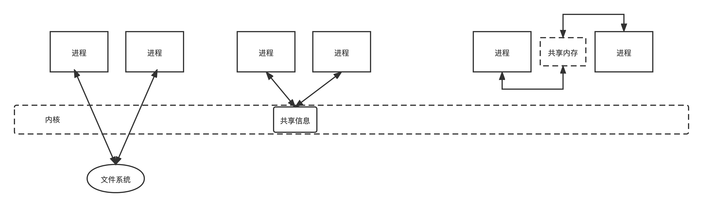

# 介绍


进程间通信（IPC：interprocess communication）是一种涉及一个进程与另一个进程的通信的机制。 这通常只发生在一个系统中。

沟通可以有两种类型 -

+ 在仅从一个进程启动的相关进程之间，例如父进程和子进程。
+ 在不相关的进程之间，或两个或多个不同的进程之间。


具体来说，有下面三大类形式：





按照《UNIX网络编程 卷2：进程间通信》的目录分类：

1. 消息传递（管道、FIFO、消息队列）
2. 同步（互斥锁和条件变量、读写锁、信号量）
3. 共享内存（匿名的、具名的）


# 消息传递


## 管道

**管道是两个或多个相关或相互关联的过程之间的通信媒介。**

它可以在一个进程内，也可以在子进程和父进程之间进行通信。 通信也可以是多层次的，例如父母，孩子和孙子之间的通信等。通过写入管道的一个过程和管道的其他读取来实现通信。 

**要实现管道系统调用，请创建两个文件，一个用于写入文件，另一个用于从文件中读取。**


### 使用方法

```c
#include<unistd.h>
int pipe(int pipedes[2]);
```

该系统调用将创建用于单向通信的管道，即，它创建两个描述符，第一个连接到管道读取而另一个连接以写入管道。

描述符pipedes [0]用于读取，pipedes [1]用于写入。 无论写入管道[1]是什么都可以从pipedes [0]中读取。

此调用在成功时返回零，在失败时返回-1。 要了解失败的原因，请使用errno variable或perror（）函数进行检查。


如下图这是使用管道进行双向通信的常见做法：


### 实例代码

```c
#include<stdio.h>
#include<unistd.h>

int main() {
    // 用两个单工的管道实现双向通信
    int pipefds1[2], pipefds2[2];
    int returnstatus1, returnstatus2;
    int pid;
    char pipe1writemessage[20] = "Hi";
    char pipe2writemessage[20] = "Hello";
    char readmessage[20];
    returnstatus1 = pipe(pipefds1);
    if (returnstatus1 == -1) {
        printf("Unable to create pipe 1 \n");
        return 1;
    }
    returnstatus2 = pipe(pipefds2);
    if (returnstatus2 == -1) {
        printf("Unable to create pipe 2 \n");
        return 1;
    }
    pid = fork();
    if (pid != 0) { // Parent process 
        close(pipefds1[0]); // Close the unwanted pipe1 read side
        close(pipefds2[1]); // Close the unwanted pipe2 write side
        printf("In Parent: Writing to pipe 1 – Message is %s\n", pipe1writemessage);
        write(pipefds1[1], pipe1writemessage, sizeof(pipe1writemessage));
        read(pipefds2[0], readmessage, sizeof(readmessage));
        printf("In Parent: Reading from pipe 2 – Message is %s\n", readmessage);
    } else { //child process
        close(pipefds1[1]); // Close the unwanted pipe1 write side
        close(pipefds2[0]); // Close the unwanted pipe2 read side
        read(pipefds1[0], readmessage,
             sizeof(readmessage));
        printf("In Child: Reading from pipe 1 – Message is %s\n", readmessage);
        printf("In Child: Writing to pipe 2 – Message is %s\n", pipe2writemessage);
        write(pipefds2[1], pipe2writemessage,
              sizeof(pipe2writemessage));
    }
    return 0;
}
```


## FIFO

暂略


## 消息队列


当我们已经拥有共享内存时，为什么我们需要消息队列？ 这将有多种原因，让我们试着将其分解为多个点以简化 -

+ 如所理解的，一**旦进程接收到消息，它将不再可用于任何其他过程**。 而在共享内存中，数据可供多个进程访问。
+ 如果我们想要与小消息格式进行通信。
+ 当多个进程同时通信时，**共享内存数据需要通过同步进行保护**。
+ 使用共享内存的写入和读取频率很高，但**实现该功能将非常复杂**。 在这种情况下使用不值得。
+ 如果**并不是所有进程都需要访问共享内存**，那么使用消息队列实现会更好。
+ 如果我们想要**与不同的数据包进行通信**，则说过程A将消息类型1发送到进程B，消息类型10发送到进程C，消息类型20发送到进程D.在这种情况下，使用消息队列实现更简单。 为了将给定的消息类型简化为1,10,20，它可以是0或+ ve或-ve，如下所述。
+ 当然，**消息队列的顺序是FIFO**（先进先出）。 插入队列中的第一条消息是第一个要检索的消息。


1. 通过一个进程写入共享内存并通过另一个进程从共享内存中读取。 我们知道，阅读也可以通过多个流程完成


2. 一个进程使用不同的数据包写入共享内存，并通过多个进程从中读取，即按消息类型。


### 使用方法


这里以POSIX的接口为实例

| API                                                          | API 作用                                                     |
| ------------------------------------------------------------ | ------------------------------------------------------------ |
| mqd_t mq_open(const char *name, int oflag, mode_t mode, struct mq_attr* attr) | 创建命名消息队列                                             |
| mqd_t mq_close(mqd_t mqdes)                                  | 结束到开放式消息队列的连接                                   |
| mqd_t mq_unlink(const char *name)                            | 结束到开放式消息队列的连接，并在最后一个进程关闭此队列时将其删除 |
| mqd_t mq_send(mqd_t mqdes, const char *msg_ptr, size_t msg_len, unsigned msg_prio) | 将消息放入队列                                               |
| ssize_t mq_receive(mqd_t mqdes, char *msg_ptr, size_t msg_len, unsigned* msg_prio) | 在队列中接收消息                                             |
| mqd_t mq_notify(mqd_t mqdes, const struct sigevent *notification) | 通知进程或线程消息已存在于队列中                             |
| mqd_t mq_getattr(mqd_t mqdes, struct mq_attr *attr) 、mqd_t mq_setattr(mqd_t mqdes, struct mq_attr* newattr, struct mq_attr *oldattr) | 设置或获取消息队列属性                                       |


# 同步


## 互斥锁与条件变量

这里互斥锁和条件变量的使用，与Java的`synchronized+wait+notify`以及`Lock+Condition` 机制在语义上和使用上十分相似，就不详细介绍了。


### 使用方法

> linux c版本的条件变量和互斥锁(mutex)，不是C++的。

1. 互斥锁的初始化

```c
int pthread_mutex_init(pthread_mutex_t *restrict mutex, const pthread_mutexattr_t *restrict attr);
pthread_mutex_t mutex = PTHREAD_MUTEX_INITIALIZER;
```

2. 互斥锁的销毁

```c
int pthread_mutex_destroy(pthread_mutex_t *mutex);
```


3. 加锁与解锁

```c
int pthread_mutex_lock(pthread_mutex_t *mutex);
int pthread_mutex_trylock(pthread_mutex_t *mutex);
int pthread_mutex_unlock(pthread_mutex_t *mutex);
```


4. 条件变量的函数

```c
int pthread_cond_wait(pthread_cond_t *restrict cond,
           pthread_mutex_t *restrict mutex);
int pthread_cond_signal(pthread_cond_t *cond);
```


## 信号量


基本上信号量分为两种类型 -

**Binary Semaphores** - 只有两个状态0和1，即锁定/解锁或可用/不可用，Mutex实现。

**Counting Semaphores** - 允许任意资源计数的信号量称为计数信号量。


### 使用方法


| API                                                          | API 作用                                                     |
| ------------------------------------------------------------ | ------------------------------------------------------------ |
| sem_t *sem_open(const char  *name, int oflag, mode_t mode, unsigned int value) | 创建命名信号量                                               |
| int sem_init(sem_t *sem, int pshared, unsigned int value)    | 初始化信号量结构                                             |
| int sem_close(sem_t *sem)                                    | 结束到开放式信号量的连接                                     |
| int sem_unlink(const char *name)                             | 结束到开放式信号量的连接，并在最后一个进程关闭此信号量时将其删除 |
| int sem_getvalue(sem_t *sem, int* sval)                      | 将信号量的值复制到指定整数中                                 |
| int sem_wait(sem_t *sem)                                     | 递减信号量计数，当其他进程拥有信号量时进行阻塞，或者当其他进程拥有信号量时返回错误（aka P 操作） |
| int sem_post(sem_t *sem)                                     | 递增信号量计数（aka V 操作）                                 |


# 共享内存相关

## 内存映射


mmap()系统调用在调用进程的虚拟地址空间中提供映射，该映射将文件或设备映射到内存中。 这有两种类型 -

**File mapping or File-backed mapping** - 此映射将进程的虚拟内存区域映射到文件。 这意味着读取或写入这些内存区域会导致文件被读取或写入。 这是默认的映射类型。

**Anonymous mapping** - 此映射映射进程的虚拟内存区域，不受任何文件的支持。 内容初始化为零。 此映射类似于动态内存分配（malloc()），并在某些malloc()实现中用于某些分配。


当两个或多个进程共享相同的页面时，每个进程可以根据映射类型查看其他进程所做的页面内容的更改。 映射类型可以是私有的也可以是共享的 -

**Private Mapping (MAP_PRIVATE)** - 对此映射内容的修改对其他进程不可见，并且映射不会传送到基础文件。

**Shared Mapping (MAP_SHARED)** - 对此映射内容的修改对其他进程可见，并且映射将传送到基础文件。


### 使用方法

```c
#include <sys/mman.h>
void *mmap(void *addr, size_t length, int prot, int flags, int fd, off_t offset);
```

+ 参数

虚拟地址addr可以是用户指定的，也可以是内核生成的（将addr作为NULL传递）;

字段length需要以字节为单位的映射大小;

字段prot表示存储器保护值，例如PROT_NONE，PROT_READ，PROT_WRITE，PROT_EXEC，分别用于可能无法访问，读取，写入或执行的区域。 该值可以是单个（PROT_NONE），也可以与三个标志中的任何一个（最后3个）进行OR运算;

字段flags指示映射类型或MAP_PRIVATE或MAP_SHARED;

字段fd表示标识要映射的文件的文件描述符;

字段offset表示文件的起始点，如果需要映射整个文件，则偏移量应为零。

+ 返回值

在成功时返回映射的起始地址，或者在出错时返回MAP_FAILED。


```c
#include <sys/mman.h>
int munmap(void *addr, size_t length);
```

执行已映射内存映射区域的取消映射。

字段addr表示映射的起始地址，length表示要取消映射的映射的字节大小。


### 实例代码

```c
/* Filename: mmap_test.c */
#include <stdio.h>
#include <sys/stat.h>
#include <sys/types.h>
#include <fcntl.h>
#include <unistd.h>
#include <stdlib.h>
#include <sys/mman.h>

void write_mmap_sample_data();

int main() {
    struct stat mmapstat;
    char *data;
    int minbyteindex;
    int maxbyteindex;
    int offset;
    int fd;
    int unmapstatus;
    write_mmap_sample_data();
    if (stat("MMAP_DATA.txt", &mmapstat) == -1) {
        perror("stat failure");
        return 1;
    }
    if ((fd = open("MMAP_DATA.txt", O_RDONLY)) == -1) {
        perror("open failure");
        return 1;
    }
    data = mmap((caddr_t) 0, mmapstat.st_size, PROT_READ, MAP_SHARED, fd, 0);
    if (data == (caddr_t) (-1)) {
        perror("mmap failure");
        return 1;
    }
    minbyteindex = 0;
    maxbyteindex = mmapstat.st_size - 1;
    do {
        printf("Enter -1 to quit or ");
        printf("enter a number between %d and %d: ", minbyteindex, maxbyteindex);
        scanf("%d", &offset);
        if ((offset >= 0) && (offset <= maxbyteindex))
            printf("Received char at %d is %c\n", offset, data[offset]);
        else if (offset != -1)
            printf("Received invalid index %d\n", offset);
    } while (offset != -1);
    unmapstatus = munmap(data, mmapstat.st_size);
    if (unmapstatus == -1) {
        perror("munmap failure");
        return 1;
    }
    close(fd);
    system("rm -f MMAP_DATA.txt");
    return 0;
}

void write_mmap_sample_data() {
    int fd;
    char ch;
    struct stat textfilestat;
    fd = open("MMAP_DATA.txt", O_CREAT | O_TRUNC | O_WRONLY, 0666);
    if (fd == -1) {
        perror("File open error ");
        return;
    }
    // Write A to Z
    ch = 'A';
    while (ch <= 'Z') {
        write(fd, &ch, sizeof(ch));
        ch++;
    }
    // Write 0 to 9
    ch = '0';
    while (ch <= '9') {
        write(fd, &ch, sizeof(ch));
        ch++;
    }
    // Write a to z
    ch = 'a';
    while (ch <= 'z') {
        write(fd, &ch, sizeof(ch));
        ch++;
    }
    close(fd);
}
```


## 共享内存

共享内存是两个或多个进程之间共享的内存。 但是，为什么我们需要共享内存或其他一些通信方式？

重申一下，每个进程都有自己的地址空间，如果任何进程想要将自己的地址空间中的某些信息与其他进程通信，那么只有IPC（进程间通信）技术才有可能。 我们已经知道，沟通可以在相关或不相关的流程之间进行。


### Posix 版本

| API                                                          | API 作用                                               |
| ------------------------------------------------------------ | ------------------------------------------------------ |
| int shm_open(const char *name, int oflag, mode_t mode)       | 创建共享内存，成功返回描述符                           |
| int shm_unlink(const char *name)                             | 结束到共享内存的连接，并在最后一个进程关闭它时将其删除 |
| void *mmap(void* addr, size_t length, int prot, int flags, int fd, off_t offset) | 映射内存                                               |


Posix的共享内存区构筑在`mmap`之上。


### SystemV 版本

相关函数

```c
#include <sys/ipc.h>
#include <sys/shm.h>
// 创建或分配System V共享内存段, 成功时返回有效的共享内存标识符（用于进一步调用共享内存）
int shmget(key_t key, size_t size, int shmflg)
// 为System V共享内存段执行共享内存操作，即将共享内存段附加到调用进程的地址空间。成功时返回附加共享内存段的地址。 
void * shmat(int shmid, const void *shmaddr, int shmflg)
// 从调用进程的地址空间中分离共享内存段的System V共享内存段。将在成功时返回0，在失败时返回-1
int shmdt(const void *shmaddr)
// 执行System V共享内存段的控制操作
int shmctl(int shmid, int cmd, struct shmid_ds *buf)  
```


> 参考链接
>
> 《UNIX网络编程 卷2：进程间通信》
>
> [WIKI教程](https://iowiki.com/inter_process_communication/inter_process_communication_index.html)
> [Linux进程间通信（六）：共享内存 shmget()、shmat()、shmdt()、shmctl() ](https://www.cnblogs.com/52php/p/5861372.html)


