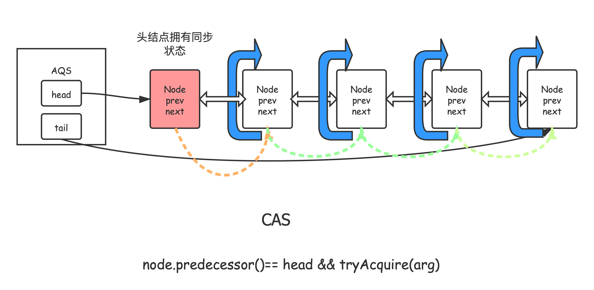

# 从自己实现一把锁说起


《操作系统概念》一书中在第6章”同步“中，以CAS这样的原子命令实现了锁的语义，并且以它为基础实现了非忙等（busy waiting）的锁。

下面我们在Java中使用`AtomicBoolean`这个原子更新类实现


## 代码实例

众所周知，`i++`是经典的读改写操作，它不是原子的。

下面的代码在多线程环境下将一个数`x`自增N次，并观察在加锁和不加锁的情况下的结果。

结果，显示如果使用我们自己的实现的互斥锁，`x`最终等于N，也说明锁生效了。

```java
public class LockByCAS implements Lock {

    private final AtomicBoolean isLocked = new AtomicBoolean(false);

    static class MyInteger {
        private int x;
        public MyInteger(int x) {
            this.x = x;
        }
        void incr() {
            x++;
        }
        public int getX() {
            return x;
        }
    }


    public static void main(String[] args) throws InterruptedException {
        MyInteger integer = new MyInteger(0);
        final int N = 1000000;
        Lock lock = new SimpleMutex();
        CountDownLatch countDownLatch = new CountDownLatch(N);
        ExecutorService pool = Executors.newFixedThreadPool(10);
        for (int i = 0; i < N; i++) {
            pool.submit(() -> {
                // 你可以去掉这个，看看结果
                lock.lock();
                integer.incr();
                lock.unlock();
                countDownLatch.countDown();
            });
        }
        countDownLatch.await(); // just wait all tasks to finish
        pool.shutdown();
        System.out.println(integer.getX());
    }


    @Override
    public void lock() {
        // busy waiting
        while (isLocked.compareAndExchange(false, true)) {
            Thread.yield();
        }        
    }


    @Override
    public void unlock() {
        isLocked.set(false);
    }
    
    /* 省略其他接口的方法 */
}
```


需要注意的是`compareAndSet`和`compareAndExchange`的区别，`compareAndExchange`的返回值是旧值，

而`compareAndSet`的返回值是CAS是否成功。

所以，如果在Java8中，使用`compareAndSet`可以使用下面的代码代替上面的循环。

```java
/* notice that compareAndExchange is different from compareAndSet*/
        for(;;) {
            // CAS succeed to jump the loop
            if(isLocked.compareAndSet(false, true)) {
                break;
            }
        }
```


## 总结

来总结一下自己实现的锁的缺点。

1. 使用`while`+`yield`，实际上就是忙等，在线程竞争非常剧烈的时候，CPU资源被大大浪费。不好，我们后面会用`wait`+`notify`的范式解决这个问题，使得线程没有获得锁的时候可以放弃CPU资源。
2. 使用了`AtomicBoolean`，以及编写了一些自旋锁实现的模板代码。如果要实现其它的同步工具，这样的模板代码还要再写一遍。况且，`AtomicBoolean`自己是怎么实现的呢？


> 实际上面的痛点也正是由AQS(抽象队列同步器)所要解决的问题了。


我们不妨看一看使用AQS实现一个非忙等的互斥锁有多简单，再开始我们对AQS的介绍。


```java
public class SimpleMutex implements Lock {

    // Our internal helper class
    private static class Sync extends AbstractQueuedSynchronizer {

        // Acquires the lock if state is zero
        @Override
        protected boolean tryAcquire(int acquires) {
            return compareAndSetState(0, 1);
        }

        // Releases the lock by setting state to zero
        @Override
        protected boolean tryRelease(int releases) {
            setState(0); // no need to use cas
            return true;
        }

        // Provides a Condition
        public Condition newCondition() {
            return new AbstractQueuedSynchronizer.ConditionObject();
        }

    }

    // The sync object does all the hard work. We just forward to it.
    private final Sync sync = new Sync();

    @Override
    public void lock() {
        sync.acquire(1);
    }

    @Override
    public void unlock() {
        sync.release(1);
    }

    @Override
    public Condition newCondition() {
        return sync.newCondition();
    }
  
    // 还有其他的加锁方法，这里省略。下面的 Mutex 会有完整的实现。
}

```

通过继承AQS并重写一些方法，就可以实现一份非忙等的锁（不过这个锁还有一些锁语义的检查没有实现，这里仅仅作一个展示罢了）。


# 介绍

`AbstractQueuedSynchronizer`抽象队列同步器（简称**队列同步器**），是用来构建锁、信号量等同步组件的一个基础模板类，它使用了一个int成员变量来表示同步状态，通过内置的FIFO队，来完成对那些因为竞争资源（这里的资源形式各式各样，比如锁就是一个典型的竞争资源）而等待的线程的排队工作。


## 如何使用AQS

AQS是一个抽象类，因此必须有子类去实现它的抽象方法。

设计模式告诉我们，聚合由于继承。

所以常见的使用方式是：

在自定义的同步组件中，用一个静态内部类去继承AQS，实现它的抽象方法。自定义的同步组件使用这个AQS的子类去实现high-level的同步语义。


要将此类用作同步器的基础，请根据适用情况重新定义以下方法，

1. `tryAcquire`
2. `tryRelease`
3. `tryAcquireShared`
4. `tryReleaseShared`
5. `isHeldExclusively`

默认情况下，这些方法中的每一个都会抛出`UnsupportedOperationException `。 这些方法的实现必须是内部线程安全的，并且通常应该是立即返回的而不是阻塞的。


override这些方法是使用此类的唯一支持方式。 所有其他方法都被声明为final因为都是模板类的模板方法，无需也不能重写。


重写同步器指定的方法时,需要使用`getState` 、 `setState()`、`compareAndSetState`来检查或修改同步器的状态。


## AQS和同步组件的关系

同步组件面向同步组件的使用者，比如`ReentrantLock` ；

而AQS构建同步组件的实现者，它隐藏了很多实现具体的实现细节，实现者只需要实现AQS的若干方法即可。

锁和同步器很好地隔离了使用者和实现者所需关注的领域。同时省去实现者对大量模板方法的编写。


# 源码分析


### AQS用于访问和修改同步状态的方法


+ `getState()` : 获取当前同步状态；
+ `setState(int newState)` 设置当前同步状态；
+ `compareAndSetState(int expect, int update)`使用CAS设置当前的状态，该方法是原子的。 


## AQS的可重写的方法

```java
    // 独占式获取同步状态，该方法应该查询对象的状态是否符合预期，如果允许，再进行CAS设置同步状态；
    // 如果此方法返回失败，acquire 方法可能会将线程排队（如果它尚未排队），直到收到来自某个其他线程的释放信号。 
    // 获取到同步状态返回 true, 否则返回 false
    protected boolean tryAcquire(int arg) {
        throw new UnsupportedOperationException();
    }

    // 独占式释放同步状态，其他在等待获取同步状态的线程将有机会获取同步状态
    protected boolean tryRelease(int arg) {
        throw new UnsupportedOperationException();
    }

    // 共享式获取同步状态，该方法应该查询对象的状态是否允许在共享模式下获取它，如果允许则获取它。
    // 如果此方法返回失败，acquire 方法可能会将线程排队（如果它尚未排队），直到收到来自某个其他线程的释放信号。
    protected int tryAcquireShared(int arg) {
        throw new UnsupportedOperationException();
    }

    // 共享式释放同步状态
    protected boolean tryReleaseShared(int arg) {
        throw new UnsupportedOperationException();
    }

    // 查询同步器是否在独占模式下被线程使用，一般该方法表示同步器是否被该线程独占（参考线程获取到锁的状态）
    protected boolean isHeldExclusively() {
        throw new UnsupportedOperationException();
    }

```


## AQS提供的模板方法

独占式和共享式获取的区别在于**同一时刻能否有多个线程同时获取的同步状态**。

（比如读写锁中，读-读共享，实际上就是因为可以同时共享的获取到同步状态）。


| 方法名称                                                  | 描述                                                         |
| --------------------------------------------------------- | ------------------------------------------------------------ |
| **独占式的获取释放同步状态**                              | ~                                                            |
| void acquire(int arg)                                     | 独占式获取同步状态，调用重写的`tryAcquire`后如果成功直接返回，否则进入同步队列等待。 |
| void acquireInterruptibly(int arg)                        | 与`acquire`类似，不过该方法响应中断。在当前线程在同步队列等待的时候，如果它被中断，则该方法会抛出`InterruptedException·。 |
| boolean tryAcquireNanos(int arg, long nanosTimeout)       | 在`acquireInterruptibly`的基础上加了超时限制，如果没有在限制时间内获取到同步状态，返回false。 |
| boolean release(int arg)                                  | 独占式的释放同步状态，该方法会在释放同步状态后，将同步队列中第一个节点包含的线程唤醒。该方法会调用重写的`tryRelease` |
| **共享式的获取释放同步状态**                              | ~                                                            |
| void acquireShared(int arg)                               | 共享式获取同步状态，如果不能获取到同步状态，进入同步队列等待，和独占式获取的主要区别在于同一时刻可以有多个线程获取到同步状态。 |
| void acquireSharedInterruptibly(int arg)                  |                                                              |
| boolean tryAcquireSharedNanos(int arg, long nanosTimeout) |                                                              |
| boolean releaseShared(int arg)                            |                                                              |
| **查询同步队列的情况**                                    | ~                                                            |
| boolean hasQueuedThreads()                                | 查询是否有线程在等待获取                                     |
| getFirstQueuedThread                                      | 返回队列中的第一个（等待时间最长的）线程，如果当前没有线程排队，则返回null 。 |
| boolean isQueued(Thread thread)                           | 如果给定线程当前正在排队，则返回 true。<br/>此实现遍历队列以确定给定线程的存在。 |
| Collection`<Thread>`getQueuedThreads()                    | 返回一个包含可能正在等待获取的线程的集合。                   |


# 使用AQS实现简单的同步工具


## 不可重入的独占锁Mutex


这个 `Mutex` 就是对上面的 *自己实现锁* 的句号了，

```java
public class Mutex implements Lock {

    // Our internal helper class
    private static class Sync extends AbstractQueuedSynchronizer {
        // Acquires the lock if state is zero

        @Override
        protected boolean tryAcquire(int acquires) {
            assert acquires == 1; // Otherwise unused
            if (compareAndSetState(0, 1)) {
                // 设置当前拥有独占访问权限的线程。
                setExclusiveOwnerThread(Thread.currentThread());
                return true;
            }
            return false;
        }

        // Releases the lock by setting state to zero
        @Override
        protected boolean tryRelease(int releases) {
            assert releases == 1; // Otherwise unused
            if (!isHeldExclusively())  // 只有抢到锁的才能释放锁
                throw new IllegalMonitorStateException();
            setExclusiveOwnerThread(null);
            setState(0);
            return true;
        }

        @Override
        public boolean isHeldExclusively() {
            // a data race, but safe due to out-of-thin-air guarantees
            return getExclusiveOwnerThread() == Thread.currentThread();
        }

        // Reports whether in locked state
        public boolean isLocked() {
            return getState() != 0;
        }

        // Provides a Condition
        public Condition newCondition() {
            return new AbstractQueuedSynchronizer.ConditionObject();
        }

    }

    // The sync object does all the hard work. We just forward to it.
    private final Sync sync = new Sync();

    @Override
    public void lock() {
        sync.acquire(1);
    }

    @Override
    public boolean tryLock() {
        return sync.tryAcquire(1);
    }

    @Override
    public void unlock() {
        sync.release(1);
    }

    @Override
    public Condition newCondition() {
        return sync.newCondition();
    }

    @Override
    public void lockInterruptibly() throws InterruptedException {
        sync.acquireInterruptibly(1);
    }

    @Override
    public boolean tryLock(long timeout, TimeUnit unit)
            throws InterruptedException {
        return sync.tryAcquireNanos(1, unit.toNanos(timeout));
    }

    public boolean isLocked() {
        return sync.isLocked();
    }

    public boolean isHeldByCurrentThread() {
        return sync.isHeldExclusively();
    }

    public boolean hasQueuedThreads() {
        return sync.hasQueuedThreads();
    }
}

```


## 简易的发令枪 BooleanLatch

如下图实现的是一个简单的`CountDownLatch`,

不过只需要调用`fire`就可以唤醒所有那些因为它而等待的线程。


值得注意的是，因为唤醒的时候是全部都要唤醒，并且完全可以有多个线程同时去调用`fire()`，

所以**下面的对于同步状态的获取和释放都是共享式的**。

```java
public class BooleanLatch {

    private static class Sync extends AbstractQueuedSynchronizer {
        boolean isSignalled() {
            return getState() != 0;
        }

        protected int tryAcquireShared(int ignore) {
            return isSignalled() ? 1 : -1; // >= 0
        }

        protected boolean tryReleaseShared(int ignore) {
            assert ignore == 1; // just use state 1
            setState(1);
            return true;
        }
    }

    private final Sync sync = new Sync();

    public void fire() {
        sync.releaseShared(1);
    }

    public void await() throws InterruptedException {
        sync.acquireSharedInterruptibly(1);
    }

    public static void main(String[] args) throws InterruptedException {
        BooleanLatch booleanLatch = new BooleanLatch();
        for (int i = 0; i < 8; i++) {
            new Thread(() -> {
                try {
                    booleanLatch.await();
                } catch (InterruptedException e) {
                    e.printStackTrace();
                }
                System.out.println(Thread.currentThread().getName() + " start");
            }).start();
        }

        for (int i = 0; i < 3; i++) {
            TimeUnit.SECONDS.sleep(1);
            System.out.println("倒计时" + (3 - i));
        }
        booleanLatch.fire();
    }
}
```

## 最多两个线程同时获得锁 TwinsLock

因为允许多个线程同时获取锁，所以这里的对于同步状态的获取都是共享式的。

```java
public class TwinsLock implements Lock {


    private static class Sync extends AbstractQueuedSynchronizer {

        public Sync() {
            setState(2);
        }

        @Override
        protected int tryAcquireShared(int arg) {
            for (; ; ) { // 直到成功或者当前不可获取锁（不可获取锁就要去等待）
                int count = getState();
                int newCount = count - arg;
                if (newCount < 0 || compareAndSetState(count, newCount)) {
                    return newCount;
                }
            }
        }

        @Override
        protected boolean tryReleaseShared(int arg) {
            for (; ; ) {
                int count = getState();
                int newCount = count + arg;
                if (compareAndSetState(count, newCount)) {
                    return true;
                }
            }
        }
    }

    private final Sync sync = new Sync();


    @Override
    public void lock() {
        sync.acquireShared(1);
    }

    @Override
    public void unlock() {
        sync.releaseShared(1);
    }

    @Override
    public void lockInterruptibly() throws InterruptedException {
        sync.acquireSharedInterruptibly(1);
    }

    @Override
    public boolean tryLock() {
        return sync.tryAcquireShared(1) >= 0;
    }

    @Override
    public boolean tryLock(long time, TimeUnit unit) throws InterruptedException {
        return sync.tryAcquireSharedNanos(1, unit.toNanos(time));
    }


    @Override
    public Condition newCondition() {
        throw new UnsupportedOperationException();
    }

    static void sleep(int time) {
        try {
            TimeUnit.SECONDS.sleep(time);
        } catch (InterruptedException e) {
            System.err.println(e.getMessage());
        }
    }
}
```

测试代码

```java
    public static void main(String[] args) {
        final Lock lock = new TwinsLock();
        class Worker extends Thread {
            @Override
            public void run() {
                lock.lock();
                try {
                    System.out.println(Thread.currentThread().getName());
                    TwinsLock.sleep(2);
                } finally {
                    lock.unlock();
                }
            }
        }
        for (int i = 0; i < 10; i++) {
            Worker worker = new Worker();
            worker.setDaemon(true);
            worker.start();
        }
        for (int i = 0; i < 10; i++) {
            sleep(1);
            System.out.println();
        }
    }
```


# AQS源码分析


# 同步队列


```java
static final class Node {
        /** Marker to indicate a node is waiting in shared mode */
        // 共享等待模式
        static final Node SHARED = new Node();
        /** Marker to indicate a node is waiting in exclusive mode */
        // 独占等待模式
        static final Node EXCLUSIVE = null;

        /** waitStatus value to indicate thread has cancelled */
        // 表明：由于在同步队列中等待的线程等待超时或被中断，需要从队列中取消等待，节点进入此状态就不再变化
        static final int CANCELLED =  1;
        /** waitStatus value to indicate successor's thread needs unparking */
        // 后继节点正在等待，而当前线程释放了同步状态或取消，会通知后继节点
        static final int SIGNAL    = -1;
        /** waitStatus value to indicate thread is waiting on condition */
        // 节点当在等待队列里，节点相关的线程正在因某个Condition等待
        static final int CONDITION = -2;
        // 表明下一次共享式同步状态获取将会无条件的传播下去
        static final int PROPAGATE = -3;

        // 尽可取为上述的枚举状态和初始化状态 0 ;
        // waitStatus < 0, 表明需要给Node发信号做一些事情，反之无需
        volatile int waitStatus;

        // 前驱
        volatile Node prev;
        // 后继
        volatile Node next;
        // 在构造时初始化并在使用后置 null
        volatile Thread thread;

        // 该字段的含义被复用：
        // 1. 
        Node nextWaiter;

        // 是否是共享式等待的节点类型
        final boolean isShared() {
            return nextWaiter == SHARED;
        }

        /**
         * Returns previous node, or throws NullPointerException if null.
         * Use when predecessor cannot be null.  The null check could
         * be elided, but is present to help the VM.
         *
         * @return the predecessor of this node
         */
        final Node predecessor() throws NullPointerException {
            Node p = prev;
            if (p == null)
                throw new NullPointerException();
            else
                return p;
        }

        Node() {    // Used to establish initial head or SHARED marker
        }

        Node(Thread thread, Node mode) {     // Used by addWaiter
            this.nextWaiter = mode;
            this.thread = thread;
        }

        Node(Thread thread, int waitStatus) { // Used by Condition
            this.waitStatus = waitStatus;
            this.thread = thread;
        }
    }

    // 懒初始化，仅通过 setHead 修改（除了初始化的时候）
    // 首节点，总是获取同步状态成功的节点
    private transient volatile Node head;

    // 尾节点，懒初始化，仅通过 enq 修改
    private transient volatile Node tail;

    // 同步状态
    private volatile int state;
```


## 独占式同步状态的获取与释放

+ 同步器的独占式同步状态的获取：`acquire(int arg)`


先尝试一下获取同步状态，失败后线程安全地将节点加入**同步队列** (调用addWaiter)。

然后进入同步队列的那些节点而言，就进入了一个自旋过程，该节点以”死循环“的方式获取同步状态（调用acquireQueued）。

```java
 public final void acquire(int arg) {
        // 先尝试一下获取同步状态，失败后
        if (!tryAcquire(arg) &&
            acquireQueued(addWaiter(Node.EXCLUSIVE), arg))
            selfInterrupt(); // 
    }
```


+ 为当前线程和给定模式创建和排队节点。

```java
private Node addWaiter(Node mode) {
        Node node = new Node(Thread.currentThread(), mode);
        // Try the fast path of enq; backup to full enq on failure
        // 先快速尝试一下
        Node pred = tail;
        if (pred != null) {
            node.prev = pred;
            if (compareAndSetTail(pred, node)) { // cas 设置尾巴
                pred.next = node;
                return node;
            }
        }
        // 如果上面的 cas 失败再调用 enq(node);
        enq(node);
        return node;
    }
```


+ 将节点插入队列，必要时进行初始化。

```java
// 返回入队节点 node 的前驱
private Node enq(final Node node) {
        for (;;) {
            Node t = tail;
            if (t == null) { // Must initialize
                if (compareAndSetHead(new Node()))
                    tail = head;
            } else {
                node.prev = t;
                if (compareAndSetTail(t, node)) {
                    t.next = node;
                    return t;
                }
            }
        }
    }
```


对于进入同步队列的节点，会进入一个自旋的过程：

在**前驱为head**时，尝试获取同步状态（调用tryAcquire）,如果获取到同步状态，则退出自旋；

否则进入阻塞（调用parkAndCheckInterrupt）。

再它被唤醒的时候再次进行上面的尝试，一直这样循环下去。





+ 以独占不响应中断的模式获取同步状态

```java
      // 如果在等待时中断，则返回true
      final boolean acquireQueued(final Node node, int arg) {
        boolean failed = true;
        try {
            boolean interrupted = false;
            for (;;) {
                final Node p = node.predecessor();
                if (p == head && tryAcquire(arg)) {
                    setHead(node);
                    p.next = null; // help GC
                    failed = false;
                    return interrupted;
                }
                if (shouldParkAfterFailedAcquire(p, node) &&
                    parkAndCheckInterrupt())
                    interrupted = true;
            }
        } finally {
            if (failed)
                cancelAcquire(node);
        }
    }
```


头结点的线程释放了同步状态之后，将唤醒其后继节点，后继节点的线程被唤醒之后在去尝试获取同步状态。

不过需要注意，一定要有`p == head `的测试，**因为只有首节点才拥有同步状态，但是非首节点有可能因为中断而被唤醒**（也就是说要防止过早通知的情况）。


+ 可中断的获取同步状态

```java
    public final void acquireInterruptibly(int arg)
            throws InterruptedException {
        if (Thread.interrupted())
            throw new InterruptedException();
        if (!tryAcquire(arg))
            doAcquireInterruptibly(arg);
    }
    
    // 和上面的并没有什么差别，只是会直接抛出异常
    private void doAcquireInterruptibly(int arg)
        throws InterruptedException {
        final Node node = addWaiter(Node.EXCLUSIVE);
        boolean failed = true;
        try {
            for (;;) {
                final Node p = node.predecessor();
                if (p == head && tryAcquire(arg)) {
                    setHead(node);
                    p.next = null; // help GC
                    failed = false;
                    return;
                }
                if (shouldParkAfterFailedAcquire(p, node) &&
                    parkAndCheckInterrupt())
                    throw new InterruptedException(); // 如果在等待中被中断，直接抛出 InterruptedException
            }
        } finally {
            if (failed)
                cancelAcquire(node);
        }
    }
```


## 共享式同步状态的获取与释放

先挖个坑。。。


