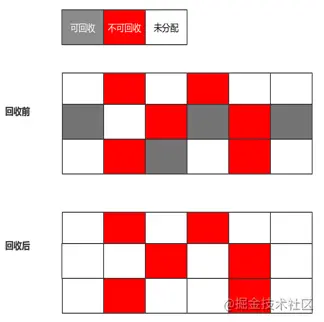
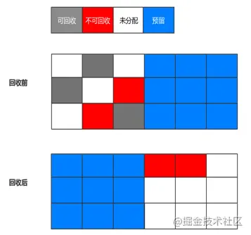
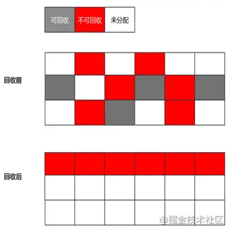
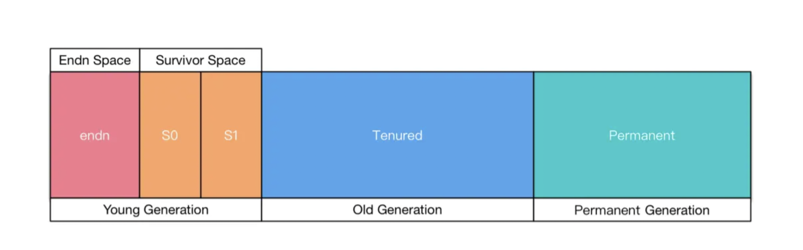
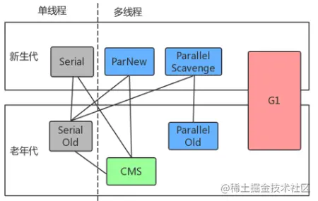
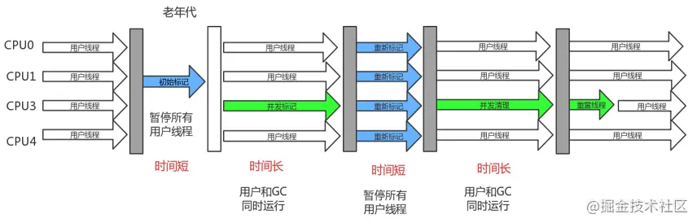
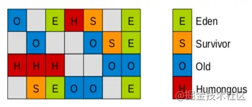
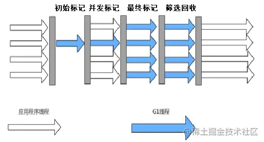

# GC的基础知识

## 一、垃圾回收的区域

+ 栈：栈中的生命周期是跟随线程，所以一般不需要关注。
+ 堆：堆中的对象是垃圾回收的重点。
+ 方法区：这一块也会发生垃圾回收，不过这块的效率比较低，一般不是我们关注的重点。

## 二、怎么判断对象的存活

一般有两种方式（引用计数法、可达性分析），**JVM使用的是可达性分析**。

### 1. 引用计数法

给对象添加一个引用计数器，当对象增加一个引用时计数器加 1，引用失效时计数器减 1。引用计数为 0 的对象可被回收（Python 在用，但主流虚拟机没有使用）。

+ 优点：快，方便，实现简单。
+ 缺陷：对象相互引用时（A.instance=B 同时 B.instance=A），很难判断对象是否该回收。

### 2. 可达性分析

来判定对象是否存活的。这个算法的基本思路就是通过一系列的称为“GC Roots”的对象作为起始点，从这些节点开始向下搜索，搜索所走过的路径称为引用链（Reference Chain），当一个对象到 GC Roots 没有任何引用链相连时，则证明此对象是不可用的。

作为 GC Roots 的对象包括下面几种：

+ 虚拟机栈（栈帧中的本地变量表）中引用的对象；
+ 方法区中类静态属性引用的对象；
+ 方法区中常量引用的对象；
+ 本地方法栈中JNI（即一般说的Native方法）引用的对象；


## 三、 垃圾回收算法

本节具体介绍一下各种垃圾回收算法的思想：

### 1. 标记-清除算法

标记-清除算法对**根集合**进行扫描，对**存活**的对象进行标记。标记完成后，再对整个空间内**未被标记**的对象扫描，进行回收。

+ **优点**：

  **实现简单，不需要进行对象进行移动**。

+ **缺点**：

  标记、清除过程效率低，**产生大量不连续的内存碎片**，提高了垃圾回收的频率。




### 2. 标记-复制算法

这种收集算法解决了标记清除算法存在的效率问题。它将内存区域划分成相同的两个**内存块**。每次仅使用一半的空间，`JVM`生成的新对象放在一半空间中。当一半空间用完时进行`GC`，把可到达对象复制到另一半空间，然后把使用过的内存空间一次清理掉。

+ **优点**：

  按顺序分配内存即可，实现简单、运行高效，不用考虑内存碎片。

+ **缺点**：

  **可用的内存大小缩小为原来的一半**，**对象存活率高时会频繁进行复制**。





### 3. 标记-整理算法

**标记-整理算法** 采用和 **标记-清除算法** 一样的方式进行对象的标记，但后续不直接对可回收对象进行清理，而是将所有的**存活对象**往一端**空闲空间**移动，然后清理掉端边界以外的内存空间。

+ **优点**：

  **解决了标记-清理算法存在的内存碎片问题**。

+ **缺点**：

  仍**需要进行局部对象移动，一定程度上降低了效率**。
  
  
  
  
  
  
  
  

### 4. 分代收集技术

#### 基本术语

+ 部分收集（Partial GC）指目标不是完整收集整个Java堆的垃圾收集，其中可以分为：
+ + 新生代收集（Minor GC/Young GC）: 指目标只是新生代的垃圾收集；
  + 老年代收集（Major GC/Old GC）: 指目标只是老年代的垃圾收集。注意这个名词可能有歧义，有的也指整堆收集。
  + 混合收集（Mixed GC）：指目标是收集整个新生代以及部分老年代的来及收集。目前只有G1收集器有这种行为。
+ 整堆收集（Full GC）：收集整个Java堆和方法区的垃圾收集。


当前商业虚拟机都采用**分代收集**的垃圾收集算法。分代收集算法，顾名思义是根据对象的**存活周期**将内存划分为几块。一般包括**年轻代**、**老年代** 和 **永久代**，如图所示：



> 上图中的 永久（Permanent）代在 JDK8之后便被取消。


#### 新生代（Young generation）

绝大多数最新被创建的对象会被分配到这里，由于**大部分对象**在创建后会很快变得**不可达**，所以很多对象被创建在**新生代**，然后**消失**。对象从这个区域消失的过程我们称之为 `minor GC`。

**新生代** 中存在一个`Eden`区和两个`Survivor`区（Survivor 区里面分为 from 和 to 区），每次只使用Eden和其中的一块Survivor区。新对象会首先分配在`Eden`中（**如果新对象过大，会直接分配在老年代**中）。在`GC`中，`Eden`中的对象会被移动到`Survivor`中，直至对象满足一定的年纪（定义为熬过`GC`的次数），会被移动到**老年代**。

可以设置**新生代**和**老年代**的相对大小。这种方式的优点是新生代大小会随着整个**堆**大小**动态扩展**。参数 `-XX:NewRatio` 设置**老年代**与**新生代**的比例。例如 `-XX:NewRatio=8` 指定 **老年代/新生代** 为`8/1`. **老年代** 占堆大小的 `7/8` ，**新生代** 占堆大小的 `1/8`（默认即是 `1/8`）。


**当Eden区满了的时候，会触发Young GC。**


#### 老年代（Old generation）

对象没有变得不可达，并且从新生代中**存活**下来，会被**拷贝**到这里。其所占用的空间要比新生代多。也正由于其相对**较大的空间**，发生在**老年代**上的`GC`要比**新生代**要**少得多**。对象从**老年代**中消失的过程，可以称之为`major GC`（或者`full GC`）。


`JDK8`堆内存一般是划分为**年轻代**和**老年代**，**不同年代** 根据自身特性采用**不同的垃圾收集算法**。

对于**新生代**，每次`GC`时都有**大量**的对象死亡，只有**少量**对象存活。考虑到复制成本低，适合采用**复制算法**。因此有了`From Survivor`和`To Survivor`区域。

对于**老年代**，因为对象**存活率高**，没有额外的内存空间对它进行担保。因而适合采用**标记-清除算法**和**标记-整理算法**进行回收。


# 垃圾回收器
Jvm 垃圾回收器把上面的三种算法全部用到了，采用分代收集。

## 新生代：复制算法。

| 收集器            | 收集对象和算法           | 收集器类型         |
| ----------------- | ------------------------ | ------------------ |
| Serial            | 新生代，**标记复制算法** | 单线程             |
| ParNew            | 新生代，**标记复制算法** | 并行的多线程收集器 |
| Parallel Scavenge | 新生代，**标记复制算法** | 并行的多线程收集器 |


## 老年代：标记清除算法和标记整理算法

| 收集器                        | 收集对象和算法                            | 收集器类型         |
| ----------------------------- | ----------------------------------------- | ------------------ |
| Serial Old                    | 老年代，标记整理算法                      | 单线程             |
| Parallel Old                  | 老年代，标记整理算法                      | 并行的多线程收集器 |
| CMS（Concurrent Mark Sweep ） | 老年代，**标记清除算法**                  | 并行和并发收集器   |
| G1（Garbage First）           | 跨新生代和老年代，复制算法 + 标记整理算法 | 并行和并发收集器   |





**注：**

+ **并行：垃圾收集的多线程的同时进行**。
+ **并发：垃圾收集的多线程和用户应用的多线程同时进行**。
+ 使用 `jps -v` 可以看到使用的垃圾收集器，例如：`-XX:+UseConcMarkSweepGC` （CMS）


## Serial/Serial Old

最古老的，单线程，独占式，成熟，适合单 CPU 服务器。`-XX:+UseSerialGC` 新生代和老年代都用串行收集器。

## ParNew

ParNew 和 Serial 基本没区别，唯一的区别：多线程，多 CPU 的，停顿时间比 Serial 少 。

`-XX:+UseParNewGC`新生代使用 ParNew，老年代使用 Serial Old 。

可以和CMS搭配使用。

##  Parallel Scavenge（ParallerGC）/Parallel Old


**关注吞吐量的垃圾收集器**，**高吞吐量则可以高效率地利用 CPU 时间**（但对响应时间有负面影响），尽快完成程序的运算任务，主要适合在后台运算而不需要太多交互的任务。所谓吞吐量就是 CPU 用于运行用户代码的时间与 CPU 总消耗时间的比值，即吞吐量=运行用户代码时间/（运行用户代码时间+垃圾收集时间）


## CMS（Concurrent Mark Sweep）


CMS收集器是一种**以获取最短回收停顿时间为目标**的收集器。目前很大一部分的 Java 应用集中在互联网站或者 B/S 系统的服务端上，这类应用尤其**重视服务的响应速度，希望系统停顿时间最短**，以给用户带来较好的体验。

CMS 收集器就非常符合这类应用的需求。`-XX:+UseConcMarkSweepGC` ，**一般新生代使用 ParNew，老年代的用 CMS**，从名字（包含“Mark Sweep”）上就可以看出，CMS 收集器是基于“标记—清除”算法实现的，它的运作过程相对于前面几种收集器来说更复杂一些。


### 步骤



整个过程分为 4 个步骤，包括：

1、**初始标记**：仅仅只是标记一下 **GC Roots 能直接关联到的对象**，速度很快，需要停顿（STW -Stop the world）。（需要 STW）

2、**并发标记**：从 GC Root 开始对堆中对象进行可达性分析，找到存活对象，它在整个回收过程中耗时最长，不需要停顿。（无需STW）

3、**重新标记**：**为了修正并发标记期间因用户程序继续运作而导致标记产生变动的那一部分对象的标记记录，**。这个阶段的停顿时间一般会比初始标记阶段稍长一些，但远比并发标记的时间短。(因为用户在并发标记阶段对对象做的修改相对来讲是比较少的)。（需要STW)

4. **并发清除**：（无需STW）


> **Stop The World**
>
> Java中Stop-The-World机制简称STW，是在执行垃圾收集算法时，Java应用程序的其他所有线程都被挂起（除了垃圾收集帮助器之外）。Java中一种全局暂停现象，全局停顿，所有Java代码停止，native代码可以执行，但不能与JVM交互。


### 优缺点

1. 优点

由于整个过程中耗时最长的并发标记和并发清除过程收集器线程都可以与用户线程一起工作，所以，从**总体上来说，CMS 收集器的内存回收过程是与用户线程一起并发执行的**。

2. 缺点

+ **CPU 资源敏感**：因为并发阶段多线程占据 CPU 资源，如果 CPU 资源不足，效率会明显降低。
+ **会产生内存碎片**：**标记-清除算法** 会导致产生不连续的内存碎片。
+ 由于 CMS **并发清理阶段** 用户线程还在运行着，伴随程序运行自然就还会有新的垃圾不断产生，这一部分垃圾出现在标记过程之后，CMS 无法在当次收集中处理掉它们，只好留待下一次 GC 时再清理掉。这一部分垃圾就称为 **浮动垃圾**。
+ 由于浮动垃圾的存在，因此需要预留出一部分内存，意味着 CMS 收集不能像其它收集器那样等待老年代快满的时候再回收。在 1.6 的版本中老年代空间使用率阈值(92%)，如果预留的内存不够存放浮动垃圾，就会出现 Concurrent Mode Failure，这时虚拟机将临时启用 Serial Old 来替代 CMS。


## G1


**G1相比较CMS的改进**

+ **基于标记-整理算法, 不会产生空间碎片**，分配大对象时不会无法得到连续的空间而提前触发一次full gc 。
+ **停顿时间相对可控**： G1可以通过设置预期停顿时间（Pause time）来控制垃圾收集时间，但是**这个预期停顿时间G1只能尽量做到，而不是一定能做到**。


G1 收集器之所以能建立可预测的停顿时间模型，是因为它可以**有计划地避免在整个 Java 堆中进行全区域的垃圾收集**。

G1 跟踪各个 Region 里面的垃圾堆积的价值大小（回收所获得的空间大小以及回收所需时间的经验值），**在后台维护一个优先列表**，**每次根据允许的收集时间，优先回收价值最大的 Region**（这也就是 **Garbage-First** 名称的来由）。

**这种使用 Region 划分内存空间以及有优先级的区域回收方式**，**保证了 G1 收集器在有限的时间内可以获取尽可高的收集效率**。


### Region如何划分

G1 把堆划分成多个大小相等的 **独立区域**（Region），**新生代和老年代不再物理隔离**。

G1 算法将堆划分为若干个独立区域（Region），它仍然属于分代收集器。

不过，这些区域的一部分包含新生代，**新生代的垃圾收集依然采用暂停所有应用线程的方式，将存活对象拷贝到老年代或者 Survivor 空间**。

例如其中一个独立区域如图：




### 步骤





大致分为4个步骤：

1. **初始标记**：仅仅只是标记一下 GC Roots 能直接关联到的对象，并且修改 TAMS（Nest Top Mark Start）的值，让下一阶段用户程序并发运行时，能在正确可以的 Region 中创建对象，此阶段需要停顿线程(STW)，但耗时很短。
2. **并发标记**：从 GC Root 开始对堆中对象进行可达性分析，找到存活对象，此阶段耗时较长，但可与用户程序并发执行。
3. **最终标记**：**为了修正在并发标记期间因用户程序继续运作而导致标记产生变动的那一部分标记记录**，虚拟机将这段时间对象变化记录在线程的 `Remembered Set Logs` 里面，最终标记阶段需要把 Remembered Set Logs 的数据合并到 Remembered Set 中。这阶段需要停顿线程(STW)，但是可并行执行。
4. **筛选回收**：**首先对各个 Region 中的回收价值和成本进行排序，根据用户所期望的 GC 停顿时间来制定回收计划**。此阶段其实也可以做到与用户程序一起并发执行，但是因为只回收一部分 Region，时间是用户可控制的，而且停顿用户线程将大幅度提高收集效率。


G1 从整体来看是基于**标记整理**算法实现的收集器，从局部（两个Region之间）上来看是基于复制算法实现的。


## 垃圾回收器的一些重要参数

使用`java -XX:+PrintCommandLineFlags -version`查看关于垃圾收集器的一些信息。

```shell
-XX:InitialHeapSize=268435456 -XX:MaxHeapSize=4294967296 -XX:+PrintCommandLineFlags -XX:+UseCompressedClassPointers -XX:+UseCompressedOops -XX:+UseParallelGC
java version "1.8.0_281"
Java(TM) SE Runtime Environment (build 1.8.0_281-b09)
Java HotSpot(TM) 64-Bit Server VM (build 25.281-b09, mixed mode)
```


| 参数                           | 描述                                                         |
| ------------------------------ | ------------------------------------------------------------ |
| UseSerialGC                    | 虚拟机运行在 Client 模式下的默认值，打开此开关后，使用 Serial+Serial Old 的收集器组合进行内存回收 |
| UseParNewGC                    | 打开此开关后，使用 ParNew + Serial Old 的收集器组合进行内存回收 |
| UseConcMarkSweepGC             | 打开此开关后，使用 ParNew + CMS + Serial Old 的收集器组合进行内存回收。Serial Old 收集器将作为 CMS 收集器出现 Concurrent Mode Failure 失败后的后备收集器使用 |
| **UseParallelGC**              | **虚拟机运行在 Server 模式下的默认值**，打开此开关后，使用 **Parallel Scavenge + Serial Old(PS MarkSweep)** 的收集器组合进行内存回收 |
| UseParallelOldGC               | 打开此开关后，使用 Parallel Scavenge + Parallel Old 的收集器组合进行内存回收 |
| SurvivorRatio                  | 新生代中 Eden 区域与 Survivor 区域的容量比值，默认为 8，代表 Eden : Survivor = 8 : 1 |
| PretenureSizeThreshold         | 直接晋升到老年代的对象大小，设置这个参数后，大于这个参数的对象将直接在老年代分配 |
| MaxTenuringThreshold           | 晋升到老年代的对象年龄，每个对象在坚持过一次 Minor GC 之后，年龄就增加 1，当超过这个参数值时就进入老年代 |
| UseAdaptiveSizePolicy          | 动态调整 Java 堆中各个区域的大小以及进入老年代的年龄         |
| HandlePromotionFailure         | 是否允许分配担保失败，即老年代的剩余空间不足以应付新生代的整个 Eden 和 Survivor 区的所有对象都存活的极端情况 |
| ParallelGCThreads              | 设置并行 GC 时进行内存回收的线程数                           |
| GCTimeRatio GC                 | 时间占总时间的比率，默认值为 99，即允许 1% 的 GC 时间，仅在使用 Parallel Scavenge 收集器生效 |
| MaxGCPauseMillis               | 设置 GC 的最大停顿时间，仅在使用 Parallel Scavenge 收集器时生效 |
| CMSInitiatingOccupancyFraction | 设置 CMS 收集器在老年代空间被使用多少后触发垃圾收集，默认值为 68%，仅在使用 CMS 收集器时生效 |
| UseCMSCompactAtFullCollection  | 设置 CMS 收集器在完成垃圾收集后是否要进行一次内存碎片整理，仅在使用 CMS 收集器时生效 |
| CMSFullGCsBeforeCompaction     | 设置 CMS 收集器在进行若干次垃圾收集后再启动一次内存碎片整理，仅在使用 CMS 收集器时生效 |


> [JVM垃圾回收算法和垃圾回收器](https://juejin.cn/post/6844904148404535309)
>
> [JVM系列(五) - JVM垃圾回收算法](https://juejin.cn/post/6844903639794843656)
>
> [Full GC 和 Minor GC，傻傻分不清楚](https://cloud.tencent.com/developer/article/1582661)


# FullGC

## 什么时候会触发FullGC

### System.gc()方法的调用
此方法的调用是建议JVM进行Full GC,虽然只是建议而非一定,但很多情况下它会触发 Full GC,从而增加Full GC的频率,也即增加了间歇性停顿的次数。强烈影响系建议能不使用此方法就别使用，让虚拟机自己去管理它的内存，可通过通过`-XX:+ DisableExplicitGC`来禁止RMI调用System.gc。


### Metaspace区内存达到阈值
从JDK8开始，永久代(PermGen)的概念被废弃掉了，取而代之的是一个称为Metaspace的存储空间。Metaspace使用的是本地内存，而不是堆内存，也就是说在默认情况下Metaspace的大小只与本地内存大小有关。-XX:MetaspaceSize=21810376B（约为20.8MB）超过这个值就会引发Full GC，这个值不是固定的，是会随着JVM的运行进行动态调整的，与此相关的参数还有多个，详细情况请参考[这篇文章](https://blog.csdn.net/bolg_hero/article/details/78189621)


### 老年代空间不足

> **Survivor区域对象晋升到老年代有两种情况**：
>
> 一种是给每个对象定义一个对象计数器，如果对象在Eden区域出生，并且经过了第一次GC，那么就将他的年龄设置为1，在Survivor区域的对象每熬过一次GC，年龄计数器加一，等到到达默认值15时，就会被移动到老年代中，默认值可以通过-XX:MaxTenuringThreshold来设置。
> 另外一种情况是如果JVM发现Survivor区域中的相同年龄的对象占到所有对象的一半以上时，就会将大于这个年龄的对象移动到老年代，在这批对象在统计后发现可以晋升到老年代，但是发现老年代没有足够的空间来放置这些对象，这就会引起Full GC。

老年代空间只有在**新生代对象转入**及**创建大对象、大数组**时才会出现不足的现象，

当执行Full GC后空间仍然不足，则抛出如下错误：`java.lang.OutOfMemoryError: Java heap space`
为避免以上两种状况引起的Full GC，调优时应尽量做到让对象在Minor GC阶段被回收、让对象在新生代多存活一段时间及不要创建过大的对象及数组。


### 堆中分配很大的对象

这个参数可以通过`-XX:PretenureSizeThreshold`进行设定，大对象或者长期存活的对象进入老年代，典型的大对象就是很长的字符串或者数组，它们在被创建后会直接进入老年代，虽然可能新生代中的Eden区域可以放置这个对象，在要放置的时候JVM如果发现老年代的空间不足时，会触发GC。


所谓大对象，是指需要大量连续内存空间的java对象，例如很长的数组，**此种对象会直接进入老年代，而老年代虽然有很大的剩余空间，但是无法找到足够大的连续空间来分配给当前对象**，此种情况就会触发JVM进行Full GC。

为了解决这个问题，CMS垃圾收集器提供了一个可配置的参数，即-XX:+UseCMSCompactAtFullCollection开关参数，用于在“享受”完Full GC服务之后额外免费赠送一个碎片整理的过程，**内存整理的过程无法并发的，空间碎片问题没有了，但提顿时间不得不变长了**，JVM设计者们还提供了另外一个参数 -XX:CMSFullGCsBeforeCompaction,这个参数用于设置在执行多少次不压缩的Full GC后,跟着来一次带压缩的。


### 统计得到的Minor GC晋升到旧生代的平均大小大于老年代的剩余空间

这是一个较为复杂的触发情况，Hotspot**为了避免由于新生代对象晋升到旧生代导致旧生代空间不足的现象**，在进行Minor GC时，做了一个判断，**如果之前统计所得到的Minor GC晋升到旧生代的平均大小大于旧生代的剩余空间，那么就直接触发Full GC**。


> 例如程序第一次触发Minor GC后，有6MB的对象晋升到旧生代，那么当下一次Minor GC发生时，首先检查旧生代的剩余空间是否大于6MB，如果小于6MB，则执行Full GC（相当于，提前进行fullgc，而不是把新生代的对象移动过去之后发现内存不足才fullgc）。
>
> 
>
> 当新生代采用PS GC时，方式稍有不同，PS GC是在Minor GC后也会检查，例如上面的例子中第一次Minor GC后，PS GC会检查此时旧生代的剩余空间是否大于6MB，如小于，则触发对旧生代的回收。
> 除了以上4种状况外，对于使用RMI来进行RPC或管理的Sun JDK应用而言，默认情况下会一小时执行一次Full GC。可通过在启动时通过- java -Dsun.rmi.dgc.client.gcInterval=3600000来设置Full GC执行的间隔时间或通过-XX:+ DisableExplicitGC来禁止RMI调用System.gc。


### CMS GC时出现promotion failed和concurrent mode failure

对于采用CMS进行老年代GC的程序而言，尤其要注意GC日志中是否有**promotion failed**和**concurrent mode failure**两种状况，当这两种状况出现时可能会触发Full GC。

promotion failed是在进行Minor GC时，survivor space放不下、对象只能放入老年代，而此时老年代也放不下造成的；concurrent mode failure是在

执行CMS GC的过程中同时有对象要放入老年代，而此时老年代空间不足造成的（有时候“空间不足”是CMS GC时当前的浮动垃圾过多导致暂时性的空间不足触发Full GC）。
应对措施为：增大survivor space、老年代空间或调低触发并发GC的比率，但在JDK 5.0+、6.0+的版本中有可能会由于JDK的bug29导致CMS在remark完毕后很久才触发sweeping动作。对于这种状况，可通过设置-XX: CMSMaxAbortablePrecleanTime=5（单位为ms）来避免。

### 总结
可以发现其实堆内存的Full GC一般都是**两个原因**引起的，**要么是老年代内存过小，要么是老年代连续内存过小。**无非是这两点，而**元数据区Metaspace引发的Full GC可能是阈值引起的**。


## 如何排查

**检测JVM堆的情况**

方法1. 可以使用JDK的bin目录下的jvisualvm.exe工具来进行实时监测，这个是图形化界面，最为直观，这是一个强大的工具。
方法2. 采用jps找到进行id，然后使用jstat -gc pid来实时进行检测。
方法3. 运行程序前设置-XX:+PrintGCDetails，-XX:+PrintGCDateStamps参数打印GC的详细信息进行分析。


> 参考博客
>
> https://blog.csdn.net/Hollake/article/details/90484027