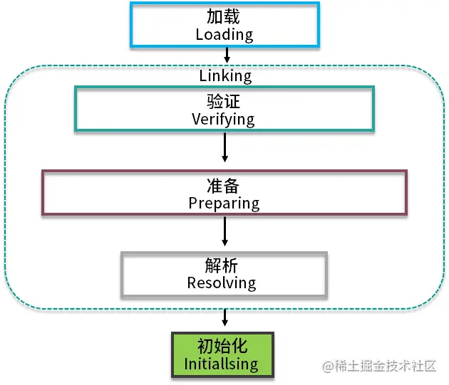

# 类加载

类的加载过程非常复杂，主要有这几个过程：**加载、链接（验证、准备、解析）、初始化**。这些术语很多地方都出现过，我们不需要死记硬背，而应该要了解它背后的原理和要做的事情。


如图所示。大多数情况下，类会按照图中给出的顺序进行加载。



## 类加载过程

包含了加载、验证、准备、解析和初始化这 5 个阶段。

### 1. 加载

加载是类加载的一个阶段，注意不要混淆。

加载过程完成以下三件事：

+ 通过一个类的全限定名来获取定义此类的二进制字节流。
+ 将这个字节流所代表的**静态存储结构**转化为方法区的**运行时存储结构**。
+ 在内存中**生成一个代表这个类的 Class 对象**，作为方法区这个类的各种数据的访问入口。

其中二进制字节流可以从以下方式中获取：

+ 从 ZIP 包读取，这很常见，最终成为日后 JAR、EAR、WAR 格式的基础。
+ 从网络中获取，这种场景最典型的应用是 Applet。
+ **运行时计算生成**，这种场景使用得最多得就是**动态代理技术**，在 java.lang.reflect.Proxy 中，就是用了 ProxyGenerator.generateProxyClass 的代理类的二进制字节流。
+ 由其他文件生成，典型场景是 JSP 应用，即由 JSP 文件生成对应的 Class 类。
+ 从数据库读取，这种场景相对少见，例如有些中间件服务器（如 SAP Netweaver）可以选择把程序安装到数据库中来完成程序代码在集群间的分发。 


### 2. 验证

确保 Class 文件的字节流中包含的信息符合当前虚拟机的要求，并且不会危害虚拟机自身的安全。

+ 文件格式验证：验证字节流是否符合 Class 文件格式的规范，并且能被当前版本的虚拟机处理。
+ 元数据验证：对字节码描述的信息进行语义分析，以保证其描述的信息符合 Java 语言规范的要求。
+ 字节码验证：通过数据流和控制流分析，确保程序语义是合法、符合逻辑的。
+ 符号引用验证：发生在虚拟机将符号引用转换为直接引用的时候，对类自身以外（常量池中的各种符号引用）的信息进行匹配性校验。


### 3. 准备

类变量是被 static 修饰的变量，**准备阶段为类变量分配内存并设置初始值**，使用的是方法区的内存。

实例变量不会在这阶段分配内存，它将会在对象实例化时随着对象一起分配在 Java 堆中。（实例化不是类加载的一个过程，类加载发生在所有实例化操作之前，并且类加载只进行一次，实例化可以进行多次）

初始值一般为 0 值，例如下面的类变量 value 被初始化为 0 而不是 123。

```java
public static int value = 123;
```


如果类变量是常量，那么会按照表达式来进行初始化，而不是赋值为 0。

```java
public static final int value = 123;
```


### 4. 解析

将常量池的符号引用替换为直接引用的过程。

~~最复杂，暂时跳过。~~


解析在类加载中是非常非常重要的一环，是将符号引用替换为直接引用的过程。这句话非常的拗口，其实理解起来也非常的简单。

**符号引用**是一种定义，可以是任何字面上的含义，而**直接引用**就是**直接指向目标的指针、相对偏移量**。

直接引用的对象都存在于内存中，你可以把通讯录里的女友手机号码，类比为符号引用，把面对面和你吃饭的人，类比为直接引用。

解析阶段负责把整个类激活，串成一个可以找到彼此的网，过程非常重要。那这个阶段都做了哪些工作呢？大体可以分为：

+ 类或接口的解析
+ 类方法解析
+ 接口方法解析
+ 字段解析

我们来看几个经常发生的异常，就与这个阶段有关。

+ `java.lang.NoSuchFieldError` 根据继承关系从下往上，找不到相关字段时的报错。
+ `java.lang.IllegalAccessError` 字段或者方法，访问权限不具备时的错误。
+ `java.lang.NoSuchMethodError` 找不到相关方法时的错误。

解析过程保证了相互引用的完整性，把继承与组合推进到运行时。


### 5. 初始化

**初始化阶段才真正开始执行类中的定义的 Java 程序代码**。

初始化阶段即虚拟机执行类构造器 `<clinit>() `方法的过程。


**在准备阶段，类变量已经赋过一次系统要求的初始值，而在初始化阶段，根据程序员通过程序制定的主观计划去初始化类变量和其它资源**。


`<clinit>()` 方法具有以下特点：

+ 是**由编译器自动收集类中所有类变量的赋值动作和静态语句块（static{} 块）中的语句合并产生的**，编译器收集的顺序由语句在源文件中出现的顺序决定。特别注意的是，静态语句块只能访问到定义在它之前的类变量，定义在它之后的类变量只能赋值，不能访问。例如以下代码：


```java
public class Test {
    static {
        i = 0;                // 给变量赋值可以正常编译通过
        System.out.print(i);  // 这句编译器会提示“非法向前引用”
    }
    static int i = 1;
}
```

+ 与类的构造函数（或者说实例构造器`<init>()`）不同，不需要显式的调用父类的构造器。虚拟机会自动保证**在子类的 `<clinit>()` 方法运行之前，父类的 `<clinit>() `方法已经执行结束**。因此虚拟机中第一个执行` <clinit>()` 方法的类肯定为 java.lang.Object。
+ 由于父类的 `<clinit>()`方法先执行，也就意味着**父类中定义的静态语句块要优于子类的变量赋值操作**。例如以下代码：

```java
static class Parent {
    public static int A = 1;
    static {
        A = 2;
    }
}

static class Sub extends Parent {
    public static int B = A;
}

public static void main(String[] args) {
     System.out.println(Sub.B);  // 输出结果是父类中的静态变量 A 的值，也就是 2。
}
```


+ `<clinit>()` 方法对于类或接口不是必须的，如果一个类中不包含静态语句块，也没有对类变量的赋值操作，编译器可以不为该类生成` <clinit>()` 方法。
+ 接口中不可以使用静态语句块，但仍然有类变量初始化的赋值操作，因此接口与类一样都会生成 `<clinit>()` 方法。但接口与类不同的是，执行接口的 `<clinit>()` 方法不需要先执行父接口的 `<clinit>()` 方法。只有当父接口中定义的变量使用时，父接口才会初始化。另外，接口的实现类在初始化时也一样不会执行接口的 `<clinit>()` 方法。
+ **虚拟机会保证一个类的 `<clinit>()` 方法在多线程环境下被正确的加锁和同步**，**如果多个线程同时初始化一个类，只会有一个线程执行这个类的 `<clinit>()` 方法**，其它线程都会阻塞等待，直到活动线程执行 `<clinit>()` 方法完毕。如果在一个类的 `<clinit>()` 方法中有耗时的操作，就可能造成多个线程阻塞，在实际过程中此种阻塞很隐蔽。


> 1. static 语句块，只能访问到定义在 static 语句块之前的变量。所以下面的代码是无法通过编译的。
> 2. JVM 会保证在子类的初始化方法执行之前，父类的初始化方法已经执行完毕。


## 类加载器

> 如果你在项目代码里，写一个 java.lang 的包，然后改写 String 类的一些行为，编译后，发现并不能生效。JRE 的类当然不能轻易被覆盖，否则会被别有用心的人利用，这就太危险了。
>
> 那类加载器是如何保证这个过程的安全性呢？其实，它是有着严格的等级制度的。
>

类加载器，实现类的加载动作。在 **Java 虚拟机外部实现**，以便让应用程序自己决定如何去获取所需要的类。

### 类与类加载器

两个类相等：类本身相等，并且使用同一个类加载器进行加载。这是因为每一个类加载器都拥有一个独立的类名称空间。

这里的相等，包括类的 Class 对象的 equals() 方法、isAssignableFrom() 方法、isInstance() 方法的返回结果为 true，也包括使用 instanceof 关键字做对象所属关系判定结果为 true。


### 类加载器分类

从 Java 虚拟机的角度来讲，只存在以下两种不同的类加载器：

+ 启动类加载器（Bootstrap ClassLoader），这个类加载器用 C++ 实现，是虚拟机自身的一部分；
+ 所有其他类的加载器，这些类由 Java 实现，独立于虚拟机外部，并且全都继承自抽象类 java.lang.ClassLoader。


从 Java 开发人员的角度看，类加载器可以划分得更细致一些：

+ 启动类加载器（Bootstrap ClassLoader）此类加载器负责将存放在 <JAVA_HOME>\lib 目录中的，或者被 -Xbootclasspath 参数所指定的路径中的，并且是虚拟机识别的（仅按照文件名识别，如 rt.jar，名字不符合的类库即使放在 lib 目录中也不会被加载）类库加载到虚拟机内存中。启动类加载器无法被 Java 程序直接引用，用户在编写自定义类加载器时，如果需要把加载请求委派给启动类加载器，直接使用 null 代替即可。
+ 扩展类加载器（Extension ClassLoader）这个类加载器是由 ExtClassLoader（sun.misc.Launcher$ExtClassLoader）实现的。它负责将 <JAVA_HOME>/lib/ext 或者被 java.ext.dir 系统变量所指定路径中的所有类库加载到内存中，开发者可以直接使用扩展类加载器。
+ 应用程序类加载器（Application ClassLoader）这个类加载器是由 AppClassLoader（sun.misc.Launcher$AppClassLoader）实现的。由于这个类加载器是 ClassLoader 中的 getSystemClassLoader() 方法的返回值，因此一般称为系统类加载器。它负责加载用户类路径（ClassPath）上所指定的类库，开发者可以直接使用这个类加载器，如果应用程序中没有自定义过自己的类加载器，一般情况下这个就是程序中默认的类加载器。


### 双亲委派模型

> 但你有没有想过，“类加载的双亲委派机制，双亲在哪里？明明都是单亲？”
>
> 我们还是用一张图来讲解。可以看到，除了启动类加载器，每一个加载器都有一个parent，并没有所谓的双亲。但是由于翻译的问题，这个叫法已经非常普遍了，一定要注意背后的差别。


应用程序都是由三种类加载器相互配合进行加载的，如果有必要，还可以加入自己定义的类加载器。

下图展示的类加载器之间的层次关系，称为类加载器的双亲委派模型（Parents Delegation Model）。该模型要求除了顶层的启动类加载器外，其余的类加载器都应有自己的父类加载器。这里类加载器之间的父子关系一般通过组合（Composition）关系来实现，而不是通过继承（Inheritance）的关系实现。


**（一）工作过程**

一个类加载器首先将类加载请求传送到父类加载器，只有当父类加载器无法完成类加载请求时才尝试加载。

**（二）好处**

使得 Java 类随着它的类加载器一起具有一种带有优先级的层次关系，从而使得基础类得到统一。

例如 java.lang.Object 存放在 rt.jar 中，如果编写另外一个 java.lang.Object 的类并放到 ClassPath 中，程序可以编译通过。因为双亲委派模型的存在，所以在 rt.jar 中的 Object 比在 ClassPath 中的 Object 优先级更高，因为 rt.jar 中的 Object 使用的是启动类加载器，而 ClassPath 中的 Object 使用的是应用程序类加载器。正因为 rt.jar 中的 Object 优先级更高，因为程序中所有的 Object 都是这个 Object。

**（三）实现**

以下是抽象类 java.lang.ClassLoader 的代码片段，其中的 loadClass() 方法运行过程如下：先检查类是否已经加载过，如果没有则让父类加载器去加载。当父类加载器加载失败时抛出 ClassNotFoundException，此时尝试自己去加载。


```java
public abstract class ClassLoader {
    // The parent class loader for delegation
    private final ClassLoader parent;

    public Class<?> loadClass(String name) throws ClassNotFoundException {
        return loadClass(name, false);
    }

    protected Class<?> loadClass(String name, boolean resolve) throws ClassNotFoundException {
        synchronized (getClassLoadingLock(name)) {
            // First, check if the class has already been loaded
            Class<?> c = findLoadedClass(name);
            if (c == null) {
                try {
                    if (parent != null) {
                        c = parent.loadClass(name, false);
                    } else {
                        c = findBootstrapClassOrNull(name);
                    }
                } catch (ClassNotFoundException e) {
                    // ClassNotFoundException thrown if class not found
                    // from the non-null parent class loader
                }

                if (c == null) {
                    // If still not found, then invoke findClass in order
                    // to find the class.
                    c = findClass(name);
                }
            }
            if (resolve) {
                resolveClass(c);
            }
            return c;
        }
    }

    protected Class<?> findClass(String name) throws ClassNotFoundException {
        throw new ClassNotFoundException(name);
    }
}
```


### 自定义类加载器实现

FileSystemClassLoader 是自定义类加载器，继承自 java.lang.ClassLoader，用于加载文件系统上的类。它首先根据类的全名在文件系统上查找类的字节代码文件（.class 文件），然后读取该文件内容，最后通过 defineClass() 方法来把这些字节代码转换成 java.lang.Class 类的实例。

**java.lang.ClassLoader 类的方法`loadClass()` 实现了双亲委派模型的逻辑（换言之，你可以通过override去打破双亲委派模型）**，因此自定义类加载器一般不去重写它，而是通过重写 findClass() 方法。


```java
public class FileSystemClassLoader extends ClassLoader {

    private String rootDir;

    public FileSystemClassLoader(String rootDir) {
        this.rootDir = rootDir;
    }

    protected Class<?> findClass(String name) throws ClassNotFoundException {
        byte[] classData = getClassData(name);
        if (classData == null) {
            throw new ClassNotFoundException();
        } else {
            return defineClass(name, classData, 0, classData.length);
        }
    }

    private byte[] getClassData(String className) {
        String path = classNameToPath(className);
        try {
            InputStream ins = new FileInputStream(path);
            ByteArrayOutputStream baos = new ByteArrayOutputStream();
            int bufferSize = 4096;
            byte[] buffer = new byte[bufferSize];
            int bytesNumRead;
            while ((bytesNumRead = ins.read(buffer)) != -1) {
                baos.write(buffer, 0, bytesNumRead);
            }
            return baos.toByteArray();
        } catch (IOException e) {
            e.printStackTrace();
        }
        return null;
    }

    private String classNameToPath(String className) {
        return rootDir + File.separatorChar
                + className.replace('.', File.separatorChar) + ".class";
    }
}
```

### 一些自定义加载器

#### 案例一：tomcat


我们看到，前面3个类加载和默认的一致，CommonClassLoader、CatalinaClassLoader、SharedClassLoader和WebappClassLoader则是Tomcat自己定义的类加载器，它们分别加载/common/*、/server/*、/shared/*（在tomcat 6之后已经合并到根目录下的lib目录下）和/WebApp/WEB-INF/*中的Java类库。其中WebApp类加载器和Jsp类加载器通常会存在多个实例，每一个Web应用程序对应一个WebApp类加载器，每一个JSP文件对应一个Jsp类加载器。

1. commonLoader：Tomcat最基本的类加载器，加载路径中的class可以被Tomcat容器本身以及各个Webapp访问；
2. catalinaLoader：Tomcat容器私有的类加载器，加载路径中的class对于Webapp不可见；
3. sharedLoader：各个Webapp共享的类加载器，加载路径中的class对于所有Webapp可见，但是对于Tomcat容器不可见；
4. webappClassLoader：各个Webapp私有的类加载器，加载路径中的class只对当前Webapp可见；


**对于一些需要加载的非基础类，会由一个叫作 WebAppClassLoader 的类加载器优先加载。等它加载不到的时候，再交给上层的 ClassLoader 进行加载。这个加载器用来隔绝不同应用的 .class 文件**，

**比如你的两个应用，可能会依赖同一个第三方的不同版本，它们是相互没有影响的**。


**如何在同一个 JVM 里，运行着不兼容的两个版本，当然是需要自定义加载器才能完成的事。**


那么 tomcat 是怎么打破双亲委派机制的呢？可以看图中的 WebAppClassLoader，它加载自己目录下的 .class 文件，并不会传递给父类的加载器。但是，

**它却可以使用 SharedClassLoader 所加载的类**，**实现了共享和分离的功能**。
但是你自己写一个 ArrayList，放在应用目录里，tomcat 依然不会加载（因为父类加载器有ArrayList）。它只是自定义的加载器顺序不同，但对于顶层来说，还是一样的。


> tomcat 违背了java 推荐的双亲委派模型了吗？
答案是：违背了。 我们前面说过：
双亲委派模型要求除了顶层的启动类加载器之外，其余的类加载器都应当由自己的父类加载器加载。
很显然，tomcat 不是这样实现，tomcat 为了实现隔离性，没有遵守这个约定，每个WebappClassLoader加载自己的目录下的class文件，不会传递给父类加载器。


### 如何替换 JDK 的类

让我们回到开始的问题，如何替换 JDK 中的类？比如，我们现在就拿 HashMap为例。

当 Java 的原生 API 不能满足需求时，比如我们要修改 HashMap 类，就必须要使用到 Java 的 endorsed 技术。我们需要将自己的 HashMap 类，打包成一个 jar 包，然后放到 -Djava.endorsed.dirs 指定的目录中。注意类名和包名，应该和 JDK 自带的是一样的。但是，java.lang 包下面的类除外，因为这些都是特殊保护的。

因为我们上面提到的双亲委派机制，是无法直接在应用中替换 JDK 的原生类的。但是，有时候又不得不进行一下增强、替换，比如你想要调试一段代码，或者比 Java 团队早发现了一个 Bug。所以，Java 提供了 endorsed 技术，用于替换这些类。这个目录下的 jar 包，会比 rt.jar 中的文件，优先级更高，可以被最先加载到。

