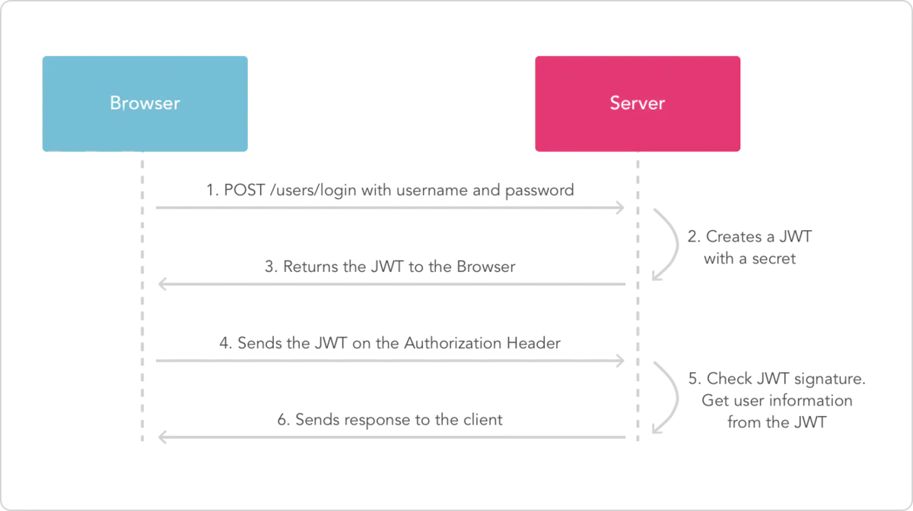

> 在一个web项目中总需要考虑的一个问题就是如何认证用户的身份。


# 用户的认证方式

## 传统的session认证


互联网服务离不开用户认证。一般流程是下面这样。

> 1、用户向服务器发送用户名和密码。
>
> 2、服务器验证通过后，在当前对话（session）里面保存相关数据，比如用户角色、登录时间等等。
>
> 3、服务器向用户返回一个 session_id，写入用户的 Cookie。
>
> 4、用户随后的每一次请求，都会通过 Cookie，将 session_id 传回服务器。
>
> 5、服务器收到 session_id，找到前期保存的数据，由此得知用户的身份。


我们知道，http协议本身是一种无状态的协议，而这就意味着如果用户向我们的应用提供了用户名和密码来进行用户认证，那么下一次请求时，用户还要再一次进行用户认证才行。

因为根据http协议，我们并不能知道是哪个用户发出的请求，所以**为了让我们的应用能识别是哪个用户发出的请求**，我们只能**在服务器存储一份用户登录的信息**，这份登录信息会在响应时传递给浏览器，**将SessionID告诉客户端保存在cookie中，以便下次请求时发送给我们的应用**，这样我们的应用就能识别请求来自哪个用户了，这就是传统的基于session认证。

但是这种基于session的认证使应用本身很难得到扩展，随着不同客户端用户的增加，独立的服务器已无法承载更多的用户，而这时候基于session认证应用的问题就会暴露出来。


### 基于session认证所显露的问题

+ Session: 每个用户经过我们的应用认证之后，我们的应用都要在服务端做一次记录，以方便用户下次请求的鉴别，通常而言session都是保存在内存中，而随着认证用户的增多，服务端的开销会明显增大。
+ 水平扩展困难: 用户认证之后，服务端做认证记录，如果认证的记录被保存在内存中的话，这意味着用户下次请求还必须要请求在这台服务器上,这样才能拿到授权的资源，这样在分布式的应用上，相应的限制了负载均衡器的能力。这也意味着限制了应用的扩展能力。
+ CSRF: 因为是基于cookie来进行用户识别的, cookie如果被截获，用户就会很容易受到跨站请求伪造的攻击。


> [前端安全系列（二）：如何防止CSRF攻击？](https://tech.meituan.com/2018/10/11/fe-security-csrf.html)


## 基于token的鉴权机制

基于token的鉴权机制类似于http协议也是无状态的，它不需要在服务端去保留用户的认证信息或者会话信息。这就意味着基于token认证机制的应用不需要去考虑用户在哪一台服务器登录了，这就为应用的扩展提供了便利。

流程：

1. 用户使用账户、密码来请求服务器
2. 服务器进行验证用户的信息
3. 服务器通过验证发送给用户一个token
4. 客户端存储token，并在每次请求时附送上这个token值
5. 服务端验证token值，并返回数据


# JWT

## 什么是JWT及原理

JWT(JSON Web Token) 是一个开放标准(RFC 7519)，它定义了一种**紧凑的**、**自包含的**（内部包含了一些会话信息）方式，

**用于作为JSON对象在各方之间安全地传输信息****。该信息可以被验证和信任**，因为它是有数字签名的。


JWT 的原理是，服务器认证以后，生成一个 JSON 对象，发回给用户，就像下面这样。

```json
 {
   "姓名": "张三",
   "角色": "管理员",
   "到期时间": "2018年7月1日0点0分"
 }
```


以后，用户与服务端通信的时候，都要发回这个 JSON 对象。服务器完全只靠这个对象认定用户身份。为了防止用户篡改数据，服务器在生成这个对象的时候，会加上签名（详见后文）。

服务器就不保存任何 session 数据了，也就是说，服务器变成无状态了，从而比较容易实现扩展。


## JWT的构成
JWT由三部分组成，它们之间用圆点(.)连接。这三部分分别是：

+ Header
+ Payload
+ Signature

三种都是经过Base64URL编码后的串。


写成一行，就是下面的样子。

```javascript
Header.Payload.Signature
```


具体的构成方式如下：

```
base64(header).base64(payload).base64( HS256(base64(header) + "." + base64(payload), secret) )
```


### Header

jwt的头部由两部分信息组成：

+ type：声明类型，这里是jwt
+ alg：声明加密的算法 通常直接使用 HMAC SHA256

```json
{
  "typ":"jwt",
  "alg":"HS256"
}
```

对头部信息进行Base64编码的得到第一部分的信息。


### Payload

载荷就是存放有效信息的地方,它包含声明（要求）。声明有三种类型：

+ registered claims：标准中注册的声明。这里有一组预定义的声明，它们不是强制的，但是推荐
+ public claims：公共的声明
+ private claims：私有的声明


**标准中注册的声明 (建议但不强制使用) ：**

+ iss: jwt签发者
+ sub: jwt所面向的用户
+ aud: 接收jwt的一方
+ exp: jwt的过期时间，这个过期时间必须要大于签发时间
+ nbf: 定义在什么时间之前，该jwt都是不可用的
+ iat: jwt的签发时间
+ jti: jwt的唯一身份标识，主要用来作为一次性token,从而回避重放攻击


**公共的声明 ：**

公共的声明可以添加任何的信息，一般添加用户的相关信息或其他业务需要的必要信息.但不建议添加敏感信息，因为该部分在客户端可解密.

**私有的声明 ：**

私有声明是提供者和消费者所共同定义的声明，一般不建议存放敏感信息，因为base64是对称解密的，意味着该部分信息可以归类为明文信息。

对Payload进行Base64加密就得到了JWT第二部分的内容。


### Signature


JWT的第三部分是一个签证信息，这个签证信息由三部分组成：

+ header (base64后的)
+ payload (base64后的)
+ secret


**Signature 部分是对前两部分的签名，防止数据篡改。**

第三部分需要base64加密后的header和base64加密后的payload使用 `.` 连接组成的字符串，然后通过header中声明的加密方式进行加盐secret组合加密，然后就构成了JWT的第三部分。

**注意：**
 secret是保存在服务器端的，JWT的签发生成也是在服务器端的，**secret就是用来进行JWT的签发和JWT的验证，所以，它就是你服务端的私钥，在任何场景都不应该流露出去**。

一旦客户端得知这个secret, 那就意味着客户端是可以自我签发JWT了。


## JWT的几个特点

（1）JWT 默认是不加密，但也是可以加密的。生成原始 Token 以后，可以用密钥再加密一次。（？？？）

（2）JWT 不加密的情况下，不能将秘密数据写入 JWT。

（3）JWT 不仅可以用于认证，也可以用于交换信息。有效使用 JWT，可以降低服务器查询数据库的次数。

（4）JWT 的最大缺点是，由于服务器不保存 session 状态，因此无法在使用过程中废止某个 token，或者更改 token 的权限。也就是说，一旦 JWT 签发了，在到期之前就会始终有效，除非服务器部署额外的逻辑。

（5）JWT 本身包含了认证信息，一旦泄露，任何人都可以获得该令牌的所有权限。为了减少盗用，JWT 的有效期应该设置得比较短。对于一些比较重要的权限，使用时应该再次对用户进行认证。

（6）为了减少盗用，JWT 不应该使用 HTTP 协议明码传输，要使用 HTTPS 协议传输。


## 基于jjwt使用JWT
```java
@SpringBootTest
class LearnJwtApplicationTests {

    private static final String secret = "secret";
    private static final String secretBase64;

    static {
        secretBase64 = Base64.getEncoder().encodeToString(secret.getBytes());
    }

    @Test
    void testJwtCreate() {
        JwtBuilder jwtBuilder = Jwts.builder();
        String token = jwtBuilder
                // header
                .setHeaderParam("alg", "HS256")
                .setHeaderParam("typ", "JWT")
                // payload
                .claim("sub", "1234567890") // 标准声明
                .claim("iat", 1516239022)   // 标准声明
                .claim("name", "John Doe")  // 自定义声明
                // signature
                .signWith(SignatureAlgorithm.HS256, secretBase64)
                .compact();

        System.out.println();
        System.out.println(token);
    }

    @Test
    void testJWTParse() {
        String token = "eyJhbGciOiJIUzI1NiIsInR5cCI6IkpXVCJ9." +
//                "eyJzdWIiOiIxMjM0NTY3ODkwIiwibmFtZSI6IkpvaG4gRG9lIiwiaWF0IjoxNTE2MjM5MDIyfQ."+
                "eyJzdWIiOiIxMjM0NTY3ODkwIiwibmFtZSI6IkpvaG4gRG9vIiwiaWF0IjoxNTE2MjM5MDIyfQ." +
                "XbPfbIHMI6arZ3Y922BhjWgQzWXcXNrz0ogtVhfEd2o";
        JwtParser jwtParser = Jwts.parser();
        Jws<Claims> claimsJws = jwtParser.setSigningKey(secretBase64).parseClaimsJws(token);
        JwsHeader header = claimsJws.getHeader();
        Claims body = claimsJws.getBody();
        String signature = claimsJws.getSignature();

        System.out.println("----- header -----");
        System.out.println("alg : " + header.getAlgorithm());
        System.out.println("typ : "+header.getType());

        System.out.println("----- body -----");
        System.out.println("sub : "+body.getSubject());
        System.out.println("iat : "+body.getIssuedAt());
        System.out.println("name : "+body.get("name"));
        System.out.println("id : "+body.getId());

        System.out.println("----- signature -----");
        System.out.println("signature : " + signature);
    }

}
```


# JWT的使用方式

## 前端

### 前端储存JWT

```javascript
import axios from 'axios';
axios.post(
	"/user/login",
	{
		username: this.userId,
		password: this.userPsw,
	},
).then((res)=>{
	if (res.status === 200) {
		localStorage.setItem("token", res.data.data);
		this.$message({
			title: "登录成功",
			message: "登录成功！正在为您跳转页面...",
			type: "success",
			duration: 1000,
			showClose: false,
			onClose: () => {
				this.$store.dispatch("setNoToken", false);
				this.$router.go(-1);
			},
		});
	} else {
		this.$alert(
			`错误代码${res.data.code}：${res.data.message}`,
			"登录失败",
			{
				type: "error",
			}
		);
	}
});
```


### 请求携带JWT
客户端收到服务器返回的 JWT，可以储存在 Cookie 里面，也可以储存在 localStorage。

此后，客户端每次与服务器通信，都要带上这个 JWT。你可以把它放在 Cookie 里面自动发送，但是这样不能跨域([cookie跨域那些事](https://www.cnblogs.com/imgss/p/cors.html))，所以更好的做法是放在 HTTP 请求的头信息`Authorization`字段里面。

```javascript
Authorization: Bearer <token>
```

另一种做法是，跨域的时候，JWT 就放在 POST 请求的数据体里面。


```javascript
import axios from 'axios';
axios.post(
	'/test', // url
	{num: 1}, // data
	{
		headers: {
			Authorization: `Bearer ${token}`
		}
	}, // options
).then((res)=>{
	console.log(res);
})

```





### 前端提取JWT携带的信息
前面也有提到，JWT的payload模块可以携带一些业务逻辑所必要的非敏感信息。因此，前端需要能够解析出JWT字符串。
举个例子，在sduoj中，需要判断用户的登录信息是否合法，其中一项评判标准就是JWT是否过期。在后端的服务器代码中存在这一部分逻辑，而在前端的代码中，也包含了这一段逻辑代码。
前端的代码逻辑中，仅在用户首次与sduoj的前端页面建立会话时进行判断。


```javascript
// 首先判断localStorage中是否存在token字段
if(localStorage.getItem("token") !== null) {
	/**
	 * 注意，由于localStorage是以字符串形式取出的
	 * 当token字段是空字符串时，javascript会将其转换为布尔值false。
	 * 因此需要增加!==null进行判断。	
	 */
	// 使用模块加载器将通过yarn安装的jsonwebtoken加载进来
	let jwt = require("jsonwebtoken"); 
	// 使用jsonwebtoken解析JWT字符串
	const TOKEN = jwt.decode(localStorage.getItem("token"));
	/**
	 * 通过jsonwebtoken解析后将会得到包含payload非敏感部分明文的JSON对象
	 * 提取jwt的过期时间，过期时间处在exp字段下
	 * 注意：jwt的时间单位比javascript、java等语言的时间单位要大3个数量级
	 * 因此，需要给解析出的时间乘上1000
	 */
	let exp = TOKEN.exp * 1000;
	// 判断当前时间是否已超过token的过期时间
	if (exp <= new Date().getTime()) {
		this.$message({
			message: "您的身份认证已过期，请重新登陆",
			type: "warning",
			duration: 1000,
			onClose: () => {
				/**
				 * 消息提示关闭后执行两项任务
				 * 1.将过期的token字段从localStorage中移除
				 * 2.为用户跳转至登录界面
				 */
				localStorage.removeItem("token");
				this.$router.push("/login");
			},
		});
	}
} else {
	// 当localStorage中不存在token字段时，自动跳转至登录界面
	this.$router.push("/login");
}
```


## 后端（SpringBoot）

### 生成、解析JWT

```java
package com.jsy.learnjwt.util;


import com.jsy.learnjwt.entity.CheckResult;
import com.jsy.learnjwt.entity.SystemConstant;
import io.jsonwebtoken.*;

import javax.crypto.SecretKey;
import javax.crypto.spec.SecretKeySpec;
import java.util.Date;

public class JwtUtil {
    /**
     * 签发JWT
     *
     * @param id        JWT的唯一标识
     * @param subject   代表这个JWT的主体，即它的所有人，这个是一个json格式的字符串，可以存放什么userId，roleId之类的，作为什么用户的唯一标志
     * @param ttlMillis 有效时间
     */
    public static String createJWT(String id, String subject, Long ttlMillis) {
        long nowMillis = System.currentTimeMillis();
        Date now = new Date(nowMillis);
        SecretKey secretKey = generalKey();
        JwtBuilder builder = Jwts.builder()
                .setId(id) // 是JWT的唯一标识，根据业务需要，这个可以设置为一个不重复的值，主要用来作为一次性token,从而回避重放攻击。
                .setSubject(subject)
                .setIssuer("user")     // 颁发者是使用 HTTP 或 HTTPS 方案的 URL（区分大小写），其中包含方案、主机及（可选的）端口号和路径部分
                .setIssuedAt(now)      // jwt的签发时间
                .signWith(SignatureAlgorithm.HS256, secretKey); // 设置签名使用的签名算法和签名使用的秘钥
        if (ttlMillis > 0) {
            long expMillis = nowMillis + ttlMillis;
            Date expDate = new Date(expMillis);
            builder.setExpiration(expDate); // 过期时间
        }
        return builder.compact();
    }

    /**
     * 验证JWT
     */
    public static CheckResult validateJWT(String jwtStr) {
        CheckResult checkResult = new CheckResult();
        try {
            Claims claims = parseJWT(jwtStr);
            checkResult.setClaims(claims);
            checkResult.setSuccess(true);
        } catch (ExpiredJwtException e) {  // JWT 过期
            checkResult.setErrCode(SystemConstant.JWT_ERRCODE_EXPIRE);
            checkResult.setSuccess(false);
        } catch (Exception e) {
            checkResult.setErrCode(SystemConstant.JWT_ERRCODE_FAIL);
            checkResult.setSuccess(false);
        }
        return checkResult;
    }

    private static SecretKey generalKey() {
        byte[] encodedKey = SystemConstant.JWT_SECRET.getBytes();
        return new SecretKeySpec(encodedKey, 0, encodedKey.length, "AES");
    }

    /**
     * 解析JWT字符串
     */
    public static Claims parseJWT(String jwt) {
        SecretKey secretKey = generalKey();
        return Jwts.parser()
                .setSigningKey(secretKey)
                .parseClaimsJws(jwt)
                .getBody();
    }
}
```


### 拦截器处理token的验证
```java
package com.jsy.learnjwt.config;

import com.alibaba.fastjson.JSONObject;
import com.jsy.learnjwt.entity.CheckResult;
import com.jsy.learnjwt.entity.SystemConstant;
import com.jsy.learnjwt.util.JwtUtil;
import lombok.extern.slf4j.Slf4j;
import org.apache.commons.lang3.StringUtils;
import org.springframework.stereotype.Component;
import org.springframework.web.servlet.HandlerInterceptor;

import javax.servlet.http.Cookie;
import javax.servlet.http.HttpServletRequest;
import javax.servlet.http.HttpServletResponse;
import java.nio.charset.StandardCharsets;


/**
 * @author: SongyangJi
 * @description:
 * @since: 2021/12/27
 */

@Slf4j
@Component
public class MyInterceptor implements HandlerInterceptor {

    @Override
    public boolean preHandle(HttpServletRequest request, HttpServletResponse response, Object handler) throws Exception {

        // 1.从Cookie获取token
        String token = getTokenFromCookie(request);
        if (StringUtils.isBlank(token)) {
            // 2.从headers中获取
            token = request.getHeader("token");
        }
        if (StringUtils.isBlank(token)) {
            // 3.从请求参数获取
            token = request.getParameter("token");
        }

        if (StringUtils.isBlank(token)) {
            //输出响应流
            JSONObject jsonObject = new JSONObject();
            jsonObject.put("msg", "403");
            response.setCharacterEncoding("UTF-8");
            response.setContentType("application/json; charset=utf-8");
            response.getOutputStream().write(jsonObject.toString().getBytes(StandardCharsets.UTF_8));
            return false;
        }
        // 验证token
        CheckResult checkResult = JwtUtil.validateJWT(token);
        if (checkResult.isSuccess()) {
            // 验证通过
            return true;
        } else {
            if (checkResult.getErrCode().equals(SystemConstant.JWT_ERRCODE_EXPIRE)) {
                //输出响应流
                JSONObject jsonObject = new JSONObject();
                jsonObject.put("msg", SystemConstant.JWT_ERRCODE_EXPIRE);
                response.setCharacterEncoding("UTF-8");
                response.setContentType("application/json; charset=utf-8");
                response.getOutputStream().write(jsonObject.toString().getBytes(StandardCharsets.UTF_8));
                return false;
            } else if (checkResult.getErrCode().equals(SystemConstant.JWT_ERRCODE_FAIL)) {
                //输出响应流
                JSONObject jsonObject = new JSONObject();
                jsonObject.put("msg", SystemConstant.JWT_ERRCODE_FAIL);
                response.setCharacterEncoding("UTF-8");
                response.setContentType("application/json; charset=utf-8");
                response.getOutputStream().write(jsonObject.toString().getBytes(StandardCharsets.UTF_8));
                return false;
            }
            //输出响应流
            JSONObject jsonObject = new JSONObject();
            jsonObject.put("msg", "403");
            response.setCharacterEncoding("UTF-8");
            response.setContentType("application/json; charset=utf-8");
            response.getOutputStream().write(jsonObject.toString().getBytes(StandardCharsets.UTF_8));
            return false;
        }
    }

    private String getTokenFromCookie(HttpServletRequest request) {
        String token = null;
        Cookie[] cookies = request.getCookies();
        int len = null == cookies ? 0 : cookies.length;
        if (len > 0) {
            for (Cookie cookie : cookies) {
                if (cookie.getName().equals("token")) {
                    token = cookie.getValue();
                    break;
                }
            }
        }
        return token;
    }
}
```


设置对应路径的接口的拦截器
```java
@Configuration
public class WebMvcConfig implements WebMvcConfigurer {
    @Resource
    private MyInterceptor myInterceptor;

    @Override
    public void addInterceptors(InterceptorRegistry registry) {
        // 设置对应路径的接口的拦截器
        registry.addInterceptor(myInterceptor).addPathPatterns("/token/**");
    }
}
```


# 参考链接

https://jwt.io/


https://jwt.io/introduction/


http://www.jsons.cn/allencrypt/


https://www.ruanyifeng.com/blog/2018/07/json_web_token-tutorial.html


https://blog.csdn.net/qq_53126706/article/details/120925322?spm=1001.2014.3001.5501


https://www.jianshu.com/p/6623416161ff


https://www.jianshu.com/p/4a124a10fcaf

