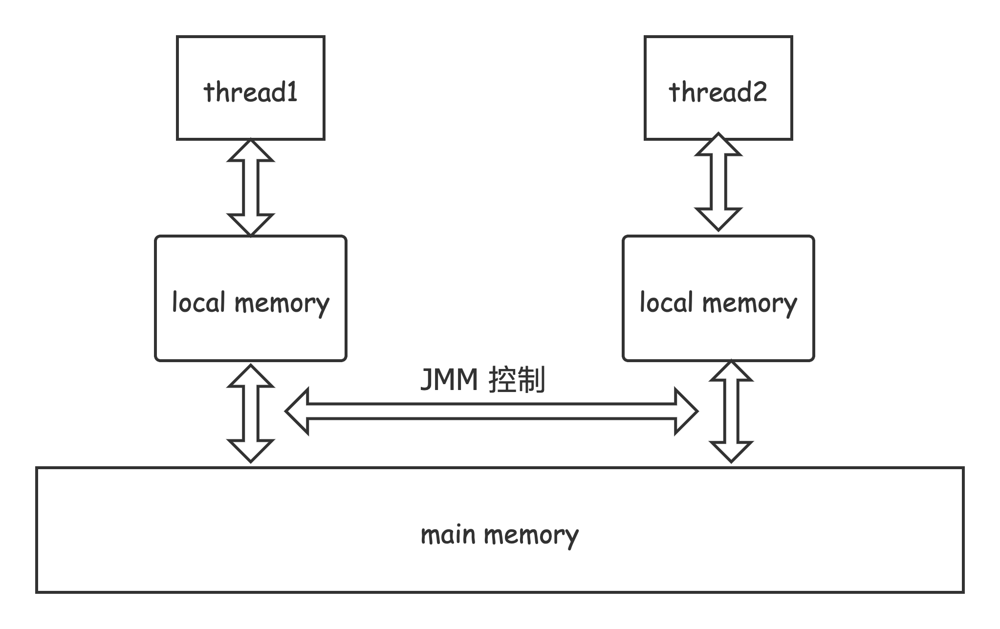
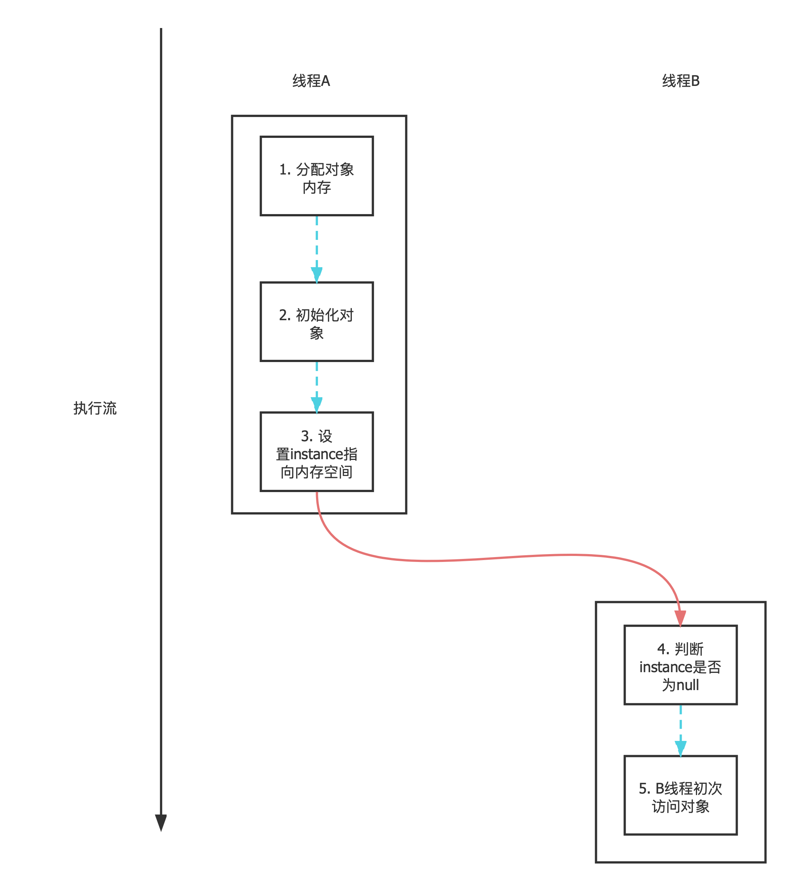

# 并发编程中的三个主要问题

## 可见性问题

当一个线程修改共享变量的值的时候，其他能否立即得知这个修改，这是第一个问题。

## 原子性问题

这里的原子性，有两个尺度。

1. 小的尺度上，对于单个变量（主要对long、double而言）的修改是否具有原子性。
2. 大的尺度上，对于一个方法或者代码块的原子性如何保证。


## 有序性问题

有序性问题在并发编程时是最令人困惑的。

这里先指明，**如果没有作出一些合理的同步工作**，那么**在单个线程中执行顺序具有顺序性**， 但是**在一个线程中观察另一个线程的操作都是不具有有序性的**。


>  正由于上面的问题，才有了这篇文章，其中有的问题这篇文章已经可以回答，有的还不能（主要是对**锁的内存语义**没有阐述）。


# Java 内存模型


Java线程之间的通信由Java内存模型（也就是JMM）来控制，JMM决定一个线程对共享变量的写入何时对另一个线程可见。

从抽象的角度看，JMM定义了线程和主内存之间的抽象关系：线程之间的共享变量存储在主内存（Main memory）中，每个线程都有一个私有的本地内存（Local memory），本地内存存储了线程读写共享变量的副本。本地内存是JMM的一个抽象，它涵盖cache、store buffer、寄存器以及其他的硬件和编译器优化。





## 重排序和内存屏障

### 重排序

在执行程序的过程中，为了提高性能，编译器和处理器通常会对指令进行重排序。重排序主要分为三类。

1. 编译器优化的重排序：编译器在不改变单线程语义的情况下，会对执行语句进行重新排序；

2. 指令集重排序：现代操作系统中的处理器都是并行的，如果执行语句之间不存在数据依赖性，处理器可以改变语句的执行顺序；

3. 内存重排序：由于处理器会使用读/写缓冲区，出于性能的原因，内存会对读/写进行重排序；

上述的 1 属于编译器重排序，2、3属于处理器重排序。这些重排序会导致多线程程序出现内存可见性问题。

对于编译器，JMM的编译器重排序规则会禁止特定类型的编译器重排序；

对于处理器，JMM的处理器重排序规则会要求Java编译器生成指令序列的时插入特定的内存屏障（Memory barrier、Memory fence）。


### 内存屏障

> 这里我们先来了解一下内存屏障的概念。

内存屏障也叫做`栅栏`，它是一种底层原语。它使得 CPU 或编译器在对内存进行操作的时候, 要严格按照一定的顺序来执行, 也就是说在 memory barrier 之前的指令和 memory barrier 之后的指令不会由于系统优化等原因而导致乱序。

内存屏障提供了两个功能。首先，它们通过确保从另一个 CPU 来看屏障的两边的所有指令都是正确的程序顺序；其次它们可以实现内存数据可见性，确保内存数据会同步到 CPU 缓存子系统。


不同计算机体系结构下面的内存屏障也不一样，通常需要认真研读硬件手册来确定，所以我们的主要研究对象是基于 x86 的内存屏障，通常情况下，硬件为我们提供了四种类型的内存屏障。

+ **LoadLoad** 屏障

它的执行顺序是 Load1 ； LoadLoad ；Load2 ，其中的 Load1 和 Load2 都是加载指令。LoadLoad 指令能够确保执行顺序是在 Load1 之后，Load2 之前，LoadLoad 指令是一个比较有效的防止看到旧数据的指令。

+ **StoreStore** 屏障

它的执行顺序是 Store1 ；StoreStore ；Store2 ，和上面的 LoadLoad 屏障的执行顺序相似，它也能够确保执行顺序是在 Store1 之后，Store2 之前。

+ **LoadStore** 屏障

它的执行顺序是 Load1 ； StoreLoad ； Store2 ，保证 Load1 的数据被加载在与这数据相关的 Store2 和之后的 store 指令之前。

+ **StoreLoad** 屏障

它的执行顺序是 Store1 ； StoreLoad ； Load2 ，确保 Store1 数据对其他处理器可见先于 Load2 及所有后续的访存指令。该屏障会使的此屏障前所有的访存指令完成之后，才会执行此屏障之后的访存指令。


其中**StoreLoad**是一个全能屏障，同时具有其他3个屏障的效果。

此屏障的开销很大，往往需要把写缓冲区（store buffer）中的所有数据全部刷新到主存中（Buffer fully flush）。


也正因此，x86处理器禁止了所有的Load-Load、Store-Store、Load-Store重排序，所以说它具有较强的处理器内存模型。不过对于Store-Load并没有在处理器层面“一棒子打死”，而是把禁止Store-Load重排序的责任交给了更上层，禁止Store-Load重排序的方式就是使用**StoreLoad** 内存屏障。


### as-if-serial语义

正如前面所说，为了提高程序的运行的效率，即使是单线程的程序，每行代码的执行顺序也并非如我们想的那样，完全是顺序的执行的，这好几个步骤的指令重排。

但是，为什么在单线程编程环境下，我们从来没有关心过这些重排序带来的问题。

这就是as-if-serial语义带来的效果，不管编译器、处理器为了提高并行度做出怎样的重排序，单线程程序的结果不能被改变，就好像代码就是真的就是顺序执行的一样。

as-if-serial语义为单线程编程环境下的程序员创造了一个幻觉：单线程程序是按程序的顺序执行的，无心担心内存可见性等问题。


### 重排序对多线程程序的影响

举例：

```java
public class Test {
    boolean flag = false;
    int x = 0;
    public void write() {
        x = 1;
        flag = true;
    }
    public void read() {
        if (flag) {
            int i = x; // i 可能等于 0
        }
    }
}
```

在单线程下执行，当然不会有任何异常，原因正如上面的as-if-serial;


但是在多线程下，由于重排序，在read()方法的if代码块中，可能没能读到最新的 x 值。

比如说，A线程先执行 write方法，修改了 flag值，但是此时还没有修改x的值（指令重拍），或者修改了x但是还没有刷回到主存，这个时候B线程执行了read方法，通过率 if的判断条件，但是读 x 的值还是 0 。


这个时候，在多线程程序中，对存在控制依赖的操作重排序，可能改变程序的执行结果。


这是另一个例子：

```java
public class MemoryReorderingExample {
    private static int x = 0, y = 0;
    private static int a = 0, b = 0;

    public static void main(String[] args) throws InterruptedException {
        int i = 0;
        while (true) {
            i++;
            x = 0;
            y = 0;
            a = 0;
            b = 0;
            Thread t1 = new Thread(() -> {
                a = 1;
                x = b;
            });
            Thread t2 = new Thread(() -> {
                b = 1;
                y = a;
            });
            t1.start();
            t2.start();
            t1.join();
            t2.join();
            String result = "第" + i + "次(" + x + "," + y + ")";
            if (x == 0 && y == 0) {
                System.out.println(result);
                break;
            }
        }
    }
}
```


# volatile的内存语义

volatile: 为了确保共享变量能被准确和一致地更新，线程应该确保通过排它锁单独的更改这个变量。

Java提供了 `volatile`，它在多线程中保证了共享变量的可见性——一个线程修改一个共享变量时，另一个线程能读到这个修改值。

它某种程度上是一个轻量级的`synchronized`。


**volatile的特性**：

1. 保证共享变量的可见性；
3. 禁止指令重排序的优化；
3. 对单个变量的读写的原子性。


下面会对此分别作出解释。


## volatile的读-写内存语义

+ volatile写的内存语义：当写一个volatile变量时，JMM会把该线程的本地内存中的共享变量值刷新到主内存。


+ volatile读的内存语义：当读一个volatile变量时，如果此共享变量值已被另一个线程修改，JMM会把线程对应的本地内存置为无效，然后会从主内存中读取共享变量。


一个关于可见性的测试：

```java
public class TestVolatile {

    volatile boolean finished = false; // 去掉 volatile 再看看执行效果

    public void doWork() {
        long x = 0;
        while (!finished) {
            ++x;
        }
        System.out.println("x is "+x);
    }

    public void done() {
        finished = true;
    }

    public static void main(String[] args) throws InterruptedException {
        TestVolatile test = new TestVolatile();
        new Thread(test::doWork).start();
        Thread.sleep(3000);
        new Thread(test::done).start();
    }
}

```


## volatile的禁止重排序规则


为了优化代码执行顺序，前面提到过编译器和处理器的重排序。

为了实现volatile的语义，JMM会限制这两种类型的重排序类型。

**JMM规则**:

1. 当第二个操作是volatile写时，不管第一个操作是什么，都不允许重排序；

2. 当第一个操作是volatile读时，不管第二个操作是什么，都不能重排序；
3. 第一个操作是volatile写，第二个操作是volatile读时，不允许重排序。


其中，第1条保证，在volatile写之前的所有的普通写在执行完 volatile写后都会被刷新到主内存，换言之，如果volatile写没有执行，前面的普通写也不会产生影响（也就是说其他线程不可见）。这个性质对于普通是不具备的（下面会举个例子）

其中，第2条保证，在volatile读之前，下面的普通读不会执行，直到volatile读执行完，才能执行下面的普通读。

其中，第3条的保证是自然要有的。


值得注意的是，第1条、第2条实际上让**volatile写-读**在内存读写顺序上具有**锁的释放-获取**语义。

**volatile写对应锁的释放，volatile读对应锁的获取。**

注意一定只有在一个线程在将锁释放之后，另一个线程可以获取锁。

这让 volatile 具有一定的有序性。


> 注意，上述的性质是在JSR-133标准（JDK-5）发布之后才有的语义，之前的volatile的语义比较弱，而这会给程序员带来了很多违反直觉的结果。


举例如下：

```java
public class TestVolatile {

    int x = 0;
    boolean flag = false; // #1
    
    public void write() {
        x = 1;
        flag = true;
    }
    
    public void read() {
        int y = -1;
        if (flag) {
            y = x; // #2
        }
    }
}
```


在多线程环境下，#2处 y 一定为 1 吗？答案是不确定的。这就是违反程序员直觉的结果。

因为程序没有得到正确的同步处理，所以多线程并发下的结果很可能是混乱的。

同步的方法有很多，比如给`write()`、`read()`加上`synchronized`修饰。

不过这里还有更高效的同步方法，就是在#1处用`volatile`修饰flag变量，根据volatile的指令重排序规则，

一样可以做到访问变量的有序性，此时#1出y的值必然是 1 。


## volatile对非原子性约定的修正


首先讲一个冷知识，在32位机器上，java对64位长度的数据类型（double、long）的读写**可能不是原子性的**。

换言之，**有可能**一个线程在读写double、long变量读的结果既不是自己修改的也不是其它线程修改的，而是一个错误的混乱的值（比如其中前32位来自一个线程，后32位来自另一个线程）。这就带来了一定的风险（虽然这个风险很小很小）。

所以，如果确保一定没有这样的风险，就需要使用volatile修饰double、long变量。

因为，**对于任何单个volatile变量的读写是具有原子性的**。（注意，i++这种经典的**读改写操作**可不是原子的）


## volatile内存语义的实现


### 共享内存的可见性


volatile的两条实现原则：

1. lock前缀指令会让处理器缓存写回到主内存。

   锁住总线：从而独占任何共享内存。

   锁住缓存：锁定某块共享内存的缓存并写回到内存，并用缓存一致性协议（MESI）确保修改的原子性，这常常称为”缓存锁定“。

   缓存一致性机制会阻止同时修改由两个处理器缓存的内存区域数据。

2. 一个处理器的缓存会写到内存的操作会导致其他处理器的缓存无效。

   每个处理器通过嗅探在总线上传播来的数据来检查自己的缓存值是不是已经过期了，当处理器发现自己缓存行对应中有内存地址对应的数据被修改，就会把该缓存行（cache line）设置为无效，需要这个值时重新到主存中获取。

比如`lock addl $0x0,(%esp)`就是实际上的有lock前缀的汇编命令（这是个空操纵，因为不允许单独使用lock）。


### 禁止指令优化重排序

正如上面所言，我们需要使用内存屏障来禁止重排序。


具体的，基于保守策略的JMM按如下规则插入内存屏障：

1. 每个volatile写前面插入StoreStore屏障；
2. 每个volatile写后面插入StoreLoad屏障；
3. 每个volatile读后面插入LoadLoad屏障；
4. 每个volatile读后面插入LoadStore屏障；


在上面说到，x86机器本身就有着较为安全的内存模型，在处理器层面就禁止了Store-Store、Load-Load、Load-Store 重排序。

所以，在x86机器上，仅仅需要在每个volatile写后面插入StoreLoad屏障即可。


那么这个内存屏障究竟是什么呢？

实际上仍然依赖使用带有Lock前缀的汇编代码来完成。


# happens-before


## happen-before的作用

我们先不讲happen-before的定义和规则，先旗帜鲜明地指出**happen-before的价值**。


正因为上面的一系列的内存屏障等等底层的细节，让Java工作组觉得对于开发者极不友好，很难在跨平台的编程环境中编写出可靠的多线程程序，他们提出了happen-before这个规则， 或者说是工具，帮助程序在不了解内存屏障这些概念的情况下依旧可以对他们的程序的执行顺序有个清醒的判断。


## happen-before的定义

JSR-133中对Java内存模型**happen-before**的定义如下：


`happen-before`是 Java 模型中定义的两项操作的偏序关系。


1. 如果一个操作happen-before另一个操作，那么**第一个操作的执行结果将对第二个操作可见**，而且**第一个操作的执行顺序可认为排在第二个操作之前**。
2. 两个操作之间存在happen-before关系，并不意味着Java平台具体实现必须要按照happen-before关系指定的顺序来执行，如果重排序之后的结果，与按happen-before关系来执行的结果一致，那么这种重排序也是合理的，JMM并不禁止。


>注意第二个含义，是“可以认为”第一个执行顺序排在第二个操作“，意思是，即使由于重排序导致时间上第二个操作排在第一个操作之前，它的执行效果也可以等同于”第一个执行顺序排在第二个操作“。


上面的(1)是对程序员的承诺：如果 A happens-before B，那么A的操作结果将对 B 可见，并且执行结果正如A的执行顺序在B之前那样。

上面的(2)是对编译器和处理器排序的约束原则：在不改变程序的语义的情况下，编译器和处理器怎么优化都是可以的。


## happen-before的规则


+ 程序次序规则：一个线程内，按照执行流顺序，书写在前面的操作先行发生于书写在后面的操作;
+ 锁定规则：一个 unLock 操作先行发生于后面对同一个锁的 lock 操作，注意这个后面指的是”时间上的先后“；
+ volatile 变量规则：对一个volatile变量的写操作先行发生于后面对这个volatile变量的读操作，注意这个后面指的是”时间上的先后“;
+ 传递规则：如果操作 A 先行发生于操作 B，而操作 B 又先行发生于操作 C，则可以得出操作 A 先行发生于操作C;
+ 线程启动规则：Thread 对象的 `start()` 方法先行发生于此线程的每个一个动作;
+ 线程中断规则：对线程`interrupt()`方法的调用先行发生于被中断线程的代码检测到中断事件的发生;
+ 线程终结规则：线程中所有的操作都先行发生于线程的终止检测，我们可以通过 `Thread.join()` 方法结束、`Thread.isAlive()`的返回值手段检测到线程已经终止执行;
+ 对象终结规则：一个对象的初始化完成先行发生于他的`finalize()`方法的开始。


> 这 8 条原则摘自《深入理解Java虚拟机》。

其中第三条规则，尤其需要注意一下。

这 8 条规则中，前 4 条规则是比较重要的，后 4 条规则都是显而易见的。


所以，只有在可以使用上面的8条规则的前提下，才能使用happen-before的规则， 进而判断程序的执行顺序。

否则不能仅靠你的直觉判断，那完全不可信。


## happen-before与时间上的先后顺序的关系

先说答案，二者之间没有必然的关系。

一一解释。

1. A happen-before B, A 在时间上就排在B前面吗？

   不一定。前面已经说了，在单线程中as-serial就是来确保这个事情的，就是两个无数据依赖关系的变量的读写顺序可以被交换，但是仍然具有happen-before关系。

   

2. A 在时间上就排在B前面，A 就 happen-before B 吗?

   happen-before的定义要求中有**操作的可见性**，但是在多线程中，如果有正确的同步操作（synchronized、volatile等），那么先发生的操作也不一定对发生的操作可见。


## 使用happen-before解释DoubleCheckLock

下面是使用双重检查锁实现单例的经典代码。（为什么这么写，就不细讲了）


```java
//懒汉式
public class Singleton {
    private volatile static Singleton singleton = null;
    public static Singleton getSingleton() {
        if(singleton==null){
            synchronized (Singleton.class){
                if(singleton==null){
                    singleton = new Singleton();
                }
            }
        }
        return singleton;
    }
}

```


这里我只讲为什么 `volatile`可以实现代码重排序的效果。

使用的工具正是happen-before。




根据happe-before的第一条规则（**程序次序规则**），可以得到各个线程内的蓝色线（代表happen-before的偏序关系）。

根据**volatile 变量规则**，可以得到红色的那条线。

最后根据**传递性规则**，可以得出5个操作的全序关系，这就做到了对象的安全访问。

（多说一句，本质上volatile是通过禁止线程A的2、3的重排序实现happen-before的）。


反过来，如果没有volatile修饰，那么那条红色的线也就不复存在，自然操作5完全可能排在操作2的前面，从而导致对象的不安全访问。


# 参考


[既然CPU有缓存一致性协议（MESI），为什么JMM还需要volatile关键字？](https://www.zhihu.com/question/296949412)

[MESI（缓存一致性协议）](https://blog.csdn.net/xiaowenmu1/article/details/89705740)

[MESI协议-wiki](https://zh.wikipedia.org/zh-hans/MESI%E5%8D%8F%E8%AE%AE)

