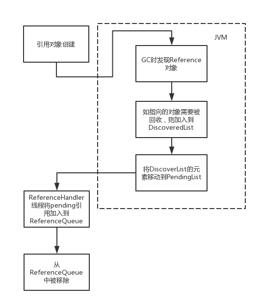

# Reference


```java
public abstract class Reference<T> {
    //引用的对象
    private T referent;        
    //回收队列，由使用者在Reference的构造函数中指定
    volatile ReferenceQueue<? super T> queue;
     //当该引用被加入到queue中的时候，该字段被设置为queue中的下一个元素，以形成链表结构
    volatile Reference next;
    //在GC时，JVM底层会维护一个叫DiscoveredList的链表，存放的是Reference对象，discovered字段指向的就是链表中的下一个元素，由JVM设置
    transient private Reference<T> discovered;  
    //进行线程同步的锁对象
    static private class Lock { }
    private static Lock lock = new Lock();
    //等待加入queue的Reference对象，在GC时由JVM设置，会有一个java层的线程(ReferenceHandler)源源不断的从pending中提取元素加入到queue
    private static Reference<Object> pending = null;
}
```


一个Reference对象的生命周期如下：




# 1.强引用

我们平日里面的用到的new了一个对象就是强引用，例如 `Object obj = new Object();`

当JVM的内存空间不足时，宁愿抛出OutOfMemoryError使得程序异常终止也不愿意回收具有**强引用的存活着的对象**！

回收的时间是不一定的，具体得看GC回收策略。


# 2.软引用

软引用的生命周期比强引用短一些。软引用是通过`SoftReference`类实现的。


```java
Object obj = new Object();
SoftReference softObj = new SoftReference(obj);
obj = null； //去除强引用
```


这样就是一个简单的软引用使用方法。通过`get()`方法获取对象。

**当JVM认为内存空间不足时，就回去试图回收软引用指向的对象**，也就是说在JVM抛出`OutOfMemoryError`之前，会去清理软引用对象。

软引用可以与引用队列`(ReferenceQueue)`联合使用。

```java
Object obj = new Object();
ReferenceQueue queue = new ReferenceQueue();
SoftReference softObj = new SoftReference(obj,queue);
obj = null； //去除强引用
```


当`softObj`软引用的`obj`被GC回收之后，`softObj` 对象就会被塞到`queue`中，之后我们可以通过这个队列的`poll()`来检查你关心的对象是否被回收了，如果队列为空，就返回一个`null`。反之就返回软引用对象也就是`softObj`。

**软引用一般用来实现内存敏感的缓存**，如果有空闲内存就可以保留缓存，当内存不足时就清理掉，这样就保证使用缓存的同时不会耗尽内存。例如图片缓存框架中缓存图片就是通过软引用的。


# 3.弱引用

弱引用是通过`WeakReference`类实现的，它的生命周期比软引用还要短, 也是通过`get()`方法获取对象。


```java
 Object obj = new Object();
 WeakReference<Object> weakObj = new WeakReference<Object>(obj);
 obj = null； //去除强引用
```


**在GC的时候，JVM 不管内存空间足不足都会回收这个对象**，同样也可以配合`ReferenceQueue` 使用，也同样适用于内存敏感的缓存。

`ThreadLocal`中的`Entry`就是继承了`WeakReference`类，这`Entry`弱引用着`ThreadLocal`。


# 4.幻象引用

也称虚引用，是通过`PhantomReference`类实现的。任何时候可能被GC回收,就像没有引用一样。


```java
Object obj = new Object();
ReferenceQueue queue = new ReferenceQueue();
PhantomReference<Object> phantomObj = new PhantomReference<Object>(obj , queue);
obj = null； //去除强引用
```


不过**无法通过虚引用访问对象的任何属性或者函数**。

那就要问了要它有什么用？


```java
public class PhantomReference<T> extends Reference<T> {
    // 永远返回 null
    public T get() {
        return null;
    }
}
```


虚引用仅仅只是提供了一种确保对象被`finalize`以后来做某些事情的机制。比如说这个对象被回收之后发一个系统通知啊啥的。虚引用是必须配合`ReferenceQueue` 使用的，具体使用方法和上面提到软引用的一样。主要用来跟踪对象被垃圾回收的活动。


一个错误认知：

> 严格的说，**虚引用是会影响对象生命周期的**，如果不做任何处理，只要虚引用不被回收，那其引用的对象永远不会被回收。所以一般来说，从ReferenceQueue中获得PhantomReference对象后，如果PhantomReference对象不会被回收的话（比如被其他GC ROOT可达的对象引用），需要调用clear方法解除PhantomReference和其引用对象的引用关系。


> [[Java四种引用类型原理你真的搞明白了吗？五分钟带你深入理解！](https://segmentfault.com/a/1190000039994284)](https://segmentfault.com/a/1190000039994284)
