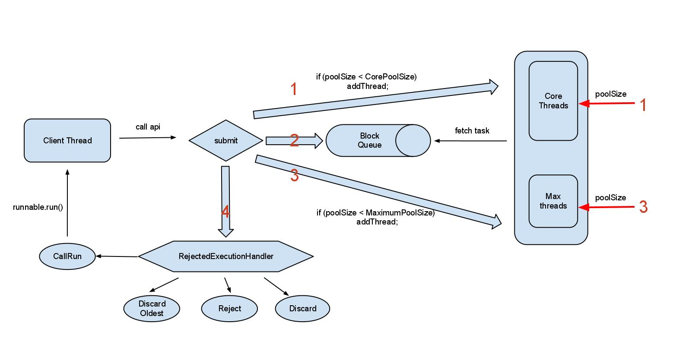
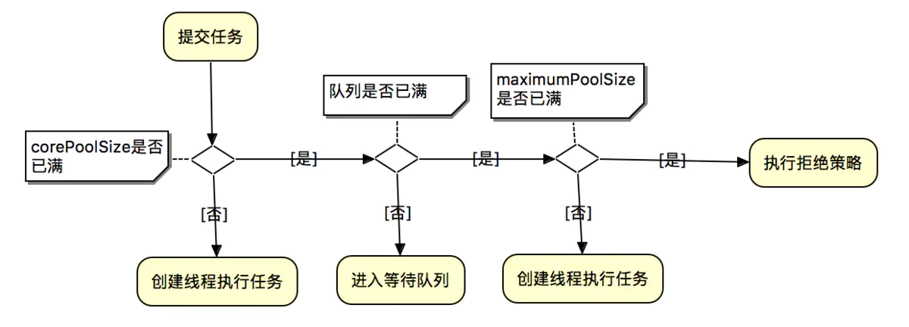
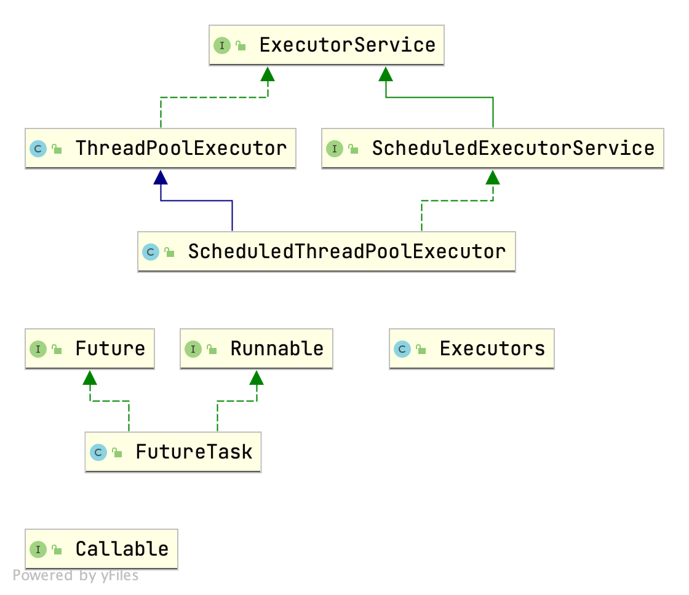

# 使用线程池的好处
首先，回答这个问题，要先回答为什么要使用多线程。
其次再是为什么要使用线程池。
使用多线程的好处及必要性就不说了。

**使用线程池的好处：**

1. 提高响应速度：通过复用线程可以消除线程创建销毁带来的延迟，提示响应速度
2. 降低资源消耗线程池可以统筹内存和CPU的使用，避免资源使用不当，线程池会根据配置和任务数量灵活控制线程数量，不够就创建，多了就回收，避免线程过多导致内存溢出，过少导致资源浪费
3. 提高线程可管理行线程池可以统一管理资源，统一进行分配、调优、监控。


# 线程池工作原理
将任务传递给线程池，而不是为每个任务启动一个新线程来并发执行。
一旦池中有任何空闲线程，任务就会分配给其中之一并执行。
在内部，任务被插入到一个阻塞队列中，然后池中的空闲线程从该队列中取出任务并执行。


不过在JDK提供的线程池的原理比这个还要复杂些（真实的往往是复杂的）。




# 自己实现一个简单的线程池 
```java
/**
 * @author: SongyangJi
 * @description:
 * @since: 2021/10/15
 */
public class ThreadPool {

    private final BlockingQueue<Runnable> taskQueue;
    private final List<PooledThread> threads = new ArrayList<>();
    private volatile boolean isStopped = false;

    /**
     * @param numOfThreads  工作线程数
     * @param maxNumOfTasks 缓冲队列最多预存任务数
     */
    public ThreadPool(int numOfThreads, int maxNumOfTasks) {
        taskQueue = new LinkedBlockingQueue<>(maxNumOfTasks);

        for (int i = 0; i < numOfThreads; i++) {
            threads.add(new PooledThread(taskQueue));
        }
        for (PooledThread thread : threads) {
            thread.start();
        }
    }

    public void execute(Runnable task) throws InterruptedException {
        if (this.isStopped) throw
                new IllegalStateException("ThreadPool is stopped");
        this.taskQueue.put(task);
    }

    public void shutDown() {
        this.isStopped = true;
        for (PooledThread thread : threads) {
            thread.toStop();
        }
        taskQueue.clear();
    }

    private static class PooledThread extends Thread {

        private final BlockingQueue<Runnable> taskQueue;
        private volatile boolean isStopped = false;

        public PooledThread(BlockingQueue<Runnable> queue) {
            taskQueue = queue;
        }

        @Override
        public void run() {
            while (!isStopped) {
                Runnable runnable;
                try {
                    runnable = taskQueue.take();
                    runnable.run();
                } catch (InterruptedException ignored) {
                }
            }
        }

        public void toStop() {
            isStopped = true;
            this.interrupt(); // 中断当前线程（但可能不被响应）
        }

    }


    // 测试
    public static void main(String[] args) throws InterruptedException {
        Random random = new Random();
        ThreadPool threadPool = new ThreadPool(3, 10);
        for (int i = 0; i < 20; i++) {
            final int id = i;
            threadPool.execute(() -> {
                try {
                    TimeUnit.MILLISECONDS.sleep(random.nextInt(3000));
                } catch (InterruptedException e) {
                    e.printStackTrace();
                }
                System.out.printf("task %d finished in %s\n", id,Thread.currentThread().getName());
            });
        }
        TimeUnit.SECONDS.sleep(10);
        threadPool.shutDown();
    }

}
```


# ThreadPoolExecutor工作机制

## 构造方法
```java
public ThreadPoolExecutor(int corePoolSize, 
                          int maximumPoolSize,
                          long keepAliveTime,
                          TimeUnit unit,
                          BlockingQueue<Runnable> workQueue,
                          ThreadFactory threadFactory,
                          RejectedExecutionHandler handler)
```


## 构造参数的含义


| 序号 | 名称            | 类型                     | 含义             |
| ---- | --------------- | ------------------------ | ---------------- |
| 1    | corePoolSize    | int                      | 核心线程池大小   |
| 2    | maximumPoolSize | int                      | 最大线程池大小   |
| 3    | keepAliveTime   | long                     | 线程最大空闲时间 |
| 4    | unit            | TimeUnit                 | 时间单位         |
| 5    | workQueue       | BlockingQueue            | 线程等待队列     |
| 6    | threadFactory   | ThreadFactory            | 线程创建工厂     |
| 7    | handler         | RejectedExecutionHandler | 拒绝策略         |


## 内部机制

1. 如果当前线程池的线程数还没有达到基本大小(poolSize < corePoolSize)，无论是否有空闲的线程新增一个线程处理新提交的任务；

2. 如果当前线程池的线程数大于或等于基本大小(poolSize >= corePoolSize) 且任务队列未满时，就将新提交的任务提交到阻塞队列排队，等候处理workQueue.offer(command)；

3. 如果当前线程池的线程数大于或等于基本大小(poolSize >= corePoolSize) 且任务队列满时；
   - 当前poolSize<maximumPoolSize，那么就新增线程来处理任务；
   - 当前poolSize=maximumPoolSize，那么意味着线程池的处理能力已经达到了极限，此时需要拒绝新增加的任务。至于如何拒绝处理新增的任务，取决于线程池的饱和策略RejectedExecutionHandler。


描述为如下的工作流程图：




这里有一篇讲的很好的、可视化线程池工作机制的文章[>>传送门](https://zhuanlan.zhihu.com/p/112527671)。


## 拒绝策略


拒绝策略是RejectedExecutionHandler的实现类；

```java
// r - 请求执行的可运行任务
// executor – 尝试执行此任务的执行器
public interface RejectedExecutionHandler {
    void rejectedExecution(Runnable r, ThreadPoolExecutor executor);
}
```


当要创建的线程数量大于线程池的最大线程数的时候，新的任务就会被拒绝，就会调用这个接口里的这个方法。


下面介绍 ThreadPoolExecutor 中已经实现的四种策略。

### AbortPolicy

这也是默认的拒绝策略（保守的策略）

```java
public void rejectedExecution(Runnable r, ThreadPoolExecutor e) {
    throw new RejectedExecutionException("Task " + r.toString() +
                                         " rejected from " +
                                         e.toString());
}
```

### DiscardPolicy

很潇洒，啥也不做。

```java
public void rejectedExecution(Runnable r, ThreadPoolExecutor e) {
}
```

### DiscardOldestPolicy

丢弃最早的未处理请求，然后去执行这个现在的任务。

```java
public void rejectedExecution(Runnable r, ThreadPoolExecutor e) {
    if (!e.isShutdown()) {
        e.getQueue().poll();
        e.execute(r);
    }
}
```


### CallerRunsPolicy

在任务被拒绝添加后，会调用当前线程池的所在的线程去执行被拒绝的任务。

也就是说，自己的活自己做，不要让线程池去做了。

```java
public void rejectedExecution(Runnable r, ThreadPoolExecutor e) {
    if (!e.isShutdown()) {
        r.run();
    }
}
```


## 阻塞队列

阻塞队列的选取可以参考在JUC中BlockingQueue的几种实现类，这里不再赘述。


# Executor框架 —— JDK提供的线程池家族

## 类图



## 几种开箱即用的线程池

### FixedThreadPool

构造函数：

```java
    public static ExecutorService newFixedThreadPool(int nThreads) {
        return new ThreadPoolExecutor(nThreads, nThreads,
                                      0L, TimeUnit.MILLISECONDS,
                                      new LinkedBlockingQueue<Runnable>());
    }
```


特点：

+ workQueue 为LinkedBlockingQueue（**无界阻塞队列**），队列最大值为Integer.MAX_VALUE。如果任务提交速度持续大余任务处理速度，会造成队列大量阻塞。因为队列基本上是无穷大，很有可能在拒绝策略前，内存溢出。由于队列容量无穷大，所以实际上maximumPoolSize是无效参数。

+ corePoolSize与maximumPoolSize相等，即其线程全为核心线程，是一个固定大小的线程池；

+ keepAliveTime = 0 表明多余的线程会被立即终止，但是由于默认情况下这不对核心线程起作用，又由于队列容量无穷大，所以这个参数实际上也是无效的。（因为在核心线程池满之后，就不再被销毁，除非你`allowCoreThreadTimeOut(true)`）
+ 由于第一点，没有设置拒绝策略，设置了也是无效的。


适用场景：

计算重量级的任务。


### CachedThreadPool

构造函数：

```java
     public static ExecutorService newCachedThreadPool() {
        return new ThreadPoolExecutor(0, Integer.MAX_VALUE,
                                      60L, TimeUnit.SECONDS,
                                      new SynchronousQueue<Runnable>());
    }
```


+ corePoolSize = 0，maximumPoolSize = Integer.MAX_VALUE，即线程数量几乎无限制；

+ keepAliveTime = 60s，线程空闲60s后自动结束，因此长时间保持空闲的CachedThreadPool不占用资源。

+ workQueue 为 SynchronousQueue 为无容量的同步队列，这个队列类似于一个接力棒，入队出队必须同时传递，所以当核心线程池已满的时候，会直接创建一个新的线程；


适用场景：快速处理大量耗时较短的任务，如Netty的NIO接受请求时，可使用CachedThreadPool。


### SingleThreadExecutor

```java
    public static ExecutorService newSingleThreadExecutor() {
        return new FinalizableDelegatedExecutorService
            (new ThreadPoolExecutor(1, 1,
                                    0L, TimeUnit.MILLISECONDS,
                                    new LinkedBlockingQueue<Runnable>()));
    }
```

实际上就是 Executors.newFixedThreadPool(1)的包装。

线程池一旦接受了一个任务，就保持一个线程去接受任务。


# 合理配置线程池大小

## 任务的不同角度的分类

合理的配置线程池的大小，从以下几个角度分析任务的特性：

+ 任务的性质：CPU密集型任务、IO密集型任务、混合型任务。


+ 任务的优先级：高、中、低。


+ 任务的执行时间：长、中、短。
+ 任务的依赖性：是否依赖其他系统资源，如数据库连接等。 


性质不同的任务可以交给不同规模的线程池执行
+ CPU密集型任务应配置尽可能小的线程，如配置CPU个数+1的线程数;

+ IO密集型任务应配置尽可能多的线程，因为IO操作不占用CPU，不要让CPU闲下来，应加大线程数量，如配置两倍CPU个数+1;

+ 混合型的任务，如果可以拆分，拆分成IO密集型和CPU密集型分别处理，前提是两者运行的时间是差不多的，如果处理时间相差很大，则没必要拆分了。


## 一个经验公式
**最佳线程数目 = （（线程等待时间+线程CPU时间）/线程CPU时间 ）* CPU数目**

比如平均每个线程CPU运行时间为0.5s，而线程等待时间（非CPU运行时间，比如IO）为1.5s，CPU核心数为8，那么根据上面这个公式估算得到：((0.5+1.5)/0.5)*8=32。这个公式进一步转化为：

```
最佳线程数目 = （线程等待时间/线程CPU时间+ 1）* CPU
```


可以得出一个结论： 线程等待时间所占比例越高，需要越多线程。线程CPU时间所占比例越高，需要越少线程。 以上公式与CPU和IO密集型任务设置线程数基本吻合。
    

## 实践配置
高并发、任务执行时间短的业务怎样使用线程池？并发不高、任务执行时间长的业务怎样使用线程池？并发高、业务执行时间长的业务怎样使用线程池？  

1. 高并发、任务执行时间短的业务，线程池线程数可以设置为CPU核数+1，减少线程上下文的切换

2. 并发不高、任务执行时间长的业务要区分开看：
  - 假如是业务时间长集中在IO操作上，也就是IO密集型的任务，因为IO操作并不占用CPU，所以不要让所有的CPU闲下来，可以适当加大线程池中的线程数目，让CPU处理更多的业务 　　
  - 假如是业务时间长集中在计算操作上，也就是计算密集型任务，这个就没办法了，和（1）一样吧，线程池中的线程数设置得少一些，减少线程上下文的切换
3. 并发高、业务执行时间长，解决这种类型任务的关键不在于线程池而在于整体架构的设计，看看这些业务里面某些数据是否能做缓存是第一步，增加服务器是第二步，至于线程池的设置，设置参考（2）。

   最后，业务执行时间长的问题，也可能需要分析一下，看看能不能使用中间件对任务进行拆分和解耦


## 其他配置

队列大小 = 线程数 * (最大响应时间/任务实际处理时间)

假设目标最大响应时间为0.4s，计算阻塞队列的长度为20 * (0.4 / 0.2) = 40。

很好理解，就是拿最大响应时间（pct999的响应时间）和平均处理时间的比率*线程数，这些任务可能就是来不及处理堆积在队列里的。


> 参考链接
>
> [Thread Pools](http://tutorials.jenkov.com/java-concurrency/thread-pools.html)
>
> [线程池工作原理可视化](https://zhuanlan.zhihu.com/p/112527671)
>
> [本以为“线程池”很简单，没想到第一问就被干趴下了！](https://www.jianshu.com/p/0d5604152b97)
>
> 《Java 并发编程的艺术》

