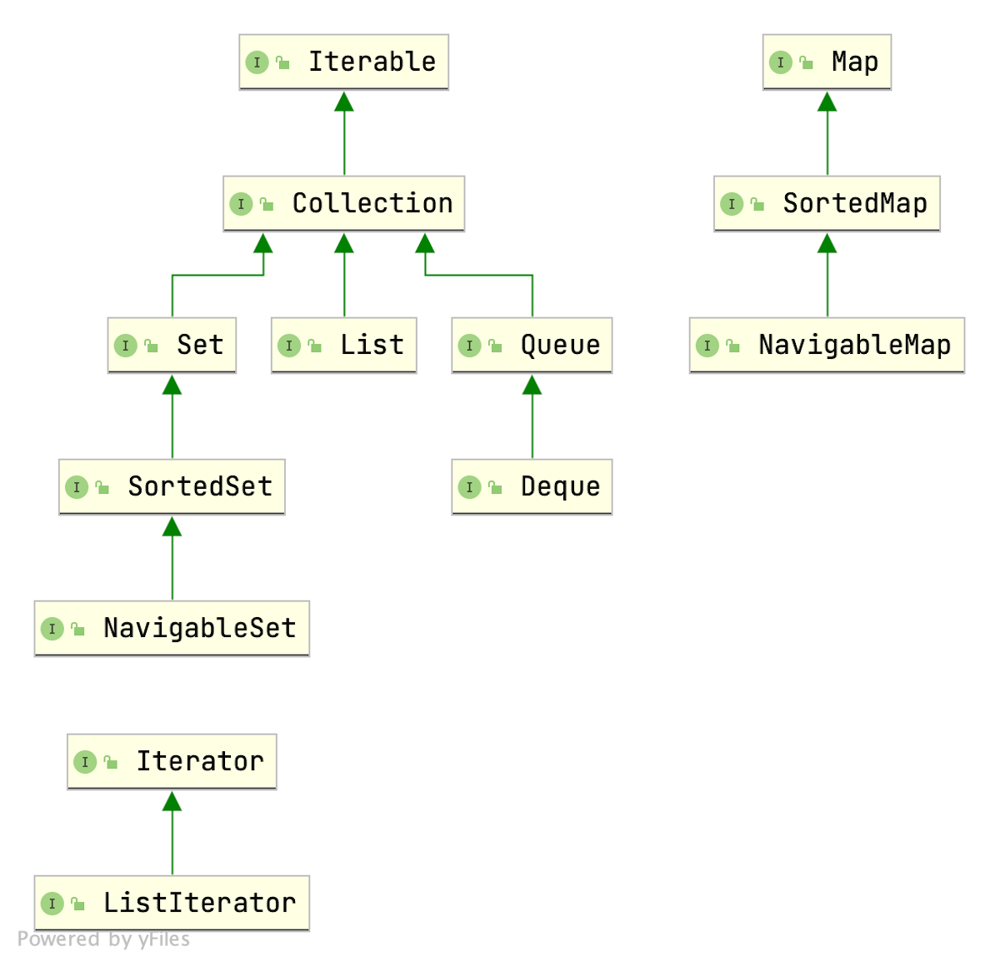

本篇博客本着**面向接口编程**的思想，整理了Java集合类的接口设计UML图，
然后根据官方文档摘取了笔者觉得比较重要的API，这对增强Java集合类的整体认识无疑是很有帮助的。
不过，这样一篇整理+搬运的博客也仅仅是对笔者自己有帮助罢了。


# 接口设计UML图



# 迭代模式的实现
Java类库实现的 **迭代器模式**。

## 迭代器：```Iterator```
| Modifier and Type | Method and Description                                       |
| :---------------- | :----------------------------------------------------------- |
| `boolean`         | `hasNext()`如果迭代具有更多元素，则返回 `true` 。            |
| `E`               | `next()`返回迭代中的下一个元素。                             |
| `default void`    | `remove()`从底层集合中删除此迭代器返回的最后一个元素（可选操作）。 |


## 可迭代对象：```Iterable```

| Modifier and Type | Method and Description                                       |
| :---------------- | :----------------------------------------------------------- |
| `default void`    | `forEach(Consumer<? super T> action)`对 `Iterable`的每个元素执行给定的操作，直到所有元素都被处理或动作引发异常。 |
| `Iterator<T>`     | `iterator()`返回类型为 `T`元素的迭代器。                     |

# 一元集合
 ```Collection```

| Modifier and Type        | Method and Description                                       |
| :----------------------- | :----------------------------------------------------------- |
| `boolean`                | `add(E e)`确保此集合包含指定的元素（可选操作）。             |
| `boolean`                | `addAll(Collection<? extends E> c)`将指定集合中的所有元素添加到此集合（可选操作）。 |
| `void`                   | `clear()`从此集合中删除所有元素（可选操作）。                |
| `boolean`                | `contains(Object o)`如果此集合包含指定的元素，则返回 `true` 。 |
| `boolean`                | `containsAll(Collection<?> c)`如果此集合包含指定 `集合`中的所有元素，则返回true。 |
| `boolean`                | `isEmpty()`如果此集合不包含元素，则返回 `true` 。            |
| `Iterator<E>`            | `iterator()`返回此集合中的元素的迭代器。                     |
| `boolean`                | `remove(Object o)`从该集合中删除指定元素的单个实例（如果存在）（可选操作）。 |
| `boolean`                | `removeAll(Collection<?> c)`删除指定集合中包含的所有此集合的元素（可选操作）。 |
| `int`                    | `size()`返回此集合中的元素数。                               |
| `Object[]`               | `toArray()`返回一个包含此集合中所有元素的数组。              |
| `<T> T[]`                | `toArray(T[] a)`返回包含此集合中所有元素的数组; 返回的数组的运行时类型是指定数组的运行时类型。 |

## 线性集合
###  ```List```
拓展了Collection接口，所以只列出多出的方法。

| Modifier and Type        | Method and Description                                       |
| :----------------------- | :----------------------------------------------------------- |
| `void`                   | `add(int index, E element)`将指定的元素插入此列表中的指定位置（可选操作）。 |
| `E`                      | `get(int index)`返回此列表中指定位置的元素。                 |
| `int`                    | `indexOf(Object o)`返回此列表中指定元素的第一次出现的索引，如果此列表不包含元素，则返回-1。 |
| `int`                    | `lastIndexOf(Object o)`返回此列表中指定元素的最后一次出现的索引，如果此列表不包含元素，则返回-1。 |
| `E`                      | `remove(int index)`删除该列表中指定位置的元素（可选操作）。  |
| `E`                      | `set(int index, E element)`用指定的元素（可选操作）替换此列表中指定位置的元素。 |
| `default void`           | `sort(Comparator<? super E> c)`使用随附的 `Comparator`排序此列表来比较元素。 |
| `List<E>`                | `subList(int fromIndex, int toIndex)`返回此列表中指定的 `fromIndex` （含）和 `toIndex`之间的视图。 |


###  ```Queue```

| Modifier and Type | Method and Description                                       |
| :---------------- | :----------------------------------------------------------- |
| `boolean`         | `add(E e)`将指定的元素插入到此队列中，如果可以立即执行此操作，而不会违反容量限制， `true`在成功后返回 `IllegalStateException`如果当前没有可用空间，则抛出IllegalStateException。 |
| `boolean`         | `offer(E e)`如果在不违反容量限制的情况下立即执行，则将指定的元素插入到此队列中。 |
| `E`               | `remove()`检索并删除此队列的头。如果队列对空，抛出异常NoSuchElementException。 |
| `E`               | `poll()`检索并删除此队列的头，如果此队列为空，则返回 `null` 。 |
| `E`               | `element()`检索但不删除这个队列的头。如果队列为空，抛出异常NoSuchElementException。 |
| `E`               | `peek()`检索但不删除此队列的头，如果此队列为空，则返回 `null` 。 |

要注意这三对方法的差别。


###  ```Deque```

| Modifier and Type | Method and Description                                       |
| :---------------- | :----------------------------------------------------------- |
| `void`            | `addFirst(E e)`插入此双端队列的前面，如果它是立即可行且不会违反容量限制，抛出一个指定的元素 `IllegalStateException`如果当前没有空间可用。 |
| `void`            | `addLast(E e)`在插入如果它是立即可行且不会违反容量限制，抛出此双端队列的末尾指定元素 `IllegalStateException`如果当前没有空间可用。 |
| `boolean`         | `offerFirst(E e)`在此deque的前面插入指定的元素，除非它会违反容量限制。 |
| `boolean`         | `offerLast(E e)`在此deque的末尾插入指定的元素，除非它会违反容量限制。 |
| `E`               | `getFirst()`检索，但不删除，这个deque的第一个元素。如果为空，抛出抛出异常NoSuchElementException。 |
| `E`               | `getLast()`检索，但不删除，这个deque的最后一个元素。如果为空，抛出抛出异常NoSuchElementException。 |
| `E`               | `peekFirst()`检索，但不删除，此deque的第一个元素，或返回 `null`如果这个deque是空的。 |
| `E`               | `peekLast()`检索但不删除此deque的最后一个元素，如果此deque为空，则返回 `null` 。 |
| `E`               | `removeFirst()`检索并删除此deque的第一个元素。如果为空，抛出抛出异常NoSuchElementException |
| `E`               | `removeLast()`检索并删除此deque的最后一个元素。如果为空，抛出抛出异常NoSuchElementException |
| `E`               | `pollFirst()`检索并删除此deque的第一个元素，如果此deque为空，则返回 `null` 。 |
| `E`               | `pollLast()`检索并删除此deque的最后一个元素，如果此deque为空，则返回 `null` 。 |

和Queue的方法几乎一致，主要是双端队列在两端都可以进出。
所以，在各方法后面加上了 First、Last修饰（事实上，还有缺省First、Last的方法，但是考虑到会引起歧义，所以干脆不用）。


```Deque```接口实际上既可以作为Queue，也可以作为Stack来使用。

push、pop是针对栈而言的。

offer、poll是针对队列而言的。


其中 jdk的设计是，push、pop实际上都是对队列的第一个元素的操作。

offer向队尾加入元素，poll从队首移除元素。


## 唯一性集合
### ```Set```
Set接口与之相同（仅仅是接口定义约束的不同），略去。

### ```SortedSet```

| Modifier and Type        | Method and Description                                       |
| :----------------------- | :----------------------------------------------------------- |
| `E`                      | `first()`返回此集合中当前的第一个（最低）元素。              |
| `E`                      | `last()`返回此集合中当前的最后（最高）元素。                 |
| `SortedSet<E>`           | `headSet(E toElement)`返回该集合的部分的视图，其元素严格小于 `toElement` 。 |
| `SortedSet<E>`           | `tailSet(E fromElement)`返回此组件的元素大于或等于 `fromElement`的部分的视图。 |
| `SortedSet<E>`           | `subSet(E fromElement, E toElement)`返回该集合的部分的视图，其元素的范围为 `fromElement` （含），为 `toElement` ，独占。 |


### ```NavigableSet```
| Modifier and Type | Method and Description                                       |
| :---------------- | :----------------------------------------------------------- |
| `E`               | `ceiling(E e)`返回此集合中最小元素大于或等于给定元素，如果没有此元素则返回 `null` 。 |
| `E`               | `floor(E e)`返回该集合中最大的元素小于或等于给定元素，如果没有这样的元素，则返回 `null` 。 |
| `E`               | `higher(E e)`返回这个集合中的最小元素严格大于给定的元素，如果没有这样的元素，则返回 `null` 。 |
| `E`               | `lower(E e)`返回该集合中最大的元素严格小于给定的元素，如果没有这样的元素，则返回 `null` 。 |
| `E`               | `pollFirst()`检索并删除第一个（最低）元素，如果此集合为空，则返回 `null` 。 |
| `E`               | `pollLast()`检索并删除最后一个（最高）元素，如果此集合为空，则返回 `null` 。 |
| `Iterator<E>`     | `iterator()`以升序返回此集合中的元素的迭代器。               |
| `Iterator<E>`     | `descendingIterator()`以降序返回该集合中的元素的迭代器。     |

# 二元集合（映射）

## ```Map```

| Modifier and Type     | Method and Description                                       |
| :-------------------- | :----------------------------------------------------------- |
| `boolean`             | `containsKey(Object key)`如果此映射包含指定键的映射，则返回 `true` 。 |
| `boolean`             | `containsValue(Object value)`如果此地图将一个或多个键映射到指定的值，则返回 `true` 。 |
| `Set<K>`              | `keySet()`返回此地图中包含的键的视图。                       |
| `Collection<V>`       | `values()`返回此地图中包含的值的视图。 |
| `Set<Map.Entry<K,V>>` | `entrySet()`返回此地图中包含的映射的视图。                   |
| `V`                   | `get(Object key)`返回到指定键所映射的值，或 `null`如果此映射包含该键的映射。 |
| `default V`           | `getOrDefault(Object key, V defaultValue)`返回到指定键所映射的值，或 `defaultValue`如果此映射包含该键的映射。 |
| `V`                   | `put(K key, V value)`将指定的值与该映射中的指定键相关联（可选操作）。 |
| `default V`           | `putIfAbsent(K key, V value)`如果指定的键尚未与某个值相关联（或映射到 `null` ）将其与给定值相关联并返回 `null` ，否则返回当前值。 |
| `default V`           | `replace(K key, V value)`只有当目标映射到某个值时，才能替换指定键的条目。 |
| `default boolean`     | `replace(K key, V oldValue, V newValue)`仅当前映射到指定的值时，才能替换指定键的条目。 |
| `V`                   | `remove(Object key)`如果存在（从可选的操作），从该地图中删除一个键的映射。 |
| `default boolean`     | `remove(Object key, Object value)`仅当指定的密钥当前映射到指定的值时删除该条目。 |


需要注意 replace 和 putIfAbsent 的区别。


## ```Map.Entry```
它的角色类似于迭代器的角色，不过是二元的。

| Modifier and Type | Method and Description                                       |
| :---------------- | :----------------------------------------------------------- |
| `K`               | `getKey()`返回与此条目相对应的键。                           |
| `V`               | `getValue()`返回与此条目相对应的值。                         |
| `V`               | `setValue(V value)`用指定的值替换与该条目相对应的值（可选操作）。 |


> 参考资料
>
> [Overview (Java Platform SE 8 ](https://docs.oracle.com/javase/8/docs/api/)
