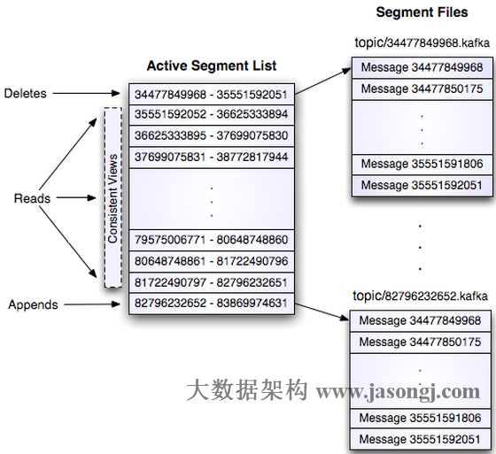
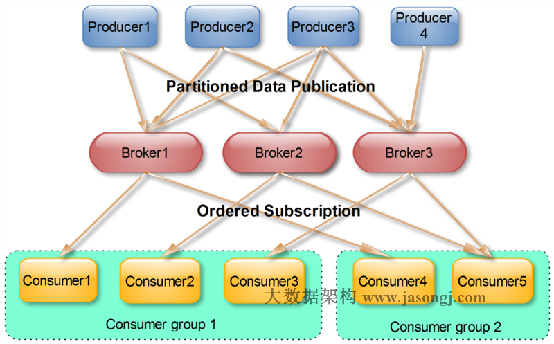

# Kafka简介

Kafka是一种分布式的，基于发布/订阅的消息系统。主要设计目标如下：

+ 快写：以时间复杂度为O(1)的方式提供消息持久化能力，即使对TB级以上数据也能保证常数时间复杂度的访问性能；
+ 高吞吐率：即使在非常廉价的商用机器上也能做到单机支持每秒100K条以上消息的传输；
+ 支持Kafka Server间的消息分区，及分布式消费，同时保证每个Partition内的消息顺序传输；
+ 同时支持离线数据处理和实时数据处理；
+ 扩容：支持在线水平扩展。


# 为何使用消息系统

异步、削峰、解耦


+ **解耦**
  　　在项目启动之初来预测将来项目会碰到什么需求，是极其困难的。消息系统在处理过程中间插入了一个隐含的、基于数据的接口层，两边的处理过程都要实现这一接口。这允许你独立的扩展或修改两边的处理过程，只要确保它们遵守同样的接口约束。
+ **冗余**
  　　有些情况下，处理数据的过程会失败。除非数据被持久化，否则将造成丢失。消息队列把数据进行持久化直到它们已经被完全处理，通过这一方式规避了数据丢失风险。许多消息队列所采用的”插入-获取-删除”范式中，在把一个消息从队列中删除之前，需要你的处理系统明确的指出该消息已经被处理完毕，从而确保你的数据被安全的保存直到你使用完毕。
+ **扩展性**
  　　因为消息队列解耦了你的处理过程，所以增大消息入队和处理的频率是很容易的，只要另外增加处理过程即可。不需要改变代码、不需要调节参数。扩展就像调大电力按钮一样简单。
+ **灵活性 & 峰值处理能力**
  　　在访问量剧增的情况下，应用仍然需要继续发挥作用，但是这样的突发流量并不常见；如果为以能处理这类峰值访问为标准来投入资源随时待命无疑是巨大的浪费。使用消息队列能够使关键组件顶住突发的访问压力，而不会因为突发的超负荷的请求而完全崩溃。
+ **可恢复性**
  　　系统的一部分组件失效时，不会影响到整个系统。消息队列降低了进程间的耦合度，所以即使一个处理消息的进程挂掉，加入队列中的消息仍然可以在系统恢复后被处理。
+ **顺序保证**
  　　在大多使用场景下，数据处理的顺序都很重要。大部分消息队列本来就是排序的，并且能保证数据会按照特定的顺序来处理。Kafka保证一个Partition内的消息的有序性。
+ **缓冲**
  　　在任何重要的系统中，都会有需要不同的处理时间的元素。例如，加载一张图片比应用过滤器花费更少的时间。消息队列通过一个缓冲层来帮助任务最高效率的执行———写入队列的处理会尽可能的快速。该缓冲有助于控制和优化数据流经过系统的速度。
+ **异步通信**
  　　很多时候，用户不想也不需要立即处理消息。消息队列提供了异步处理机制，允许用户把一个消息放入队列，但并不立即处理它。想向队列中放入多少消息就放多少，然后在需要的时候再去处理它们。


# Kafka架构
## Kafka名词术语

+ 服务器：Broker, 接收客户端发送过来的消息，对消息进行持久化，进行消息的推送等等功能。
+ 主题：Topic。**主题是承载消息的逻辑容器**，在实际使用中多用来区分具体的业务。
+ 分区：Partition。一个有序的消息序列。每个主题下可以有多个分区。分区在业务上并没有太多意义。
+ 消息：Message。由消息头（CRC、版本号、属性、时间戳等等）、消息键（KEY）、消息体（VALUE）、时间戳（TIMESTAMP）等组成。
+ 消息位移：Offset。**表示分区中每条消息的位置信息**，是一个随着消息单调递增且一旦确定就不变的值（对于某条消息而言）。
+ 副本：Replica。**Kafka 中同一条消息能够被拷贝到多个地方以提供数据冗余，这些地方就是所谓的副本**。副本还分为领导者副本（leader replica）和追随者副本（foller replica），各自有不同的角色划分。每个分区可配置多个副本实现高可用。一个分区的N个副本一定在N个不同的Broker上。
+ 生产者：Producer。向主题发布新消息的应用程序。
+ 消费者：Consumer。从主题订阅新消息的应用程序。
+ 消费者位移：Consumer Offset。表示消费者消费进度，**每个消费者都有自己的消费者位移**。offset保存在broker端的内部topic中（老版本存储在zookeeper集群），不是在clients中保存。**<Group ID，主题名，分区号 >**
+ 消费者组：Consumer Group。**多个消费者实例共同组成的一个组，同时消费某个主题的多个分区**以实现高吞吐。
+ 重平衡：Rebalance。消费者组内某个消费者实例挂掉后，其他消费者实例自动重新分配订阅主题分区


### topic 和 partition


partition上的每一条消息都会被分配一个序列号，该序列号被称为位移。

每条消息在某个消息的位移是固定的（不要和消费者的位移产生混淆）。

所以，kafka中的每一条消息都可以由<topic,partition,offset>这个三元组位移确定。


### replica

副本分为leader副本和follower副本。
这个主从结构并不是一回事。一般情况下，在主从结构中，主提供写，主从都可以提供读。


## Kafka拓扑结构


如上图所示，一个典型的Kafka集群中包含若干Producer（可以是web前端产生的Page View，或者是服务器日志，系统CPU、Memory等），若干broker（Kafka支持水平扩展，一般broker数量越多，集群吞吐率越高），若干Consumer Group，以及一个[Zookeeper](http://zookeeper.apache.org/)集群。Kafka通过Zookeeper管理集群配置，选举leader，以及在Consumer Group发生变化时进行rebalance。Producer使用push模式将消息发布到broker，Consumer使用pull模式从broker订阅并消费消息。 　　


## Topic & Partition

　　Topic在逻辑上可以被认为是一个queue，每条消费都必须指定它的Topic，可以简单理解为必须指明把这条消息放进哪个queue里。为了使得Kafka的吞吐率可以线性提高，物理上把Topic分成一个或多个Partition，每个Partition在物理上对应一个文件夹，该文件夹下存储这个Partition的所有消息和索引文件。若创建topic1和topic2两个topic，且分别有13个和19个分区，则整个集群上会相应会生成共32个文件夹。


每个日志文件都是一个`log entry`序列，每个`log entry`包含一个4字节整型数值（值为N+5），1个字节的”magic value”，4个字节的CRC校验码，其后跟N个字节的消息体。每条消息都有一个当前Partition下唯一的64字节的offset，它指明了这条消息的起始位置。磁盘上存储的消息格式如下：
　　message length ： 4 bytes (value: 1+4+n)
　　“magic” value ： 1 byte
　　crc ： 4 bytes
　　payload ： n bytes
这个`log entry`并非由一个文件构成，而是分成多个segment，每个segment以该segment第一条消息的offset命名并以“.kafka”为后缀。另外会有一个索引文件，它标明了每个segment下包含的`log entry`的offset范围，如下图所示。




因为每条消息都被append到该Partition中，属于顺序写磁盘，因此效率非常高（经验证，顺序写磁盘效率比随机写内存还要高，这是Kafka高吞吐率的一个很重要的保证）。


对于传统的message queue而言，一般会删除已经被消费的消息，而Kafka集群会保留所有的消息，无论其被消费与否。当然，因为磁盘限制，不可能永久保留所有数据（实际上也没必要），因此Kafka提供两种策略删除旧数据。一是基于时间，二是基于Partition文件大小。例如可以通过配置`$KAFKA_HOME/config/server.properties`，让Kafka删除一周前的数据，也可在Partition文件超过1GB时删除旧数据，配置如下所示。

```
# The minimum age of a log file to be eligible for deletion
log.retention.hours=168
# The maximum size of a log segment file. When this size is reached a new log segment will be created.
log.segment.bytes=1073741824
# The interval at which log segments are checked to see if they can be deleted according to the retention policies
log.retention.check.interval.ms=300000
# If log.cleaner.enable=true is set the cleaner will be enabled and individual logs can then be marked for log compaction.
log.cleaner.enable=false
```


## Producer消息路由

Producer发送消息到broker时，会根据Paritition机制选择将其存储到哪一个Partition。

如果Partition机制设置合理，所有消息可以均匀分布到不同的Partition里，这样就实现了负载均衡。如果一个Topic对应一个文件，那这个文件所在的机器I/O将会成为这个Topic的性能瓶颈，而有了Partition后，不同的消息可以并行写入不同broker的不同Partition里，极大的提高了吞吐率。可以在`$KAFKA_HOME/config/server.properties`中通过配置项`num.partitions`来指定新建Topic的默认Partition数量，也可在创建Topic时通过参数指定，同时也可以在Topic创建之后通过Kafka提供的工具修改。

具体的本文不再详细介绍。


## Consumer Group

（本节所有描述都是基于Consumer hight level API而非low level API）。
使用Consumer high level API时，同一Topic的一条消息只能被同一个Consumer Group内的一个Consumer消费，但多个Consumer Group可同时消费这一消息。


[](http://www.jasongj.com/img/kafka/KafkaColumn1/consumer_group.png)
　　

这是Kafka用来实现一个Topic消息的广播（发给所有的Consumer）和单播（发给某一个Consumer）的手段。一个Topic可以对应多个Consumer Group。如果需要实现广播，只要每个Consumer有一个独立的Group就可以了。要实现单播只要所有的Consumer在同一个Group里。用Consumer Group还可以将Consumer进行自由的分组而不需要多次发送消息到不同的Topic。


## Push vs. Pull　　

作为一个消息系统，Kafka遵循了传统的方式，选择由Producer向broker push消息并由Consumer从broker pull消息。一些logging-centric system，比如Facebook的[Scribe](https://github.com/facebookarchive/scribe)和Cloudera的[Flume](http://flume.apache.org/)，采用push模式。事实上，push模式和pull模式各有优劣。

push模式很难适应消费速率不同的消费者，因为消息发送速率是由broker决定的。push模式的目标是尽可能以最快速度传递消息，但是这样很容易造成Consumer来不及处理消息，典型的表现就是拒绝服务以及网络拥塞。而pull模式则可以根据Consumer的消费能力以适当的速率消费消息。

对于Kafka而言，pull模式更合适。pull模式可简化broker的设计，Consumer可自主控制消费消息的速率，同时Consumer可以自己控制消费方式——即可批量消费也可逐条消费，同时还能选择不同的提交方式从而实现不同的传输语义。 　　


