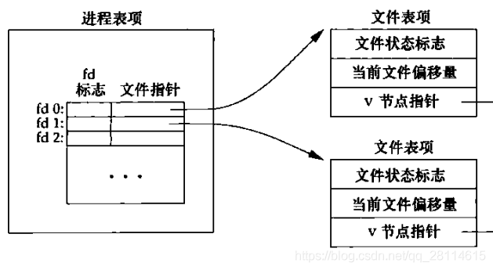
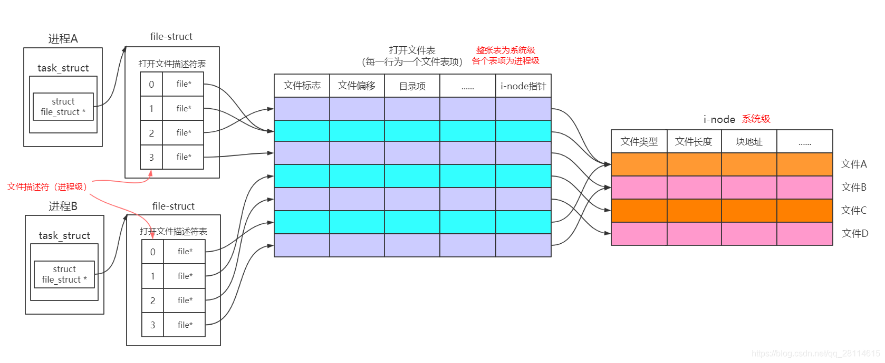

# 什么是文件描述符
## 简介

文件描述符在形式上是一个非负整数。实际上，它是一个索引值，指向内核为每一个进程所维护的该进程打开文件的记录表。当程序打开一个现有文件或者创建一个新文件时，内核向进程返回一个文件描述符。在程序设计程序设计)中，一些涉及底层的程序编写往往会围绕着文件描述符展开。但是文件描述符这一概念往往只适用于UNIX、Linux这样的操作系统。

每个Unix进程（除了可能的守护进程）应均有三个标准的POSIX文件描述符，对应于三个标准流：


| 整数值 |                          名称                           |   符号常量    | 文件流 |
| :----: | :-----------------------------------------------------: | :-----------: | :----: |
|   0    |  [Standard input](https://zh.wikipedia.org/wiki/Stdin)  | STDIN_FILENO  | stdin  |
|   1    | [Standard output](https://zh.wikipedia.org/wiki/Stdout) | STDOUT_FILENO | stdout |
|   2    | [Standard error](https://zh.wikipedia.org/wiki/Stderr)  | STDERR_FILENO | stderr |


文件描述符的优点主要有两个：

+ 基于文件描述符的I/O操作兼容POSIX标准。
+ 在UNIX、Linux的系统调用中，大量的系统调用都是依赖于文件描述符。

例如，下面的代码就示范了如何基于文件描述符来读取当前目录下的一个指定文件，并把文件内容打印至Console中。

```c
#include <stdio.h>
#include <stdlib.h>
#include <string.h>
#include <unistd.h>
#include <sys/types.h>
#include <sys/stat.h>
#include <fcntl.h>

int main (void){
    int fd;
    int numbytes;
    char path[] = "file";
    char buf[256];

    /*
     * O_CREAT:如果文件不存在则创建
     * O_RDONLY:以只读模式打开文件
     */
    fd = open(path, O_CREAT | O_RDONLY, 0644);
    if(fd < 0){
        perror("open()");
        exit(EXIT_FAILURE);
    }

    memset(buf, 0x00, 256);
    while((numbytes = read(fd, buf, 255)) > 0){
        printf("%d bytes read: %s", numbytes, buf);
        memset(buf, 0x00, 256);
    }
    close (fd);
    exit(EXIT_SUCCESS);
}
```


## 与文件描述符相关的操作

### 文件描述符的生成

+ open(), open64(), creat(), creat64()
+ socket()
+ socketpair()
+ pipe()

### 与单一文件描述符相关的操作

+ read(), write()
+ recv(), send()
+ recvmsg(), sendmsg()
+ sendfile()
+ lseek(), lseek64()
+ fstat(), fstat64()
+ fchmod()
+ fchown()

### 与复数文件描述符相关的操作
+ select(), pselect()
+ poll(),epoll()

### 与文件描述符表相关的操作
+ close()
+ dup()
+ dup2()
+ fcntl (F_DUPFD)
+ fcntl (F_GETFD and F_SETFD)

### 改变进程状态的操作
+ fchdir()
+ mmap()

### 与文件加锁的操作

+ flock()
+ fcntl (F_GETLK, F_SETLK and F_SETLKW)
+ lockf()

### 与套接字相关的操作
+ connect()
+ bind()
+ listen()
+ accept()
+ getsockname()
+ getpeername()
+ getsockopt(), setsockopt()
+ shutdown()


# 文件描述符的实现


**在内核中每一个打开的文件都需要由3种数据结构来进行维护**。

 根据文中内容，这三种数据结构分别为：

1. 进程级：每个进程对应一张**打开文件描述符表，**这是**进程级**数据结构，也就是每一个进程都各自有这样一个数据结构；

2. 内核级：内核维持一张**打开文件表，文件表由多个文件表项组成，**这是**系统级**数据结构，也就是说这样的数据结构是针对于整个内核而言的，每个进程都可共享的；

3. 系统级：每个打开的文件对应一个**i节点（i-node）**数据结构（Linux下只有i节点没有v节点），由于这是每一个打开的文件与之对应的，因此这也是一个**系统级**数据结构，存在于内核中，非进程所独有。

那么，这三种数据结构到底是什么呢？


## 文件描述符表

在Linux中，对于每一个进程，都会分配一个PCB数据结构，它其中包含了该进程的所有信息，而在代码实现上，这个数据结构名为**task_struct**，在linux源码的**include/linux/sched.h**中可以找到其定义，它是一个很庞大的结构体，部分定义如下：

```c
struct task_struct {
	......
	/* CPU-specific state of this task */
	struct thread_struct thread;
	/* filesystem information */
	struct fs_struct *fs;
	/* open file information */
	struct files_struct *files;  // 注意这个
	/* namespaces */
	struct nsproxy *nsproxy;
	/* signal handlers */
	struct signal_struct *signal;
	struct sighand_struct *sighand;
	......
};
```


 在**task_struct**中，有一个成员变量名为**files**，注释中提到这是一个描述打开文件信息的变量，其类型为**struct files_struct \***，那么现在再接着看**files_struct**，在linux源码的**include/linux/fdtable.h**中可以找到其定义，定义如下：


```c
struct files_struct {
	/*
   * read mostly part
   */
	atomic_t count;
	struct fdtable __rcu *fdt;
	struct fdtable fdtab;
	/*
   * written part on a separate cache line in SMP
   */
	spinlock_t file_lock ____cacheline_aligned_in_smp;
	int next_fd;
	struct embedded_fd_set close_on_exec_init;
	struct embedded_fd_set open_fds_init;
	struct file __rcu * fd_array[NR_OPEN_DEFAULT];
	//进程级打开文件描述符表
};
```


而这里所要找到的**打开文件描述符表**，实际上就是files_struct 中的成员**struct file \* fd_array[NR_OPEN_DEFAULT]**它是一个指针数组，数组每一个元素都是一个指向**file**类型的指针，可想而知，这些指针都会指向一个打开的文件，并且file这一数据结构就是用来描述一个打开的文件的，**而我们所说的文件描述符，实际上就是这个指针数组的索引。**这也是为什么文件描述符是非负整数。


## 文件表项

前面说了，每一个打开文件实际上就是用一个**file**结构体进行描述的，在linux源码的**include/linux/fs.h**中可以找到其定义，定义如下:

```c
struct file {
	/*
	 * fu_list becomes invalid after file_free is called and queued via
	 * fu_rcuhead for RCU freeing
	 */
	union {
		struct list_head	fu_list;
		struct rcu_head 	fu_rcuhead;
	}f_u;
	struct path		f_path;
	//文件路径，包括目录项以及i-node
	#define f_dentry	f_path.dentry
	#define f_vfsmnt	f_path.mnt
		const struct file_operations	*f_op;
	spinlock_t		f_lock;
	/* f_ep_links, f_flags, no IRQ */
	#ifdef CONFIG_SMP
		int			f_sb_list_cpu;
	#endif
		atomic_long_t		f_count;
	//文件打开次数
	unsigned int 		f_flags;
	//文件打开时的flag，对应于open函数的flag参数
	fmode_t			f_mode;
	//文件打开时的mode，对应于open函数的mode参数
	loff_t			f_pos;
	//文件偏移位置
	struct fown_struct	f_owner;
	const struct cred	*f_cred;
	struct file_ra_state	f_ra;
	u64			f_version;
	#ifdef CONFIG_SECURITY
		void			*f_security;
	#endif
	/* needed for tty driver, and maybe others */
	void			*private_data;
	#ifdef CONFIG_EPOLL
	/* Used by fs/eventpoll.c to link all the hooks to this file */
	struct list_head	f_ep_links;
	#endif 
	/* #ifdef CONFIG_EPOLL */
	struct address_space	*f_mapping;
	#ifdef CONFIG_DEBUG_WRITECOUNT
		unsigned long f_mnt_write_state;
	#endif
};
```


在file结构体中，不得不再说一下它的f_path成员，这是一个**struct path**类型的变量，该类型定义于**include/linux/path.h：**

```c
struct path {
	struct vfsmount *mnt;
	struct dentry *dentry;
};
```


 这里的dentry实际上就指向文件所在的**目录项**了，**struct dentry**的类型定义于**include/linux/dcache.h：**


```c
struct dentry {
	/* RCU lookup touched fields */
	unsigned int d_flags;
	/* protected by d_lock */
	seqcount_t d_seq;
	/* per dentry seqlock */
	struct hlist_bl_node d_hash;
	/* lookup hash list */
	struct dentry *d_parent;
	/* parent directory */
	struct qstr d_name;
	struct inode *d_inode; // 注意这个
	/* Where the name belongs to - NULL is
					 * negative */
	unsigned char d_iname[DNAME_INLINE_LEN];
	/* small names */
	/* Ref lookup also touches following */
	unsigned int d_count;
	/* protected by d_lock */
	spinlock_t d_lock;
	/* per dentry lock */
	const struct dentry_operations *d_op;
	struct super_block *d_sb;
	/* The root of the dentry tree */
	unsigned long d_time;
	/* used by d_revalidate */
	void *d_fsdata;
	/* fs-specific data */
	struct list_head d_lru;
	/* LRU list */
	/*
	 * d_child and d_rcu can share memory
	 */
	union {
		struct list_head d_child;
		/* child of parent list */
		struct rcu_head d_rcu;
	}d_u;
	struct list_head d_subdirs;
	/* our children */
	struct list_head d_alias;
	/* inode alias list */
};
```

在dentry结构体中，描述了根结点、父节点等等信息，尤其还要注意的是**struct inode \*d_inode**这一变量，它则是指向了一个**i-node**结点。


再回到file结构体中，有一个**struct file_operations \*f_op**变量，其类型定义在**include/linux/fs.h**中：

```c
struct file_operations {
	struct module *owner;
	loff_t (*llseek) (struct file *, loff_t, int);
	ssize_t (*read) (struct file *, char __user *, size_t, loff_t *);
	ssize_t (*write) (struct file *, const char __user *, size_t, loff_t *);
	ssize_t (*aio_read) (struct kiocb *, const struct iovec *, unsigned long, loff_t);
	ssize_t (*aio_write) (struct kiocb *, const struct iovec *, unsigned long, loff_t);
	int (*readdir) (struct file *, void *, filldir_t);
	unsigned int (*poll) (struct file *, struct poll_table_struct *);
	long (*unlocked_ioctl) (struct file *, unsigned int, unsigned long);
	long (*compat_ioctl) (struct file *, unsigned int, unsigned long);
	int (*mmap) (struct file *, struct vm_area_struct *);
	int (*open) (struct inode *, struct file *);
	int (*flush) (struct file *, fl_owner_t id);
	int (*release) (struct inode *, struct file *);
	int (*fsync) (struct file *, int datasync);
	int (*aio_fsync) (struct kiocb *, int datasync);
	int (*fasync) (int, struct file *, int);
	int (*lock) (struct file *, int, struct file_lock *);
	ssize_t (*sendpage) (struct file *, struct page *, int, size_t, loff_t *, int);
	unsigned long (*get_unmapped_area)(struct file *, unsigned long, unsigned long, unsigned long, unsigned long);
	int (*check_flags)(int);
	int (*flock) (struct file *, int, struct file_lock *);
	ssize_t (*splice_write)(struct pipe_inode_info *, struct file *, loff_t *, size_t, unsigned int);
	ssize_t (*splice_read)(struct file *, loff_t *, struct pipe_inode_info *, size_t, unsigned int);
	int (*setlease)(struct file *, long, struct file_lock **);
	long (*fallocate)(struct file *file, int mode, loff_t offset,
				  loff_t len);
};
```


可见，在该成员中包含了所有文件操作相关的函数指针。

每一个打开的文件都对应于一个file结构体，在该结构体中，f_flags描述了文件标志，f_pos描述了文件的偏移位置，而在f_path中有含有一个指向一个inode结点的指针。


因此可以知道，文件表项的数据结构就是file结构体，而在实际上内核中也并不存在这样一张文件表，只是每个打开的文件都对应一个file结构体，也就是一个文件表项，**打开文件描述符表struct file fd_array[NR_OPEN_DEFAULT]**数组中的每一项都会指向这样一个文件表项，如下图所示：





## Inode

第三种数据结构就是inode节点，在**include/linux/fs.h**中找到其定义如下：

```c
struct inode {
	/* RCU path lookup touches following: */
	umode_t			i_mode;
	//权限
	uid_t			i_uid;
	//用户id
	gid_t			i_gid;
	//组id
	const struct inode_operations	*i_op;
	struct super_block	*i_sb;
	spinlock_t		i_lock;
	/* i_blocks, i_bytes, maybe i_size */
	unsigned int		i_flags;
	struct mutex		i_mutex;
	unsigned long		i_state;
	unsigned long		dirtied_when;
	/* jiffies of first dirtying */
	struct hlist_node	i_hash;
	struct list_head	i_wb_list;
	/* backing dev IO list */
	struct list_head	i_lru;
	/* inode LRU list */
	struct list_head	i_sb_list;
	union {
		struct list_head	i_dentry;
		struct rcu_head		i_rcu;
	};
	unsigned long		i_ino;
	//inode节点号
	atomic_t		i_count;
	unsigned int		i_nlink;
	dev_t			i_rdev;
	unsigned int		i_blkbits;
	u64			i_version;
	loff_t			i_size;
	//文件大小
	#ifdef __NEED_I_SIZE_ORDERED
		seqcount_t		i_size_seqcount;
	#endif
		struct timespec		i_atime;
	//最后一次访问(access)的时间
	struct timespec		i_mtime;
	//最后一次修改(modify)的时间
	struct timespec		i_ctime;
	//最后一次改变(change)的时间
	blkcnt_t		i_blocks;
	//块数
	unsigned short          i_bytes;
	struct rw_semaphore	i_alloc_sem;
	const struct file_operations	*i_fop;
	/* former ->i_op->default_file_ops */
	struct file_lock	*i_flock;
	struct address_space	*i_mapping;
	//块地址映射
	struct address_space	i_data;
	#ifdef CONFIG_QUOTA
		struct dquot		*i_dquot[MAXQUOTAS];
	#endif
		struct list_head	i_devices;
	union {
		struct pipe_inode_info	*i_pipe;
		struct block_device	*i_bdev;
		struct cdev		*i_cdev;
	};
	__u32			i_generation;
	#ifdef CONFIG_FSNOTIFY
		__u32			i_fsnotify_mask;
	/* all events this inode cares about */
	struct hlist_head	i_fsnotify_marks;
	#endif
	#ifdef CONFIG_IMA
		atomic_t		i_readcount;
	/* struct files open RO */
	#endif
		atomic_t		i_writecount;
	#ifdef CONFIG_SECURITY
		void			*i_security;
	#endif
	#ifdef CONFIG_FS_POSIX_ACL
		struct posix_acl	*i_acl;
	struct posix_acl	*i_default_acl;
	#endif
		void			*i_private;
	/* fs or device private pointer */
};
```

 代码中只注释了一部分，通过inode结构，可以知道**文件数据块的在磁盘上的位置以及文件大小**等信息，这样才能使得**进程能够通过file结构体来找到磁盘上相应文件的位置**来进行文件读写。


 另外补充一点，关于inode结构体中的**struct inode_operations \*i_op**成员，其数据结构定义在**include/linux/fs.h**中：

```c
struct inode_operations {
	struct dentry * (*lookup) (struct inode *,struct dentry *, struct nameidata *);
	void * (*follow_link) (struct dentry *, struct nameidata *);
	int (*permission) (struct inode *, int, unsigned int);
	int (*check_acl)(struct inode *, int, unsigned int);
	int (*readlink) (struct dentry *, char __user *,int);
	void (*put_link) (struct dentry *, struct nameidata *, void *);
	int (*create) (struct inode *,struct dentry *,int, struct nameidata *);
	int (*link) (struct dentry *,struct inode *,struct dentry *);
	int (*unlink) (struct inode *,struct dentry *);
	int (*symlink) (struct inode *,struct dentry *,const char *);
	int (*mkdir) (struct inode *,struct dentry *,int);
	int (*rmdir) (struct inode *,struct dentry *);
	int (*mknod) (struct inode *,struct dentry *,int,dev_t);
	int (*rename) (struct inode *, struct dentry *,
				struct inode *, struct dentry *);
	void (*truncate) (struct inode *);
	int (*setattr) (struct dentry *, struct iattr *);
	int (*getattr) (struct vfsmount *mnt, struct dentry *, struct kstat *);
	int (*setxattr) (struct dentry *, const char *,const void *,size_t,int);
	ssize_t (*getxattr) (struct dentry *, const char *, void *, size_t);
	ssize_t (*listxattr) (struct dentry *, char *, size_t);
	int (*removexattr) (struct dentry *, const char *);
	void (*truncate_range)(struct inode *, loff_t, loff_t);
	int (*fiemap)(struct inode *, struct fiemap_extent_info *, u64 start,
			      u64 len);
}____cacheline_aligned;
```

 可见，在该成员变量所指向的数据结构中，包含了许多函数指针，这些函数指针大多针对于目录、文件操作。


## 总结


 进程、打开文件描述符表、文件表项和i-node结点关系如图所示。（暂时忽略进程中0、1和2号文件描述符分别默认为标准输入、标准输出和标准错误的情况）




通过以上分析，我们可以得出以下结论：

1. 每启动一个进程都会为其分配一个`task_struct`结构体，在task_struct结构体中含有一个`file_struct`结构体指针，其所指向的file_struct结构体中，含有一个file的指针数组`fd_array`,它就是**打开文件描述符表**，其中**每一个元素都指向一个文件表项**，这个**数组的索引就是文件描述符**。此外，file_struct结构体中的next_fd保存的是下一个分配的文件描述符，它会在调用open和close改变，最终使得每次open返回的都是当前可用的**最小文件描述符**；

2. 每次调用open或者create(内部实际上还是调用的open)，都会对新打开的文件分配一个file结构体，并且将打开文件的标志、状态、权限等信息填入这个file结构体中。**这个file结构体也叫文件表项**；

3. **磁盘中的每个文件都对应一个i-node**，**每一个文件表项都会指向一个文件的i-node**，**但是同一文件的i-node可以对应多个文件表项（**当多次调用open打开同一个文件时就会出现这种情况，不管是同一进程多次打开同一文件（如图中A进程的0号和2号文件描述符对应两个文件表项，但是最终指向同一i-node即同一文件），还是不同进程多次打开同一文件（如图中A进程3号文件描述符和B进程的3号文件描述符））；

4. **同一进程下的不同文件描述符是可以指向同一文件表项**，即最终指向同一文件**（如图中A进程的0号文件描述符和1号文件描述符，使用dup函数即可实现）。**

5. 子进程在创建时会拷贝父进程的打开文件描述符表，因此**父子进程是共享文件表项**的。而相互独立的不同进程的打开文件描述符表是相互独立的，因此相互独立的多个进程之间的文件描述符可以相同，但是不同进程的文件描述符是不能指向同一文件表项的（**除非这个文件描述符是从同一个祖先进程中继承得来的**），但是这并不妨碍不同进程访问同一文件（如第3点结论）；

6. 指向同一文件表项的不同文件描述符（不同进程相同数值的文件描述符也看做不同）共享文件标志、文件偏移等信息；

7. 每一个文件表项对应的file结构体中的`f_count`会记录通过该文件表项打开文件的次数，当`f_count`计数归0时这个文件表项才会被删除，因此，对于指向同一文件表项的两个不同文件描述符（如子进程所继承的父进程的文件描述符，或同一进程中dup的两个文件描述符指向同一个文件表项），即使其中一个文件描述符关闭了，只要仍然有文件描述符指向这个文件表项，那么就依然能通过这个文件表项访问文件，直到所有指向该文件表项的文件描述符都关闭了才不能再进行访问；


> 参考链接
>
> [文件描述符](https://zh.wikipedia.org/wiki/%E6%96%87%E4%BB%B6%E6%8F%8F%E8%BF%B0%E7%AC%A6)
>
> [Linux中文件描述符的理解](https://www.cnblogs.com/lwyeric/p/13598704.html)

