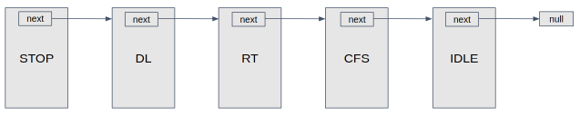
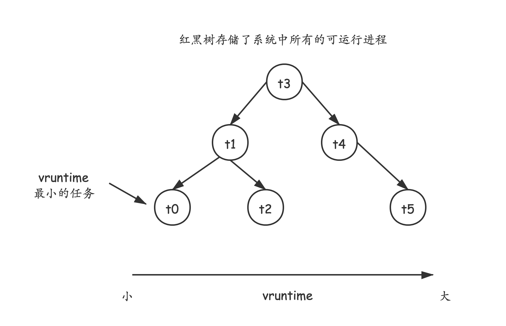

# Linux进程调度的顶层设计

进程的调度有多种算法。常见的有：

+ 先来先服务（FIFO）
+ 最短作业优先调度（Shortest-Job-First SJF）
+ 优先级调度（Priority-Scheduling）
+ 轮转调度（Round-Robin RR）

上述的调度算法在一般的操作系统教科书中都有讲解，不再赘述。

如何合理组织调度算法和调度类呢？


Linux 的进程调度器是以模块化的方式来提供的，这种模块化的结构称之为**调度器类**

## 调度类与调度策略 (Scheduling classes and policies)

**每一个调度器类都有一个优先级别，调度器会依次从最高的优先级别的调度器类中选择一个进程去执行。**

**不同优先级的调度器类中的进程的调度互不干扰，依次属于不同的调度梯队。**

进程调度的入口是函数`schedule()`,定义在`kernel/sched.c`中，其中它有一个关键的函数`pick_next_task()`

也就是挑选下一个可以执行的进程（task）。


伪代码如下：

```c
pick_next_task {
   scheduling_class = sched_class_highest; // 这是用链表组织起来的 调度器类，优先级别从高到低
   for(;;) {
       p = scheduling_class->pick_next_task; // 从当前最高级别的调度器类中选择一个任务执行，
       if(p) { // 如果不为空，直接返回
           return p;
       }
       // 如果为空，说明此级别的调度器类已经没有可执行的任务了，那就去看次优先的调度器类
       scheduling_class = scheduling_class->next;
   }
}
```

> Linux kernel每当需要挑选一个新的task在某个local CPU上运行的时候，就会调用schedule()函数，进而调到pick_next_task()来找到合适的next task。pick_next_task()会利用for_each_class()宏来遍历调度类别链表，先找到有task想要运行的最高优先级的调度类别。等找到task之后，就会返回给函数调用者，让这个task在local CPU上运行。在Idle class里面总是会有一个task的，所以如果没有任何其他task要运行了，就直接执行Idle class里的这个task即可。


**linux实现了很多种"scheduling class"（调度类别），每个class都可以包含一些调度策略。**

调度类以及其拥有的调度策略如下，优先级别从低到高：

1. **Stop** schedulding class
   - 无实现的调度策略
2. **Deadline** scheduling class
   - SCHED_DEADLINE

3. **Realtime** scheduling class
   - SCHED_FIFO
   - SCHED_RR

4. **Completely fair** scheduling class
   - SCHED_NORMAL
   - SCHEDULE_BATCH
   - SCHED_IDLE
5. **Idle** scheduling class
   - 无实现的调度策略

下面做一点详细讲解。


+ **Stop** schedulding class是一个特殊的类别，只在kernel内部使用。其实并没有实现任何针对它的调度策略，也不会有任何用户进程采用这种调度类别。Stop class其实是用作一种强制CPU把手头其他任何工作都停下来从而执行某种特殊任务的机制。因为这是最高优先级的class，因此可以抢占任何其他类别，却不会被任何其他任务抢占。一般是一个CPU想要把另一个CPU停下来执行某些特定功能的时候使用，因此只有SMP系统里才有。Stop class会创建一个per-CPU的内核线程（kthread），名为migration/N，这里N就是CPU编号。这个类别主要用在kernel的task migration, CPU hotplug, RCU, ftrace, clock event等场景。

+ **Deadline** scheduling class只制定了唯一一条调度策略，名为SCHED_DEADLINE，它用在系统里最高优先级的用户进程上。主要是针对那些有明确截止时间的任务，例如视频编码、解码任务。在这种调度策略之下，截止时间最近的任务拥有最高优先级。可以使用sched_setattr()系统调用来把某个进程设置为SCHED_DEADLINE调度策略，同时需要传递三个参数进去：运行时间，截止时间，周期。

+ **Realtime (简称RT) scheduling class**，**主要用在一些耗时很短、对延迟很敏感的task之上**，例如IRQ thread。这是一个拥有固定优先级的类别，高优先级的task都会在低优先级的task之前调度。这个类别里实现了两种调度策略：SCHED_FIFO和SCHED_RR。SCHED_FIFO策略会让一个task持续运行直到它放弃占用CPU，例如它block在某个资源上，或者完成了执行。而SCHED_RR（round robin）策略则会对task持续执行的一个时间片限制最大值，如果task持续占用CPU超过这个时长，仍然没有block住（也就是仍然期望继续占用CPU），调度器就会把它放到拥有相同优先级的round-robin队列的尾部，并换一个task进来执行。这些采用实时策略的task可以使用1（最低）到99（最高）的优先级。

+ **CFS** （completely fair scheduling）class则**包含了绝大多数的用户进程**。CFS实现了三类调度策略：SCHED_NORMAL，SCHEDULE_BATCH，SCHED_IDLE。采用这三者之中任意一种策略的话，进程就只有在没有任何deadline和realtime class的进程在等待执行的情况下才有机会被调度到（当然缺省来说调度器其实保留了5%的CPU时间专用于CFS task）。scheduler会跟踪各个task的vruntime (virtual runtime)，包括那些runnable和blocked状态下的task。一个task的vrtuntime越小，它就越应该优先占用处理器的时间。相应地，CFS会把这些vruntime很低的进程向调度队列的前端移动。
  **这也是本篇文章的重点。**

  **SCHED_NORMAL调度策略（在user space的名字叫做SCHED_OTHER）是用在Linux环境里运行的绝大多数task上的**，例如shell。SCHED_BATCH调度策略则主要用在那些非交互式的任务所需要的批量处理上面，通常这些任务执行中需要一段时间不被打断，因此通常都会在完成所有SCHED_NORMAL工作之后再进行调度切换。SCHED_IDLE调度策略则专用于系统里的低优先级task，他们仅在系统里没有什么需要运行的时候才会执行。尽管实际上说哪怕有其他一些SCHED_NORMAL task，其实SCHED_IDLE task还是会分到一些时间运行的（对于一个nice值为0的task来说大概会有1.4%的时间）。这个调度策略目前用到的很少，有人在试着改进它的工作方式。

+ **Idle** scheduling class（不要跟SCHED_IDLE的调度策略弄混了）。这是最低优先级的调度类别。就跟Stop class类似，Idle class其实不会用在任何用户进程之上，因此并没有实现什么调度策略。它其实仅仅是用在名为swapper/N（N是CPU序号）的一系列per-CPU kthread上。这些kthreads也被称为"idle thread"，用户空间是看不到的。这些线程负责让系统更加省电，主要是通过在没什么事情要做的时候把CPU放到一些deep idle状态来做到的。


在kernel代码里面，scheduling class是用struct sched_class来代表的：

```c
struct sched_class {
const struct sched_class *next;
void (*enqueue_task) (struct rq *rq, struct task_struct *p, int flags);
void (*dequeue_task) (struct rq *rq, struct task_struct *p, int flags);
struct task_struct *(*pick_next_task) (struct rq *rq, struct task_struct *prev, 
		    struct rq_flags *rf);
/* many fields omitted */
};
```

这个结构里主要放了一些指向class相关实现的函数指针（回调函数），供scheduler core调用，从而能让scheduler核心代码不用包含任何class相关的代码。这些调度类别放在一个按照优先级排序的单项链表里面，第一项是Stop scheduling class（最高优先级），最后一项是Idle class（最低优先级）。





# CFS（普通进程的调度类）

## 设计理念

CFS——完全公平调度，关于的详细的解析这里就不展开来讲了，可以参看《Linux Kernel Development》这本书，这里只调出关于它的一些设计的关键之处，优秀的调度理念来讲。


CFS的出发点基于一个简单的理念：进程调度的效果应该如果系统具备一个理想的完美多任务处理器。在这种系统中，**每个进程都能获得 1/n 的处理器时间**，n 指可运行的进程数。
同时，在任何可度量时间内，每个进程都可以得到相同多的运行时间。
当然上述的是理想的模型，实现中当然有贴合实际的处理。

CFS的做法是: **允许每个进程运行一段时间，循环轮转，选择运行最少时间（实际上是虚拟的运行时间）的进程**。

## 关键问题


1. **时间片的长度如何分配？**
    **CFS并没有像RR一样固定的分配一个时间片，也不是根据进程的优先级分配长度不一的时间片。而是根据系统当时的负载情况，为每一个任务分配一个比例的CPU处理时间。**具体的，CFS没有使用离散的时间片，而是采用**目标延迟**（target latency），这是每个可执行任务应当运行一次的时间间隔。
    
    **根据目标延迟，按比例分配CPU时间。**
    
    
    
    当然，这个目标延迟有一个默认值、最小值，当然随着系统负载的提高，这个目标延迟还可以延长。
    
    

2. **优先级如何影响调度？**

    CFS没有直接分配优先级（对于普通进程而言）。它通过每个任务的**虚拟运行时间（vruntime）**，进而每个任务运行多久，虚拟运行时间和基于**优先级（nice值）**的衰减因子有关。

    进程的优先级是通过对它的nice值（取值范围-20到+19）加上120而得到的。

    进程的优先级主要是用来调整进程的权重（weight，会影响vruntime增加速率）的，进而会影响到进程的vruntime。**nice值越低，优先级就越高**。task的权重因此也会更加高一些，相应的vruntime则会在task执行时增长得更加缓慢。

  

3. **如何调度IO密集型、CPU密集型任务？**

   首先，IO密集型任务需要更频繁的调度，但是每次需要的CPU时间片很短；而CPU密集型任务需要相对更长的时间片，但是调度频率可以较低。
   
   如何解决？显然IO型任务的**vruntime**是比较低的（假定nice值都相同），所以它因为vruntime很小，很快可以得到再次调度，而CPU密集型任务只要得到处理器资源，就可以用完分配给它的时间片。
   
   所以，IO型任务的vruntime总是偏小，所以”优先级“比CPU型任务更高，总是可以得到及时调度。
   
   **不过，精妙的是，这样的优先级既不是用户显式指定的，也不是os通过某种方式动态调整，完全是根据进程的自身的行为动态调整的。**


4. **可运行的进程以何种数据结构组织？**
在CFS调度类中，所有可执行的任务都放置在红黑树中，键值正是 **vruntime**，如下图。


当进程从可执态到阻塞态时，会从红黑树中删除，当再次可调度的时候，又会加入红黑树。


# 实时进程的调度类

实时进程的调度类优先级比CFS调度类要高。

Linux提供两种实时调度策略，FIFO和RR。关于这两种调度策略比较简单，教科书上也都有就不讲了。


# 与调度相关的系统调用

## chrt

```shell
chrt --help
```

```shell
songyangji@SongyangJi-Ubuntu-DeskStop:~$ chrt --help
显示或更改某个进程的实时调度属性。

设置策略：
 chrt [选项] <优先级> <命令> [<参数>...]
 chrt [选项] --pid <优先级> <pid>

获取策略
 chrt [选项] -p <pid>

策略选项：
 -b, --batch          将策略设置为 SCHED_BATCH
 -d, --deadline       将策略设置为 SCHED_DEADLINE
 -f, --fifo           将策略设置为 SCHED_FIFO
 -i, --idle           将策略设置为 SCHED_IDLE
 -o, --other          将策略设置为 SCHED_OTHER
 -r, --rr             将策略设置为 SCHED_RR (默认)

调度选项：
 -R, --reset-on-fork       为 FIFO 或 RR 设置 SCHED_RESET_ON_FORK
 -T, --sched-runtime <ns>  DEADLINE 的运行时参数
 -P, --sched-period <ns>  DEADLINE 的周期参数
 -D, --sched-deadline <ns> DEADLINE 的截止时间参数

其他选项：
 -a, --all-tasks      对指定 pid 的所有任务(线程) 操作
 -m, --max            显示最小和最大有效优先级
 -p, --pid            对指定且存在的 pid 操作
 -v, --verbose        显示状态信息

 -h, --help           display this help
 -V, --version        display version

```


查询各调度策略的优先级：

```shell
songyangji@SongyangJi-Ubuntu-DeskStop:~$ chrt -m
SCHED_OTHER 最小/最大优先级	: 0/0
SCHED_FIFO 最小/最大优先级	: 1/99
SCHED_RR 最小/最大优先级	: 1/99
SCHED_BATCH 最小/最大优先级	: 0/0
SCHED_IDLE 最小/最大优先级	: 0/0
SCHED_DEADLINE 最小/最大优先级	: 0/0
songyangji@SongyangJi-Ubuntu-DeskStop:~$ 
```


## taskset

**CPU 亲和性**是一个调度程序属性，它将进程“绑定”到系统上的一组给定 CPU。

通过 `taskset` 命令可将某个进程与某个CPU核心绑定，使得其仅在与之绑定的CPU核心上运行。

不过需要注意的是，这只能此进程绑定到某个cpu核心上，但不是说这个cpu核心只能被这个进程使用，其他进程可以正常使用。(`cpuset`可以，不过我们可以在自己的程序中控制cpu核心池的调度)


功能:显示或更改某个进程的 CPU 亲和力。

用法：

```
taskset [选项] [掩码 | cpu列表] [pid|命令 [参数...]]
```


例如，指定某个进程在cpu核心号为0、1上运行:

```shell
taskset -c 0,1 {shell_cmd}
```


# 参考资料

> 《Operating System Concepts》
>
> 《Linux Kernel Development》
>
> [Fixing SCHED_IDLE](https://lwn.net/Articles/805317/)

