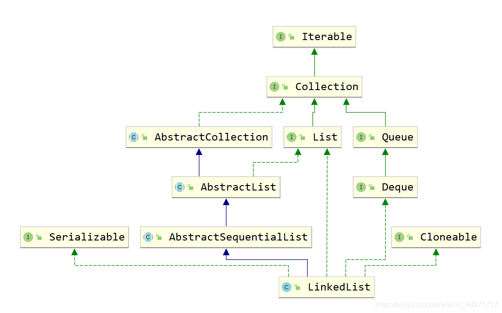
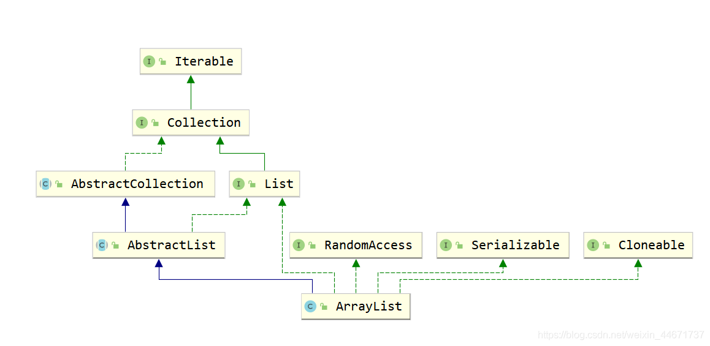
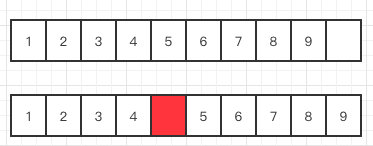

> 系列的其他文章：
>
> [Java集合类](http://47.117.127.179/categories/Java%E9%9B%86%E5%90%88%E7%B1%BB/)


# 总结

## LinkedList

### 继承关系


可见LinkedList既是List接口的实现也是Queue的实现（Deque），故其和ArrayList相比LinkedList支持的功能更多，其可视作队列来使用。



### 数据结构

也很简单，和我们自己实现的链表没什么差异。

为什么都被标记为`transient`呢 ？因为序列化以及反序列话的时候不需要真实的序列化Node节点，只需要序列化存储的真实的元素即可，然后反序列化的时候在new出Node节点。

```java
    transient int size = 0;
  	// 头尾节点
  	// 在列表空的时候，都为 null
    transient Node<E> first; // 链表头
    transient Node<E> last;  // 链表尾
    
    private static class Node<E> {
        E item;       // 真实元素
        Node<E> next; // 后继
        Node<E> prev; // 前驱

        Node(Node<E> prev, E element, Node<E> next) {
            this.item = element;
            this.next = next;
            this.prev = prev;
        }
    }
```

值得一提的是，jdk实现中并没有使用一个始终存在的哑巴节点。


### 构造函数

这个构造函数没什么可说的。


### 操作的时间复杂度


无论是get还是set等等，都是先查询对应的node，然后对它进行操作。

根据index要么从前面开始，要么从后面开始遍历链表。

```java
    // 根据下标返回Node, 这是链表使用下标访问的基本方法。
    Node<E> node(int index) {
        // assert isElementIndex(index);

        // 根据位置，从头或者从尾开始查找
        if (index < (size >> 1)) {
            Node<E> x = first;
            for (int i = 0; i < index; i++)
                x = x.next;
            return x;
        } else {
            Node<E> x = last;
            for (int i = size - 1; i > index; i--)
                x = x.prev;
            return x;
        }
    }

```

时间复杂度：O(n)。

所以说，**LinkedList不适合随机读取，而时候在靠近头和尾的地方进行添加和删除（这是它最擅长的地方，所以用它来实现Deque很适合）**。


#### 查

很简单。

```java
public E get(int index) {
    checkElementIndex(index);
    return node(index).item;
}
```

#### 改

和上面是一样的。

```java
public E set(int index, E element) {
    checkElementIndex(index);
    Node<E> x = node(index);
    E oldVal = x.item;
    x.item = element;
    return oldVal;
}
```

#### 增

```java
public void add(int index, E element) {
    checkPositionIndex(index);

    if (index == size)
        linkLast(element);
    else
        linkBefore(element, node(index));
}
```

注意，如果不是靠近头尾的添加元素，虽然避免了在数组中移动元素，但是`node(index)`的开销仍然是O(n)的。


#### 删

```java
public E remove(int index) {
    checkElementIndex(index);
    return unlink(node(index));
}
```

调用了`unlink`方法。

```java
E unlink(Node<E> x) {
    // assert x != null;
    final E element = x.item;
    final Node<E> next = x.next; // 拿到后继
    final Node<E> prev = x.prev; // 拿到前驱

    if (prev == null) {
        first = next;
    } else {
        prev.next = next;
        x.prev = null; // help GC
    }

    if (next == null) {
        last = prev;
    } else {
        next.prev = prev;
        x.next = null; // help GC
    }

    x.item = null; // help GC
    size--;
    modCount++;
    return element;
}
```

也很简单。


## ArrayList

### 继承关系


如下图，`ArrayList`实现类List接口，注意其中有一个`RandomAccess`接口表明ArrayList支持随机访问。



可见LinkedList既是List接口的实现也是Queue的实现（Deque），故其和ArrayList相比LinkedList支持的功能更多，其可视作队列来使用。


### 数据结构

很简单，和我们自己实现的vector啊之类的一样，数组保存真实结构，size保存个数。

```java
    // 存储真实元素的数组缓冲区（这个数组的length也就是ArrayList的capacity）
    // 注意它被 transient 修饰, 在序列化/反序列化的时候，需要手动处理数据的序列化 
    // 而且注意到，这里不是泛型数组，因为处理泛型数组不方便, 比如上面的 EMPTY_ELEMENTDATA
    transient Object[] elementData; // non-private to simplify nested class access

    // 存储的元素的个数
    private int size;
```

### 构造函数

默认情况下，会初始化为`DEFAULTCAPACITY_EMPTY_ELEMENTDATA`，特点是一开始数组不占空间（当然除了数组对象本身占的空间），然后在第一次添加元素的时候一下子扩容到10。

那为什么又可以指定`initialCapacity`呢？

这是因为可以让程序员自己根据自己要处理数据的规模，提前一次性分配数组，防止反复扩容带来的性能开销。


```java
// 带初始化容量的构造器
public ArrayList(int initialCapacity) {
    if (initialCapacity > 0) {
        this.elementData = new Object[initialCapacity];
    // 可以显式的设置为0
    } else if (initialCapacity == 0) {
        this.elementData = EMPTY_ELEMENTDATA;
    } else {
        throw new IllegalArgumentException("Illegal Capacity: "+
                                           initialCapacity);
    }
}

// 默认的初始化容量为 10, 但是为了防止空间浪费,所以在第一次添加元素的时才夸大容量至10
public ArrayList() {
    this.elementData = DEFAULTCAPACITY_EMPTY_ELEMENTDATA;
}
```


### 操作的时间复杂度

数据结构无外乎增删改查，依次来看就好。

#### 查


检查下标的合法性，取出元素强转即可，很简单。

时间复杂度O(1)。

```java
   @SuppressWarnings("unchecked")
    E elementData(int index) {
        return (E) elementData[index];
    }

    // getter
    public E get(int index) {
        rangeCheck(index);
        return elementData(index);
    }
```


#### 改

和上面一样的。

```java
  // setter
    public E set(int index, E element) {
        rangeCheck(index);

        E oldValue = elementData(index);
        elementData[index] = element;
        return oldValue;
    }
```


#### 增


分两种情况。

**直接添加**

很简单，数组末尾加一个元素即可。

时间复杂度：O(1)

其中`ensureCapacityInternal`是一个和扩容有关的函数，后面还会详解。

```java
// add元素，可能需要扩容
public boolean add(E e) {
    ensureCapacityInternal(size + 1);  // Increments modCount!!
    elementData[size++] = e;
    return true;
}
```


**在数组中间添加**

先将后面的元素挪一下，然后set元素。




时间复杂度：O(n)，（小心使用，尤其在做算法题时）

```java
// 批量移动
public void add(int index, E element) {
    rangeCheckForAdd(index);

    ensureCapacityInternal(size + 1);  // Increments modCount!!
    System.arraycopy(elementData, index, elementData, index + 1,
                     size - index);
    elementData[index] = element;
    size++;
}
```

注意使用这个native的方法移动数组元素而不是自己写java代码（内部实现更快）。

```java
public static native void arraycopy(Object src,  int  srcPos,
                                    Object dest, int destPos,
                                    int length);
```


#### 删

这个逻辑和上面也是类似的。

```java
    public E remove(int index) {
        rangeCheck(index);

        modCount++;
        E oldValue = elementData(index);

        int numMoved = size - index - 1;
        if (numMoved > 0)
            System.arraycopy(elementData, index+1, elementData, index,
                             numMoved);
        elementData[--size] = null; // clear to let GC do its work

        return oldValue;
    }
```

时间复杂度：O(n)


### 扩容机制

关于扩容，有这么几个方法`ensureCapacityInternal`,`calculateCapacity`,`ensureExplicitCapacity`,`grow`,

`hugeCapacity`。

不过最核心的扩容方法是`grow`：

```java
    // 扩容的核心函数
    private void grow(int minCapacity) {
        // overflow-conscious code
        int oldCapacity = elementData.length;
        // 每次至少扩容至 1.5倍，所以不会出现每次 add 操作都要扩容复制的情况
        int newCapacity = oldCapacity + (oldCapacity >> 1);
        if (newCapacity - minCapacity < 0)
            newCapacity = minCapacity;
        // 此时1.5*oldCapacity 已超过 MAX_ARRAY_SIZE
        if (newCapacity - MAX_ARRAY_SIZE > 0)
            newCapacity = hugeCapacity(minCapacity);
        // minCapacity is usually close to size, so this is a win:
        elementData = Arrays.copyOf(elementData, newCapacity); // 每一次扩容都会复制原来的数组，开销很大
    }
```


那么反复添加元素导致数组扩容之后又去删除元素导致数组大量闲置空间怎么办，

有这么个方法，`trimToSize()`

```java
// 将 elementData 的大小缩小至 size，以节省空间
public void trimToSize() {
    modCount++;
    if (size < elementData.length) {
        elementData = (size == 0)
          ? EMPTY_ELEMENTDATA
          : Arrays.copyOf(elementData, size);
    }
}
```

不过需要注意的是，这个方法内部从未调用（原因也很好理解，要是每次remove之后都去trimsize然后又add扩容不是反复横跳了吗），所以此方法只供程序员自己显式调用。


# 源码要点
## 关于GC
```java
    /**
     * Removes all of the elements from this list.
     * The list will be empty after this call returns.
     */
    public void clear() {
        // Clearing all of the links between nodes is "unnecessary", but:
        // - helps a generational GC if the discarded nodes inhabit
        //   more than one generation
        // - is sure to free memory even if there is a reachable Iterator
        for (Node<E> x = first; x != null; ) {
            Node<E> next = x.next;
            x.item = null;
            x.next = null;
            x.prev = null;
            x = next;
        }
        first = last = null;
        size = 0;
        modCount++;
    }
```

```java
    public void clear() {
        modCount++;

        // clear to let GC do its work
        for (int i = 0; i < size; i++)
            elementData[i] = null;

        size = 0;
    }
```
## 序列化/反序列化

### LinkedList的序列化实现 

```java

    private void writeObject(java.io.ObjectOutputStream s)
        throws java.io.IOException {
        // Write out any hidden serialization magic
        s.defaultWriteObject();

        // Write out size
        s.writeInt(size);

        // Write out all elements in the proper order.
        for (Node<E> x = first; x != null; x = x.next)
            s.writeObject(x.item);
    }


    @SuppressWarnings("unchecked")
    private void readObject(java.io.ObjectInputStream s)
        throws java.io.IOException, ClassNotFoundException {
        // Read in any hidden serialization magic
        s.defaultReadObject();

        // Read in size
        int size = s.readInt();

        // Read in all elements in the proper order.
        for (int i = 0; i < size; i++)
            linkLast((E)s.readObject());
    }
```

### ArrayList的序列化实现 

```java
    private void writeObject(java.io.ObjectOutputStream s)
        throws java.io.IOException{
        // Write out element count, and any hidden stuff
        int expectedModCount = modCount;
        s.defaultWriteObject();

        // Write out size as capacity for behavioural compatibility with clone()
        s.writeInt(size);

        // Write out all elements in the proper order.
        for (int i=0; i<size; i++) {
            s.writeObject(elementData[i]);
        }

        if (modCount != expectedModCount) {
            throw new ConcurrentModificationException();
        }
    }


    private void readObject(java.io.ObjectInputStream s)
        throws java.io.IOException, ClassNotFoundException {
        elementData = EMPTY_ELEMENTDATA;

        // Read in size, and any hidden stuff
        s.defaultReadObject();

        // Read in capacity
        s.readInt(); // ignored

        if (size > 0) {
            // be like clone(), allocate array based upon size not capacity
            int capacity = calculateCapacity(elementData, size);
            SharedSecrets.getJavaOISAccess().checkArray(s, Object[].class, capacity);
            ensureCapacityInternal(size);

            Object[] a = elementData;
            // Read in all elements in the proper order.
            for (int i=0; i<size; i++) {
                a[i] = s.readObject();
            }
        }
    }
```

## 迭代器实现

### LinkedList的迭代器实现
```java
// 省略了一些方法
private class ListItr implements ListIterator<E> {
        private Node<E> lastReturned;
        private Node<E> next;
        private int nextIndex;
        private int expectedModCount = modCount;

        ListItr(int index) {
            // assert isPositionIndex(index);
            next = (index == size) ? null : node(index);
            nextIndex = index;
        }

        public boolean hasNext() {
            return nextIndex < size;
        }

        public E next() {
            checkForComodification();
            if (!hasNext())
                throw new NoSuchElementException();

            lastReturned = next;
            next = next.next;
            nextIndex++;
            return lastReturned.item;
        }

        public void remove() {
            checkForComodification();
            if (lastReturned == null)
                throw new IllegalStateException();

            Node<E> lastNext = lastReturned.next;
            unlink(lastReturned);
            if (next == lastReturned)
                next = lastNext;
            else
                nextIndex--;
            lastReturned = null;
            expectedModCount++;
        }

        final void checkForComodification() {
            if (modCount != expectedModCount)
                throw new ConcurrentModificationException();
        }
    }
```

### ArrayList的迭代器实现
```java
    // 返回迭代器
    public Iterator<E> iterator() {
        return new Itr();
    }


    private class Itr implements Iterator<E> {
        int cursor;       // index of next element to return
        int lastRet = -1; // index of last element returned; -1 if no such
        int expectedModCount = modCount;

        Itr() {}

        public boolean hasNext() {
            return cursor != size;
        }

        @SuppressWarnings("unchecked")
        public E next() {
            checkForComodification();
            int i = cursor;
            if (i >= size)
                throw new NoSuchElementException();
            Object[] elementData = ArrayList.this.elementData;
            if (i >= elementData.length)
                throw new ConcurrentModificationException();
            cursor = i + 1;
            return (E) elementData[lastRet = i];
        }

        public void remove() {
            if (lastRet < 0)
                throw new IllegalStateException();
            checkForComodification(); // remove 操作会检查mod-count以支持支持fast-fail机制

            try {
                ArrayList.this.remove(lastRet);
                cursor = lastRet;
                lastRet = -1;
                expectedModCount = modCount;
            } catch (IndexOutOfBoundsException ex) {
                throw new ConcurrentModificationException();
            }
        }
        
        // modCount 计数器检查，支持 fail-fast 机制
        final void checkForComodification() {
            if (modCount != expectedModCount)
                throw new ConcurrentModificationException();
        }
    }
```


# 源码阅读笔记
## LinkedList

```java
package java.util;

// 实现了 List 接口、Deque接口
public class LinkedList<E>
    extends AbstractSequentialList<E>
    implements List<E>, Deque<E>, Cloneable, java.io.Serializable
{
  	
    transient int size = 0;
  	// 头尾节点
  	// 在列表空的时候，都为 null
    transient Node<E> first;
    transient Node<E> last;

 	
    public LinkedList() {
    }
  	// 用一个集合初始化LinkedList
    public LinkedList(Collection<? extends E> c) {
        this();
        addAll(c);
    }

		// 将 e 插入表头
    private void linkFirst(E e) {
        final Node<E> f = first;
        final Node<E> newNode = new Node<>(null, e, f);
        first = newNode;
        if (f == null) // 此时 first,last 都为 null
            last = newNode;
        else
            f.prev = newNode;
        size++;
        modCount++;
    }

    // 将 e 插入表尾
    void linkLast(E e) {
        final Node<E> l = last;
        final Node<E> newNode = new Node<>(l, e, null);
        last = newNode;
        if (l == null)
            first = newNode;
        else
            l.next = newNode;
        size++;
        modCount++;
    }

    // 将元素 e 插入非null节点之前
    void linkBefore(E e, Node<E> succ) {
        // assert succ != null;
        final Node<E> pred = succ.prev;
        final Node<E> newNode = new Node<>(pred, e, succ);
        succ.prev = newNode;
        if (pred == null)
            first = newNode;
        else
            pred.next = newNode;
        size++;
        modCount++;
    }

   	// 移除首节点
    private E unlinkFirst(Node<E> f) {
        // assert f == first && f != null;
        final E element = f.item;
        final Node<E> next = f.next;
        f.item = null;
        f.next = null; // help GC
        first = next;
        if (next == null)
            last = null;
        else
            next.prev = null;
        size--;
        modCount++;
        return element;
    }

   	// 移除尾节点
    private E unlinkLast(Node<E> l) {
        // assert l == last && l != null;
        final E element = l.item;
        final Node<E> prev = l.prev;
        l.item = null;
        l.prev = null; // help GC
        last = prev;
        if (prev == null)
            first = null;
        else
            prev.next = null;
        size--;
        modCount++;
        return element;
    }

    // 移除中间节点
    E unlink(Node<E> x) {
        // assert x != null;
        final E element = x.item;
        final Node<E> next = x.next;
        final Node<E> prev = x.prev;

        if (prev == null) {
            first = next;
        } else {
            prev.next = next;
            x.prev = null;
        }

        if (next == null) {
            last = prev;
        } else {
            next.prev = prev;
            x.next = null;
        }

        x.item = null;
        size--;
        modCount++;
        return element;
    }

  
    public E getFirst() {
        final Node<E> f = first;
        if (f == null)
            throw new NoSuchElementException();
        return f.item;
    }

   
    public E getLast() {
        final Node<E> l = last;
        if (l == null)
            throw new NoSuchElementException();
        return l.item;
    }


    public E removeFirst() {
        final Node<E> f = first;
        if (f == null)
            throw new NoSuchElementException();
        return unlinkFirst(f);
    }


    public E removeLast() {
        final Node<E> l = last;
        if (l == null)
            throw new NoSuchElementException();
        return unlinkLast(l);
    }

   
    public void addFirst(E e) {
        linkFirst(e);
    }

 
    public void addLast(E e) {
        linkLast(e);
    }

  
    public boolean contains(Object o) {
        return indexOf(o) != -1;
    }


    public int size() {
        return size;
    }

   
    public boolean add(E e) {
        linkLast(e);
        return true;
    }

    // 遍历链表删除equals o 的节点
    public boolean remove(Object o) {
        if (o == null) {
            for (Node<E> x = first; x != null; x = x.next) {
                if (x.item == null) {
                    unlink(x);
                    return true;
                }
            }
        } else {
            for (Node<E> x = first; x != null; x = x.next) {
                if (o.equals(x.item)) {
                    unlink(x);
                    return true;
                }
            }
        }
        return false;
    }


    public boolean addAll(Collection<? extends E> c) {
        return addAll(size, c);
    }

    // 通过Collection的toArray方法，将 c 包含的元素加入链表
    public boolean addAll(int index, Collection<? extends E> c) {
        checkPositionIndex(index);

        Object[] a = c.toArray();
        int numNew = a.length;
        if (numNew == 0)
            return false;

        Node<E> pred, succ;
        if (index == size) {
            succ = null;
            pred = last;
        } else {
            succ = node(index);
            pred = succ.prev;
        }

        for (Object o : a) {
            @SuppressWarnings("unchecked") E e = (E) o;
            Node<E> newNode = new Node<>(pred, e, null);
            if (pred == null)
                first = newNode;
            else
                pred.next = newNode;
            pred = newNode;
        }

        if (succ == null) {
            last = pred;
        } else {
            pred.next = succ;
            succ.prev = pred;
        }

        size += numNew;
        modCount++;
        return true;
    }

    /**
     * Removes all of the elements from this list.
     * The list will be empty after this call returns.
     */
    public void clear() {
        // Clearing all of the links between nodes is "unnecessary", but:
        // - helps a generational GC if the discarded nodes inhabit
        //   more than one generation
        // - is sure to free memory even if there is a reachable Iterator
        for (Node<E> x = first; x != null; ) {
            Node<E> next = x.next;
            x.item = null;
            x.next = null;
            x.prev = null;
            x = next;
        }
        first = last = null;
        size = 0;
        modCount++;
    }


    // 基于位置的随机访问，依赖 node(int index)方法


    public E get(int index) {
        checkElementIndex(index);
        return node(index).item;
    }


    public E set(int index, E element) {
        checkElementIndex(index);
        Node<E> x = node(index);
        E oldVal = x.item;
        x.item = element;
        return oldVal;
    }


    public void add(int index, E element) {
        checkPositionIndex(index);

        if (index == size)
            linkLast(element);
        else
            linkBefore(element, node(index));
    }


    public E remove(int index) {
        checkElementIndex(index);
        return unlink(node(index));
    }

    // 元素的合法下标
    private boolean isElementIndex(int index) {
        return index >= 0 && index < size;
    }

    // 操作位置的合法下标
    private boolean isPositionIndex(int index) {
        return index >= 0 && index <= size;
    }

    // 报错信息
    private String outOfBoundsMsg(int index) {
        return "Index: "+index+", Size: "+size;
    }
    
    // 对判定的方法的调用，抛出异常
    private void checkElementIndex(int index) {
        if (!isElementIndex(index))
            throw new IndexOutOfBoundsException(outOfBoundsMsg(index));
    }
    
    // 对判定的方法的调用，抛出异常
    private void checkPositionIndex(int index) {
        if (!isPositionIndex(index))
            throw new IndexOutOfBoundsException(outOfBoundsMsg(index));
    }

    // 根据下标返回Node, 这是链表使用下标访问的基本方法。
    Node<E> node(int index) {
        // assert isElementIndex(index);

        // 根据位置，从头或者从尾开始查找
        if (index < (size >> 1)) {
            Node<E> x = first;
            for (int i = 0; i < index; i++)
                x = x.next;
            return x;
        } else {
            Node<E> x = last;
            for (int i = size - 1; i > index; i--)
                x = x.prev;
            return x;
        }
    }


		// 遍历即可
    public int indexOf(Object o) {
        int index = 0;
        if (o == null) {
            for (Node<E> x = first; x != null; x = x.next) {
                if (x.item == null)
                    return index;
                index++;
            }
        } else {
            for (Node<E> x = first; x != null; x = x.next) {
                if (o.equals(x.item))
                    return index;
                index++;
            }
        }
        return -1;
    }

    // 倒过来遍历
    public int lastIndexOf(Object o) {
        int index = size;
        if (o == null) {
            for (Node<E> x = last; x != null; x = x.prev) {
                index--;
                if (x.item == null)
                    return index;
            }
        } else {
            for (Node<E> x = last; x != null; x = x.prev) {
                index--;
                if (o.equals(x.item))
                    return index;
            }
        }
        return -1;
    }

    // Queue 的方法


    public E peek() {
        final Node<E> f = first;
        return (f == null) ? null : f.item;
    }


    public E element() {
        return getFirst();
    }


    public E poll() {
        final Node<E> f = first;
        return (f == null) ? null : unlinkFirst(f);
    }


    public E remove() {
        return removeFirst();
    }


    public boolean offer(E e) {
        return add(e);
    }

    // Deque 的方法
    public boolean offerFirst(E e) {
        addFirst(e);
        return true;
    }


    public boolean offerLast(E e) {
        addLast(e);
        return true;
    }


    public E peekFirst() {
        final Node<E> f = first;
        return (f == null) ? null : f.item;
     }

    
    public E peekLast() {
        final Node<E> l = last;
        return (l == null) ? null : l.item;
    }


    public E pollFirst() {
        final Node<E> f = first;
        return (f == null) ? null : unlinkFirst(f);
    }


    public E pollLast() {
        final Node<E> l = last;
        return (l == null) ? null : unlinkLast(l);
    }


    public void push(E e) {
        addFirst(e);
    }

 
    public E pop() {
        return removeFirst();
    }

    // 移除第一次出现的元素
    public boolean removeFirstOccurrence(Object o) {
        return remove(o);
    }

    // 移除最后一次出现的元素
    public boolean removeLastOccurrence(Object o) {
        if (o == null) {
            for (Node<E> x = last; x != null; x = x.prev) {
                if (x.item == null) {
                    unlink(x);
                    return true;
                }
            }
        } else {
            for (Node<E> x = last; x != null; x = x.prev) {
                if (o.equals(x.item)) {
                    unlink(x);
                    return true;
                }
            }
        }
        return false;
    }

 
    public ListIterator<E> listIterator(int index) {
        checkPositionIndex(index);
        return new ListItr(index);
    }

    private class ListItr implements ListIterator<E> {
        /*
        省略了 ListIterator 的实现代码
        */
    }
		
  	// 私有静态内部类 
    private static class Node<E> {
        E item; // 真实元素
        Node<E> next; // 前驱
        Node<E> prev; // 后继
				// 前驱、元素、后继
        Node(Node<E> prev, E element, Node<E> next) {
            this.item = element;
            this.next = next;
            this.prev = prev;
        }
    }


   
		// 返回包含所有元素数组		
    public Object[] toArray() {
        Object[] result = new Object[size];
        int i = 0;
        for (Node<E> x = first; x != null; x = x.next)
            result[i++] = x.item;
        return result;
    }

   	// 通过反射的方式根据传入泛型数组的对象类型来返回一个泛型数组
  	// 和上面的toArray()的区别在于泛型的引入，以及这个方法可能会改变 泛型数组a 
    @SuppressWarnings("unchecked")
    public <T> T[] toArray(T[] a) {
        if (a.length < size)
            a = (T[])java.lang.reflect.Array.newInstance(
                                a.getClass().getComponentType(), size);
        int i = 0;
        Object[] result = a;
        for (Node<E> x = first; x != null; x = x.next)
            result[i++] = x.item;

        if (a.length > size)
            a[size] = null;

        return a;
    }

    // 序列化版本号
    private static final long serialVersionUID = 876323262645176354L;
 
}
```

## ArrayList
```java
package java.util;

// 实现了List接口，但它没有实现 Deque接口
public class ArrayList<E> extends AbstractList<E>
        implements List<E>, RandomAccess, Cloneable, java.io.Serializable
{
    private static final long serialVersionUID = 8683452581122892189L;

    // 默认的初始化数组容量
    private static final int DEFAULT_CAPACITY = 10;

    // 空数组
    private static final Object[] EMPTY_ELEMENTDATA = {};

    // 也是空数组，但是可以在第一次添加元素的时候，扩容至10（DEFAULT_CAPACITY
）
    private static final Object[] DEFAULTCAPACITY_EMPTY_ELEMENTDATA = {};

    // 存储真实元素的数组缓冲区（这个数组的length也就是ArrayList的capacity）
    // 注意它被 transient 修饰, 在序列化/反序列化的时候，需要手动处理数据的序列化 
    // 而且注意到，这里不是泛型数组，因为处理泛型数组不方便, 比如上面的 EMPTY_ELEMENTDATA
    transient Object[] elementData; // non-private to simplify nested class access

    // 存储的元素的个数
    private int size;

    // 带初始化容量的构造器
    public ArrayList(int initialCapacity) {
        if (initialCapacity > 0) {
            this.elementData = new Object[initialCapacity];
        // 可以显式的设置为0
        } else if (initialCapacity == 0) {
            this.elementData = EMPTY_ELEMENTDATA;
        } else {
            throw new IllegalArgumentException("Illegal Capacity: "+
                                               initialCapacity);
        }
    }

    // 默认的初始化容量为 10, 但是为了防止空间浪费,所以在第一次添加元素的时才夸大容量至10
    public ArrayList() {
        this.elementData = DEFAULTCAPACITY_EMPTY_ELEMENTDATA;
    }

    // 调用 Arrays.copyOf 方法
    public ArrayList(Collection<? extends E> c) {
        Object[] a = c.toArray();
        if ((size = a.length) != 0) {
            if (c.getClass() == ArrayList.class) {
                elementData = a;
            } else {
                // 调用 Arrays 的静态方法
                elementData = Arrays.copyOf(a, size, Object[].class);
            }
        } else {
            // replace with empty array.
            elementData = EMPTY_ELEMENTDATA;
        }
    }

    // 将 elementData 的大小缩小至 size，以节省空间
    public void trimToSize() {
        modCount++;
        if (size < elementData.length) {
            elementData = (size == 0)
              ? EMPTY_ELEMENTDATA
              : Arrays.copyOf(elementData, size);
        }
    }

    // 公有的、扩大容量的方法
    public void ensureCapacity(int minCapacity) {
        int minExpand = (elementData != DEFAULTCAPACITY_EMPTY_ELEMENTDATA)
            // any size if not default element table
            ? 0
            // larger than default for default empty table. It's already
            // supposed to be at default size.
            : DEFAULT_CAPACITY;

        if (minCapacity > minExpand) {
            ensureExplicitCapacity(minCapacity);
        }
    }

    // 计算最小容量
    private static int calculateCapacity(Object[] elementData, int minCapacity) {
        if (elementData == DEFAULTCAPACITY_EMPTY_ELEMENTDATA) {
            return Math.max(DEFAULT_CAPACITY, minCapacity);
        }
        return minCapacity;
    }
    // 调用下面的方法，供内部调用, 确保至少 minCapacity 的容量（在扩容时需要）
    private void ensureCapacityInternal(int minCapacity) {
        ensureExplicitCapacity(calculateCapacity(elementData, minCapacity));
    }

    // 调用 grow 方法，而且此方法 modCount++
    private void ensureExplicitCapacity(int minCapacity) {
        modCount++;

        // overflow-conscious code
        if (minCapacity - elementData.length > 0)
            grow(minCapacity);
    }


    private static final int MAX_ARRAY_SIZE = Integer.MAX_VALUE - 8;

    // 扩容的核心函数
    private void grow(int minCapacity) {
        // overflow-conscious code
        int oldCapacity = elementData.length;
        // 每次至少扩容至 1.5倍，所以不会出现每次 add 操作都要扩容复制的情况
        int newCapacity = oldCapacity + (oldCapacity >> 1);
        if (newCapacity - minCapacity < 0)
            newCapacity = minCapacity;
        // 此时1.5*oldCapacity 已超过 MAX_ARRAY_SIZE
        if (newCapacity - MAX_ARRAY_SIZE > 0)
            newCapacity = hugeCapacity(minCapacity);
        // minCapacity is usually close to size, so this is a win:
        elementData = Arrays.copyOf(elementData, newCapacity);
    }

    private static int hugeCapacity(int minCapacity) {
        if (minCapacity < 0) // overflow
            throw new OutOfMemoryError();
        return (minCapacity > MAX_ARRAY_SIZE) ?
            Integer.MAX_VALUE :
            MAX_ARRAY_SIZE;
    }


    public int size() {
        return size;
    }


    public boolean isEmpty() {
        return size == 0;
    }

 
    public boolean contains(Object o) {
        return indexOf(o) >= 0;
    }


    public int indexOf(Object o) {
        if (o == null) {
            for (int i = 0; i < size; i++)
                if (elementData[i]==null)
                    return i;
        } else {
            for (int i = 0; i < size; i++)
                if (o.equals(elementData[i]))
                    return i;
        }
        return -1;
    }


    public int lastIndexOf(Object o) {
        if (o == null) {
            for (int i = size-1; i >= 0; i--)
                if (elementData[i]==null)
                    return i;
        } else {
            for (int i = size-1; i >= 0; i--)
                if (o.equals(elementData[i]))
                    return i;
        }
        return -1;
    }

    // 克隆数组，但是数组元素本身还是浅拷贝
    public Object clone() {
        try {
            ArrayList<?> v = (ArrayList<?>) super.clone();
            v.elementData = Arrays.copyOf(elementData, size);
            v.modCount = 0;
            return v;
        } catch (CloneNotSupportedException e) {
            // this shouldn't happen, since we are Cloneable
            throw new InternalError(e);
        }
    }

    // 不能直接提供 elementData
    public Object[] toArray() {
        return Arrays.copyOf(elementData, size);
    }


    // 在a容量不够时，创建一个新数组；否则原地复制
    @SuppressWarnings("unchecked")
    public <T> T[] toArray(T[] a) {
        if (a.length < size)
            // Make a new array of a's runtime type, but my contents:
            return (T[]) Arrays.copyOf(elementData, size, a.getClass());
        System.arraycopy(elementData, 0, a, 0, size);
        if (a.length > size)
            a[size] = null;
        return a;
    }

    // 根据位置来访问

    // 从 Object 到泛型的强转
    @SuppressWarnings("unchecked")
    E elementData(int index) {
        return (E) elementData[index];
    }

    // getter
    public E get(int index) {
        rangeCheck(index);

        return elementData(index);
    }

    // setter
    public E set(int index, E element) {
        rangeCheck(index);

        E oldValue = elementData(index);
        elementData[index] = element;
        return oldValue;
    }

    // add元素，可能需要扩容
    public boolean add(E e) {
        ensureCapacityInternal(size + 1);  // Increments modCount!!
        elementData[size++] = e;
        return true;
    }

    // 批量移动
    public void add(int index, E element) {
        rangeCheckForAdd(index);

        ensureCapacityInternal(size + 1);  // Increments modCount!!
        System.arraycopy(elementData, index, elementData, index + 1,
                         size - index);
        elementData[index] = element;
        size++;
    }

		// 批量移动, 注意GC问题
    public E remove(int index) {
        rangeCheck(index);

        modCount++;
        E oldValue = elementData(index);

        int numMoved = size - index - 1;
        if (numMoved > 0)
            System.arraycopy(elementData, index+1, elementData, index,
                             numMoved);
        elementData[--size] = null; // clear to let GC do its work

        return oldValue;
    }


    // 遍历
    public boolean remove(Object o) {
        if (o == null) {
            for (int index = 0; index < size; index++)
                if (elementData[index] == null) {
                    fastRemove(index);
                    return true;
                }
        } else {
            for (int index = 0; index < size; index++)
                if (o.equals(elementData[index])) {
                    fastRemove(index);
                    return true;
                }
        }
        return false;
    }

 
    private void fastRemove(int index) {
        modCount++;
        int numMoved = size - index - 1;
        if (numMoved > 0)
            System.arraycopy(elementData, index+1, elementData, index,
                             numMoved);
        elementData[--size] = null; // clear to let GC do its work
    }


    public void clear() {
        modCount++;

        // clear to let GC do its work
        for (int i = 0; i < size; i++)
            elementData[i] = null;

        size = 0;
    }

    // 先扩容，再复制
    public boolean addAll(Collection<? extends E> c) {
        Object[] a = c.toArray();
        int numNew = a.length;
        ensureCapacityInternal(size + numNew);  // Increments modCount
        System.arraycopy(a, 0, elementData, size, numNew);
        size += numNew;
        return numNew != 0;
    }

    
    public boolean addAll(int index, Collection<? extends E> c) {
        rangeCheckForAdd(index);

        Object[] a = c.toArray();
        int numNew = a.length;
        ensureCapacityInternal(size + numNew);  // Increments modCount

        int numMoved = size - index;
        if (numMoved > 0)
            System.arraycopy(elementData, index, elementData, index + numNew,
                             numMoved);

        System.arraycopy(a, 0, elementData, index, numNew);
        size += numNew;
        return numNew != 0;
    }

    // 删除对应区间的元素
    protected void removeRange(int fromIndex, int toIndex) {
        modCount++;
        int numMoved = size - toIndex;
        System.arraycopy(elementData, toIndex, elementData, fromIndex,
                         numMoved);

        // clear to let GC do its work
        int newSize = size - (toIndex-fromIndex);
        for (int i = newSize; i < size; i++) {
            elementData[i] = null;
        }
        size = newSize;
    }

		// 检查下标的合法范围
    private void rangeCheck(int index) {
        if (index >= size)
            throw new IndexOutOfBoundsException(outOfBoundsMsg(index));
    }

    // 同上
    private void rangeCheckForAdd(int index) {
        if (index > size || index < 0)
            throw new IndexOutOfBoundsException(outOfBoundsMsg(index));
    }

		// 
    private String outOfBoundsMsg(int index) {
        return "Index: "+index+", Size: "+size;
    }


    
    // 获取ArrayList的子区间的视图，注意它返回的是仅是List接口的SubList内部类
    public List<E> subList(int fromIndex, int toIndex) {
        subListRangeCheck(fromIndex, toIndex, size);
        return new SubList(this, 0, fromIndex, toIndex);
    }

    
    // 传入比较器，进行排序，如果 c == null,就将元素强转为
    @Override
    @SuppressWarnings("unchecked")
    public void sort(Comparator<? super E> c) {
        final int expectedModCount = modCount;
        Arrays.sort((E[]) elementData, 0, size, c);
        if (modCount != expectedModCount) {
            throw new ConcurrentModificationException();
        }
        modCount++;
    }
}
```


