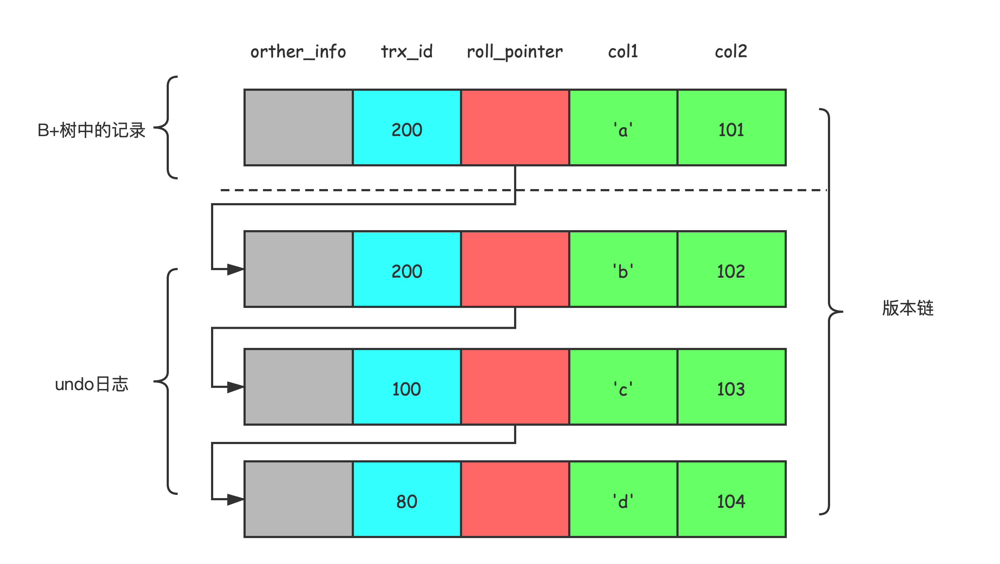

# 前置知识

## 事务并发执行时遇到的一致性问题

+ 脏写

一个事务修改了另一个未提交事务修改过的数据。

+ 脏读

一个事务读到了另一个未提交事务修改过的数据。

+ 不可重复读

一个事务多次读到的同一数据行的值不相同。

+ 幻读

一个事务多次按照同一个搜索条件，读到了不同的数据行。

## 隔离级别

隔离级别描述了并发事务执行时对竞争数据的互相影响的程度。

最理想化的隔离应该每个事务执行时互不影响，互不干涉，就像数据库此时只为它一个事务使用似的。

不过，一般使用场景下，我们会**舍弃一定的隔离性去换取一部分性能**,

于是SQL标准设立的4个隔离级别，隔离级别越低，越有可能出现数据不一致的情况，不过并发性能也越高。

> 注意，这是SQL指定的标准，不是MySQL指定的。
>
> 不同DBMS对隔离级别的支持也不一样。
>

| Isolation Level P1（隔离级别） | 脏读         | 不可重复读   | 幻读         |
| ------------------------------ | ------------ | ------------ | ------------ |
| READ UNCOMMITTED （读未提交）  | Possible     | Possible     | Possible     |
| READ COMMITTED（读已提交）     | Not Possible | Possible     | Possible     |
| REPEATABLE READ （可重复读）   | Not Possible | Not Possible | Possible     |
| SERIALIZABLE  （可序列化）     | Not Possible | Not Possible | Not Possible |

在任何隔离级别下，脏写都是不可接受的，这是一个对一致性影响极大的操作。

MySQL会用锁去保证不会有两个并发事务同时修改一条记录。

**MySQL默认使用的隔离级别是REPEATABLE READ**，而且MySQL的可重复读，可以在很大程度上禁止幻读现象的发生，但不能绝对禁止（后文会给出原因）。

# MVCC

Multi-Version Concurrency Control（多版本并发控制），MySQL中如何实现？

对于`READ UNCOMMITTED `直接读取B+树的最新记录就好了，无需任何多余操作，很简单；

对于`SERIALIZABLE`是通过对select语句加共享锁的方式实现的，后面会详细将锁的实现与使用；

对于`READ COMMITTED`和`REPEATABLE READ`的实现是比较复杂的，具体看下面的**版本链+ReadView**。

## 版本链

+ trx_id

一个事务每次对某条聚簇索引进行更改的时候，都会把该事务的事务id赋值给trx_id列。

+ roll_pointer

每次对某条聚簇索引记录进行改动时，都会把旧的记录写入到undo日志中，这个隐藏列就相当于一个指针，可以通过它找到修改前的信息。

如上图，每一次修改记录，就会产生一条undo日志（当然在具体实现的时候是许多条undo log）,每个undo日志也有一个 roll_pointer，那么对于某一数据行，B+树中的行记录和undo日志就构成一条版本链。

这条版本链在MVCC机制中起到重要作用。

## ReadView（一致性视图）

`READ COMMITTED`和`REPEATABLE READ`二者的一个共同的问题就是，如何判断版本链中的哪个版本是当前事务可见的。

MySQL设计出ReadView这样的数据结构解决这个问题。

它包括4个比较重要的概念：

1. **m_ids** : 生成此ReadView时，当前系统**活跃的**读写事务的事务id列表；
2. **min_trx_id** ：生成此ReadView时，当前系统活跃的读写事务列表中最小的事务id，也就是m_ids中的最小值；
3. **max_trx_id** ：生成此ReadView时，系统应该分配给下一个事务的事务id值；
4. **creator_trx_id** ：生成此ReadView的事务id。

有了这个ReadView，在访问某条记录时，采用下面的方式判断即可。

1. 如果被访问版本的**trx_id和creator_trx_id相同**，说明这个事务正在访问它自己修改过的记录，所以可见。
2. 如果被访问版本的**trx_id小于min_trx_id**，说明生成此版本的事务在当前事务生成readview之前就已经提交了，自然也是可见的。
3. 如果被访问版本的**trx_id大于等于max_trx_id**，表明生成此版本的事务在当前事务后才开启，所以不可见。
4. 如果被访问版本的**trx_id在min_trx_id-max_trx_id之间**，那么需要判断trx_id是否在m_ids之间。如果在，说明此事务是活跃的，记录不可以被访问；如果不在，说明生成此已经结束，记录可见。
5. 如果某个版本的记录对当前事务不可见，那么就顺着版本链往下找，并按照上面的方式判断可见性，直到遍历到最后一个版本返回空。

那么具体怎么实现`READ COMMITTED`和`REPEATABLE READ`呢？

实际上二者的区别就在于生成ReadView的时机不同。

`READ COMMITTED`在每次读取一条记录前都去生成ReadView，

`REPEATABLE READ`则在第一次读取数据的时候生成ReadView（不过可以使用`WITH CONSISTENT SANPSHOT`指定一开启事务就生成ReadView）。

## 二级索引和MVCC

注意只有聚簇索引记录才有 trx_id和roll_pointer。那么如果使用二级索引查询记录如何判断可见性呢？

1. 二级索引页面的Page Header部分有一个PAGE_MAX_TRX_ID的属性，它代表着**修改**该二级索引页面的最大事务id。如果此`PAGE_MAX_TRX_ID`是小于min_trx_id的，说明整个页面对当前事务都是可见的，判断完毕。
2. 否则， 根据二级索引的主键值执行回表操作，得到对应的聚簇索引记录根据前面的方法判断可见性，然后对第一个可见的记录判断是否和利用二级索引查询的索引列的值相匹配，匹配，则此条记录可见；否则继续往下找，**直到聚簇索引记录可见同时二级索引匹配条件满足**。

> [A Critique of ANSI SQL Isolation Levels](https://www.microsoft.com/en-us/research/wp-content/uploads/2016/02/tr-95-51.pdf)
>
> [Mysql8.0下验证mysql的四种隔离级别](https://blog.csdn.net/hhc9_9/article/details/109394221)
>
> 《MySQL是怎样运行的》

