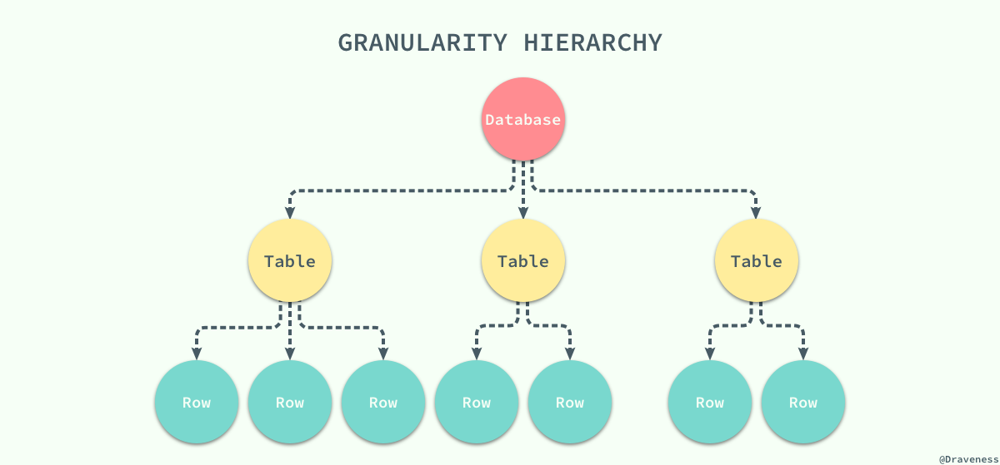
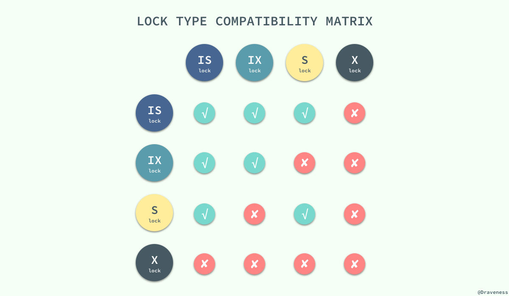
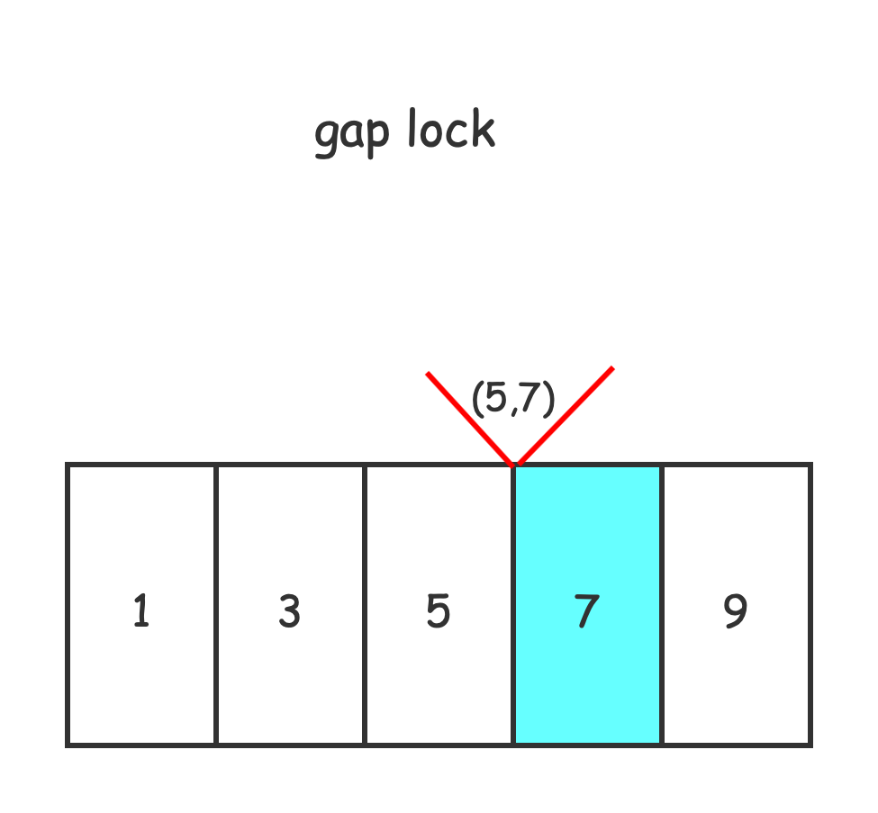
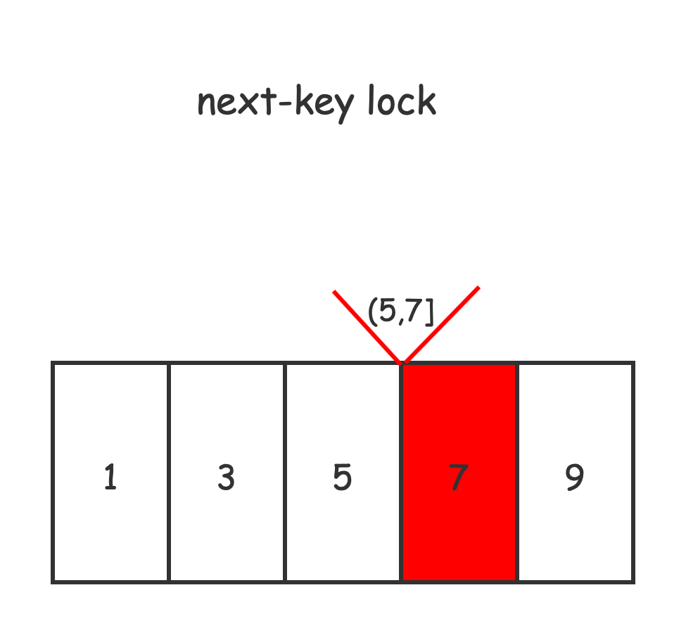
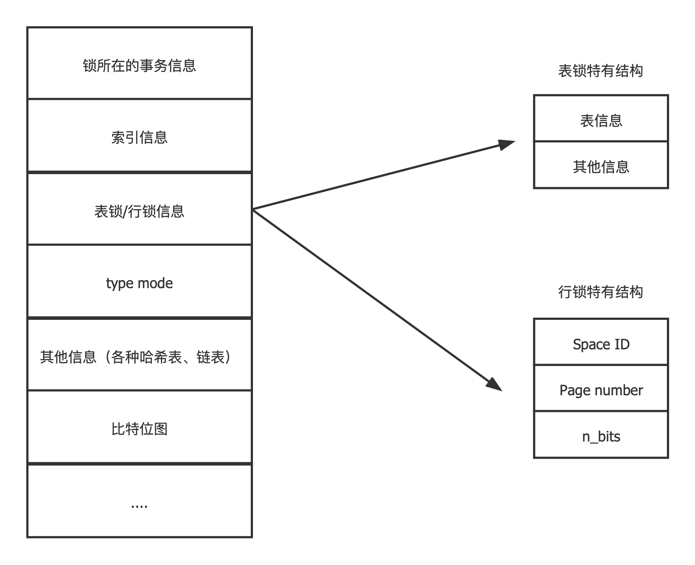
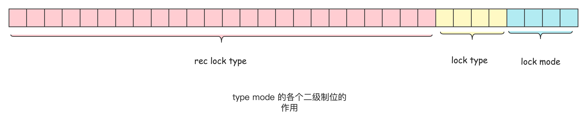

### 两阶段锁协议

两阶段锁协议（2PL）是一种能够保证事务可串行化的协议，它将事务的获取锁和释放锁划分成了增长（Growing）和缩减（Shrinking）两个不同的阶段。

在增长阶段，一个事务可以获得锁但是不能释放锁；而在缩减阶段事务只可以释放锁，并不能获得新的锁，如果只看 2PL 的定义，那么到这里就已经介绍完了，但是它还有两个变种：

1. **严格两阶段锁**（Strict 2PL）：事务持有的**互斥**锁必须在提交后再释放；
2. **强两阶段锁**（Rigorous 2PL）：事务持有的**所有**锁必须在提交后释放；


# MySQL中锁机制

## 按粒度分
表锁
行锁

简单的说，表锁上锁的粒度是table，而行锁可以只对部分行上锁。

后者粒度低得多，这也是为什么InnoDB引擎是默认的引擎，除非你的数据库操作只有读，没有写和加锁读。

否则表锁的代价太大。





## 按是否意向锁区分
意向锁、非意向锁

（见上图）

虽然这种不同粒度的锁能够解决父节点被加锁时，子节点不能被加锁的问题，但是我们没有办法在子节点被加锁时，立刻确定父节点能不能被加锁。

在这时我们就需要引入**意向锁**来解决这个问题了。

**当需要给子节点加锁时，先给所有的父节点加对应的意向锁**，**意向锁之间是完全不会互斥的**，只是用来帮助父节点快速判断是否可以对该节点进行加锁。


具体的，InnoDB如果需要对每一行加上行锁，那么需要先给它所在表加上意向锁。

加的是互斥行锁，就给表加上意向互斥锁（IX）；

加的是共享行锁，就给锁加上意向共享锁（IS）。


见下图，各种锁的兼容性矩阵。




## 按读写性质分
读锁（共享锁、S锁）
写锁（互斥锁、X锁）

这个锁的语义和其他地方（如Java中的`ReadWriteLock`）锁的意义是一致的。

读锁-读锁共享；读锁-写锁互斥；写锁-写锁互斥。


写操作加的都是写锁，普通读操作是不加锁的（这个读称之为MVCC的一致性非锁定读）。

如果需要读操作也要加锁，可以使用`for share`、`for update`）(前者也就是`lock in share mode `)。（后面会详细介绍）


>  注意MySQL支持多种存储引擎，不同引擎对锁的支持是不一样的。
> 比如，MyISAM、Memory引擎就不支持行锁，自然也无需表级别的意向锁。
> 重点是InnoDB中的锁机制。

# InnoDB存储引擎中的锁

## InnoDB中的表级锁
+ **表级别的S锁、X锁**

1. 默认情况在对一个表执行 select、insert、delete、update语句时, InnoDB引擎不会为这个表加上表级别的锁。

2. 在执行一些DDL语句时，会和select、insert、delete、update产生冲突，一个阻塞另一个。

   不过，这个不是表锁起的作用，而是位于服务器层的 **元数据锁**（Metadata Lock）来实现的。

   （DDL语句执行时，**会隐式提交当前会话中的事务**，这个要注意)

3. InnoDB存储引擎提供的表锁其实在一般使用场景下，并不会直接使用到，只有在一些特殊场景下（服务崩溃需要对系统运维时使用）。

**如何加表锁**

在系统变量为 `autocommit = 0`和`innodb_table_locks = 1`时，

```SQL
LOCK TABLES t READ; # 表级别读锁
LOCK TABLES T WRITE; # 表级别的写锁
```


+ **表级别的IS、IX锁**

  在需要加行锁的时候，需要先给所在的表加上意向锁。加意向锁的作用和意图在上面已经说过了。


+ **表级别的AUTO-INC锁**

如何实现对具有**AUTO_INCREMENT**属性的列的自增？

这个时候需要使用到表级别的**自增锁**。

注意这个AUTO-INC锁的作用范围只有单个插入语句，在插入语句完成后，这把锁就会被释放。

还有一个更轻量的实现，就是在获取到需要的自增值就立即释放锁，不必等待插入语句完成。

可以使用`innodb_autoinc_lock_mode`控制使用哪个实现。


## InnoDB中的行级锁

InnoDB中的行级锁有下面几种概念， 共同实现了行锁这个语义。


+ **Record Lock**

  记录锁，官方叫它“LOCK_REC_NOT_GAP”，顾名思义，锁住的是真实的数据行。

+ **Gap Lock**
  
  间隙锁，"LOCK_GAP"

  这个间隙锁，锁住的是数据记录之间的间隙。
  
  为什么要锁住间隙？这个gap lock的提出是为了解决”幻行“现象的发生。
  
  所谓幻读，就是一个事务向另一个事务读范围中插入了一条记录，然后另一个事务就读到了“幻行”（虽然说MVCC的一致性读很大程度上可以避免，但是彻底避免幻读就需要使用gap lock）。 



如上图，再给7上间隙锁的时候，其他事务无法向(5,7)之间插入行记录。这就是**锁住间隙**的作用。


+ **Next-key Lock**

临键锁，官方叫它”LOCK_ORDINARY“,从这个英文名字就可以看出。

这个锁才是正常使用的加的行锁。




如上，临键锁实际上记录锁和间隙锁的合体。给某个记录加上临键锁，实际上锁住了这条记录和它前面的间隙。

所以说临键锁是”左开右闭“的。


# InnoDB锁的内存结构

上面讲到了表锁和行锁。

表锁的对象的是一个表，可以为这张表生成一个锁结构。

如果是行锁呢？难不成为每一个数据行都要生成一个锁结构吧，这个对内存消耗太大了，也不利于管理。

所以，符合下面这些条件的记录的锁实际上使用一个锁结构就可以做到。

+ 同一个事务中
+ 加锁的类型一样
+ 等待状态一样
+ 被加锁的记录在同一个页面中





+ **锁所在的事务信息**：无论表级锁还是行级锁，都是属于一个事务的，这里记载着属于这个事务的信息。

+ **索引信息**：对于行级锁而言，需要记录一下加锁的记录属于哪个索引。

+ 表锁或者行锁信息：

  如果是行锁的话：

  + Space ID：记录所在表空间。
  + Page Number：记录所在的页号
  + n_bits：对弈行级锁而言，一条记录对应一个比特，实际上就是用一个位图结构去记录那些行记录被加了锁，n_bits则是表示使用了多少比特。

  

+ **type mode**
  
  + **lock_mode**（锁模式）
    + LOCK_IS（共享意向锁）
    + LOCK_IX（独占意向锁）
    + LOCK_S（共享锁）
    + LOCK_X（独占锁）
    + LOCK_AUTO_INC（AUTO_INC锁）
  
  + **lock_type**（锁类型）
    + LOCK_TABLE（表级锁）
    + LOCK_REC （行级锁）
  
  + **rec_lock_type** （行锁的具体类型，只有当lock_type为LOCK_REC时才是有效的）
  
    + LOCK_ORDINARY（next_key临键锁）
    + LOCK_GAP（间隙锁）
    + LOCK_REC_NOT_GAP（记录锁）
    + LOCK_INSERT_INTENTION（插入意向锁）
  
  + **LOCK_WAITING** 
  
    1 表示当前事务尚未得到锁，正处于等待状态，0 表示当前事务已经或得到锁。

其实仅仅看这个一个type mode 的结构皆可以知道MySQL锁的整体结构了。





+ 其他信息

为了更好地管理系统运行过程中生成的锁结构，有哈希表、链表等等数据结构方便管理

+ 比特数组

  n_bits属性指出这个位图有多大，那么这一堆比特位就是用来隐射这一页中有哪些记录加上了锁的。


# 查看事务的加锁情况

也许需要打开一些配置项：

```sql
SET GLOBAL innodb_status_output=ON;
SET GLOBAL innodb_status_output_locks=ON;
```

在MySQL Clinet中使用`show engine innodb status`


这里只列出关于事务和锁的信息，其余信息省略：

```shell
# 当前活动的事务 
TRANSACTIONS
------------
# 下一个分配的事务ID信息
Trx id counter 7203081
Purge done for trx's n:o < 7203074 undo n:o < 0 state: running but idle
# 每个回滚段中都有一个History链表，链表的长度为 57
History list length 57

# 下面对于每一个会话列出它的事务信息
LIST OF TRANSACTIONS FOR EACH SESSION:
#  每一个'---TRANSACTION' 后面跟着响应的事务的信息
---TRANSACTION 422190990756560, not started
0 lock struct(s), heap size 1136, 0 row lock(s)

# 事务ID7203080, 活跃了 163 秒
---TRANSACTION 7203080, ACTIVE 163 sec
# 2个锁结构， 7个行锁（实际上只有6条记录）（这里的锁结构指的就是前面的锁的内存结构）
2 lock struct(s), heap size 1136, 7 row lock(s)
# MySQL内部线程号、操作系统中的线程号等信息
MySQL thread id 17, OS thread handle 13048123392, query id 389 localhost 127.0.0.1 root

# 锁结构1. 表级别的意向互斥锁
TABLE LOCK table `test_lock`.`test_lock` trx id 7203080 lock mode IX
# 锁结构2. 记录锁（
# 详细解释：表空间号是106，页号是4，锁的位图大小为80，索引是PRIMARY聚簇索引，X型实际上是next-key-lock，（aka 临键锁）
RECORD LOCKS space id 106 page no 4 n bits 80 index PRIMARY of table `test_lock`.`test_lock` trx id 7203080 lock_mode X
# 紧接着就是加锁记录的详细信息
Record lock, heap no 1 PHYSICAL RECORD: n_fields 1; compact format; info bits 0
 0: len 8; hex 73757072656d756d; asc supremum;;

Record lock, heap no 2 PHYSICAL RECORD: n_fields 6; compact format; info bits 0
 0: len 4; hex 80000000; asc     ;;
 1: len 6; hex 0000002e0502; asc    .  ;;
 2: len 7; hex 0100000164102a; asc     d *;;
 3: len 4; hex 80000000; asc     ;;
 4: len 4; hex 80000000; asc     ;;
 5: len 4; hex 80000000; asc     ;;

Record lock, heap no 3 PHYSICAL RECORD: n_fields 6; compact format; info bits 0
 0: len 4; hex 8000000a; asc     ;;
 1: len 6; hex 0000002e0502; asc    .  ;;
 2: len 7; hex 01000001641060; asc     d `;;
 3: len 4; hex 8000000a; asc     ;;
 4: len 4; hex 8000000a; asc     ;;
 5: len 4; hex 8000000a; asc     ;;

Record lock, heap no 4 PHYSICAL RECORD: n_fields 6; compact format; info bits 0
 0: len 4; hex 80000014; asc     ;;
 1: len 6; hex 0000002e0551; asc    . Q;;
 2: len 7; hex 010000012c112d; asc     , -;;
 3: len 4; hex 80000014; asc     ;;
 4: len 4; hex 80000014; asc     ;;
 5: len 4; hex 80000014; asc     ;;

Record lock, heap no 5 PHYSICAL RECORD: n_fields 6; compact format; info bits 0
 0: len 4; hex 8000001e; asc     ;;
 1: len 6; hex 0000002e0502; asc    .  ;;
 2: len 7; hex 01000001641100; asc     d  ;;
 3: len 4; hex 8000001e; asc     ;;
 4: len 4; hex 8000001e; asc     ;;
 5: len 4; hex 8000001e; asc     ;;

Record lock, heap no 6 PHYSICAL RECORD: n_fields 6; compact format; info bits 0
 0: len 4; hex 80000028; asc    (;;
 1: len 6; hex 0000002e13cd; asc    .  ;;
 2: len 7; hex 02000001591605; asc     Y  ;;
 3: len 4; hex 80000028; asc    (;;
 4: len 4; hex 80000028; asc    (;;
 5: len 4; hex 80000028; asc    (;;

Record lock, heap no 7 PHYSICAL RECORD: n_fields 6; compact format; info bits 0
 0: len 4; hex 80000032; asc    2;;
 1: len 6; hex 0000002e0990; asc    .  ;;
 2: len 7; hex 020000013e14d7; asc     >  ;;
 3: len 4; hex 80000032; asc    2;;
 4: len 4; hex 80000032; asc    2;;
 5: len 4; hex 80000032; asc    2;;

--------
```


## 死锁

死锁示例sql：

事务1

```sql
start transaction ;
select * from test_lock where primary_id = 10 for update ;
select * from test_lock where primary_id = 20 for update ;
```

事务2

```sql
start transaction ;
select * from test_lock where primary_id = 20 for update ;
select * from test_lock where primary_id = 10 for update ;
```


**InnoDB的死锁检测机制**

当它检测到死锁发生时，会选择一个较小的事务（所谓较小的事务，就是在事务执行过程中插入、更新后删除的记录较少的事务）进行回滚（这个是自动完成的），并向客户端发送一条消息：`[40001][1213] Deadlock found when trying to get lock; try restarting transaction` .


> 那么如何定位到死锁的发生的地方呢？


仍然是使用`show engine innnodb status`来查看死锁信息：

```shell
------------------------
# 最近一次捕捉的死锁信息
LATEST DETECTED DEADLOCK
------------------------
# 死锁发生时间
2021-11-27 11:49:06 0x309c3d000
# 死锁发生时的第一个事务信息
*** (1) TRANSACTION:
TRANSACTION 7203086, ACTIVE 12 sec starting index read
# 该事务使用了一个表，为一个表上了锁
mysql tables in use 1, locked 1
# 拥有 3 个锁结构，2个行锁
LOCK WAIT 3 lock struct(s), heap size 1136, 2 row lock(s)
# 线程信息
MySQL thread id 24, OS thread handle 13048426496, query id 978 localhost 127.0.0.1 root statistics
# 发生锁时执行的SQL语句
/* ApplicationName=DataGrip 2020.3.1 */ select * from test_lock where primary_id = 20 for update
# 当前线程正在等待获取的锁
*** (1) WAITING FOR THIS LOCK TO BE GRANTED:
RECORD LOCKS space id 106 page no 4 n bits 80 index PRIMARY of table `test_lock`.`test_lock` trx id 7203086 lock_mode X locks rec but not gap waiting
# 这条记录正对应着 select * from test_lock where primary_id = 20 for update ;
Record lock, heap no 4 PHYSICAL RECORD: n_fields 6; compact format; info bits 0
 0: len 4; hex 80000014; asc     ;;
 1: len 6; hex 0000002e0551; asc    . Q;;
 2: len 7; hex 010000012c112d; asc     , -;;
 3: len 4; hex 80000014; asc     ;;
 4: len 4; hex 80000014; asc     ;;
 5: len 4; hex 80000014; asc     ;;

# 死锁发生时的第二个事务信息
*** (2) TRANSACTION:
TRANSACTION 7203087, ACTIVE 9 sec starting index read
mysql tables in use 1, locked 1
3 lock struct(s), heap size 1136, 2 row lock(s)
MySQL thread id 25, OS thread handle 13048729600, query id 987 localhost 127.0.0.1 root statistics
/* ApplicationName=DataGrip 2020.3.1 */ select * from test_lock where primary_id = 10 for update
# 此事务已经或得到的锁
*** (2) HOLDS THE LOCK(S):
RECORD LOCKS space id 106 page no 4 n bits 80 index PRIMARY of table `test_lock`.`test_lock` trx id 7203087 lock_mode X locks rec but not gap
# 这条记录正对应着 select * from test_lock where primary_id = 20 for update ;
Record lock, heap no 4 PHYSICAL RECORD: n_fields 6; compact format; info bits 0
 0: len 4; hex 80000014; asc     ;;
 1: len 6; hex 0000002e0551; asc    . Q;;
 2: len 7; hex 010000012c112d; asc     , -;;
 3: len 4; hex 80000014; asc     ;;
 4: len 4; hex 80000014; asc     ;;
 5: len 4; hex 80000014; asc     ;;
# 此事务等待的锁
*** (2) WAITING FOR THIS LOCK TO BE GRANTED:
RECORD LOCKS space id 106 page no 4 n bits 80 index PRIMARY of table `test_lock`.`test_lock` trx id 7203087 lock_mode X locks rec but not gap waiting
Record lock, heap no 3 PHYSICAL RECORD: n_fields 6; compact format; info bits 0
 0: len 4; hex 8000000a; asc     ;;
 1: len 6; hex 0000002e0502; asc    .  ;;
 2: len 7; hex 01000001641060; asc     d `;;
 3: len 4; hex 8000000a; asc     ;;
 4: len 4; hex 8000000a; asc     ;;
 5: len 4; hex 8000000a; asc     ;;

# InnoDB决定回滚第二个事务
*** WE ROLL BACK TRANSACTION (2)
```


不过注意，默认只记录最近一次死锁信息，可以将全局变量`innodb_print_all_deadlocks`设置为ON，这样的话

死锁发生的信息就会都记录在MySQL的错误日志中，然后就可以通过查看错误日志来分析更多的日志情况了。


于是，根据死锁发生的死锁日志来逆向定位产生的死锁的语句，然后再优化我们的业务。


# 参考资料


> [浅谈数据库并发控制 - 锁和 MVCC](https://draveness.me/database-concurrency-control/)

