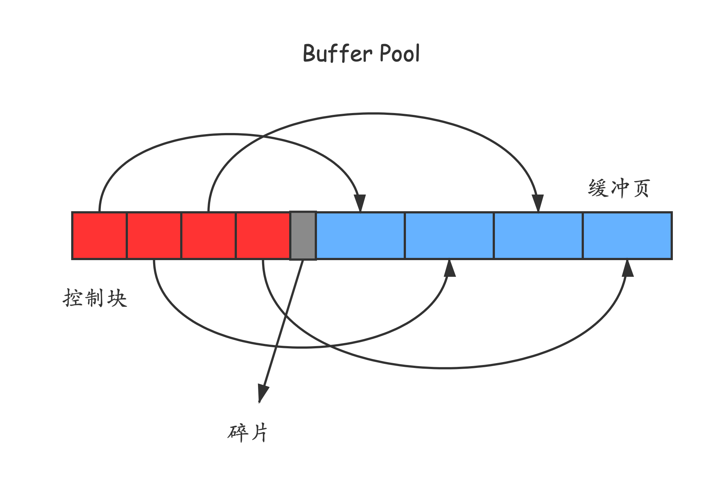
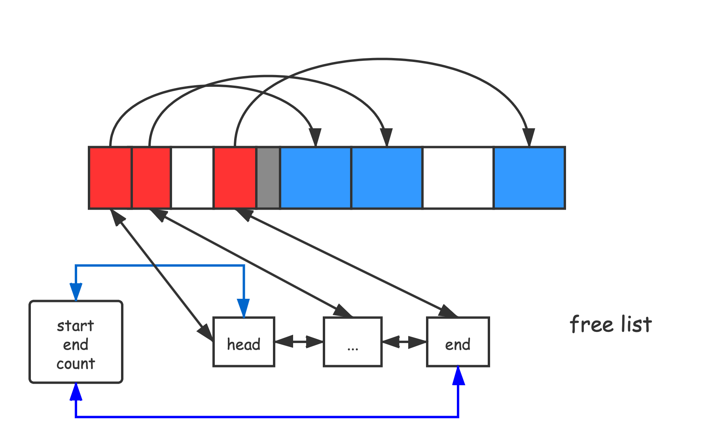

# InnoDB Buffer Pool 

## 介绍

磁盘太慢，用内存作为缓冲区很有必要——这是缓存的基本思想，将数据存放在读写速度更快的存储介质中。

不过这里的缓冲区指的不是 Redis、Memchached这些外部的内存性缓冲，还是MySQL自治的一块内存缓冲区。

所谓自治，就是说完全由MySQL自己去管理这块内存区域，自己完成脏数据的刷盘，使用MySQL执行CRUD无需也无法自己做这方面的操作——不过你可以修改其中的配置以调整缓存的具体行为。


InnoDB Buffer Pool 本质上是MySQL在向操作系统申请的一大块内存，默认是128MB（比较小，完全可以开大一点）。


## 内部组成

Buffer Pool 对应的一大块内存被划分一个又一个页面，页面大小和InnoDB表空间的页面大小一致，默认是16KB，不妨称它为**缓冲页。**


由于这些缓冲业本身较大，如果已过用户的调整可能更大，不便于直接管理。于是为每个缓冲页创建一个控制块，

每个控制块包含该页所属的表空间编号、页号、缓冲页在Buffer Pool 中的地址等关键信息。

每个控制块的所占用的内存大小是一致的，大概只有16KB的5%左右（aka 800个字节）。





## free 链表

缓冲页一开始都为空（逻辑上的空），随着从磁盘读取数据会逐渐使用buffer pool中的页。

如何区分这些空闲的页和非空闲的页呢？

MySQL的做法并不特殊，使用一条链表将空闲也组织起来。

具体的数据结构，下面的图说的很清楚了。

红色对应的空闲的控制块，蓝色对应的是相应的缓冲页。




## flush 链表

读缓存的逻辑比较简单，就是把磁盘中的页读到内存中（不过还要设计缓冲页的淘汰问题）。

写缓存呢？

和上面，我们需要把buffer pool中的写过的页（也就是和磁盘的上的页不一致的页），也就是脏页管理起来，然后按照某种刷盘逻辑将这些脏页在未来某个时刻写到磁盘上。


具体的组织结构也是链表，和上面的的形式几乎一致。不再赘述。


## 缓冲页的哈希表

如何根据快速知道某个是否在缓冲池中，毫无疑问，哈希表可以派上用场。

具体的，可以使用 **表空间号+页号** 作为键来定位一个页，值是页控制块的内存地址。


## LRU链表的使用管理

只要涉及到缓存，就必然涉及到缓存区不够用，需要淘汰部分缓存的情况。对于innodb buffer pool来说也不意外。

不过，这里的LRU算法不是最朴素的实现（比如每使用一次页，就把它对应的控制块移动到LRU链表的头部），
这里的LRU链表是变种。

### 数据冷热分离

为什么呢？

两个原因：

1. MySQL的预读策略可能将一些原本不会使用的页面误装载进了buffer pool；
2. 执行一些全表扫描的SQL时，会将大量的数据页加载进buffer pool，不过又由于这些全表扫描出的页面的本身的使用频率的非常低（全表的扫描这样的sql一般只有定期做报表的时候用到），这个时候相当于一下子就把缓冲区全用冷数据充满了，也就是说相当于清空了缓冲区。


所以，MySQL对这里LRU链表作如下处理，

将数据冷热分离，默认情况下，将LRU链表前约5/8的数据作为热数据（也称为 young ）区域，后3/8的数据作为冷数据（也称为 old）区域。

如何对上面提出的两个问题做出优化，上面的问题的共同点在于使用一个页面之后就再不用了（aka，用完即弃，不是那种在一个时间段里频繁使用到的数据）。

所以，`innnodb_old_blocks_time`这个系统配置变量其到作用，默认是1000ms。

对于从磁盘加载进来的数据页，先将它加入old区域，记录下第一次加入的时间，之后再访问它的时候，如果间隔的时间小于`innnodb_old_blocks_time`, 还不会加入young区域，仍然作为冷数据处理。


于是，对于那些原表扫描和预读机制的冷数据页不会影响到真正的需要缓存的热数据。


### 进一步优化

是不是对于young区域数据页每访问一次就要把它加入LRU链表的头部呢？因为这些数据可能都很热，每一次每访问一次就把要移动一次控制块节点，没必要。

所以，MySQL只对于那些处于young区域后3/4区域的节点才会在使用的时候加入young的头部。


## 刷新脏页到磁盘

后台线程会定期将脏页刷新到磁盘中。

也就是说，这里的缓存使用方式实际上是**Write-hehind（异步缓存写入）**，适合多写的方式。

脏页的刷新主要有3种做法：

1. 从LRU的尾部（也是从old区域）开始扫描一些页面，扫描页面的数量由`innodb_lru_scan_depth`（默认是1024）指定，如果扫描中发现是脏页就把它刷新到磁盘。
2. 从flush链表刷新一部分页面到磁盘。刷新的速率取决于当时系统繁忙的程度。

3. 如果用户线程想将一个磁盘页加载进buffer pool，但是此时全都是脏页了，这时就必须挑出一个脏页刷到磁盘上。


## 查看当前 buffer pool的状态/配置

查看当前状态

```sql
show engine innodb status;
```

输出

```shell
# ......
BUFFER POOL AND MEMORY
----------------------
Total large memory allocated 137428992 # 向操作系统申请的一大块连续空间 + 全部控制块 + 缓冲页 + 碎片
Dictionary memory allocated 410319
Buffer pool size   8191  # 一共容纳多少缓冲页（页数）
Free buffers       7017  # 空闲的缓冲页个数
Database pages     1170  # LRU链表中的页的数量
Old database pages 451   # OLD区域中的页的数量
Modified db pages  0     # FLUSH链表中页的数量（脏页的数量）
Pending reads      0
Pending writes: LRU 0, flush list 0, single page 0
Pages made young 0, not young 0
0.00 youngs/s, 0.00 non-youngs/s
Pages read 1039, created 131, written 137
0.00 reads/s, 0.00 creates/s, 0.00 writes/s
No buffer pool page gets since the last printout
Pages read ahead 0.00/s, evicted without access 0.00/s, Random read ahead 0.00/s
LRU len: 1170, unzip_LRU len: 0
I/O sum[0]:cur[0], unzip sum[0]:cur[0]
```

具体的参看官方文档。


**查看配置变量**

```sql
show status like 'Innodb_buffer_pool_%'
```


**变量解析**

+ Innodb_buffer_pool_pages_total 参数表示缓存页面的总数量;
+ Innodb_buffer_pool_pages_data 代表有数据的缓存页数;
+ Innodb_buffer_pool_pages_free 代表没有使用的缓存页数;
+ Innodb_buffer_pool_pages_misc: innodb buffer pool 缓存池中当前已经被用作管理用途或hash index而不能用作为普通数据页的数目。
+ Innodb_buffer_pool_read_requests表示read请求的次数，
+ Innodb_buffer_pool_reads 表示从物理磁盘中读取数据的请求次数，

innodb buffer的read命中率 =（Innodb_buffer_pool_read_requests -Innodb_buffer_pool_reads） / Innodb_buffer_pool_read_requests * 100%。
如果这个命中率小于95%，建议增大 innodb_buffer_pool_size。


如果Innodb_buffer_pool_pages_free偏大的话，证明有很多缓存没有被利用到，这时可以考虑减小缓存; 相反Innodb_buffer_pool_pages_data过大就考虑增大缓存。

## 配置 Buffer Pool


### 配置解析


由于一个Buffer Pool可能很大，一次性申请、移动、管理它不适合，所以MySQL实际做法是用多个做个chunk组成一个buffer pool。


+ innodb_buffer_pool_size 参数为innodb_buffer_pool的大小设置（默认是128MB）。
+ innodb_buffer_pool_chunk_size 参数为InnoDB缓冲池块大小（默认是128MB）。
+ innodb_buffer_pool_instances 参数为缓冲池实例的个数（默认是1）。

注意，不同的innodb_buffer_pool 实例的链表管理、哈希管理、锁管理都是独立的，也正因此如果可以配置多个buffer pool实例可以增大并发度。


配置规则：
**innodb_buffer_pool_size = innodb_buffer_pool_chunk_size * innodb_buffer_pool_instances *N**

其中N指的是一个buffer pool实例中有几个 chunk。


（注意，如果不是整数倍，那么会调整为整数倍；又如果配置的innodb_buffer_pool_size 小于innodb_buffer_pool_chunk_size * innodb_buffer_pool_instances，那么MySQL会缩小innodb_buffer_pool_chunk_size的大小）


系统默认的innodb_buffer_pool_chunk_size （8.x版本）为128M。
innodb_buffer_pool_instances参数的默认设置为1 最大设置为64 ，但是
将innodb_buffer_pool_size大小设置为1GB或更大时，此选项才生效。
（主要是防止有太多小的instance从而导致性能问题。）

### 配置参考

建议设置为系统内存的50%-80%，但也不是越大越好，要根据具体项目具体分析
（操作系统留1G左右，mysql连接数*4M，宿主程序缓存nM）。

| 实例内存大小（单位：MB） | 默认Buffer Pool（单位：MB） | 推荐最大Buffer Pool（单位：MB） |
| :----------------------- | :-------------------------- | :------------------------------ |
| 1024                     | 256                         | 256                             |
| 2048                     | 512                         | 512                             |
| 4096                     | 1536                        | 1536                            |
| 8192                     | 4608                        | 4608                            |
| 16384                    | 12288                       | 12288                           |
| 24576                    | 18432                       | 19456                           |
| 32768                    | 24576                       | 25600                           |
| 49152                    | 36864                       | 38912                           |
| 65536                    | 49152                       | 52224                           |
| 98304                    | 73728                       | 77824                           |
| 131072                   | 98304                       | 104448                          |
| 196608                   | 147456                      | 156672                          |
| 229376                   | 172032                      | 183296                          |
| 262144                   | 196608                      | 208896                          |


# 参考链接

> 《MySQL是怎样运行的》


https://www.cnblogs.com/frankcui/p/15227775.html
