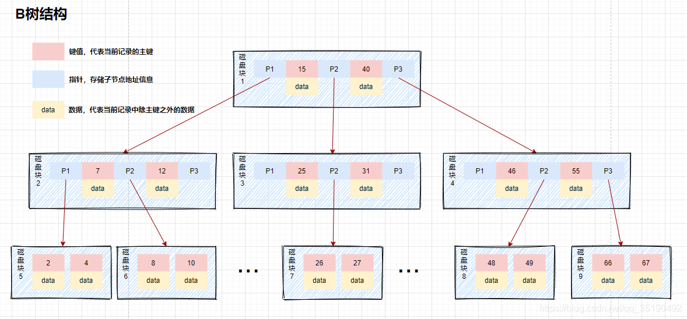
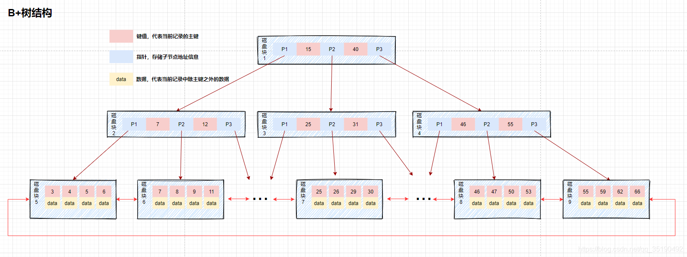
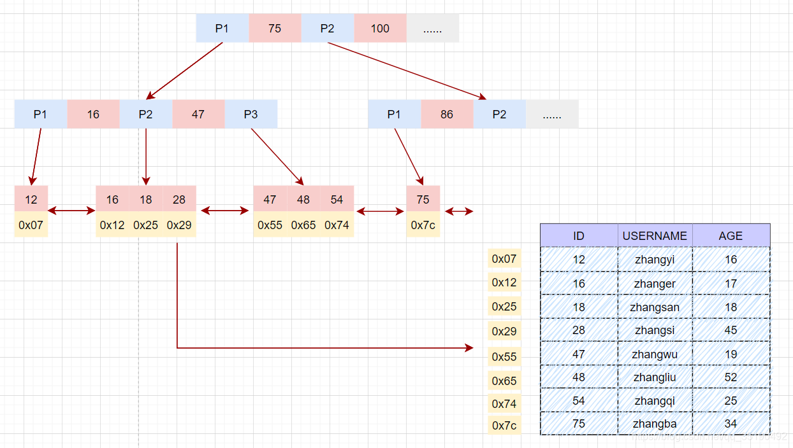
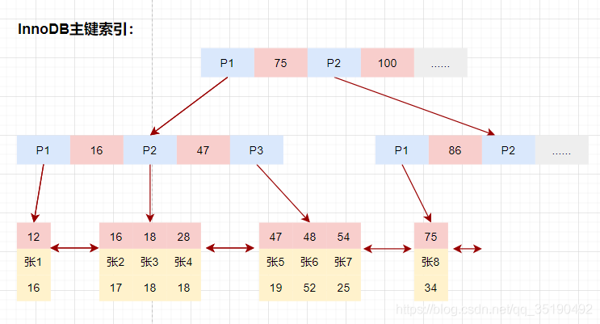
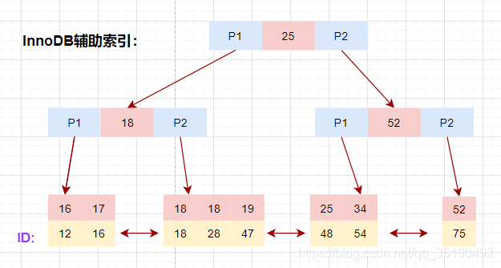
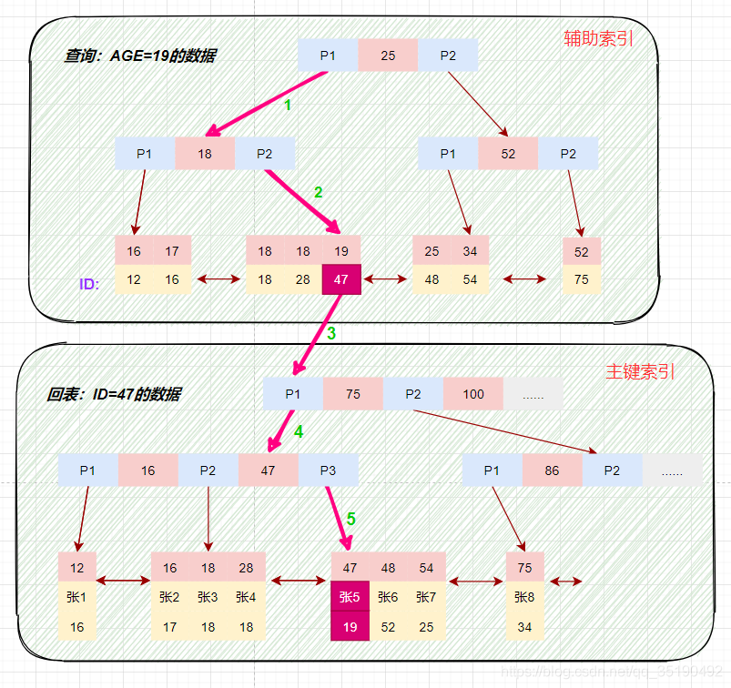

# 索引的数据结构


## B树、B+树

> 关于 B树、B+树本身的介绍，不是本文的重点，之后也许会专门写一篇文章详细介绍，

这里直接就贴出wiki的链接了。

[B树](https://zh.wikipedia.org/wiki/B%E6%A0%91)

[B+树](https://zh.wikipedia.org/wiki/B%2B%E6%A0%91)


+ 为什么不使用普通的平衡二叉树（如RB树、AVL树）？

  MySQL的数据是存储在磁盘文件中的，查询处理数据时，需要先把磁盘中的数据加载到内存中，**磁盘IO 操作非常耗时**，所以我们优化的重点就是尽量减少磁盘 IO 操作。**访问二叉树的每个节点就会发生一次IO，如果想要减少磁盘IO操作，就需要尽量降低树的高度**。那如何降低树的高度呢？

  B树的特点就是一个多叉的平衡树，特点就是**矮胖**（相比于普通平衡二叉树的高瘦），在相同数据规模下访问节点的次数更少，换句话说，磁盘IO的开销更少。


如下图，红色的是主键，黄色的其余的数据，蓝色的是指向子节点的指针。





+ 为什么Innodb引擎使用B+树而不是B树？

  1. B树不支持范围查询的快速查找，你想想这么一个情况如果我们想要查找10和35之间的数据，查找到15之后，需要回到根节点重新遍历查找，需要从根节点进行多次遍历，查询效率有待提高。

  2. 如果data存储的是行记录，行的大小随着列数的增多，所占空间会变大。这时，**一个页中可存储的数据量就会变少，树相应就会变高**，磁盘IO次数就会变大。

  

  B+树和B树最主要的区别在于**非叶子节点是否存储数据**的问题
  
  + B树：非叶子节点和叶子节点都会存储数据。
  + B+树：**只有叶子节点才会存储数据，非叶子节点至存储键值**。叶子节点之间使用双向指针连接，**最底层的叶子节点形成了一个双向有序链表**。
  
  当然，非要讲B+树和B树的缺点，就是每一次查询行数据，都一定要查询到叶子节点，不过这个缺点和它的优势相比可以忽略了。





## MyISAM引擎中的索引

MyISAM的数据文件和索引文件是分开存储的。MyISAM使用B+树构建索引树时，**叶子节点中存储的键值为索引列的值，数据为索引所在行的磁盘地址**。


**在 MyISAM 中,辅助索引和主键索引的结构是一样的，没有任何区别**。叶子节点的数据存储的都是行记录的磁盘地址。只是主键索引的键值是唯一的，而辅助索引的键值可以重复。





MyISAM通过key_buffer**把索引先缓存到内存中**，当需要访问数据时（通过索引访问数据），在内存中直接搜索索引，然后**通过索引找到磁盘相应数据**。

这也就是为什么索引不在key buffer命中时，速度慢的原因。


## InnoDB引擎中的索引

> 首先需要澄清的一点是，MySQL 跟 B+ 树没有直接的关系，**真正与 B+ 树有关系的是 MySQL 的默认存储引擎 InnoDB**，MySQL 中存储引擎的主要作用是负责数据的存储和提取，除了 InnoDB 之外，MySQL 中也支持 MyISAM 作为表的底层存储引擎。
>
> ~~不过本文不介绍xianMyISAM，只介绍 InnoDB，会在介绍MySQL中的存储引擎文章中介绍 MyISAM引擎以及其索引特点。~~


### 主键索引（聚簇索引）


通俗点讲：

聚簇索引的意思就是：将数据存储与索引放到了一块，找到索引也就找到了数据。


每个InnoDB表都有一个聚簇索引 ，**聚簇索引使用B+树构建**，**叶子节点存储的数据是整行记录**。一般情况下，**聚簇索引基本上等同于主键索引**，当一个表没有创建主键索引时，InnoDB会自动创建一个ROWID字段来构建聚簇索引。

InnoDB创建索引的具体规则如下：

1. 在表上定义主键PRIMARY KEY，InnoDB将**主键**用作聚簇索引。
2. 如果表没有定义主键，InnoDB会选择**第一个不为NULL的唯一索引列**用作聚簇索引。
3. 如果以上两个都没有，InnoDB 会使用一个6 字节长整型的隐式字段 **ROWID字段**构建聚簇索引。该ROWID字段会在插入新行时自动递增。

 在检索时，InnoDB使用此主键值在聚簇索引中搜索行记录。





### 二级索引（辅助索引）

除聚簇索引之外的所有索引都称为辅助索引。在中InnoDB，**辅助索引中的叶子节点存储的数据是该行的主键值**。

**辅助索引也使用B+树构建**。




如何使用二级索引来查询行数据呢？

第一步，在二级索引里根据索引列查询到主键值。

第二步，根据主键值再到聚簇索引里查询数据行。

这个操作就叫做**回表**。





## 聚簇索引 vs 非聚簇索引

### 优势
+ 由于行数据和叶子节点存储在一起，同一页中会有多条行数据，访问同一数据页不同行记录时，已经把页加载到了Buffer中，再次访问的时候，会在内存中完成访问，不必访问磁盘。
+ 辅助索引使用主键作为"指针"而不是使用地址值作为指针的好处是，**减少了当出现行移动或者数据页分裂时辅助索引的维护工作**。也就是聚簇索引这棵树由于页分裂导致的树的结构的调整，不会牵扯到辅助索引这个树的调整。
+ **可以把相关数据保存在一起**。例如实现电子邮箱时，可以根据用户 ID 来聚集数据，这样只需要从磁盘读取少数的数据页就能获取某个用户的全部邮件。如果没有使用聚簇索引，则每封邮件都可能导致一次磁盘 I/O。


### 劣势

1. **维护索引很昂贵，特别是插入新行或者主键被更新导至要分页(page split)的时候**。建议在大量插入新行后，选在负载较低的时间段，通过OPTIMIZE TABLE优化表，因为必须被移动的行数据可能造成碎片。使用独享表空间可以弱化碎片。

2. 如果主键比较大的话，那辅助索引将会变的更大，因为**辅助索引的叶子存储的是主键值；过长的主键值，会导致非叶子节点占用占用更多的物理空间**。


# 使用索引的一些注意点


## 最左匹配原则


**组合索引的最左前缀匹配原则：使用组合索引查询时，mysql会一直向右匹配直至遇到范围查询(>、<、between、like)就停止匹配。**

最左前缀匹配原则和联合索引的**索引存储结构和检索方式**是有关系的。

说白了，就是B树的节点的键进行比较的时候比较原则。

比方说，创建索引了`index_abc(a,b,c)`，

在组合索引树中，最底层的叶子节点按照第一列按a字段从左到右递增排列，但是b列和c列是相对无序的——只有在a相同的时候，b才是有序的。同理，c列只能在a，b两列相等的情况下小范围内递增有序。


## 覆盖索引


覆盖索引并不是说是索引结构，**覆盖索引是一种很常用的优化手段**。

因为在使用辅助索引的时候，我们只可以拿**到主键值和建立的辅助索引列**，相当于获取数据还需要再根据主键查询主键索引再获取到数据。但是试想下这么一种情况，，那是不是意味着我们查询到组合索引的叶子节点就可以直接返回了，而**不需要回表**。这种情况就是覆盖索引。

如何知道是否使用了覆盖索引呢？

explain执行计划，查询Extra列，如果是Using index，表明确实使用了覆盖索引，或者说没有回表操作。


## 合理建立联合索引 
联合索引，在建立索引的时候，尽量在多个单列索引上判断下是否可以使用联合索引。联合索引的使用**不仅可以节省空间**，还可以更容易的使用到索引覆盖。

比如联合索引（a_b_c），是不是等于有了索引：a，a_b，a_b_c三个索引，这样是不是节省了空间，当然节省的空间并不是三倍于（a，a_b，a_b_c）三个索引。


总之：

1. 考虑当前是否已经存在多个可以合并的单列索引，如果有，那么**将当前多个单列索引创建为一个联合索引**。
2. 当前索引**存在频繁使用作为返回字段的列**，这个时候就可以考虑当前列是否可以加入到当前已经存在索引上，使其查询语句可以使用到覆盖索引。


# 索引的创建、删除、使用


## 索引的创建


+ 建表时创建

  ```sql
  create table 表名（
  ......
  [UNIQUE|FULLTEXT|SPATIAL] INDEX|KEY 
  [索引名](字段名 [长度] [ASC | DESC]...) [USING {BTREE|HASH}]
  ）
  ```

  

  + UNIQUE: 可选。表示索引为唯一性索引；FULLTEXT:可选。表示索引为全文索引；SPATIAL:可选。表示索引为空间索引。
  + INDEX和KEY: 用于指定字段为索引，两者选择其中之一就可以了，作用是一样的。
  + 索引名: 可选。给创建的索引取一个新名称。
  + 字段名: 指定索引对应的字段的名称，该字段必须是前面定义好的字段。
  + 长度: 可选。指索引的长度，必须是字符串类型才可以使用。
  + ASC: 可选。表示升序排列、DESC:可选。表示降序排列。
    注：索引方法默认使用B+TREE。

 


+ 建表后创建

  第一种方法：

  ```
  ALTER TABLE 表名 ADD [UNIQUE|FULLTEXT|SPATIAL] INDEX|KEY [索引名] (字段名[(长度)] [ASC|DESC]) [USING 索引方法]；
  ```

  ```sql
  ALTER TABLE mytable ADD INDEX idx_c1c2c3 (mycol1, mycol2, mycol3);
  ```

  

  第二种方法:

  ```
  CREATE [UNIQUE|FULLTEXT|SPATIAL] INDEX 索引名 ON 表名(字段名) [USING 索引方法]；
  ```

  ```sql
  CREATE INDEX idx_c1c2c3 ON mytable(mycol1, mycol2, mycol3);
  ```
  


## 查看与删除索引

+ 查看
```sql
show index from 表名;
```
+ 删除
```sql
DROP INDEX 索引名 ON 表名
ALTER TABLE 表名 DROP INDEX 索引名
```


# 有关索引的补充了解

 ## 自适应哈希索引

**自适应hash索引（Adaptive Hash Index）**
是InnoDB存储引擎中的内存结构的组成部分。

**InnoDB存储引擎会自动根据访问的频率和模式来自动的为某些热点数据建立hash索引**。

InnoDB存储引擎会监控对表上各索引页的查询，如果观察到建立hash索引可以提高查询速度，则自动建立hash索引。这就是自适应哈希索引（Adaptive Hash Index，AHI）
**AHI是通过缓存池的B+树页构造而来**，因此建立的速度很快，而且不需要对整张表构建hash索引。

## 索引下推（IPC）

索引条件下推 (ICP) 是 MySQL 5.6.2 里程碑版本中的新优化器功能之一。

**Index Condition Pushdown 的目标是将尽可能多的条件处理（主要是 WHERE 子句）从服务器层转移到存储引擎层**。


举个具体的例子吧，

```sql
   CREATE TABLE person (
     personid INTEGER PRIMARY KEY,
     firstname CHAR(20),
     lastname CHAR(20),
     postalcode INTEGER,
     age INTEGER,
     address CHAR(50),
     KEY k1（postalcode，age）
    ）ENGINE=InnoDB;
```


如果有下面这条sql语句

```sql
SELECT lastname, firstname FROM person
WHERE postalcode BETWEEN 5000 AND 5500 AND age BETWEEN 21 AND 22;
```

根据最左匹配原则，只能使用到索引k1的postalcode列，age列无法使用（因为postalcode是一个范围查询）

如果，没有IPC, 那么怎么处理这条sql呢？

服务器层将sql推给存储引擎层，引擎层只能使用索引的第一个列查询一部分数据（比如说由10000条），

然后将这10000条数据返回给存储引擎层，然后服务器层再根据第二个条件进行过滤，最终留下1000条数据。


有了IPC之后呢，服务器层可以直接把where条件下推给存储引擎层，然后存储引擎可以直接查出这1000条数据，然后再返回给服务器层。


> 参考链接

[MySQL 5.6：索引条件下推](http://olavsandstaa.blogspot.com/2011/04/mysql-56-index-condition-pushdown.html)


> 参考链接
>
> [一文搞懂MySQL索引所有知识点（建议收藏）](https://blog.csdn.net/qq_35190492/article/details/109257302)
>
> [为什么 MySQL 使用 B+ 树](https://draveness.me/whys-the-design-mysql-b-plus-tree/)
>
> [聚簇索引与非聚簇索引](https://www.jianshu.com/p/fa8192853184)


