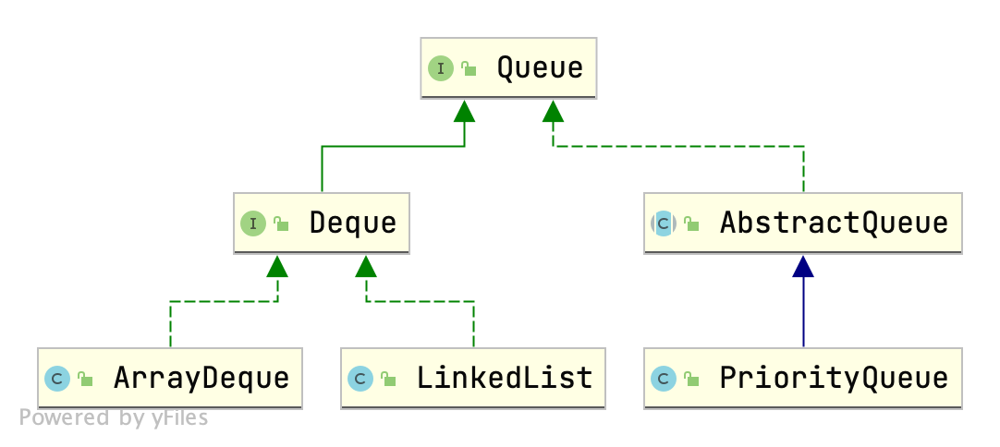

# Queue的实现

## 继承类图

其中`LinkedList`的实现已经在这篇[List实现类](http://47.117.127.179/2021/07/24/List%E5%AE%9E%E7%8E%B0%E7%B1%BB%E6%BA%90%E7%A0%81%E5%88%86%E6%9E%90%20%E2%80%94%E2%80%94%20LinkedList%E3%80%81ArrayList/)里面讲过了。




## ArrayDeque

### 数据结构

使用一个循环数组来实现队列, 应将数组视作首尾相连的。

数组的长度始终是2的整数次幂。为什么呢？

还是和HashMap一样的道理，取模运算可以使用位运算代替，加快速度。


```java

    // 存储真实元素的数组，其 length 必为2的整数次幂
    transient Object[] elements; // non-private to simplify nested class access


    // 队列头部元素在数组中的索引
    transient int  head;

    // 队列尾部元素的下一个元素在数组中的索引
    // 也就是下一个元素要放置的位置索引
    transient int tail;
    
    /*
    不变量: x 为 element、o 为 empty cell
    实例1:
        o x x x x x o o	
          h         t
		实例2:	 
        x x o o o o x x
            t       h
    实例3: (队列空)
        o o o o o o o o
          h(t)
    实例4: (队列即将满)      
        x x x o x x x x
              t h
    */

```


注意head、tail字段的含义

+ head： 队列第一个元素在数组中的索引；
+ tail： 队列尾部元素的下一个元素在数组中的索引，也就是下一个元素要放置的位置索引；

这样做有一个小缺点，就是数组满的数组的空的时候，head都是等于tail都是空的，所以需要这一点的处理。


### 构造函数

值得一提的是，这里并没有按照 ArrayList的处理方式进行“懒”处理，而是直接接分配数组容量。

```java
// 默认构造器的容量是 16
public ArrayDeque() {
    elements = new Object[16];
}

// 指定容量
public ArrayDeque(int numElements) {
    allocateElements(numElements);
}
```


### 扩容机制

这里的扩容机制做的很简单。

在每次添加完元素后，检查一下，如果head==tail，表明此时数组已满，需要扩容。

如何扩容呢？

也很简单，开辟一个两倍的大的数组，然后原来的数组元素拷贝过来，更新head与tail。


```java
   // 只在队列满的时候调用，断言此时 head == tail
    private void doubleCapacity() {
        assert head == tail;
        int p = head;
        int n = elements.length;
        int r = n - p; // number of elements to the right of p
        int newCapacity = n << 1;
        if (newCapacity < 0)
            throw new IllegalStateException("Sorry, deque too big");
        Object[] a = new Object[newCapacity];
        // 左边的
        System.arraycopy(elements, p, a, 0, r);
        // 右边的
        System.arraycopy(elements, 0, a, r, p);
        elements = a;
        // 注意 tail 是最后一个元素的下一个位置（循环意义上）
        head = 0;
        tail = n;
    }
```


## PriorityQueue

Java中的PriorityQueue的实现也是符合队列的方式，不过又略有不同，区别就在于PriorityQueue
的priority上，其是一个支持优先级的队列，当使用了其priority的特性的时候，则并非FIFO。


### 数据结构
**底层是一个用数组实现的小根堆**。注意c++的priority_queue默认是小根堆。

> 堆，是具有下列性质的完全二叉树：每个节点的值都小于等于其左右孩子节点值是小根堆；（大于等于则是大根堆）。 批注：有些参考书将堆直接定义为序列，但是，从逻辑结构上讲，还是将堆定义为完全二叉树更好。 虽然堆的典型实现方法是数组，但从逻辑的角度上讲，堆实际上是一种树结构。


需要注意的第一个元素从 0 开始。

```java
// 本实现中，最小的元素放在下标为 0 的位置，
// 某个下标为 n 的节点的左右孩子的下标为 2*n+1,2*(n+1)
// 注意和起始位置为 1 的构造方法的区别
transient Object[] queue; // non-private to simplify nested class access
```


### 构造函数

注意，比较器可以为null;

如果为null, 则是自然顺序，但是如果泛型类又没有实现Comparable接口，则会抛出异常。

```java
    // 初始化容量、比较器
    public PriorityQueue(int initialCapacity,
                         Comparator<? super E> comparator) {
        // Note: This restriction of at least one is not actually needed,
        // but continues for 1.5 compatibility
        if (initialCapacity < 1)
            throw new IllegalArgumentException();
        // 这里也没有进行懒处理。
        this.queue = new Object[initialCapacity];
        this.comparator = comparator;
    }
```


### 算法逻辑

这里就jdk中优先队列的实现，复习一下堆的相关操作。

#### 建堆

时间复杂度：O(n)

```java
    // 建堆操作，
    @SuppressWarnings("unchecked")
    private void heapify() {
        // 原本是 从 size/2 到 1 进行 down(i) 操作
        for (int i = (size >>> 1) - 1; i >= 0; i--)
            siftDown(i, (E) queue[i]);
    }
```


#### 下移

时间复杂度：O(log n)

```java
  // 将元素放置在 k 位置上，然后执行 down 操作 
    private void siftDown(int k, E x) {
        if (comparator != null)
            siftDownUsingComparator(k, x);
        else
            siftDownComparable(k, x);
    }
```


这里会区分是根据 comparator 还是 Comparable来进行比较操作。这两个是一样的，任意挑一个看一下源码。


很简单，就是把 k 处元素一直往下移动，直到到达叶子节点或者满足堆的性质。

```java
    // 采用自然排序
    @SuppressWarnings("unchecked")
    private void siftDownComparable(int k, E x) {
        Comparable<? super E> key = (Comparable<? super E>)x;
        int half = size >>> 1;        // loop while a non-leaf
        // k >= half 说明已经到叶子了
        while (k < half) {
            int child = (k << 1) + 1; // assume left child is least
            Object c = queue[child];
            int right = child + 1;
            if (right < size &&
                ((Comparable<? super E>) c).compareTo((E) queue[right]) > 0)
                c = queue[child = right];
            if (key.compareTo((E) c) <= 0)
                break;
            queue[k] = c;
            k = child;
        }
        queue[k] = key;
    }
```


#### 上移

时间复杂度：O(log n)

也很简单，一直把元素往上移动。

```java
@SuppressWarnings("unchecked")
private void siftUpComparable(int k, E x) {
    Comparable<? super E> key = (Comparable<? super E>) x;
    while (k > 0) {
        int parent = (k - 1) >>> 1;
        Object e = queue[parent];
        if (key.compareTo((E) e) >= 0)
            break;
        queue[k] = e;
        k = parent;
    }
    queue[k] = key;
}
```


### 入队和出队操作的实现

+ 入队

  将元素放置在最后一个位置，然后`siftUp`调整。时间复杂度：O(log n)

+ 出队

  将第一个元素用最后一个元素替代，最后一个位置置null，然后`siftDown`调整。时间复杂度：O(log n)


### 扩容机制

如果数组很小，直接双倍size，否则扩容50%。

```java
    private void grow(int minCapacity) {
        int oldCapacity = queue.length;
        // Double size if small; else grow by 50%
        int newCapacity = oldCapacity + ((oldCapacity < 64) ?
                                         (oldCapacity + 2) :
                                         (oldCapacity >> 1));
        // overflow-conscious code
        if (newCapacity - MAX_ARRAY_SIZE > 0)
            newCapacity = hugeCapacity(minCapacity);
        queue = Arrays.copyOf(queue, newCapacity);
    }
```


# 源码阅读笔记

## `ArrayDeque`
```java
package java.util;


// 实现了 Deque 接口
public class ArrayDeque<E> extends AbstractCollection<E>
                           implements Deque<E>, Cloneable, Serializable
{
    // 存储真实元素的数组，其 length 必为2的整数次幂
    transient Object[] elements; // non-private to simplify nested class access
    
    /*
    不变量: x 为 element、o 为 empty cell
    实例1:
        o x x x x x o o	
          h         t
		实例2:	 
        x x o o o o x x
            t       h
    实例3: (队列空)
        o o o o o o o o
          h(t)
    实例4: (队列满)      
        x x x o x x x x
              t h
    */

    // 队列头部元素在数组中的索引
    transient int  head;

    // 队列尾部元素的下一个元素在数组中的索引
    // 也就是下一个元素要放置的位置索引
    transient int tail;

    // 数组容量的最小值,必为 2 的整数次幂
    private static final int MIN_INITIAL_CAPACITY = 8;

    // ******  Array allocation and resizing utilities ******

    // 计算能容纳 numElements个元素的最小2的幂次
    // 也就是 arg_min(2^p >= numElements) , 不过这里没有使用循环实现
    private static int calculateSize(int numElements) {
        int initialCapacity = MIN_INITIAL_CAPACITY;
        // 这里的位运算很巧妙，将形如 10011011的串，转换到 11111111再加1
        if (numElements >= initialCapacity) {
            initialCapacity = numElements;
            initialCapacity |= (initialCapacity >>>  1);
            initialCapacity |= (initialCapacity >>>  2);
            initialCapacity |= (initialCapacity >>>  4);
            initialCapacity |= (initialCapacity >>>  8);
            initialCapacity |= (initialCapacity >>> 16);
            initialCapacity++;

            if (initialCapacity < 0)   // Too many elements, must back  off
                initialCapacity >>>= 1;// Good luck allocating 2 ^ 30 elements
        }
        return initialCapacity;
    }

    // 分配”空“数组
    private void allocateElements(int numElements) {
        elements = new Object[calculateSize(numElements)];
    }

    // 只在队列满的时候调用，断言此时 head == tail
    private void doubleCapacity() {
        assert head == tail;
        int p = head;
        int n = elements.length;
        int r = n - p; // number of elements to the right of p
        int newCapacity = n << 1;
        if (newCapacity < 0)
            throw new IllegalStateException("Sorry, deque too big");
        Object[] a = new Object[newCapacity];
        // 左边的
        System.arraycopy(elements, p, a, 0, r);
        // 右边的
        System.arraycopy(elements, 0, a, r, p);
        elements = a;
        // 注意 tail 是最后一个元素的下一个位置（循环意义上）
        head = 0;
        tail = n;
    }


    private <T> T[] copyElements(T[] a) {
        if (head < tail) {
            System.arraycopy(elements, head, a, 0, size());
        } else if (head > tail) {
            int headPortionLen = elements.length - head;
            System.arraycopy(elements, head, a, 0, headPortionLen);
            System.arraycopy(elements, 0, a, headPortionLen, tail);
        }
        return a;
    }

    // 默认构造器的容量是 16, 并没有按照 ArrayList的处理方式进行“懒”处理
    public ArrayDeque() {
        elements = new Object[16];
    }

    // 指定容量
    public ArrayDeque(int numElements) {
        allocateElements(numElements);
    }


    public ArrayDeque(Collection<? extends E> c) {
        allocateElements(c.size());
        addAll(c);
    }

    /*
    注意：在数组长度在为2的幂次时，取模运算可以用位运算代替，
    这也正是为什么设计者要把数组容量设置为 2的幂次 的原因了（加快取模操作）
    */
    public void addFirst(E e) {
        if (e == null)
            throw new NullPointerException();
        elements[head = (head - 1) & (elements.length - 1)] = e;
        if (head == tail)
            doubleCapacity();
    }

    
    public void addLast(E e) {
        if (e == null)
            throw new NullPointerException();
        elements[tail] = e;
        if ( (tail = (tail + 1) & (elements.length - 1)) == head)
            doubleCapacity();
    }

    // 这里的返回值是没有意义的
    public boolean offerFirst(E e) {
        addFirst(e);
        return true;
    }

    public boolean offerLast(E e) {
        addLast(e);
        return true;
    }

   
    // removeX 会抛出异常，但 pollX 不会
    
    public E removeFirst() {
        E x = pollFirst();
        if (x == null)
            throw new NoSuchElementException();
        return x;
    }


    public E removeLast() {
        E x = pollLast();
        if (x == null)
            throw new NoSuchElementException();
        return x;
    }

    public E pollFirst() {
        int h = head;
        @SuppressWarnings("unchecked")
        E result = (E) elements[h];
        // Element is null if deque empty
        if (result == null)
            return null;
        elements[h] = null;     // Must null out slot
        head = (h + 1) & (elements.length - 1);
        return result;
    }

    public E pollLast() {
        int t = (tail - 1) & (elements.length - 1);
        @SuppressWarnings("unchecked")
        E result = (E) elements[t];
        if (result == null)
            return null;
        elements[t] = null;
        tail = t;
        return result;
    }

    // getX会抛出异常，但 peekX 不会
    
    public E getFirst() {
        @SuppressWarnings("unchecked")
        E result = (E) elements[head];
        if (result == null)
            throw new NoSuchElementException();
        return result;
    }


    public E getLast() {
        @SuppressWarnings("unchecked")
        E result = (E) elements[(tail - 1) & (elements.length - 1)];
        if (result == null)
            throw new NoSuchElementException();
        return result;
    }

    @SuppressWarnings("unchecked")
    public E peekFirst() {
        // elements[head] is null if deque empty
        return (E) elements[head];
    }

    @SuppressWarnings("unchecked")
    public E peekLast() {
        return (E) elements[(tail - 1) & (elements.length - 1)];
    }

    

    // Queue的方法
    public boolean add(E e) {
        addLast(e);
        return true;
    }
    public boolean offer(E e) {
        return offerLast(e);
    }
    public E remove() {
        return removeFirst();
    }
    public E poll() {
        return pollFirst();
    }
    public E element() {
        return getFirst();
    }
    public E peek() {
        return peekFirst();
    }
    
    // Stack的方法
    public void push(E e) {
        addFirst(e);
    }
    public E pop() {
        return removeFirst();
    }

    // *** Collection Methods ***

    // 一样的道理，本来是取模，现在用位运算，而且做减法的时候无需加上 elements.length
    public int size() {
        return (tail - head) & (elements.length - 1);
    }

    
    public boolean isEmpty() {
        return head == tail;
    }

   
    public boolean remove(Object o) {
        return removeFirstOccurrence(o);
    }

    // head、tail复位、数组的所有cell置空（help GC）
    // 但是注意，此时没有对数组容量作出改变！
    // 此方法的时间复杂度也就是 O(n) 的。
    public void clear() {
        int h = head;
        int t = tail;
        if (h != t) { // clear all cells
            head = tail = 0;
            int i = h;
            int mask = elements.length - 1;
            do {
                elements[i] = null;
                i = (i + 1) & mask;
            } while (i != t);
        }
    }

    /
    public Object[] toArray() {
        return copyElements(new Object[size()]);
    }


    @SuppressWarnings("unchecked")
    public <T> T[] toArray(T[] a) {
        int size = size();
        if (a.length < size)
            // 注意，泛型数组的创建，需要使用反射的方式
            a = (T[])java.lang.reflect.Array.newInstance(
                    a.getClass().getComponentType(), size);
        copyElements(a);
        if (a.length > size)
            a[size] = null;
        return a;
    }


    private static final long serialVersionUID = 2340985798034038923L;
    
}

```

##  `PriorityQueue`
```java
package java.util;

// 实现了 Queue接口
public class PriorityQueue<E> extends AbstractQueue<E>
    implements java.io.Serializable {

    private static final long serialVersionUID = -7720805057305804111L;

    private static final int DEFAULT_INITIAL_CAPACITY = 11;

    // 本实现中，最小的元素放在下标为 0 的位置，
    // 某个下标为 n 的节点的左右孩子的下标为 2*n+1,2*(n+1)
    // 注意和起始位置为 1 的构造方法的区别
    transient Object[] queue; // non-private to simplify nested class access

    // 元素的个数
    private int size = 0;

    // 比较器，如果为null, 则是自然顺序（如果没有实现Comparable接口，报错）
    private final Comparator<? super E> comparator;


    transient int modCount = 0; // non-private to simplify nested class access


    public PriorityQueue() {
        this(DEFAULT_INITIAL_CAPACITY, null);
    }


    public PriorityQueue(int initialCapacity) {
        this(initialCapacity, null);
    }


    public PriorityQueue(Comparator<? super E> comparator) {
        this(DEFAULT_INITIAL_CAPACITY, comparator);
    }

    // 初始化容量、比较器
    public PriorityQueue(int initialCapacity,
                         Comparator<? super E> comparator) {
        // Note: This restriction of at least one is not actually needed,
        // but continues for 1.5 compatibility
        if (initialCapacity < 1)
            throw new IllegalArgumentException();
        this.queue = new Object[initialCapacity];
        this.comparator = comparator;
    }

    // 三种构造方式：SortedSet、PriorityQueue、普通Collection
    @SuppressWarnings("unchecked")
    public PriorityQueue(Collection<? extends E> c) {
        if (c instanceof SortedSet<?>) {
            SortedSet<? extends E> ss = (SortedSet<? extends E>) c;
            this.comparator = (Comparator<? super E>) ss.comparator();
            initElementsFromCollection(ss);
        }
        else if (c instanceof PriorityQueue<?>) {
            PriorityQueue<? extends E> pq = (PriorityQueue<? extends E>) c;
            this.comparator = (Comparator<? super E>) pq.comparator();
            initFromPriorityQueue(pq);
        }
        else {
            this.comparator = null;
            initFromCollection(c);
        }
    }

  
    @SuppressWarnings("unchecked")
    public PriorityQueue(PriorityQueue<? extends E> c) {
        this.comparator = (Comparator<? super E>) c.comparator();
        initFromPriorityQueue(c);
    }

   
    @SuppressWarnings("unchecked")
    public PriorityQueue(SortedSet<? extends E> c) {
        this.comparator = (Comparator<? super E>) c.comparator();
        // 已经有序了，所以无需堆化
        initElementsFromCollection(c);
    }

    private void initFromPriorityQueue(PriorityQueue<? extends E> c) {
        if (c.getClass() == PriorityQueue.class) {
            this.queue = c.toArray();
            this.size = c.size();
        // 有可能是 PriorityQueue 的子类
        } else {
            initFromCollection(c);
        }
    }

    private void initElementsFromCollection(Collection<? extends E> c) {
        Object[] a = c.toArray();
        if (c.getClass() != ArrayList.class)
            a = Arrays.copyOf(a, a.length, Object[].class);
        int len = a.length;
        // 检查为null
        if (len == 1 || this.comparator != null)
            for (int i = 0; i < len; i++)
                if (a[i] == null)
                    throw new NullPointerException();
        this.queue = a;
        this.size = a.length;
    }

    
    private void initFromCollection(Collection<? extends E> c) {
        initElementsFromCollection(c);
        // 建堆操作
        heapify();
    }


    private static final int MAX_ARRAY_SIZE = Integer.MAX_VALUE - 8;

    // 核心扩容函数
    // size 过小则 double 一下；否则，增长一半
    private void grow(int minCapacity) {
        int oldCapacity = queue.length;
        // Double size if small; else grow by 50%
        int newCapacity = oldCapacity + ((oldCapacity < 64) ?
                                         (oldCapacity + 2) :
                                         (oldCapacity >> 1));
        // overflow-conscious code
        if (newCapacity - MAX_ARRAY_SIZE > 0)
            newCapacity = hugeCapacity(minCapacity);
        queue = Arrays.copyOf(queue, newCapacity);
    }

    private static int hugeCapacity(int minCapacity) {
        if (minCapacity < 0) // overflow
            throw new OutOfMemoryError();
        return (minCapacity > MAX_ARRAY_SIZE) ?
            Integer.MAX_VALUE :
            MAX_ARRAY_SIZE;
    }

   
    public boolean add(E e) {
        return offer(e);
    }

    
    // 调用 siftUp函数
    // 也就是插入数组末端，然后向上 up 
    public boolean offer(E e) {
        if (e == null)
            throw new NullPointerException();
        modCount++;
        int i = size;
        if (i >= queue.length)
            grow(i + 1);
        size = i + 1;
        if (i == 0)
            queue[0] = e;
        else
            siftUp(i, e);
        return true;
    }

    @SuppressWarnings("unchecked")
    public E peek() {
        return (size == 0) ? null : (E) queue[0];
    }


    // 注意，这一步仍然没有减少数组容量
    public void clear() {
        modCount++;
        for (int i = 0; i < size; i++)
            queue[i] = null;
        size = 0;
    }


    // 用数组的最后一个元素代替第一个元素，然后从位置 0 处进行一次down操作
    @SuppressWarnings("unchecked")
    public E poll() {
        if (size == 0)
            return null;
        int s = --size;
        modCount++;
        E result = (E) queue[0];
        E x = (E) queue[s];
        queue[s] = null;
        if (s != 0)
            siftDown(0, x);
        return result;
    }

    // 将元素放置在 k 位置上，然后执行 up 操作
    private void siftUp(int k, E x) {
        if (comparator != null)
            siftUpUsingComparator(k, x);
        else
            siftUpComparable(k, x);
    }

    @SuppressWarnings("unchecked")
    private void siftUpComparable(int k, E x) {
        Comparable<? super E> key = (Comparable<? super E>) x;
        while (k > 0) {
            // 注意在从 0 开始的情况下，父亲的节点是 (k-1)/2
            int parent = (k - 1) >>> 1;
            Object e = queue[parent];
            if (key.compareTo((E) e) >= 0)
                break;
            queue[k] = e;
            k = parent;
        }
        queue[k] = key;
    }

    @SuppressWarnings("unchecked")
    private void siftUpUsingComparator(int k, E x) {
       // 算法同上
    }

    // 将元素放置在 k 位置上，然后执行 down 操作 
    private void siftDown(int k, E x) {
        if (comparator != null)
            siftDownUsingComparator(k, x);
        else
            siftDownComparable(k, x);
    }
    
    // 采用自然排序
    @SuppressWarnings("unchecked")
    private void siftDownComparable(int k, E x) {
        Comparable<? super E> key = (Comparable<? super E>)x;
        int half = size >>> 1;        // loop while a non-leaf
        while (k < half) {
            int child = (k << 1) + 1; // assume left child is least
            Object c = queue[child];
            int right = child + 1;
            if (right < size &&
                ((Comparable<? super E>) c).compareTo((E) queue[right]) > 0)
                c = queue[child = right];
            if (key.compareTo((E) c) <= 0)
                break;
            queue[k] = c;
            k = child;
        }
        queue[k] = key;
    }

    // 算法是相同的，只不过是比较器罢了
    @SuppressWarnings("unchecked")
    private void siftDownUsingComparator(int k, E x) {
       // 算法同上
    }

    // 建堆操作，时间复杂度：O(n)
    @SuppressWarnings("unchecked")
    private void heapify() {
        // 原本是 从 size/2 到 1 进行 down(i) 操作
        for (int i = (size >>> 1) - 1; i >= 0; i--)
            siftDown(i, (E) queue[i]);
    }

}

```