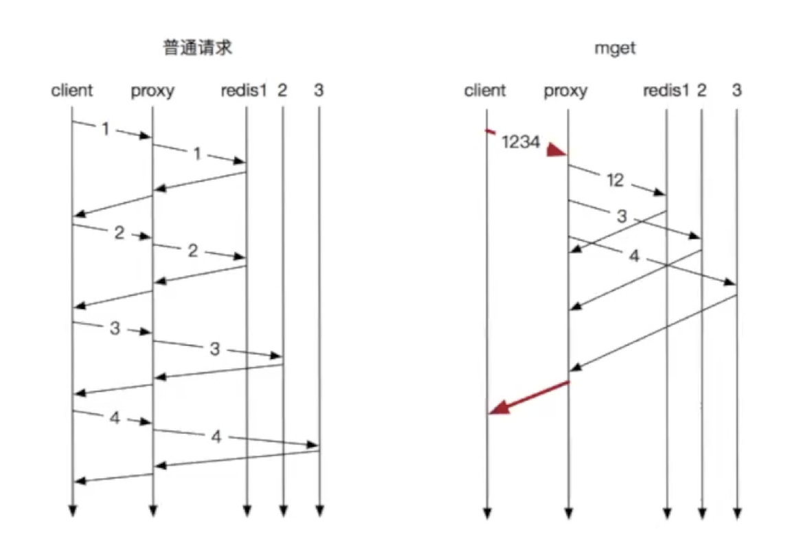
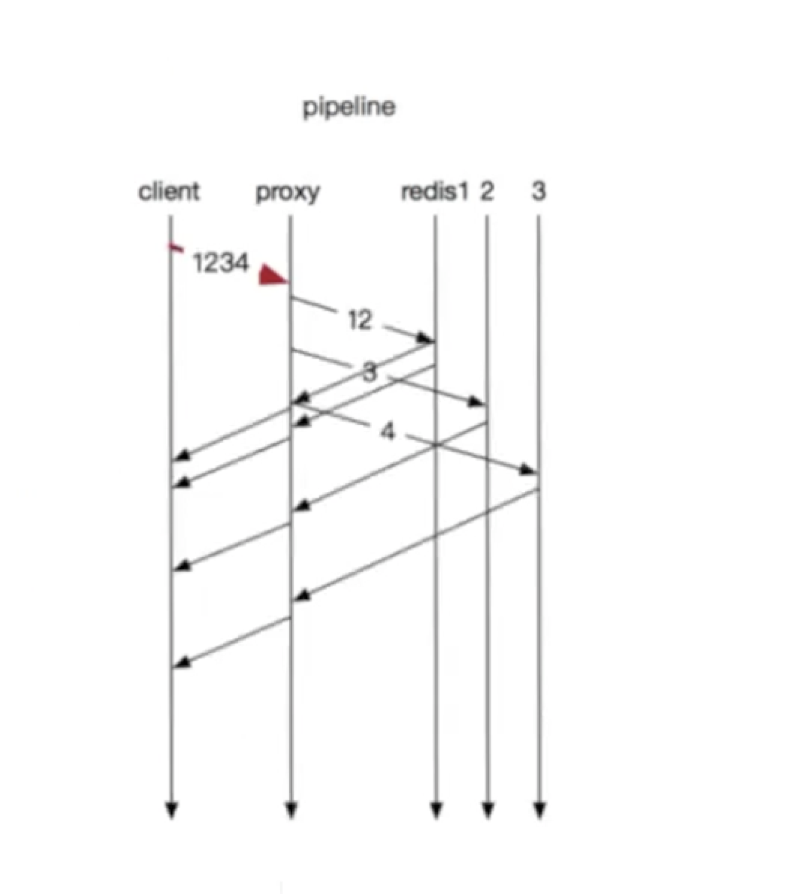

+ 普通请求：等待上一条命令应答后再执行，中间不仅仅多了RTT，而且还频繁的调用系统IO，发送网络请求

+ mget：节省RTT，但是前面的key需要等待最后一个key回复

+ pineline：节省RTT，减少IO调用次数

RTT(Round-Trip Time): 往返时延。在计算机网络中它是一个重要的性能指标，表示从发送端发送数据开始，到发送端收到来自接收端的确认（接收端收到数据后便立即发送确认），总共经历的时延。

RTT=传播时延（往返哒）+排队时延（路由器和交换机的）+数据处理时延（应用程序的）。

# Pipeline实现原理

pipeline管道操作是需要客户端与服务端的支持，客户端将命令写入缓冲，最后再通过exec命令发送给服务端，服务端通过命令拆分，逐个执行返回结果。

​    

pipeline通过减少客户端与redis的通信次数来实现降低往返延时时间，而且Pipeline 实现的原理是队列，而队列的原理是时先进先出，这样就保证数据的顺序性。

# Pipeline适用场景

  Pipeline在某些场景下非常有用，比如有多个command需要被"及时的"提交，而且他们对相应结果没有互相依赖，而且对结果响应也无需立即获得，那么pipeline就可以充当这种"批处理"的工具；而且在一定程度上，可以较大的提升性能,性能提升的原因主要是TCP链接中较少了"交互往返"的时间。

 不过在编码时请注意，pipeline期间将"独占"链接，此期间将不能进行非"管道"类型的其他操作，直到pipeline关闭；比如在上述代码中间，使用jedis.set(key,value)等操作都将抛出异常。

https://juejin.cn/post/6844904127001001991

https://redis.io/docs/manual/pipelining/

