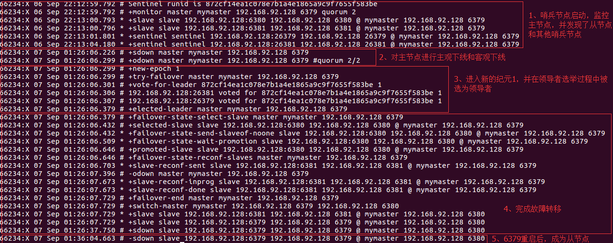

> Redis主从复制的作用有数据热备、负载均衡、故障恢复等；但主从复制存在的一个问题是故障恢复无法自动化。本文将要介绍的哨兵，它基于Redis主从复制，主要作用便是解决主节点故障恢复的自动化问题，进一步提高系统的高可用性。


## 部署哨兵节点

**哨兵节点本质上是特殊的Redis节点**，它的两个基本功能是**监控**和**故障转移**。

新建一个配置文件`sentinel.conf`,内容为

```shell
# sentinel monitor mymaster ip port quorum
sentinel monitor mymaster 192.168.92.128 6379 2
```


其中，sentinel monitor mymaster 192.168.92.128 6379 2 配置的含义是：

该哨兵节点监控192.168.92.128:6379这个主节点，该主节点的名称是mymaster，最后的2表示最低通过票数，与主节点的故障判定有关：至少需要2个哨兵节点同意，才能判定主节点故障并进行故障转移。

注意，在配置哨兵监控一个系统的时候，只需要配置其监控主数据库即可，哨兵会自动发现所有复制该主库的从库。


哨兵节点的启动有两种方式，二者作用是完全相同的：

```shell
redis-sentinel sentinel-26379.conf
redis-server sentinel-26379.conf --sentinel
```


哨兵系统的搭建过程，有几点需要注意：

（1）哨兵系统中的主从节点，与普通的主从节点并没有什么区别，故障发现和转移是由哨兵来控制和完成的。

（2）哨兵节点本质上是redis节点。

（3）**每个哨兵节点，只需要配置监控主节点**，便可以自动发现其他的哨兵节点和从节点。

（4）在哨兵节点启动和故障转移阶段，各个节点的配置文件会被重写(config rewrite)。


## Jedis使用哨兵


```java
public static void testSentinel() throws Exception {
         String masterName = "mymaster";
         Set<String> sentinels = new HashSet<>();
         sentinels.add("192.168.92.128:26379");
         sentinels.add("192.168.92.128:26380");
         sentinels.add("192.168.92.128:26381");
 
         JedisSentinelPool pool = new JedisSentinelPool(masterName, sentinels); //初始化过程做了很多工作
         Jedis jedis = pool.getResource();
         jedis.set("key1", "value1");
         pool.close();
}
```


Jedis客户端对哨兵提供了很好的支持。如上述代码所示，我们只需要向Jedis提供哨兵节点集合和masterName，构造JedisSentinelPool对象；然后便可以像使用普通redis连接池一样来使用了：通过pool.getResource()获取连接，执行具体的命令。


在整个过程中，我们的代码**不需要显式的指定主节点的地址**，就可以连接到主节点；

代码中对故障转移没有任何体现，就可以**在哨兵完成故障转移后自动的切换主节点**。

之所以可以做到这一点，是因为在JedisSentinelPool的构造器中，进行了相关的工作；主要包括以下两点：

（1）**遍历哨兵节点，获取主节点信息：**遍历哨兵节点，通过其中一个哨兵节点+masterName获得主节点的信息；该功能是通过调用哨兵节点的sentinel get-master-addr-by-name命令实现，该命令示例如下：

一旦获得主节点信息，停止遍历（因此一般来说遍历到第一个哨兵节点，循环就停止了）。

（2）**增加对哨兵的监听：**这样当**发生故障转移时，客户端便可以收到哨兵的通知**，从而完成主节点的切换。具体做法是：**利用redis提供的发布订阅功能，为每一个哨兵节点开启一个单独的线程，订阅哨兵节点的+switch-master频道，当收到消息时，重新初始化连接池**。


**需要注意的是，哨兵只是配置提供者，而不是代理**。


## 哨兵的原理


关于哨兵的原理，关键是了解以下几个概念。


### 建立连接


### 定时任务
每个哨兵节点维护了3个定时任务。定时任务的功能分别如下：1. 通过向主从节点发送info命令获取最新的主从结构；2. 通过发布订阅功能获取其他哨兵节点的信息；3. 通过向其他节点发送ping命令进行心跳检测，判断是否下线。


1. **每10秒哨兵会向主数据库和从数据库发送Info命令**。发送Info命令是的哨兵能够获得主节点的相关信息，并能够获得到从节点的信息，从而**实现对新节点的自动发现**。

2. **每2秒哨兵向主数据库和从数据库的__sentinel__:hello频道发送自己的信息** ，用于分享和获取同样监控此数据库的哨兵节点的信息。当其他节点受到信息后，会判断发消息的哨兵节点是否是新发现的节点，如果是则会加入哨兵列表。
3. **每30秒会向主数据库、从数据库和其他哨兵节点发送PING命令**。此命令的作用就是用于**定时监控这些数据库和哨兵节点有没有停止服务**，很关键的一点。


### 主观下线和客观下线

+ 主观下线：在心跳检测的定时任务中，如果其他节点超过一定时间没有回复，哨兵节点就会将其进行主观下线。顾名思义，**主观下线的意**思是一个哨兵节点“主观地”判断下线，也就是哨兵它自己认为一个节点下线了，但还没有得到其他节点的认同；与主观下线相对应的是客观下线。


+ 客观下线：哨兵节点在对主节点进行主观下线后，会通过`sentinel is-master-down-by-addr`命令询问其他哨兵节点该主节点的状态；**如果判断主节点下线的哨兵数量达到一定数值，则对该主节点进行客观下线**。

需要特别注意的是，**客观下线是主节点才有的概念**；**如果从节点和哨兵节点发生故障，被哨兵主观下线后，不会再有后续的客观下线和故障转移操作**。

### 选举领导者哨兵节点

当主节点被判断客观下线以后，各个哨兵节点会进行协商，选举出一个领导者哨兵节点，并由该领导者节点对其进行故障转移操作。

监视该主节点的所有哨兵都有可能被选为领导者，选举使用的算法是Raft算法。

使用Raft算法选举领头哨兵的过程如下：

1. 发现主数据库客观下线的哨兵节点（称为节点A），向每个哨兵节点发送命令，要求对方选自己称为领导者哨兵。
2. 如果目标哨兵节点没有选过其他人，则会同意将A设置成领头节点。
3. 如果A发现有超过半数且超过quorum参数值的哨兵节点同意选自己为领导者节点，则A成功成为领导者节点。
4. 当有多个哨兵节点同时参选领头节点的时候，则会出现任何节点都不能当选的情况，这个时候每个参选节点都等待一个随机时间重新发起参选请求，进行下一轮选举，直到选举成功。

**注意：每次选举出来的最多只会选出一个领头哨兵。**


### 故障恢复
选举出的领导者哨兵，开始进行故障恢复操作，该操作大体可以分为3个步骤： 
1. **在从节点中选择新的主节点**：选择的原则是，**首先过滤掉不健康的从节点；然后选择优先级最高的从节点(由slave-priority指定)；如果优先级无法区分，则选择复制偏移量最大的从节点；如果仍无法区分，则选择runid最小的从节点**。（健康状态-->优先级-->复制偏移量-->runid）
2. **更新主从状态**：**通过slaveof no one命令，让选出来的从节点成为主节点**；并**通过slaveof命令让其他节点成为其从节点**。
3. **将已经下线的主节点(如localhost:6379)设置为新的主节点的从节点**，当localhost:6379重新上线后，它会成为新的主节点的从节点。


通过上述几个关键概念，可以基本了解哨兵的工作原理。为了更形象的说明，下图展示了领导者哨兵节点的日志，包括从节点启动到完成故障转移。




## 配置与实践建议

### 参数配置
下面介绍与哨兵相关的几个配置。

1. sentinel monitor {masterName} {masterIp} {masterPort} {quorum}

sentinel monitor是哨兵最核心的配置，在前文讲述部署哨兵节点时已说明，其中：masterName指定了主节点名称，masterIp和masterPort指定了主节点地址**，quorum是判断主节点客观下线的哨兵数量阈值**：当判定主节点下线的哨兵数量达到quorum时，对主节点进行客观下线。**quorum建议取值为N/2 + 1（其中 N 为哨兵节点的数量）**。

2. sentinel down-after-milliseconds {masterName} {time}

sentinel down-after-milliseconds与主观下线的判断有关：**哨兵使用ping命令对其他节点进行心跳检测，如果其他节点超过down-after-milliseconds配置的时间没有回复，哨兵就会将其进行主观下线**。该配置对主节点、从节点和哨兵节点的主观下线判定都有效。

down-after-milliseconds的默认值是30000，即30s；可以根据不同的网络环境和应用要求来调整：值越大，对主观下线的判定会越宽松，好处是误判的可能性小，坏处是故障发现和故障转移的时间变长，客户端等待的时间也会变长。例如，如果应用对可用性要求较高，则可以将值适当调小，当故障发生时尽快完成转移；如果网络环境相对较差，可以适当提高该阈值，避免频繁误判。

3. sentinel parallel-syncs {masterName} {number}

sentinel parallel-syncs与故障转移之后从节点的复制有关，**规定了每次向新的主节点发起复制操作的从节点个数**。例如，假设主节点切换完成之后，有3个从节点要向新的主节点发起复制；如果parallel-syncs=1，则从节点会一个一个开始复制；如果parallel-syncs=3，则3个从节点会一起开始复制。

parallel-syncs取值越大，从节点完成复制的时间越快，但是对主节点的网络负载、硬盘负载造成的压力也越大；应根据实际情况设置。例如，如果主节点的负载较低，而从节点对服务可用的要求较高，可以适量增加parallel-syncs取值。parallel-syncs的默认值是1。

4. sentinel failover-timeout {masterName} {time}

sentinel failover-timeout与故障转移超时的判断有关，但是**该参数不是用来判断整个故障恢复阶段的超时**，而是其几个子阶段的超时，例如如果**从节点晋升为主节点时间超过timeout**，或**从节点向新的主节点发起复制操作的时间**(不包括复制数据的时间)超过timeout，都会导致故障转移超时失败。

failover-timeout的默认值是180000，即180s；如果超时，则下一次该值会变为原来的2倍。


### 实践建议
（1）**哨兵节点的数量应不止一个**，一方面增加哨兵节点的冗余，避免哨兵本身成为高可用的瓶颈；另一方面减少对下线的误判。此外，**这些不同的哨兵节点应部署在不同的物理机上**。

（2）**哨兵节点的数量应该是奇数**，便于哨兵通过投票做出“决策”：领导者选举的决策、客观下线的决策等。

（3）**各个哨兵节点的配置应一致**，包括硬件、参数等；此外，所有节点都应该使用ntp或类似服务，保证时间准确、一致。


