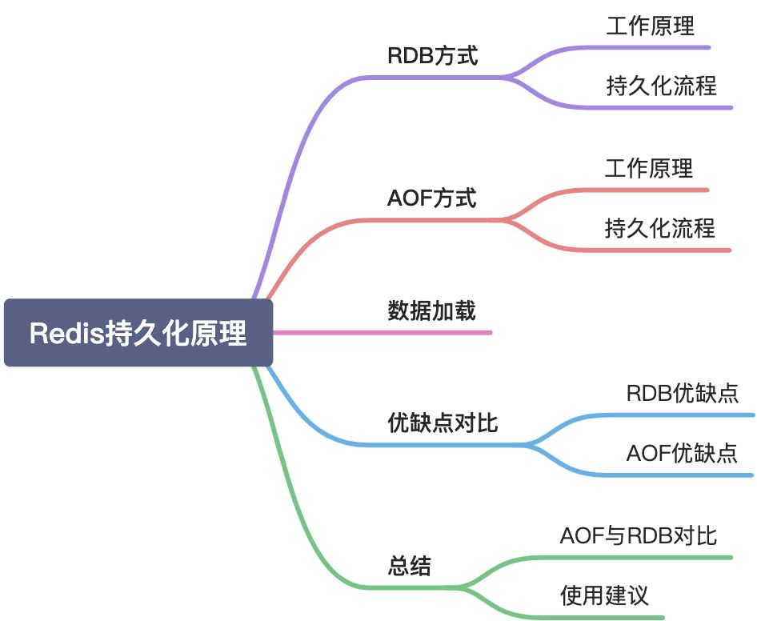
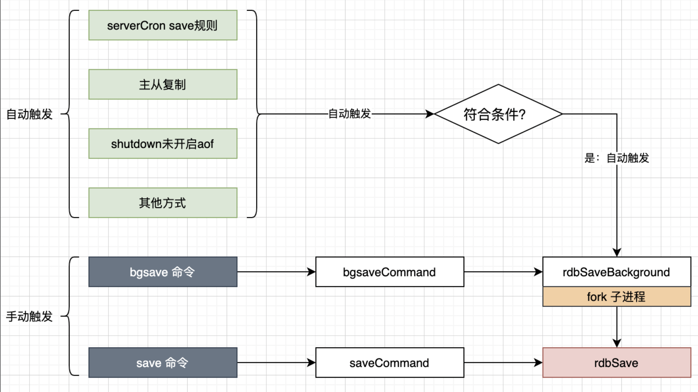
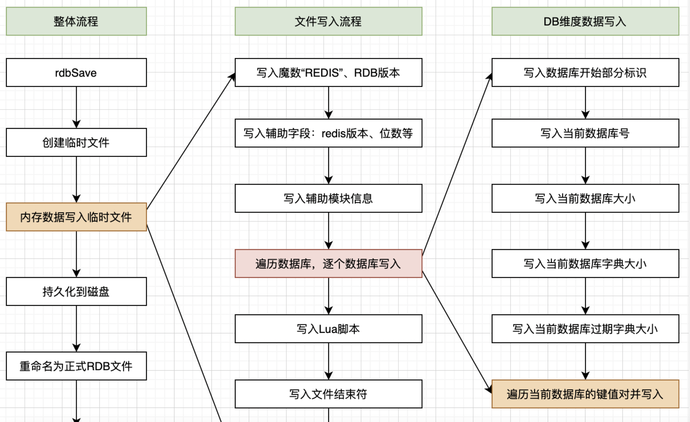
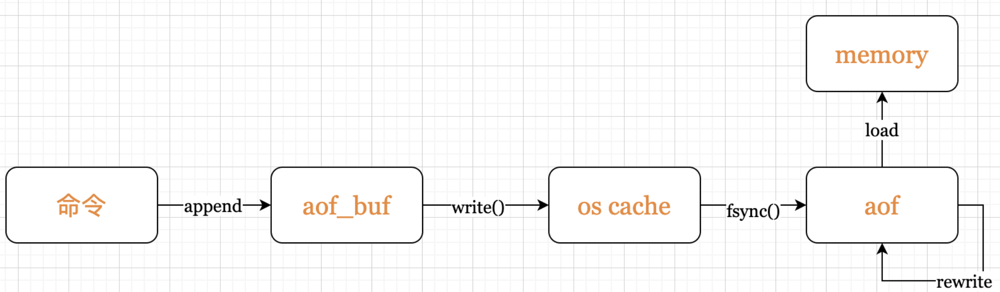
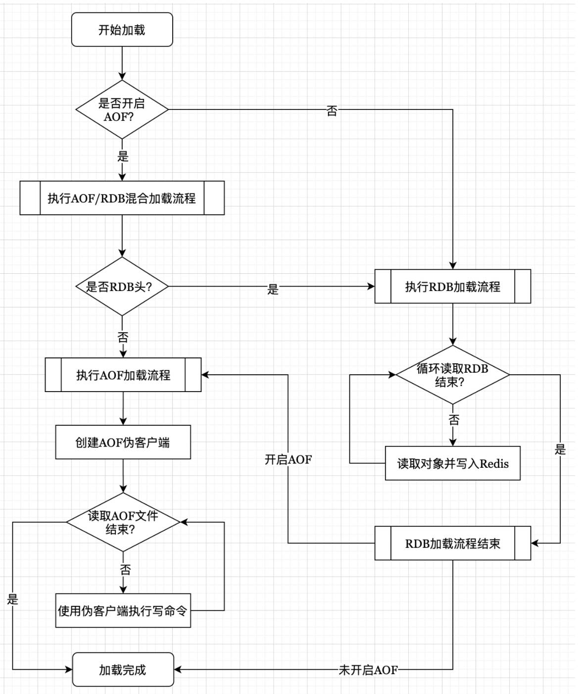
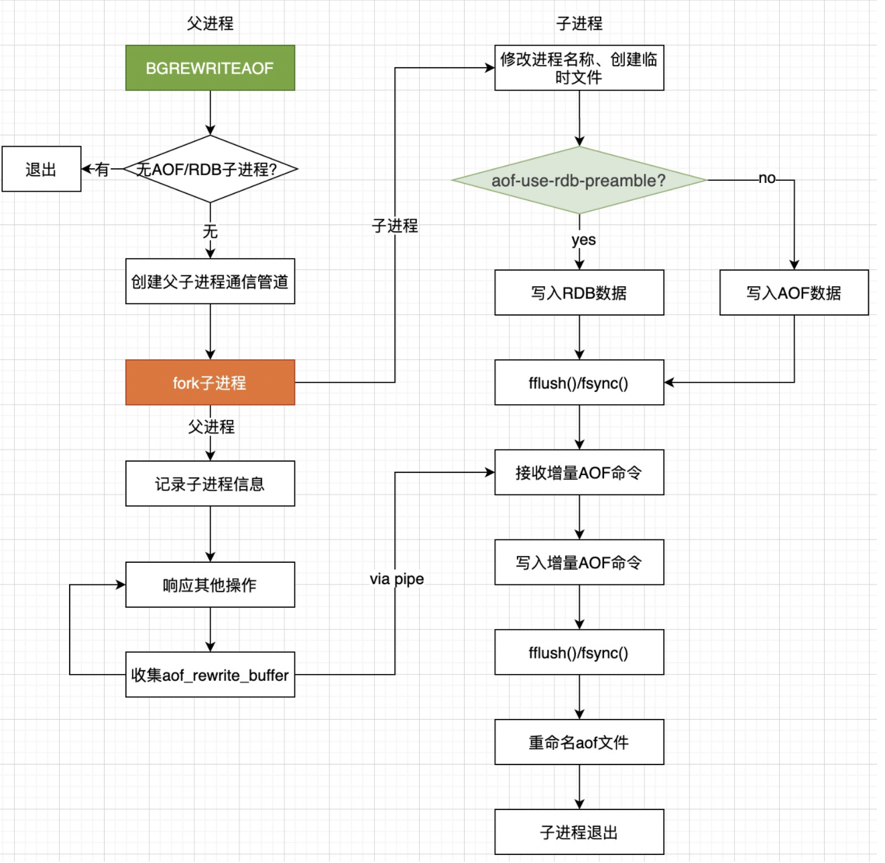

# 简介

Redis是一个内存数据库，所有的数据将保存在内存中，这与传统的MySQL、Oracle、SqlServer等关系型数据库直接把数据保存到硬盘相比，Redis的读写效率非常高。但是保存在内存中也有一个很大的缺陷，一旦断电或者宕机，内存数据库中的内容将会全部丢失。为了弥补这一缺陷，Redis提供了把内存数据持久化到硬盘文件，以及通过备份文件来恢复数据的功能，即Redis持久化机制。

Redis支持两种方式的持久化：RDB快照和AOF。




# RDB

RDB快照用官方的话来说：RDB持久化方案是按照指定时间间隔对你的数据集生成的**时间点快照**（point-to-time snapshot）。

它**以紧缩的二进制文件保存Redis数据库某一时刻所有数据对象的内存快照**，可用于Redis的数据**备份**、**转移**与**恢复**。到目前为止，仍是官方的默认支持方案。


## 触发条件

触发的方式分为手动和自动。手动触发容易理解，是指我们通过Redis客户端人为的对Redis服务端发起持久化备份指令，然后Redis服务端开始执行持久化流程，这里的指令有save和bgsave。自动触发是Redis根据自身运行要求，在满足预设条件时自动触发的持久化流程。

### 自动触发
+ serverCron中`save m n`配置规则自动触发；
+ 从节点全量复制时，主节点发送rdb文件给从节点完成复制操作，主节点会出发bgsave；
+ 执行`debug reload`命令重新加载redis时；
+ 默认情况下（未开启AOF）执行shutdown命令时，自动执行bgsave；


**save规则及检查**

`serverCron`是Redis内的一个周期性函数，每隔100毫秒执行一次，它的其中一项工作就是：根据配置文件中save规则来判断当前需要进行自动持久化流程，如果满足条件则尝试开始持久化。


`save m n`的意思是：m秒内有n条写入就触发一次快照，即备份一次。save参数可以配置多组，满足在不同条件的备份要求。如果需要关闭RDB的自动备份策略，可以使用`save ""`。以下为几种配置的说明：

```
# 表示900秒（15分钟）内至少有1个key的值发生变化，则执行
save 900 1
# 表示300秒（5分钟）内至少有1个key的值发生变化，则执行
save 300 10
# 表示60秒（1分钟）内至少有10000个key的值发生变化，则执行
save 60 10000
# 该配置将会关闭RDB方式的持久化
save ""
```


### 手动触发
1. `save`
2. `bgsave`
3. `flushall`

总结如下图所示：





## 持久化原理

在Redis内完成RDB持久化的方法有rdbSave和rdbSaveBackground两个函数方法（源码文件rdb.c中），先简单说下两者差别：

+ `rdbSave`：是同步执行的，方法调用后就会立刻启动持久化流程。由于Redis是单线程模型，持久化过程中会阻塞，Redis无法对外提供服务；
+ `rdbSaveBackground`：是后台（异步）执行的，该方法会fork出子进程，真正的持久化过程是在子进程中执行的（调用rdbSave），主进程会继续提供服务；


1. 第一种情况不可取，持久化备份会导致短时间内Redis服务不可用，这**对于高可用的系统来讲是无法容忍的**。

2. 第二种方式是RDB持久化的主要实践方式。由于fork子进程后，父进程数据一直在变化，子进程并不与父进程同步，**RDB持久化必然无法保证实时性**；RDB持久化完成后发生断电或宕机，会导致部分数据丢失；**备份频率决定了丢失数据量的大小**，提高备份频率，意味着fork过程消耗较多的CPU资源，也会导致较大的磁盘I/O。


### Fork 和 CopyOnWrite


Redis默认会把快照存储文件存储在当前进程的工作目录中的dump.rdb文件中，可以用配置`dir`和`dbfilename`配置存储路径和文件名。


**快照的过程**

1. Redis使用`fork`函数创建一个子进程复制一份当前进程的副本——子进程；
2. 父进程继续接受并处理客户端发来的命令，而子进程开始将内存中的数据写入硬盘中临时文件。
3. 当子进程写入完所有数据后会用该临时文件替换旧的RDB备份文件，至此一次备份完成。


> 注意，这里使用到了 Unix中 CoW，也就是写时复制技术。具体的，这里就不介绍了。


需要注意的是，如果父进程内存占用过大，fork过程会比较耗时，在这个过程中父进程无法对外提供服务；

另外，需要综合考虑计算机内存使用量，fork子进程后会占用双倍的内存资源，需要确保内存够用。

通过`info stats`(在redis-cli中查看)命令查看latest_fork_usec选项，可以获取最近一个fork以操作的耗时。


### rdbSaveBackground

rdbSaveBackground是RDB持久化的辅助性方法，主要工作是fork子进程，然后根据调用方（父进程或者子进程）不同，有两种不同的执行逻辑。

+ 如果调用方是父进程，则fork出子进程，保存子进程信息后直接返回。
+ 如果调用方是子进程则调用rdbSave执行RDB持久化逻辑，持久化完成后退出子进程。

```c
int rdbSaveBackground(char *filename, rdbSaveInfo *rsi) {
    pid_t childpid;

    if (hasActiveChildProcess()) return C_ERR;

    server.dirty_before_bgsave = server.dirty;
    server.lastbgsave_try = time(NULL);

    // fork子进程
    if ((childpid = redisFork(CHILD_TYPE_RDB)) == 0) {
        int retval;

        /* Child 子进程：修改进程标题 */
        redisSetProcTitle("redis-rdb-bgsave");
        redisSetCpuAffinity(server.bgsave_cpulist);
        // 执行rdb持久化
        retval = rdbSave(filename,rsi);
        if (retval == C_OK) {
            sendChildCOWInfo(CHILD_TYPE_RDB, 1, "RDB");
        }
        // 持久化完成后，退出子进程
        exitFromChild((retval == C_OK) ? 0 : 1);
    } else {
        /* Parent 父进程：记录fork子进程的时间等信息*/
        if (childpid == -1) {
            server.lastbgsave_status = C_ERR;
            serverLog(LL_WARNING,"Can't save in background: fork: %s",
                strerror(errno));
            return C_ERR;
        }
        serverLog(LL_NOTICE,"Background saving started by pid %ld",(long) childpid);
        // 记录子进程开始的时间、类型等。
        server.rdb_save_time_start = time(NULL);
        server.rdb_child_type = RDB_CHILD_TYPE_DISK;
        return C_OK;
    }
    return C_OK; /* unreached */
}
```

### rdbSave

`rdbSave`是真正执行持久化的方法，它在执行时存在大量的I/O、计算操作，耗时、CPU占用较大，**在Redis的单线程模型中持久化过程会持续占用线程资源**，**进而导致Redis无法提供其他服务**。

为了解决这一问题Redis在rdbSaveBackground中fork出子进程，由子进程完成持久化工作，避免了占用父进程过多的资源。


整体流程可以总结为：创建并打开临时文件、Redis内存数据写入临时文件、临时文件写入磁盘、临时文件重命名为正式RDB文件、更新持久化状态信息（dirty、lastsave）。其中“Redis内存数据写入临时文件”最为核心和复杂，写入过程直接体现了RDB文件的文件格式，本着一图胜千言的理念，我按照源码流程绘制了下图。





# AOF

RDB是一种时间点（point-to-time）快照，适合数据备份及灾难恢复，由于工作原理的“先天性缺陷”无法保证实时性持久化，这对于缓存丢失零容忍的系统来说是个硬伤，于是就有了AOF。


## AOF原理

AOF是Append Only File的缩写，它是Redis的完全持久化策略，从1.1版本开始支持；这里的file存储的是引起Redis数据修改的命令集合（比如：set/hset/del等）。

这些集合按照Redis Server的处理顺序追加到文件中。当重启Redis时，Redis就可以从头读取AOF中的指令并重放，进而恢复关闭前的数据状态。


AOF持久化默认是关闭的，修改redis.conf以下信息并重启，即可开启AOF持久化功能。

```
# no-关闭，yes-开启，默认no
appendonly yes
appendfilename appendonly.aof
```

AOF本质是为了持久化，持久化对象是Redis内每一个key的状态，持久化的目的是为了在Reids发生故障重启后能够恢复至重启前或故障前的状态。相比于RDB，AOF采取的策略是按照执行顺序持久化每一条能够引起Redis中对象状态变更的命令，命令是有序的、有选择的。把aof文件转移至任何一台Redis Server，从头到尾按序重放这些命令即可恢复如初。


最本质的原理用**命令重放**四个字就可以概括。

但是，考虑实际生产环境的复杂性及操作系统等方面的限制，Redis所要考虑的工作要比这个例子复杂的多。


## 持久化流程

从流程上来看，AOF的工作原理可以概括为几个步骤：

命令追加（append）、文件写入与同步（fsync）、文件重写（rewrite）、重启加载（load）。





### 命令追加

当 AOF 持久化功能处于打开状态时，Redis 在执行完一个写命令之后，会以协议格式(也就是RESP，即 Redis 客户端和服务器交互的通信协议 )把被执行的写命令追加到 Redis 服务端维护的 AOF 缓冲区末尾。对AOF文件只有单线程的追加操作，没有seek等复杂的操作，即使断电或宕机也不存在文件损坏风险。


### 文件写入与同步

AOF文件的写入与同步离不开操作系统的支持，开始介绍之前，我们需要补充一下Linux I/O缓冲区相关知识。硬盘I/O性能较差，文件读写速度远远比不上CPU的处理速度，如果每次文件写入都等待数据写入硬盘，会整体拉低操作系统的性能。为了解决这个问题，操作系统提供了延迟写（delayed write）机制来提高硬盘的I/O性能。

> 传统的UNIX实现在内核中设有缓冲区高速缓存或页面高速缓存，大多数磁盘I/O都通过缓冲进行。 当将数据写入文件时，内核通常先将该数据复制到其中一个缓冲区中，如果该缓冲区尚未写满，则并不将其排入输出队列，而是等待其写满或者当内核需要重用该缓冲区以便存放其他磁盘块数据时， 再将该缓冲排入到输出队列，然后待其到达队首时，才进行实际的I/O操作。这种输出方式就被称为延迟写。
>
> 为了保证磁盘上实际文件系统与缓冲区高速缓存中内容的一致性，UNIX系统提供了`sync`、`fsync`和`fdatasync`三个函数为强制写入硬盘提供支持。


延迟写减少了磁盘读写次数，但是却降低了文件内容的更新速度，使得欲写到文件中的数据在一段时间内并没有写到磁盘上。当系统发生故障时，这种延迟可能造成文件更新内容的丢失。


Redis每次事件轮训结束前（`beforeSleep`）都会调用函数`flushAppendOnlyFile`。

`flushAppendOnlyFile`会把AOF缓冲区（`aof_buf`）中的数据写入内核缓冲区，

并且根据`appendfsync`配置来决定采用何种策略把内核缓冲区中的数据写入磁盘，即调用`fsync()`。该配置有三个可选项`always`、`no`、`everysec`，具体说明如下：

+ always：每次都调用`fsync()`，是安全性最高、性能最差的一种策略。
+ no：不会调用`fsync()`。性能最好，安全性最差。
+ everysec：仅在满足同步条件时调用`fsync()`。**这是官方建议的同步策略**，也是默认配置，做到兼顾性能和数据安全性，理论上只有在系统突然宕机的情况下丢失1秒的数据。

注意：上面介绍的策略受配置项`no-appendfsync-on-rewrite`的影响，它的作用是告知Redis：AOF文件重写期间是否禁止调用fsync()，默认是no，即允许允许调用`fsync`。


### 文件重写

如前面提到的，Redis长时间运行，命令不断写入AOF，文件会越来越大，不加控制可能影响宿主机的安全。

为了解决AOF文件体积问题，Redis引入了**AOF文件重写**功能，它会根据Redis内数据对象的最新状态生成新的AOF文件，**新旧文件对应的数据状态一致，但是新文件会具有较小的体积**。重写既减少了AOF文件对磁盘空间的占用，又可以提高Redis重启时数据恢复的速度。


**AOF文件太大时会触发AOF文件重写，那到底是多大呢？有哪些情况会触发重写操作呢？**

与RDB方式一样，AOF文件重写既可以手动触发，也会自动触发。手动触发直接调用`bgrewriteaof`命令，如果当时无子进程执行会立刻执行，否则安排在子进程结束后执行。自动触发由Redis的周期性方法`serverCron`检查在满足一定条件时触发。先了解两个配置项：

+ auto-aof-rewrite-percentage：代表当前AOF文件大小（aof_current_size）和上一次重写后AOF文件大小（aof_base_size）相比，增长的比例。
+ auto-aof-rewrite-min-size：表示运行`BGREWRITEAOF`时AOF文件占用空间最小值，默认为64MB；

Redis启动时把`aof_base_size`初始化为当时aof文件的大小，Redis运行过程中，当AOF文件重写操作完成时，会对其进行更新；`aof_current_size`为`serverCron`执行时AOF文件的实时大小。当满足以下两个条件时，AOF文件重写就会触发：

1. 增长比例：(aof_current_size - aof_base_size) / aof_base_size > auto-aof-rewrite-percentage

2. 文件大小：aof_current_size > auto-aof-rewrite-min-size


### 混合持久化方案

除了纯AOF的方式，还有RDB+AOF方式。


这一策略由配置参数`aof-use-rdb-preamble`（使用RDB作为AOF文件的前半段）控制，设置为yes可开启。所以，在AOF重写过程中文件的写入会有两种不同的方式。

+ no：按照AOF格式写入命令，与4.0前版本无差别；
+ yes：先按照RDB格式写入数据状态，然后把重写期间AOF缓冲区的内容以AOF格式写入，文件前半部分为RDB格式，后半部分为AOF格式。


### 重启加载

Redis启动后通过`loadDataFromDisk`函数执行数据加载工作。这里需要注意，虽然持久化方式可以选择AOF、RDB或者两者兼用，但是**数据加载时必须做出选择**，两种方式各自加载一遍就乱套了。

理论上，AOF持久化比RDB具有更好的实时性，当**开启了AOF持久化方式，Redis在数据加载时优先考虑AOF方式**。而且，Redis 4.0版本后AOF支持了混合持久化，加载AOF文件需要考虑版本兼容性。Redis数据加载流程如下图所示：





在AOF方式下，开启混合持久化机制生成的文件是**RDB头+AOF尾**，未开启时生成的文件全部为AOF格式。

考虑两种文件格式的兼容性，如果Redis发现AOF文件为RDB头，会使用RDB数据加载的方法读取并恢复前半部分；然后再使用AOF方式读取并恢复后半部分。由于AOF格式存储的数据为RESP协议命令，Redis采用伪客户端执行命令的方式来恢复数据。

如果在AOF命令追加过程中发生宕机，由于延迟写的技术特点，AOF的RESP命令可能不完整（被截断）。

遇到这种情况时，Redis会按照配置项`aof-load-truncated`执行不同的处理策略。这个配置是告诉Redis启动时读取aof文件，如果发现文件被截断（不完整）时该如何处理：

+ yes：则尽可能多的加载数据，并以日志的方式通知用户；
+ no：则以系统错误的方式崩溃，并禁止启动，需要用户修复文件后再重启。





# RDB vs AOF

Redis提供了两种持久化的选择：

1. RDB支持以特定的实践间隔为数据集生成时间点快照；
2. AOF把Redis Server收到的每条写指令持久化到日志中，待Redis重启时通过重放命令恢复数据。日志格式为RESP协议，对日志文件只做append操作，无损坏风险。并且当AOF文件过大时可以自动重写压缩文件。


当然，如果你不需要对数据进行持久化，也可以禁用Redis的持久化功能，但是大多数情况并非如此。实际上，我们时有可能**同时使用RDB和AOF两种方式**的，最重要的就是我们要理解两者的区别，以便合理使用。


#### RDB优点

+ RDB是一个**格式紧凑压缩**的二进制文件，代表Redis在某一个时间点上的数据快照，非常**适合用于备份、全量复制**等场景。
+ RDB**对灾难恢复、数据迁移非常友好**，RDB文件可以转移至任何需要的地方并重新加载。
+ RDB是Redis数据的内存快照，**数据恢复速度较快**，相比于AOF的命令重放有着更高的性能。

#### RDB缺点

+ RDB方式**无法做到实时或秒级持久化**。因为持久化过程是通过fork子进程后由子进程完成的，子进程的内存只是在fork操作那一时刻父进程的数据快照，而fork操作后父进程持续对外服务，内部数据时刻变更，子进程的数据不再更新，两者始终存在差异，所以无法做到实时性。
+ RDB持久化过程中的fork操作，会导致**内存占用加倍（可能）**，而且父进程数据越多，fork过程越长。
+ Redis请求**高并发可能会频繁命中save规则**，导致fork操作及持久化备份的频率不可控；
+ RDB文件有文件格式要求，不同版本的Redis会对文件格式进行调整，存在老版本无法兼容新版本的问题。


#### AOF优点

+ AOF持久化具有**更好的实时性**，我们可以选择三种不同的方式（`appendfsync`）：no、every second、always，**every second作为默认的策略**具有最好的性能，极端情况下可能会丢失一秒的数据。
+ AOF文件只有append操作，无复杂的seek等文件操作，没有损坏风险。即使最后写入数据被截断，也很容易使用`redis-check-aof`工具修复；
+ AOF文件以已于理解与解析的方式包含了对Redis中数据的所有操作命令。即使不小心错误的清除了所有数据，只要没有对AOF文件重写，我们就可以通过移除最后一条命令找回所有数据。
+ **AOF已经支持混合持久化**，**文件大小可以有效控制**，并**提高了数据加载时的效率**。

#### AOF缺点

+ 对于相同的数据集合，**AOF文件通常会比RDB文件大**；
+ 在特定的fsync策略下，**AOF会比RDB略慢**。一般来讲，fsync_every_second的性能仍然很高，fsync_no的性能与RDB相当。但是在巨大的写压力下，RDB更能提供最大的低延时保障。
+ 在AOF上，Redis曾经遇到一些几乎不可能在RDB上遇到的罕见bug。一些特殊的指令（如BRPOPLPUSH）导致重新加载的数据与持久化之前不一致，Redis官方曾经在相同的条件下进行测试，但是无法复现问题。


## 使用建议

对RDB和AOF两种持久化方式的工作原理、执行流程及优缺点了解后，我们来思考下，实际场景中应该怎么权衡利弊，合理的使用两种持久化方式。如果仅仅是使用Redis作为缓存工具，所有数据可以根据持久化数据库进行重建，则可关闭持久化功能，做好预热、缓存穿透、击穿、雪崩之类的防护工作即可。

一般情况下，Redis会承担更多的工作，如分布式锁、排行榜、注册中心等，持久化功能在灾难恢复、数据迁移方面将发挥较大的作用。建议遵循几个原则：

+ **不要把Redis作为数据库**，所有数据尽可能可由应用服务自动重建。
+ 使用4.0以上版本Redis，使用AOF+RDB混合持久化功能。
+ **合理规划Redis最大占用内存**，防止AOF重写或save过程中资源不足。
+ 避免单机部署多实例。
+ **生产环境多为集群化部署**，可在slave开启持久化能力，让master更好的对外提供写服务。
+ **备份文件应自动上传至异地机房或云存储**，做好灾难备份。


> [深入学习Redis（2）：持久化 ](https://www.cnblogs.com/kismetv/p/9137897.html)
