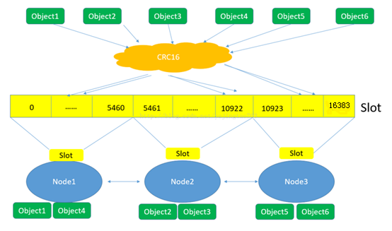
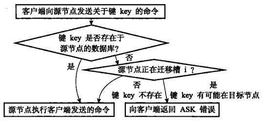
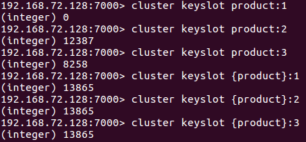

# 一、集群的作用

集群，即Redis Cluster，是Redis 3.0开始引入的分布式存储方案。

集群由多个节点(Node)组成，Redis的数据分布在这些节点中。

**集群中的节点分为主节点和从节点**：

**只有主节点负责读写请求和集群信息的维护；从节点只进行主节点数据和状态信息的复制**。


集群的作用，可以归纳为两点：

1. **数据分区**：数据分区(或称数据分片)是集群最核心的功能。

集群将数据分散到多个节点，一方面突破了Redis单机内存大小的限制，**存储容量大大增加**；

另一方面每个主节点都可以对外提供读服务和写服务，**大大提高了集群的响应能力**。

> Redis单机内存大小受限问题，在介绍持久化和主从复制时都有提及；例如，如果单机内存太大，bgsave和bgrewriteaof的fork操作可能导致主进程阻塞，主从环境下主机切换时可能导致从节点长时间无法提供服务，全量复制阶段主节点的复制缓冲区可能溢出……。


2. **高可用**：**集群支持主从复制和主节点的自动故障转移**（与哨兵类似）；当**任一节点发生故障时，集群仍然可以对外提供服务**。


# 二、集群的基本原理

数据分区有顺序分区、哈希分区等，其中哈希分区由于其天然的随机性，使用广泛；集群的分区方案便是哈希分区的一种。

哈希分区的基本思路是：对数据的特征值（如key）进行哈希，然后根据哈希值决定数据落在哪个节点。常见的哈希分区包括：哈希取余分区、一致性哈希分区、带虚拟节点的一致性哈希分区等。

衡量数据分区方法好坏的标准有很多，其中比较重要的两个因素是(1)数据分布是否均匀(2)增加或删减节点对数据分布的影响。由于哈希的随机性，哈希分区基本可以保证数据分布均匀；因此在比较哈希分区方案时，重点要看增减节点对数据分布的影响。

（1）**哈希取余分区**

哈希取余分区思路非常简单：计算key的hash值，然后对节点数量进行取余，从而决定数据映射到哪个节点上。该方案最大的问题是，当新增或删减节点时，节点数量发生变化，系统中所有的数据都需要重新计算映射关系，引发大规模数据迁移。


（2）**一致性哈希分区**

一致性哈希算法将整个哈希值空间组织成一个虚拟的圆环，如下图所示，范围为0-2^32-1；对于每个数据，根据key计算hash值，确定数据在环上的位置，然后从此位置沿环顺时针行走，找到的第一台服务器就是其应该映射到的服务器。

与哈希取余分区相比，一致性哈希分区将增减节点的影响限制在相邻节点。以上图为例，如果在node1和node2之间增加node5，则只有node2中的一部分数据会迁移到node5；如果去掉node2，则原node2中的数据只会迁移到node4中，只有node4会受影响。

一致性哈希分区的主要问题在于，当节点数量较少时，增加或删减节点，对单个节点的影响可能很大，造成数据的严重不平衡。还是以上图为例，如果去掉node2，node4中的数据由总数据的1/4左右变为1/2左右，与其他节点相比负载过高。此时可以将一个真实节点映射成多个虚拟节点，然后将多个虚拟节点分布到哈希环上。


（3）**哈希槽**

该方案在一致性哈希分区的基础上，引入了虚拟节点的概念。**Redis集群使用的便是该方案，其中的虚拟节点称为槽（slot）。**槽是介于数据和实际节点之间的虚拟概念；每个实际节点包含一定数量的槽，每个槽包含哈希值在一定范围内的数据。引入槽以后，数据的映射关系由**数据hash->实际节点**，变成了**数据hash->槽->实际节点**。

**在使用了槽的一致性哈希分区中，槽是数据管理和迁移的基本单位。槽解耦了数据和实际节点之间的关系，增加或删除节点对系统的影响很小。**仍以上图为例，系统中有4个实际节点，假设为其分配16个槽(0-15)； 槽0-3位于node1，4-7位于node2，以此类推。如果此时删除node2，只需要将槽4-7重新分配即可，例如槽4-5分配给node1，槽6分配给node3，槽7分配给node4；可以看出删除node2后，数据在其他节点的分布仍然较为均衡。

槽的数量一般远小于2^32，远大于实际节点的数量；在Redis集群中，槽的数量为**16384**。


下面这张图很好的总结了Redis集群将数据映射到实际节点的过程：





（1）Redis对数据的特征值（一般是key）计算哈希值，使用的算法是CRC16。

（2）根据哈希值，计算数据属于哪个槽。

（3）根据槽与节点的映射关系，计算数据属于哪个节点。


# 三、实践须知


## 1. 集群伸缩

实践中常常需要对集群进行伸缩，如访问量增大时的扩容操作。Redis集群可以在不影响对外服务的情况下实现伸缩；**伸缩的核心是槽迁移：修改槽与节点的对应关系，实现槽(即数据)在节点之间的移动。**

例如，如果槽均匀分布在集群的3个节点中，此时增加一个节点，则需要从3个节点中分别拿出一部分槽给新节点，从而实现槽在4个节点中的均匀分布。

### 增加节点

假设要增加7003和8003节点，其中8003是7003的从节点；步骤如下：

（1）**启动节点**：方法参见集群搭建

（2）**节点握手**：可以使用`cluster meet`命令，但在生产环境中建议使用redis-trib.rb的add-node工具，其原理也是cluster meet，但它会先检查新节点是否已加入其它集群或者存在数据，避免加入到集群后带来混乱。

```
redis-trib.rb ``add``-node 192.168.72.128:7003 192.168.72.128 7000``redis-trib.rb ``add``-node 192.168.72.128:8003 192.168.72.128 7000
```

（3）**迁移槽**：推荐使用redis-trib.rb的reshard工具实现。reshard自动化程度很高，只需要输入**redis-trib.rb reshard ip:port (ip和port可以是集群中的任一节点)**，然后按照提示输入以下信息，槽迁移会自动完成：

+ 待迁移的槽数量：16384个槽均分给4个节点，每个节点4096个槽，因此待迁移槽数量为4096
+ 目标节点id：7003节点的id
+ 源节点的id：7000/7001/7002节点的id

（4）**指定主从关系**：方法参见集群搭建


### 减少节点

假设要下线7000/8000节点，可以分为两步：

（1）**迁移槽**：使用reshard将7000节点中的槽均匀迁移到7001/7002/7003节点

（2）**下线节点**：使用redis-trib.rb del-node工具；应先下线从节点再下线主节点，因为若主节点先下线，从节点会被指向其他主节点，造成不必要的全量复制。

```
redis-trib.rb del-node 192.168.72.128:7001 {节点8000的id}
redis-trib.rb del-node 192.168.72.128:7001 {节点7000的id}
```


### ASK错误

集群伸缩的核心是槽迁移。在槽迁移过程中，如果客户端向源节点发送命令，源节点执行流程如下：



图片来源：《Redis设计与实现》

客户端收到ASK错误后，从中读取目标节点的地址信息，并向目标节点重新发送请求，就像收到MOVED错误时一样。但是二者有很大区别：ASK错误说明数据正在迁移，不知道何时迁移完成，因此重定向是临时的，SMART客户端不会刷新slots缓存；MOVED错误重定向则是(相对)永久的，SMART客户端会刷新slots缓存。


## 2. 故障转移

在 《哨兵》一文中，介绍了哨兵实现故障发现和故障转移的原理。

虽然细节上有很大不同，但集群的实现与哨兵思路类似：**通过定时任务发送PING消息检测其他节点状态；节点下线分为主观下线和客观下线；客观下线后选取从节点进行故障转移**。

**与哨兵一样，集群只实现了主节点的故障转移**；

**从节点故障时只会被下线，不会进行故障转移**。因此，使用集群时，应谨慎使用读写分离技术，因为从节点故障会导致读服务不可用，可用性变差。


这里不再详细介绍故障转移的细节，只对重要事项进行说明：

**节点数量：**在故障转移阶段，需要由主节点投票选出哪个从节点成为新的主节点；从节点选举胜出需要的票数为N/2+1；其中N为主节点数量(包括故障主节点)，但故障主节点实际上不能投票。因此为了能够在故障发生时顺利选出从节点，集群中至少需要3个主节点(且部署在不同的物理机上)。

**故障转移时间：**从主节点故障发生到完成转移，所需要的时间主要消耗在主观下线识别、主观下线传播、选举延迟等几个环节；具体时间与参数cluster-node-timeout有关，一般来说：

故障转移时间(毫秒) ≤ 1.5 * cluster-node-timeout + 1000

cluster-node-timeout的默认值为15000ms(15s)，因此故障转移时间会在20s量级。


## 3. 集群的限制及应对方法

由于集群中的数据分布在不同节点中，导致一些功能受限，包括：

（1）key批量操作受限：例如mget、mset操作，只有当操作的key都位于一个槽时，才能进行。针对该问题，一种思路是在客户端记录槽与key的信息，每次针对特定槽执行mget/mset；另外一种思路是使用Hash Tag，将在下一小节介绍。

（2）keys/flushall等操作：keys/flushall等操作可以在任一节点执行，但是结果只针对当前节点，例如keys操作只返回当前节点的所有键。针对该问题，可以在客户端使用cluster nodes获取所有节点信息，并对其中的所有主节点执行keys/flushall等操作。

（3）事务/Lua脚本：集群支持事务及Lua脚本，但前提条件是所涉及的key必须在同一个节点。Hash Tag可以解决该问题。

（4）数据库：单机Redis节点可以支持16个数据库，集群模式下只支持一个，即db0。

（5）复制结构：只支持一层复制结构，不支持嵌套。


## 4. Hash Tag

Hash Tag原理是：**当一个key包含 {}的时候，不对整个key做hash，而仅对 {}包括的字符串做hash。**

**Hash Tag可以让不同的key拥有相同的hash值，从而分配在同一个槽里**；

这样针对不同key的批量操作(mget/mset等)，以及事务、Lua脚本等都可以支持。不过Hash Tag可能会带来数据分配不均的问题，这时需要：(1)调整不同节点中槽的数量，使数据分布尽量均匀；(2)避免对热点数据使用Hash Tag，导致请求分布不均。

下面是使用Hash Tag的一个例子；通过对product加Hash Tag，可以将所有产品信息放到同一个槽中，便于操作。




## 5. 参数优化

### cluster_node_timeout

cluster_node_timeout参数在前面已经初步介绍；它的默认值是15s，影响包括：

（1）影响PING消息接收节点的选择：值越大对延迟容忍度越高，选择的接收节点越少，可以降低带宽，但会降低收敛速度；应根据带宽情况和应用要求进行调整。

（2）影响故障转移的判定和时间：值越大，越不容易误判，但完成转移消耗时间越长；应根据网络状况和应用要求进行调整。

### cluster-require-full-coverage

前面提到，只有当16384个槽全部分配完毕时，集群才能上线。这样做是为了保证集群的完整性，但同时也带来了新的问题：当主节点发生故障而故障转移尚未完成，原主节点中的槽不在任何节点中，此时会集群处于下线状态，无法响应客户端的请求。

cluster-require-full-coverage参数可以改变这一设定：如果设置为no，则当槽没有完全分配时，集群仍可以上线。参数默认值为yes，如果应用对可用性要求较高，可以修改为no，但需要自己保证槽全部分配。

## 6. redis-trib.rb

redis-trib.rb提供了众多实用工具：创建集群、增减节点、槽迁移、检查完整性、数据重新平衡等；通过help命令可以查看详细信息。在实践中如果能使用redis-trib.rb工具则尽量使用，不但方便快捷，还可以大大降低出错概率。

