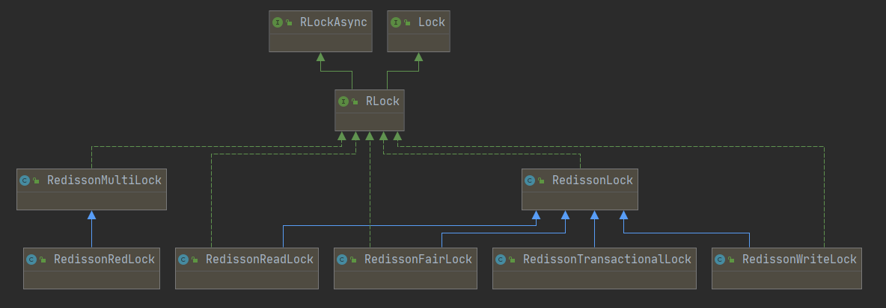
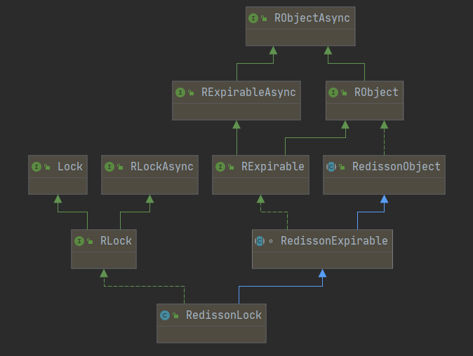

# 分布式锁简介


> 分布式锁，是一种思想，它的实现方式有很多。比如，我们将沙滩当做分布式锁的组件，那么它看起来应该是这样的：
> + **加锁**
>   在沙滩上踩一脚，留下自己的脚印，就对应了加锁操作。其他进程或者线程，看到沙滩上已经有脚印，证明锁已被别人持有，则等待。
> + **解锁**
>   把脚印从沙滩上抹去，就是解锁的过程。
> + **锁超时**
>   为了避免死锁，我们可以设置一阵风，在单位时间后刮起，将脚印自动抹去。


分布式锁的实现有很多，比如基于数据库、memcached、Redis、系统文件、zookeeper等。它们的核心的理念跟上面的过程大致相同。


在许多环境中不同进程必须以互斥方式使用共享资源进行操作时，分布式锁是一个非常有用的原语。此试图提供一种更规范的算法来实现Redis的分布式锁。我们提出了一种称为`Redlock`的算法，它实现了`DLM`（猜测是`Distributed Lock Manager`的缩写，分布式锁管理器），我们认为它比普通的单实例方法更安全。


## 锁的安全和活性保证

算法的三个核心特征（三大最低保证）：

+ **Safety property**（安全性）：互斥。确保在任何给定时刻下，只有一个客户端可以持有锁；
+ **Liveness property A**（活性A）：无死锁。即使存在曾经锁定资源的客户端崩溃或者出现网络分区异常，确保锁总是能够成功获取；
+ **Liveness property B**（活性B）：容错性。只要大多数Redis节点处于正常运行状态，客户端就可以获取和释放锁。


## 主从结构故障转移时的并发问题

文档中还指出了目前算法对于故障转移的实现还存在明显的竞态条件问题（描述的应该是`Redis`主从架构下的问题）：

+ 客户端A获取Redis主节点中的锁（假设锁定的资源为X）
+ 在Redis主节点把KEY同步到Redis从节点之前，Redis主节点崩溃
+ Redis从节点因为故障晋升为主节点
+ 此时，客户端B获取资源X的锁成功，问题是资源X的锁在前面已经被客户端A获取过，这样就出现了并发问题。


# 单机下Redis实现锁


单个实例是我们将用于此处描述的分布式算法的基础。


## 锁的获取

下面的redis命令是获取锁的核心思想 —— 如果键不存在，则设置一个id值（此时相当于拿到了锁），并且为了保证上面所说的活性要求，还设置了键的过期时间。

```shell
SET resource_name my_random_value NX PX 30000
```

这实际上是`setnx`和`setex`的结合体，不过它是原子的。

如果较低版本的客户端中不支持这个命令，那就要使用lua脚本。


## 锁的释放

下面的lua脚本的含义是：

当键存在，并且键值正是当前线程的独属id时（也就是防止释放别的线程加的锁，这就是这个独属于加到锁的线程的id的作用）。

```lua
if redis.call("get",KEYS[1]) == ARGV[1] then
    return redis.call("del",KEYS[1])
else
    return 0
end
```


## 使用Jedis实现”丐版“Redis锁

~~注意下面的代码只能算是对redis加锁的原理予以初步的实践，远远达不到高性能、高可靠。~~

```java
public class MyRedisLock implements Lock {

    private static final JedisPool jedisPool = new JedisPool("localhost");
    private static final long EXPIRE_TIME_OUT = 1000;
    // SET命令已经提供了可选的复合操作符
    // EX：设置超时时间，单位是秒
    // PX：设置超时时间，单位是毫秒
    // NX：IF NOT EXIST的缩写，只有KEY不存在的前提下才会设置K-V，设置成功返回1，否则返回0
    // XX：IF EXIST的缩写，只有在KEY存在的前提下才会设置K-V，设置成功返回1，否则返回0
    private static final SetParams params = SetParams.setParams().nx().px(EXPIRE_TIME_OUT);

    private final ThreadLocal<String> lockedId = new ThreadLocal<>();

    private final String lockName;


    private MyRedisLock(String lockName) {
        this.lockName = lockName;

    }

    public static MyRedisLock getLock(String lockName) {
        return new MyRedisLock(lockName);
    }


    @SneakyThrows
    @Override
    public void lock() {
        String id = UUID.randomUUID().toString();
        lockedId.set(id);
        try (Jedis jedis = jedisPool.getResource()) {
            // 加锁失败就重试
            for (; ; ) {
                String statusCode = jedis.set(lockName, id, params);
                if ("OK".equals(statusCode)) {
                    return;
                }
                Thread.sleep(100); // 可以设计成 wait-notify 范式，不过这里就简陋一点了
            }
        }
    }

    @Override
    public void unlock() {
        try (Jedis jedis = jedisPool.getResource()) {
            // 为做到原子性，使用 Lua 脚本
            String script =
                    "if redis.call('get',KEYS[1]) == ARGV[1] then" +
                            "   return redis.call('del',KEYS[1]) " +
                            "else" +
                            "   return 0 " +
                            "end";
            String id = lockedId.get();
            jedis.eval(script, Collections.singletonList(lockName), Collections.singletonList(id)).toString();
        }
    }
  

    @Override
    public void lockInterruptibly() throws InterruptedException {
    }
    @Override
    public boolean tryLock() {
        return false;
    }
    @Override
    public boolean tryLock(long time, TimeUnit unit) throws InterruptedException {
        return false;
    }
    @Override
    public Condition newCondition() {
        return null;
    }

		// 测试代码
    public static void main(String[] args) {
        MyRedisLock lock = MyRedisLock.getLock("lock1");

//        MyInteger.testLock(lock);


        long l = System.currentTimeMillis();
        final int N = 10000;
        MyInteger integer = new MyInteger(N);
        CountDownLatch countDownLatch = new CountDownLatch(N);
        ExecutorService pool = Executors.newFixedThreadPool(10);
        for (int i = 0; i < N; i++) {
            pool.submit(() -> {
                lock.lock();
                try {
                    integer.decr();
                } finally {
                    lock.unlock();
                }
                countDownLatch.countDown();
            });
        }
        try {
            countDownLatch.await(); // just wait all tasks to finish
        } catch (InterruptedException e) {
            e.printStackTrace();
        }
        System.out.println("end : " + integer.getX());
        long r = System.currentTimeMillis();
        System.out.println("耗时 " + (r - l) + " ms");
    }
}
```


上述算法的主要缺点：

1. 忙等（busy-waiting）的问题，消耗CPU资源；
2. 只适用于单机；
3. 不可重入
4. 没有限制等待获取的锁的超时时间
5. 不能做到在等待锁的时候响应中断


# Redisson实现分布式锁

[Redisson](https://redisson.org/)是架设在[Redis](http://redis.cn/)基础上的一个Java驻内存数据网格（In-Memory Data Grid）。

相对于Jedis而言，Redisson是一个更高级的客户端。

它里面实现了各种分布式锁（本文只介绍和使用简单的）。


## 使用Redisson中的锁

**maven依赖**

```xml
<dependency>
    <groupId>org.redisson</groupId>
    <artifactId>redisson</artifactId>
    <version>3.16.4</version>
</dependency>
```


**简单使用 lock**

```java
    // 配置类
    Config config = new Config();
    config.useSingleServer().setAddress("redis://127.0.0.1:6379");
    config.useSingleServer().setPassword("redis1234");
    // 初始化客户端
    final RedissonClient client = Redisson.create(config);  
    RLock lock = client.getLock("lock1");
    
    // 加锁
		lock.lock();
    try{
        // do something ...  
    }finally{
        // 释放锁
        lock.unlock();
    }
```


## Redisson中RLock的实现特点

`Redisson`中`RLock`的实现是基本参照了`Redis`的`red lock`算法进行实现，不过在原始的`red lock`算法下进行了改良，主要包括下面的特性：

+ 互斥
+ 无死锁
+ 可重入，类似于`ReentrantLock`，同一个线程可以重复获取同一个资源的锁（一般使用计数器实现），锁的重入特性一般情况下有利于提高资源的利用率
+ **续期**，这个是一个比较前卫解决思路，也就是如果一个客户端对资源`X`永久锁定，那么并不是直接对`KEY`生存周期设置为`-1`，而是通**过一个守护线程每隔固定周期延长`KEY`的过期时间**，这样就能实现**在守护线程不被杀掉的前提下，避免客户端崩溃导致锁无法释放长期占用资源的问题**
+ **锁状态变更订阅**，依赖于`org.redisson.pubsub.LockPubSub`，用于订阅和通知锁释放事件
+ 数据类型选用了`HASH`，配合`Lua`脚本完成多个命令的原子性


`RLock`的类图




RedissonLock`就是`RLock`的直接实现，也是分布式锁实现的核心类，从源码中看到`Redisson.getLock()`就是直接实例化`RedissonLock。


`RedissonLock`的类继承图





## 加锁整体流程

> 下面的代码是版本3.16.4中的，其他版本有点差别：

### 构造锁

```java
public RedissonLock(CommandAsyncExecutor commandExecutor, String name) {
    super(commandExecutor, name);
    //命令执行器
    this.commandExecutor = commandExecutor;
    //UUID字符串
    this.id = commandExecutor.getConnectionManager().getId();
    //内部锁过期时间(默认是 30*1000 , 也就是 30 秒)
    this.internalLockLeaseTime = commandExecutor.
                getConnectionManager().getCfg().getLockWatchdogTimeout();
    this.entryName = id + ":" + name;
}
```

`lockWatchdogTimeout`参数只有在没有使用`leaseTimeout`参数定义的成功获取到锁的场景（简单来说就是不设置时限的加锁）下生效，
如果看门狗在下一个`lockWatchdogTimeout`周期内不进行续期，那么锁就会过期释放
（从源码上看，每三分之一`lockWatchdogTimeout`就会执行一次续期任务，每次通过`pexpire`把`KEY`的存活周期延长`lockWatchdogTimeout`），`lockWatchdogTimeout`的默认值为`30000`，也就是`30`秒。


这里先列举一下`RedissonLock`中获取名称的方法，以便后面分析这些名称作为`K-V`结构的`KEY`时候使用：

+ `id`：由配置实例化时候实例化的`UUID`实例生成，从源码上分析每个连接方式的`Redisson`实例有唯一的`UUID`，`ConnectionManager`初始化的时候会调用`UUID id = UUID.randomUUID()`，笔者认为可以理解为`Redisson`实例在某个应用程序进程中的唯一标识，毕竟一般情况下，一个应用程序应该只会应用一种`Redisson`的连接方式
+ `getEntryName()`：返回的是`UUID + : + $KEY`，例如`559cc9df-bad8-4f6c-86a4-ffa51b7f1c36:resource:x`
+ `getName()`：返回的是`$KEY`，例如`resource:x`
+ `getChannelName()`：返回的是`redisson_lock__channel:{$KEY}`，例如`redisson_lock__channel:{resource:x}`
+ `getLockName(long threadId)`：返回的是`UUID + : + $threadId`，例如`559cc9df-bad8-4f6c-86a4-ffa51b7f1c36:1`


### 加锁

```java
    // 获取锁
		public RLock getLock(String name) {
        return new RedissonLock(commandExecutor, name);
    }

		/**
   	 * LeaseTime - 获取后持有锁的最长时间，如果它尚未通过调用unlock 。 如果leaseTime 为-1，则保持锁定直到显式解锁。
   	 */
		 private void lock(long leaseTime, TimeUnit unit, boolean interruptibly) throws InterruptedException {
      	// 当前线程ID
        long threadId = Thread.currentThread().getId();
      	// 尝试获取锁
        Long ttl = tryAcquire(-1, leaseTime, unit, threadId);
        // lock acquired
        // 如果ttl为 null，则证明获取锁成功
        if (ttl == null) {
            return;
        }

      	// 如果获取锁失败，则订阅到对应这个锁的channel
        RFuture<RedissonLockEntry> future = subscribe(threadId);
        if (interruptibly) {
            commandExecutor.syncSubscriptionInterrupted(future);
        } else {
            commandExecutor.syncSubscription(future);
        }
       
        // 不断尝试
        try {
            while (true) {
                // 再次尝试获取锁
                ttl = tryAcquire(-1, leaseTime, unit, threadId);
                // lock acquired
                if (ttl == null) {
                    break;
                }

                // waiting for message
                // ttl大于0 则等待ttl时间后继续尝试获取
                if (ttl >= 0) {
                    try {
                        future.getNow().getLatch().tryAcquire(ttl, TimeUnit.MILLISECONDS);
                    } catch (InterruptedException e) {
                        if (interruptibly) {
                            throw e;
                        }
                        future.getNow().getLatch().tryAcquire(ttl, TimeUnit.MILLISECONDS);
                    }
                } else {
                    if (interruptibly) {
                        future.getNow().getLatch().acquire();
                    } else {
                        future.getNow().getLatch().acquireUninterruptibly();
                    }
                }
            }
        } finally {
            // 取消对channel的订阅
            unsubscribe(future, threadId);
        }
//        get(lockAsync(leaseTime, unit));
    }
```


如上代码，就是加锁的全过程。先调用`tryAcquire`来获取锁，如果返回值ttl为空，则证明加锁成功，返回；如果不为空，则证明加锁失败。这时候，它会订阅这个锁的Channel，等待锁释放的消息，然后重新尝试获取锁。流程如下：


获取锁的过程是怎样的呢？接下来就要看`tryAcquire`方法。在这里，它有两种处理方式，一种是带有过期时间的锁，一种是不带过期时间的锁。

### 获取互斥状态

```java

    // 同步方法依赖异步方法
    private Long tryAcquire(long waitTime, long leaseTime, TimeUnit unit, long threadId) {
        return get(tryAcquireAsync(waitTime, leaseTime, unit, threadId));
    }

/**
 * 通过传入锁持有的最大时间和线程ID异步获取锁
 */
private <T> RFuture<Long> tryAcquireAsync(long waitTime, long leaseTime, TimeUnit unit, long threadId) {
        RFuture<Long> ttlRemainingFuture;
  
  
        if (leaseTime != -1) {   // 锁持有最大时间不为-1，也就是明确锁的持有时间，不是永久持有的场景
            ttlRemainingFuture = tryLockInnerAsync(waitTime, leaseTime, unit, threadId, RedisCommands.EVAL_LONG);
        } else {
            // 先按照30秒的过期时间来执行获取锁的方法
            ttlRemainingFuture = tryLockInnerAsync(waitTime, internalLockLeaseTime,
                    TimeUnit.MILLISECONDS, threadId, RedisCommands.EVAL_LONG);
        }
        // 如果还持有这个锁，则开启定时任务不断刷新该锁的过期时间
        ttlRemainingFuture.onComplete((ttlRemaining, e) -> {
            // // 执行异常场景直接返回
            if (e != null) {
                return;
            }
            
            // lock acquired（当前已经获取到锁）
            if (ttlRemaining == null) {
                if (leaseTime != -1) {
                    internalLockLeaseTime = unit.toMillis(leaseTime);
                } else {
                    // 如果是永久持有，定时调度进行 续期操作
                    scheduleExpirationRenewal(threadId);
                }
            }
        });
        return ttlRemainingFuture;
    }
```


#### 底层加锁逻辑


```java
    <T> RFuture<T> tryLockInnerAsync(long waitTime, long leaseTime, TimeUnit unit, long threadId, RedisStrictCommand<T> command) {
        return evalWriteAsync(getRawName(), LongCodec.INSTANCE, command,
                 //如果锁不存在，则通过hincrby设置持有数为 1 ，并设置过期时间
                 // KEYS[1] ：hash类型的键，代表哪个锁
                 // ARGV[2] ：hash类型的字段，代表目前获取到锁的线程名
                 // ARGV[1] ：传入的锁的过期时间                       
                "if (redis.call('exists', KEYS[1]) == 0) then " +
                        "redis.call('hincrby', KEYS[1], ARGV[2], 1); " +
                        "redis.call('pexpire', KEYS[1], ARGV[1]); " +
                        "return nil; " +
                        "end; " +
                        // 如果锁已存在，并且锁的是当前线程，则通过hincrby给数值递增1
                        "if (redis.call('hexists', KEYS[1], ARGV[2]) == 1) then " +
                        "redis.call('hincrby', KEYS[1], ARGV[2], 1); " +
                        "redis.call('pexpire', KEYS[1], ARGV[1]); " +
                        "return nil; " +
                        "end; " +
                        "return redis.call('pttl', KEYS[1]);", // //如果锁已存在，但并非本线程，则返回过期时间ttl
                Collections.singletonList(getRawName(), unit.toMillis(leaseTime), getLockName(threadId));
    }
```


这段LUA代码看起来并不复杂，有三个判断：

+ **通过exists判断，如果锁不存在，则设置值和过期时间，加锁成功**
+ **通过hexists判断，如果锁已存在，并且锁的是当前线程，则证明是重入锁，加锁成功**
+ **如果锁已存在，但锁的不是当前线程，则证明有其他线程持有锁。返回当前锁的过期时间，加锁失败**


最后再概括一下`Redisson`中实现`red lock`算法使用的`HASH`数据类型：

+ `KEY`代表的就是资源或者锁，**创建、存在性判断，延长生存周期和删除操作总是针对`KEY`进行的**
+ `FIELD`代表的是锁名称`lockName()`，但是其实它由`Redisson`连接管理器实例的初始化`UUID`拼接客户端线程`ID`组成，严格来说应该是获取锁的客户端线程唯一标识；
+ `VALUE`代表的是客户端线程对于锁的持有量。


## 解锁整体流程


### 解锁

```java
    public RFuture<Void> unlockAsync(long threadId) {
        RPromise<Void> result = new RedissonPromise<>();
        // // 返回的RFuture如果持有的结果为true，说明解锁成功，返回NULL说明线程ID异常，加锁和解锁的客户端线程不是同一个线程
        RFuture<Boolean> future = unlockInnerAsync(threadId);
        future.onComplete((opStatus, e) -> {
          	// 需要取消看门狗的续期任务
            cancelExpirationRenewal(threadId);
						// 这是内部的异常，说明解锁异常
            if (e != null) {
                result.tryFailure(e);
                return;
            }
						// 这种情况说明线程ID异常，加锁和解锁的客户端线程不是同一个线程，抛出IllegalMonitorStateException异常
            if (opStatus == null) {
                IllegalMonitorStateException cause = new IllegalMonitorStateException("attempt to unlock lock, not locked by current thread by node id: "
                        + id + " thread-id: " + threadId);
                result.tryFailure(cause);
                return;
            }
						// 走到这里说明正常解锁
            result.trySuccess(null);
        });

        return result;
    }
```


### 解锁的底层逻辑

核心还是lua脚本实现的原子性

```java
protected RFuture<Boolean> unlockInnerAsync(long threadId) {
    return evalWriteAsync(getRawName(), LongCodec.INSTANCE, RedisCommands.EVAL_BOOLEAN,
            // KEYS[1] 锁名
            // ARGV[3] 线程id
            // 如果释放锁的线程和已存在锁的线程不是同一个线程，返回null         
            "if (redis.call('hexists', KEYS[1], ARGV[3]) == 0) then " +
                    "return nil;" +
                    "end; " +
                    // 通过hincrby递减1的方式，释放一次锁
                    "local counter = redis.call('hincrby', KEYS[1], ARGV[3], -1); " +
                    // 若剩余次数大于0 ，则刷新过期时间
                    "if (counter > 0) then " +
                    // ARGV[2] 过期时间
                    "redis.call('pexpire', KEYS[1], ARGV[2]); " +
                    "return 0; " +
                    "else " +
                    // 否则证明锁已经释放，删除key并发布锁释放的消息
                    "redis.call('del', KEYS[1]); " +
                    // KEYS[2] ： 指的是 publish 的频道名
                    // ARGV[1] ：解锁的消息
                    "redis.call('publish', KEYS[2], ARGV[1]); " +
                    "return 1; " +
                    "end; " +
                    "return nil;",
            Arrays.asList(getRawName(), getChannelName()), LockPubSub.UNLOCK_MESSAGE, internalLockLeaseTime, getLockName(threadId));
}
```


1. **如果解锁的线程和当前锁的线程不是同一个，解锁失败，抛出异常**''

2. **通过hincrby递减1，先释放一次锁。**
3. **若剩余次数还大于0，则证明当前锁是重入锁，刷新过期时间；**
4. **若剩余次数小于0，删除key并发布锁释放的消息，解锁成功**


## Redisson的锁总结

`Redisson`中的`red lock`实现，应用到下面的核心技术：

+ 合理应用`Redis`的基本数据类型`HASH`
+ `Redis`的订阅发布
+ `Lua`脚本的原子性
+ `Netty`中的`Promise`实现
+ `Netty`中的时间轮`HashedWheelTimer`和对应的定时任务`(HashedWheel)Timeout`
+ `Semaphore`进行带期限、永久或者可中断的阻塞以及唤醒，替代`CountDownLatch`中的无等待期限阻塞

上面的核心技术相对合理地应用，才能实现一个高效而且容错能力相对比较高的分布式锁方案，但是从目前来看，`Redisson`仍未解决`red lock`算法中的故障转移缺陷，笔者认为这个有可能是`Redis`实现分布式锁方案的一个底层缺陷，**此方案在`Redis`单实例中是相对完善**，一旦应用在`Redis`集群（普通主从、哨兵或者`Cluster`），有几率会出现前文提到的节点角色切换导致多个不同客户端获取到同一个资源对应的锁的问题。暂时无解。


> 但值得注意的是，上面的两种实现方式都是针对单机Redis实例而进行的。如果我们有多个Redis实例，请参阅**Redlock算法**。该算法的具体内容，请参考http://redis.cn/topics/distlock.html


> [冷饭新炒：理解Redisson中分布式锁的实现 ](https://www.cnblogs.com/throwable/p/14264804.html)
>
> [Distributed locks with Redis](https://redis.io/topics/distlock)
>
> [分布式锁的进化过程](https://blog.csdn.net/dlf123321/article/details/123032170?spm=1001.2014.3001.5501)

