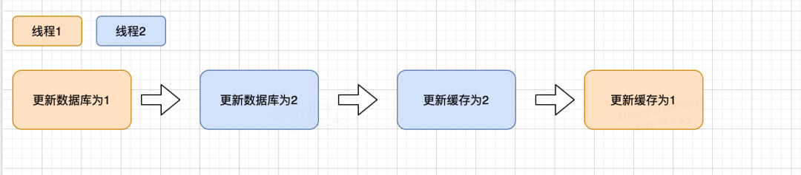
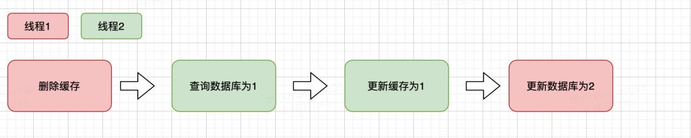
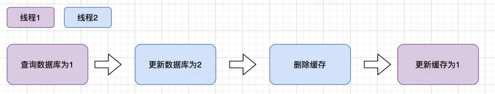
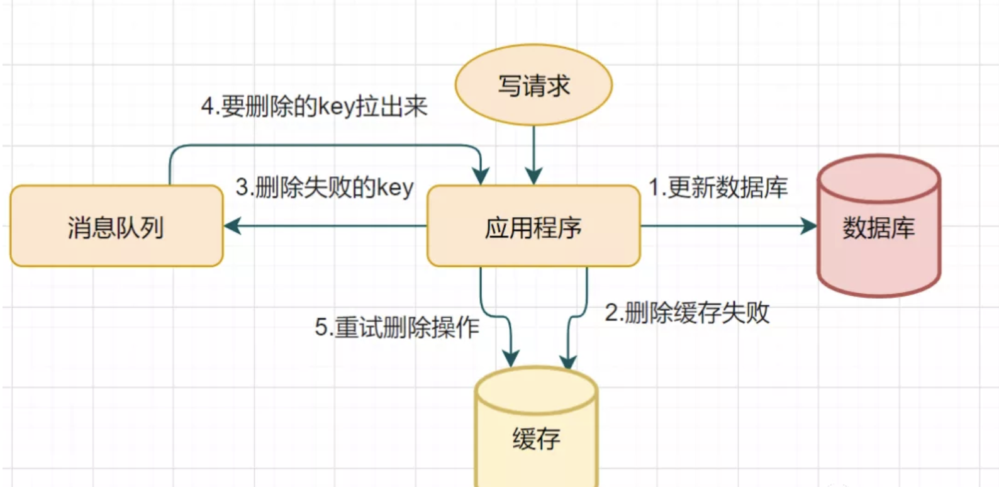
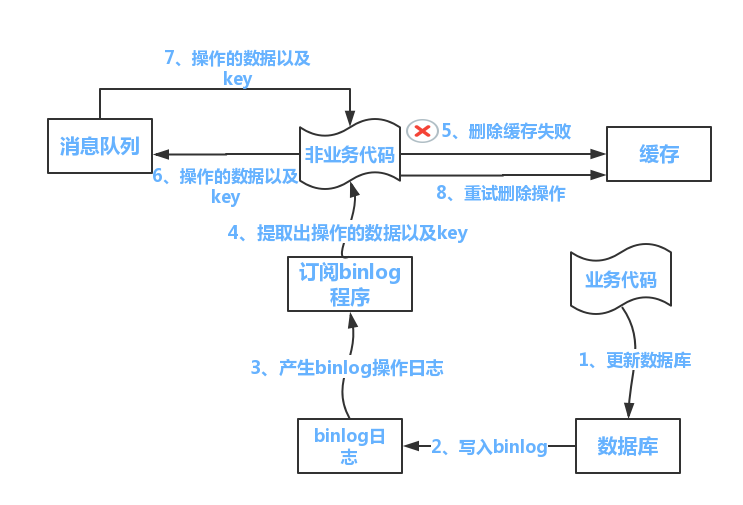
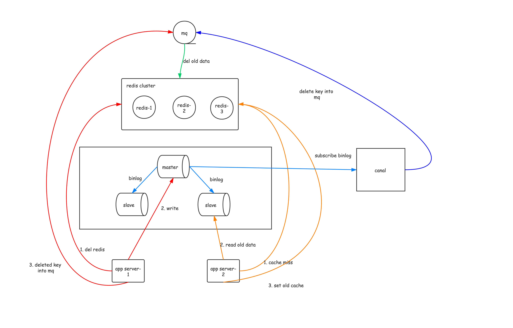

---

title: Redis系列笔记之 —— 缓存与数据库一致性
date: 2021-10-30
categories: Redis
tags:
  - NoSQL
  - Redis
---


## 使用缓存的两种模式

### Cache-Aside Pattern（旁路缓存模式）

1. 失效：程序先从缓存中读取数据，如果没有命中，则从数据库中读取，成功之后将数据放到缓存中；
2. 命中：程序先从缓存中读取数据，如果命中，则直接返回；
3. 更新：程序**先更新数据库，再删除缓存**。（这个操作顺序之后在细讲）。


### Write-behind（异步缓存写入）

这种使用模式的读缓存机制和上是一样的。但是更新缓存的策略为：

**更新时只更新缓存，不直接更新数据库**，通过**批量异步** 的方式来更新数据库。

这个设计的好处就是让数据的I/O操作飞快无比（因为直接操作内存嘛 ），因为异步，write backg还可以合并对同一个数据的多次操作，所以性能的提高是相当可观的。


但是，其带来的问题是，数据不是强一致性的，而且可能会丢失（我们知道Unix/Linux非正常关机会导致数据丢失，就是因为这个事）。


另外，Write Back实现逻辑比较复杂，因为他需要track有哪数据是被更新了的，需要刷到持久层上。操作系统的write back会在仅当这个cache需要失效的时候，才会被真正持久起来，比如，内存不够了，或是进程退出了等情况，这又叫lazy write。


这种方式下，缓存和数据库的一致性不强，**对一致性要求高的系统要谨慎使用** 。但是它适合频繁写的场景，MySQL的**InnoDB Buffer Pool机制** 就使用到这种模式。


> 不过本篇文章只对第一种模式进行拓展解析。


## 具体的更新缓存策略


1. 操作缓存的时候，到底是**删除缓存**呢，还是**更新缓存**？
2. 双写的情况下，**先操作数据库**还是**先操作缓存**？


组合起来就有四种情况：

1. 先更新缓存，再更新数据库
2. 先更新数据库，再更新缓存
3. 先删除缓存，再更新数据库
4. 先更新数据库，再删除缓存


### 先更新缓存，再更新数据库

这种方式可轻易排除，因为如果先更新缓存成功，但是数据库更新失败，则肯定会造成数据不一致。

绝对不要使用。

### 先更新数据库，再更新缓存

```java
updateDB();
updateRedis();
```

这种缓存更新策略俗称双写。

**存在问题是：并发更新数据库场景下，会将脏数据刷到缓存。**

注意上面的代码并非是原子的，在并发环境下，很明显很有可能出现数据不一致的情况。

比如下面的竞态条件：




### 先删除缓存，再更新数据库

```java
deleteRedis();
updateDB();
```

**存在问题：更新数据库之前，若有查询请求，会将脏数据刷到缓存。**




### 先更新数据库，再删除缓存

```java
updateDB();
deleteRedis();
```


**存在问题：在更新数据库之前有查询请求，并且缓存失效了，会查询数据库，然后更新缓存。如果在查询数据库和更新缓存之间进行了数据库更新的操作，那么就会把脏数据刷到缓存。**





如果发生上述情况，确实是会发生脏数据。但是发生上述情况有一个先天性条件，就是写数据库操作比读数据库操作耗时更短。

**不过数据库的读操作的速度远快于写操作的**

因此这一情形导致数据不一致性的概率比上面3种可能性都要小。


## 对上面四种方式的总结

为什么无论按照哪种做法都有可能导致数据不一致？

上面的四种策略其实到最后**有两步操作**，而**这两步操作并不是原子性的**，在并发场景下总会导致缓存和数据库的不一致。 


### 更新缓存还是删除缓存？

对于一个不能保证事务性的操作，一定涉及“哪个任务先做，哪个任务后做”的问题，解决这个问题的方向是：如果出现不一致，谁先做对业务的影响较小，就谁先执行。


更新缓存：

缺点：

+ **更新缓存需要有一定的维护成本**；
+ 存在**并发更新**的问题；
+ 写多读少的情况下，读请求还没有来，**缓存会被无用地更新很多次**，没有起到缓存的作用；


删除缓存

+ 优点：简单、成本低，容易开发；
+ 缺点：会造成一次cache miss；

如果更新缓存开销较小并且读多写少，基本不会有高写并发的时候可以才用更新缓存，否则**通用做法还是删除缓存**。


## 推荐的做法


### 设置一个合理的redis过期时间

**缓存必须要有过期时间**。

为什么必须要有过期时间？

首先，对于缓存来说，当它的命中率越高的时候，我们的系统性能也就越好。如果某个缓存项没有过期时间，而它命中的概率又很低，这就是在浪费缓存的空间。

其次，设置过期时间还有一个最大好处，就是当数据库跟缓存出现数据不一致的情况时，这个可以**作为一个最后的兜底手段**。也就是说，当数据确实出现不一致的情况时，过期时间可以保证只有在出现不一致的时间点到缓存过期这段时间之内，数据库跟缓存的数据是不一致的，因此也**保证了数据的最终一致性**。


所以，如果可以设置一个比较小的过期时间，那么**数据不一致终归是暂时的，最终一致性可以保证**。


### 延迟双删


```java
public void write(String key,Object data){
     redis.del(key);  // 第一次删除缓存
     db.update(data); // 操作数据库
     Thread.sleep(1000);  // 延时一段时间，在这段时间内有可能读操作设置的redis脏数据
     redis.del(key); // 第二次删除缓存
 }
```


大家应该评估自己的项目的读数据业务逻辑的耗时，然后写数据的休眠时间，则在读数据业务逻辑的耗时基础上即可加几百 ms 即可。

这么做的目的，就是**尽可能确保读请求结束，写请求可以删除读请求造成的缓存脏数据。**（也就是说为了避免产生第四种策略的问题）

当然，完全可能在第二次删除缓存之后，还有读操作设置了旧的缓存数据。

是的，所以**延迟双删这种方案说到底也只是降低了数据不一致的概率，不是强一致性**。


### 延时的具体实现

上面的阻塞只是语义上的延时，实际不会这样做，否则这个用户线程就阻塞在这了。

实际处理时，可以如下方法：

1. 线程池提交任务，任务中睡眠
2. Quartz定时任务
3. Rabbitmq的延时队列
4. Java中的DelayedQueue


### 删除缓存失败的重试机制


采取**先更新数据库，再删除缓存**这种方案，我们没有考虑操作数据库或者操作缓存可能失败的情况，而这种情况也是客观存在的。那么在这里我们简单讨论下，首先是如果更新数据库失败了，其实没有太大关系，因为此时数据库和缓存中都还是老数据，不存在不一致的问题。

假设删除缓存失败了呢？此时确实会存在数据不一致的情况。除了设置缓存过期时间这种兜底方案之外，如果我们希望尽可能保证缓存可以被及时删除，那么我们必须**要考虑对删除操作进行重试**。


最简单方式，就是在代码中进行重试删除，但是这样的代码侵入比较严重。

另外考虑到，分布式环境下一台需要删除redis缓存的机器可能会宕机，导致需要删除的缓存没有得到正确删除，此时需要删除的key的信息就会丢失。


这个时候可以引入 **消息中间件**, 将需要删除的key发往消息中间件，然后消费端负责根据拉下来的key删除缓存，删除失败就把这条消息重新入队，直到成功。

 





上面的做法的确点就是对业务代码有入侵，可以采用一种订阅数据库binlog的方式，用非业务代码完成对缓存的删除。





启动一个订阅程序去订阅数据库的 binlog，获得需要操作的数据。在应用程序中，另起一段程序，获得这个订阅程序传来的信息，进行删除缓存操作。


## 怎么做到强一致性？

上面讲述的所有的方案都是最终一致性的， 如果我们就要实现强一致性呢？


### 读写锁

假设我们仍然使用` Cache-Aside Pattern`, 所谓导致数据不一致的情况

实际上根本原因是**写操作的两个方法**（更新数据库-删除缓存）与**读操作两个方法**（查询数据库-更新缓存）不是串行化的执行。


所以，为了做到这样的强一致性，我们可以引入**读写锁**，去完成这样**写读-读写-读读-写写**操作之间的串行化操作。


使用读写锁之后：

回到"先更新数据库，再删除缓存"这个方案本身上来，从字面上来看，这里有两步操作，因此在数据库更新之前，到缓存被删除这段时间之内，读请求读取到的都是脏数据。

如果要实现这两者的强一致性，只能是在更新完数据库之前，所有的读请求都必须要被阻塞直到缓存最终被删除为止，读请求和读请求之间并不没有冲突，而这个同步语义正由**读写锁**提供。


需要注意是，

1. 要使用分布式读写锁；
2. 锁的粒度要尽可能小。


### 分布式一致性算法

虽然这里谈论的是Redis缓存和数据库的数据一致性，但是逻辑模型上这里和CAP定理中的C是一回事。

因而在分布式系统中为了达到多副本单操作的一致性的各种一致性算法都可以派上用场，来达到这里的缓存与数据库一致性的目的。

比如2PC、3PC、Paxos和Raft 等。

说到这里，你可以看到为了做到 **缓存-数据库一致性**的强一致性并不是一件很容易的事，实际上分布式环境下的一致性问题一直都是一个痛点，如果你使用了redis缓存来加快数据库多读少写场景下的业务，同时又想确保**缓存-数据库一致性**，是不现实的，或者说实现成本太高，即使实现效果也不好。


这个时候，你需要考虑，如果真的就需要保证强一致性，还不如将读写串行化，甚至去掉缓存。


## 分布式架构、读写分离环境下的一致性保证

上面的谈论的缓存-数据库一致性的架构仍然是单数据库-单应用程序的架构，如果是数据库读写分离环境下的呢？


我们知道数据库（以Mysql为例）主从之间的数据同步是通过binlog同步来实现的，因此这里可以考虑订阅binlog（可以使用canal之类的中间件实现，提取出要删除的缓存项，然后作为消息写入消息队列，然后再由消费端进行慢慢的消费去删除redis缓存和重试。





> [聊聊数据库与缓存数据一致性问题](https://juejin.cn/post/6844903941646319623#heading-10)
>
> [缓存更新的套路](Redis系列笔记之 —— 缓存与数据库一致性/17416.html)
>
> [缓存与数据库一致性问题深度剖析](https://xie.infoq.cn/article/47241d099404a1565e168fad4)

