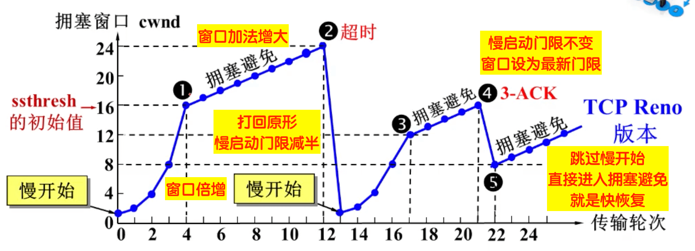

## TCP 是如何保证可靠性的

+ 数据分块：应用数据被分割成 TCP 认为最适合发送的数据块。
+ 序列号和确认应答：TCP 给发送的每一个包进行编号，在传输的过程中，每次接收方收到数据后，都会对传输方进行确认应答，即发送 ACK 报文，这个 ACK 报文当中带有对应的确认序列号，告诉发送方成功接收了哪些数据以及下一次的数据从哪里开始发。除此之外，接收方可以根据序列号对数据包进行排序，把有序数据传送给应用层，并丢弃重复的数据。
+ 校验和： TCP 将保持它首部和数据部分的检验和。这是一个端到端的检验和，目的是检测数据在传输过程中的任何变化。如果收到报文段的检验和有差错，TCP 将丢弃这个报文段并且不确认收到此报文段。
+ 流量控制： TCP 连接的双方都有一个固定大小的缓冲空间，发送方发送的数据量不能超过接收端缓冲区的大小。当接收方来不及处理发送方的数据，会提示发送方降低发送的速率，防止产生丢包。TCP 通过滑动窗口协议来支持流量控制机制。
+ 拥塞控制： 当网络某个节点发生拥塞时，减少数据的发送。
+ ARQ协议： 也是为了实现可靠传输的，它的基本原理就是每发完一个分组就停止发送，等待对方确认。在收到确认后再发下一个分组。
+ 超时重传： 当 TCP 发出一个报文段后，它启动一个定时器，等待目的端确认收到这个报文段。如果超过某个时间还没有收到确认，将重发这个报文段。

## 重传机制

TCP 实现可靠传输的⽅式之⼀，是通过序列号与确认应答。

在 TCP 中，当发送端的数据到达接收主机时，接收端主机会返回⼀个确认应答消息，表示已收到消息

所以 TCP 针对数据包丢失的情况，会⽤重传机制解决。

接下来说说常⻅的重传机制：

+ 超时重传

+ 快速重传

+ SACK

+ D-SACK

### 超时重传

重传机制的其中⼀个⽅式，就是在发送数据时，设定⼀个定时器，当超过指定的时间后，没有收到对⽅的 ACK

确认应答报⽂，就会重发该数据，也就是我们常说的超时重传。

TCP 会在以下两种情况发⽣超时重传：

1. 数据包丢失

2. 确认应答丢失

RTT （Round-Trip Time 往返时延）

RTT 就是数据从⽹络⼀端传送到另⼀端所需的时间，也就是包的往返时间。

超时重传时间是以 RTO （Retransmission Timeout 超时重传时间）表示。

当超时时间 **RTO** 较⼤时，重发就慢，丢了⽼半天才重发，没有效率，性能差；

当超时时间 **RTO** 较⼩时，会导致可能并没有丢就重发，于是重发的就快，会增加⽹络拥塞，导致更多的超

时，更多的超时导致更多的重发。

所以**精确的测量超时时间 RTO 的值是⾮常重要的**，这可让我们的重传机制更⾼效。

根据上述的两种情况，我们可以得知，**超时重传时间RTO的值应该略⼤于报⽂往返RTT的值**。

实际上「报⽂往返 RTT 的值」是经常变化的，因为我们的⽹络也是时常变化的。也就因为「报⽂往返 RTT 的值」

是经常波动变化的，所以「超时重传时间 RTO 的值」应该是⼀个动态变化的值。

我们来看看 Linux 是如何计算 RTO 的呢？

估计往返时间，通常需要采样以下两个：

+ 需要 TCP 通过**采样 RTT 的时间，然后进⾏加权平均，算出⼀个平滑 RTT 的值**，⽽且这个值还是要不断变化

的，因为⽹络状况不断地变化。

+ 除了采样 RTT，还要采样 **RTT 的波动范围**，这样就避免如果 RTT 有⼀个⼤的波动的话，很难被发现的情况。

RFC6289 建议使⽤以下的公式计算 RTO：

如果超时重发的数据，**再次超时的时候，⼜需要重传的时候，TCP 的策略是超时间隔加倍**。

也就是每当遇到⼀次超时重传的时候，都会将下⼀次超时时间间隔设为先前值的两倍。两次超时，就说明⽹络环境差，不宜频繁反复发送。

### 快速重传

TCP 还有另外⼀种快速重传（**Fast Retransmit**）机制，它**不以时间为驱动，⽽是以数据驱动重传**。

> 在上图，发送⽅发出了 1，2，3，4，5 份数据：
> 1. 第⼀份 Seq1 先送到了，于是就 Ack 回 2；
> 1. 结果 Seq2 因为某些原因没收到，Seq3 到达了，于是还是 Ack 回 2；
> 1. 后⾯的 Seq4 和 Seq5 都到了，但还是 Ack 回 2，因为 Seq2 还是没有收到；
> 1. 发送端收到了三个 **Ack = 2** 的确认，知道了 **Seq2** 还没有收到，就会在定时器过期之前，重传丢失的 **Seq2**。
> 1. 最后，收到了 Seq2，此时因为 Seq3，Seq4，Seq5 都收到了，于是 Ack 回 6 。

快速重传的⼯作⽅式是**当收到三个相同的 ACK 报⽂时，会在定时器过期之前，重传丢失的报⽂段**。

### SACK

为了解决不知道该重传哪些 TCP 报⽂，于是就有 SACK ⽅法。 **SACK （ Selective Acknowledgment 选择性确认）**。

这种⽅式需要在 TCP 头部「选项」字段⾥加⼀个 SACK 的字段，它可以**将缓存的区间发送给发送⽅，这样发送**

**⽅就可以知道哪些数据收到了，哪些数据没收到**，知道了这些信息，就可以只重传丢失的数据。

如上图，发送⽅收到了三次同样的 ACK 确认报⽂，于是就会触发快速重发机制，通过 SACK 信息发现只有

200~299 这段数据丢失，则重发时，就只选择了这个 TCP 段进⾏重复。

### Duplicate SACK

使⽤了 SACK 来告诉「发送⽅」有哪些数据被重复接收了。

具体的，就是当 ACK大于sack选项的区间时，表明收到了重复的包。

可⻅， D-SACK 有这么⼏个好处：

1. 可以让「发送⽅」知道，是发出去的包丢了，还是接收⽅回应的 ACK 包丢了;

2. 可以知道是不是「发送⽅」的数据包被⽹络延迟了;

3. 可以知道⽹络中是不是把「发送⽅」的数据包给复制了; 

## 滑动窗口

停等式发送与接收的方式的缺点是：数据包的往返时间越⻓，通信的效率就越低。

为解决这个问题，TCP 引⼊了窗⼝这个概念。即使在往返时间较⻓的情况下，它也不会降低⽹络通信的效率。

那么有了窗⼝，就可以指定**窗⼝⼤⼩**，窗⼝⼤⼩就是指**⽆需等待确认应答，⽽可以继续发送数据的最⼤值**。

> **UDP 为什么是不可靠的？**
> UDP 只有一个 socket 接收缓冲区，没有 socket 发送缓冲区，即只要有数据就发，不管对方是否可以正确接收。而在**对方的 socket 接收缓冲区满了之后，新来的数据报无法进入到 socket 接受缓冲区，此数据报就会被丢弃**，因此 UDP 不能保证数据能够到达目的地，此外，**UDP 也没有流量控制和重传机制**，故UDP的数据传输是不可靠的。

### 操作系统缓冲区与滑动窗⼝的关系

**窗⼝的实现实际上是操作系统开辟的⼀个缓存空间**，**发送⽅主机在等到确认应答返回之前，必须在缓冲区中保留已发送的数据**。**如果按期收到确认应答，此时数据就可以从缓存区清除**。

前面我们假定了发送窗⼝和接收窗⼝是不变的，但是实际上，发送窗⼝和接收窗⼝中所存放的字节数，都是放在操作系统内存缓冲区中的，⽽**操作系统的缓冲区，会被操作系统调整**。

**当应⽤进程没办法及时读取缓冲区的内容时，也会对我们的缓冲区造成影响**。

图中的 ACK 600 确认应答报⽂丢失，也没关系，因为可以通过下⼀个确认应答进⾏确认，只要发送⽅收到了 ACK

700 确认应答，就意味着 700 之前的所有数据「接收⽅」都收到了。这个模式就叫**累计确认**或者**累计应答**。

### 窗口大小的协商

TCP 头⾥有⼀个字段叫 Window ，也就是窗⼝⼤⼩。

这个字段是**接收端告诉发送端⾃⼰还有多少缓冲区可以接收数据**。于是发送端就可以根据这个接收端的处理能⼒来

发送数据，⽽不会导致接收端处理不过来。

所以，**通常窗⼝的⼤⼩是由接收⽅的窗⼝⼤⼩来决定的**。**发送⽅发送的数据⼤⼩不能超过接收⽅的窗⼝⼤⼩，否则接收⽅就⽆法正常接收到数据。**（虽然超过对端的窗口大小导致没有收到ACK，最终也会触发超时重传的，但是会导致网络的拥塞）。

**接收窗⼝和发送窗⼝的⼤⼩是相等的吗？**

并不是完全相等，接收窗⼝的⼤⼩是约等于发送窗⼝的⼤⼩的。

因为滑动窗⼝并不是⼀成不变的。⽐如，当接收⽅的应⽤进程读取数据的速度⾮常快的话，这样的话接收窗⼝可以

很快的就空缺出来。那么新的接收窗⼝⼤⼩，是通过 TCP 报⽂中的 Windows 字段来告诉发送⽅。那么这个传输过程是存在时延的，所以接收窗⼝和发送窗⼝是约等于的关系。

### 发送⽅的滑动窗⼝

我们先来看看发送⽅的窗⼝，下图就是发送⽅缓存的数据，根据处理的情况分成四个部分，其中深蓝⾊⽅框是发送

窗⼝，紫⾊⽅框是可⽤窗⼝：

+ #1 是**已发送并收到 ACK确认**的数据：1~31 字节
+ #2 是**已发送但未收到 ACK确认**的数据：32~45 字节
+ #3 是**未发送但总⼤⼩在接收⽅处理范围内**（接收⽅还有空间）：46~51字节
+ #4 是**未发送但总⼤⼩超过接收⽅处理范围**（接收⽅没有空间）：52字节以后

### 接收⽅的滑动窗⼝

接下来我们看看接收⽅的窗⼝，接收窗⼝相对简单⼀些，根据处理的情况划分成三个部分：

+ #1 + #2 是**已成功接收并确认的数据**（等待应⽤进程读取）；
+ #3 是**未收到数据但可以接收的数据；**
+ #4 是**未收到数据并不可以接收的数据**；

## 流量控制

发送⽅不能没有限制地发数据给接收⽅，要考虑接收⽅处理能⼒。

如果⼀直⽆脑的发数据给对⽅，但对⽅处理不过来，那么就会导致触发重发机制，从⽽导致⽹络流量的⽆端的浪费。

为了解决这种现象发⽣，**TCP** 提供⼀种机制可以**让「发送⽅」根据「接收⽅」的实际接收能⼒控制发送的数据量**，这就是所谓的**流量控制**。

使用滑动窗口来做到流量控制，这部内容在上面已经得到很好的描述了。

### 窗⼝关闭

在前⾯我们都看到了，TCP 通过让接收⽅指明希望从发送⽅接收的数据⼤⼩（窗⼝⼤⼩）来进⾏流量控制。
如果窗⼝⼤⼩为 0 时，就会阻⽌发送⽅给接收⽅传递数据，直到窗⼝变为⾮ 0 为⽌，这就是窗⼝关闭。

**窗⼝关闭潜在的危险**

**接收⽅向发送⽅通告窗⼝⼤⼩时，是通过 ACK 报⽂来通告的**。

那么，当发⽣窗⼝关闭时，接收⽅处理完数据后，会向发送⽅通告⼀个窗⼝⾮ 0 的 ACK 报⽂，如果这个通告窗⼝的 ACK 报⽂在⽹络中丢失了，那麻烦就⼤了。

这会导致**发送⽅⼀直等待接收⽅的⾮ 0 窗⼝通知**，接收⽅也⼀直等待发送⽅的数据，如不采取措施，这种相互等待的过程，会造成了死锁的现象。

为了解决这个问题，TCP 为每个连接设有⼀个持续定时器，只要 **TCP** 连接⼀⽅收到对⽅的零窗⼝通知，就启动持续计时器。

如果持续计时器超时，就会发送窗⼝探测 **( Window probe )** 报⽂，⽽对⽅在确认这个探测报⽂时，给出⾃⼰现在的接收窗⼝⼤⼩。

窗⼝探测的次数⼀般为 3 次，每次⼤约 30-60 秒（不同的实现可能会不⼀样）。如果 3 次过后接收窗⼝还是 0 的话，**有的 TCP 实现就会发 RST 报⽂来中断连接**。

### 低能窗口综合征

如果接收⽅太忙了，来不及取⾛接收窗⼝⾥的数据，那么就会导致发送⽅的发送窗⼝越来越⼩。

到最后，**如果接收⽅腾出⼏个字节并告诉发送⽅现在有⼏个字节的窗⼝，⽽发送⽅会义⽆反顾地发送这⼏个字节**，

这就是低能窗⼝综合症。

要知道，我们的 TCP + IP 头有 40 个字节，为了传输那⼏个字节的数据，要达上这么⼤的开销，这太不经济

了。

所以，低能窗⼝综合症的现象是可以发⽣在发送⽅和接收⽅：

1. 接收⽅可以通告⼀个⼩的窗⼝；

2. 发送⽅可以发送⼩数据。

当然解决问题的思路也从这两方面入手：

1. **接收⽅不通告⼩窗⼝**
2. **发送⽅避免发送⼩数据**

**接收⽅通常的策略如下**:

当「窗⼝⼤⼩」⼩于 min( MSS，缓存空间/2 ) ，也就是**当窗口大小⼩于 MSS 与 1/2 缓存⼤⼩中的最⼩值时，就会向发送⽅通告窗⼝为 0** ，也就阻⽌了发送⽅再发数据过来。

#### Nagle算法

**发送⽅通常的策略**

使⽤ Nagle 算法，该算法的思路是**延时处理**，它满⾜以下两个条件中的⼀条才可以发送数据：

+ **要等到窗⼝⼤⼩ >= MSS 或是数据⼤⼩ >= MSS** ;

+ **收到之前发送数据的 ack 回包** ;

只要没满⾜上⾯条件中的⼀条，发送⽅⼀直在囤积数据，直到满⾜上⾯的发送条件。

另外，**Nagle 算法默认是打开的**，如果对于⼀些需要⼩数据包交互的场景的程序，⽐如，telnet 或 ssh 这样的交互性⽐较强的程序，则需要关闭 Nagle 算法。

可以在 Socket 设置 `TCP_NODELAY` 选项来关闭这个算法（关闭 Nagle 算法没有全局参数，需要根据每个应⽤

⾃⼰的特点来关闭）

另外，**Nagle 算法默认是打开的**，如果对于⼀些需要⼩数据包交互的场景的程序，⽐如，telnet 或 ssh 这样的交互性⽐较强的程序，则需要关闭 Nagle 算法。

可以在 Socket 设置 `TCP_NODELAY` 选项来关闭这个算法（关闭 Nagle 算法没有全局参数，需要根据每个应⽤⾃⼰的特点来关闭）

## 拥塞控制

> 拥塞控制是解决网络带宽资源有限的问题，流量控制则是解决主机缓冲区有限的问题。

在⽹络出现拥堵时，如果继续发送⼤量数据包，可能会导致数据包时延、丢失等，这时 **TCP** 就会重传数据，但是

⼀重传就会导致⽹络的负担更重，于是会导致更⼤的延迟以及更多的丢包，这个情况就会进⼊恶性循环被不断地放

⼤。

所以，TCP 不能忽略⽹络上发⽣的事，它被设计成⼀个⽆私的协议，当⽹络发送拥塞时，TCP 会⾃我牺牲，降低

发送的数据量。

于是，就有了拥塞控制，控制的⽬的就是避免「发送⽅」的数据填满整个⽹络。

### 拥塞窗口
**拥塞窗⼝ `cwnd`是发送⽅维护的⼀个的状态变量**，它**会根据⽹络的拥塞程度动态变化**的。

我们在前⾯提到过发送窗⼝ swnd 和接收窗⼝ rwnd 是约等于的关系，那么由于加⼊了拥塞窗⼝的概念后，此时发送窗⼝的值是**swnd = min(cwnd, rwnd)**，也就是拥塞窗⼝和接收窗⼝中的最⼩值。
拥塞窗⼝ cwnd 变化的规则：

+ 只要⽹络中没有出现拥塞， cwnd 就会增⼤；
+ 但⽹络中出现了拥塞， cwnd 就减少；

**那么怎么知道当前⽹络是否出现了拥塞呢？**

**只要「发送⽅」没有在规定时间内接收到 ACK 应答报⽂，也就是发⽣了超时重传**，就会认为⽹络出现了⽤拥

塞。这是拥塞发生的一条很重要的前提。

### 慢启动

当发送方开始发送数据时，由于一开始不知道网络负荷情况，如果立即将大量的数据字节传输到网络中，那么就有可能引起网络拥塞。一个较好的方法是在一开始发送少量的数据先探测一下网络状况，即由小到大的增大发送窗口（拥塞窗口 cwnd）。慢开始的慢指的是初始时令 cwnd为 1，即一开始发送一个报文段。如果收到确认，则 cwnd = 2，之后每收到一个确认报文，就令 cwnd = cwnd* 2。

但是，为了防止拥塞窗口增长过大而引起网络拥塞，另外设置了一个**慢开始门限** ssthresh。⼀般来说 ssthresh 的⼤⼩是 65535 字节。

① **当 cwnd < ssthresh 时，使用上述的慢开始算法**；

② **当 cwnd > ssthresh 时，停止使用慢开始，转而使用拥塞避免算法**；

③ 当 cwnd == ssthresh 时，两者均可。

**慢启动算法**，发包的个数是**指数性的增⻓**。

### 拥塞避免

**拥塞控制是为了让拥塞窗口 cwnd 缓慢地增大**，即每经过一个往返时间 RTT （往返时间定义为发送方发送数据到收到确认报文所经历的时间）就把发送方的 cwnd 值加 1，**通过让 cwnd 线性增长，防止很快就遇到网络拥塞状态**。

**当网络拥塞发生时**，**让新的慢开始门限值变为发生拥塞时候的值的一半, 并将拥塞窗口置为 1** , 然后再次重复两种算法（慢开始和拥塞避免）,这时一瞬间会将网络中的数据量大量降低。

### 拥塞发生

当⽹络出现拥塞，也就是会发⽣数据包重传，重传机制主要有两种：

1. 超时重传

2. 快速重传

#### 超时重传

一旦发生超时重传，可以说是一夜回到解放前，这个时候，

+ cwnd = 1
+ ssthresh = ssthresh / 2 ;

重新开始上述过程。

#### 快速重传

**快重传算法要求接收方每收到一个失序的报文就立即发送重复确认**，**不必等待超时再重传**。

TCP 认为这种情况不严重，因为⼤部分没丢，只丢了⼀⼩部分，则 ssthresh 和 cwnd 变化如下：

+ cwnd = cwnd/2 ，也就是设置为原来的⼀半;

+ ssthresh = cwnd ;

+ 进⼊快速恢复算法

### 快速恢复

**快恢复算法是和快重传算法配合使用**的，该算法主要有以下两个要点：

① **当发送方连续收到三个重复确认**，执行乘法减小，慢开始门限 ssthresh 值减半；

② 由于发送方可能认为网络现在没有拥塞，因此与慢开始不同，**把 cwnd 值设置为 ssthresh 减半之后的值，然后执行拥塞避免算法，线性增大 cwnd**。

### 总结

