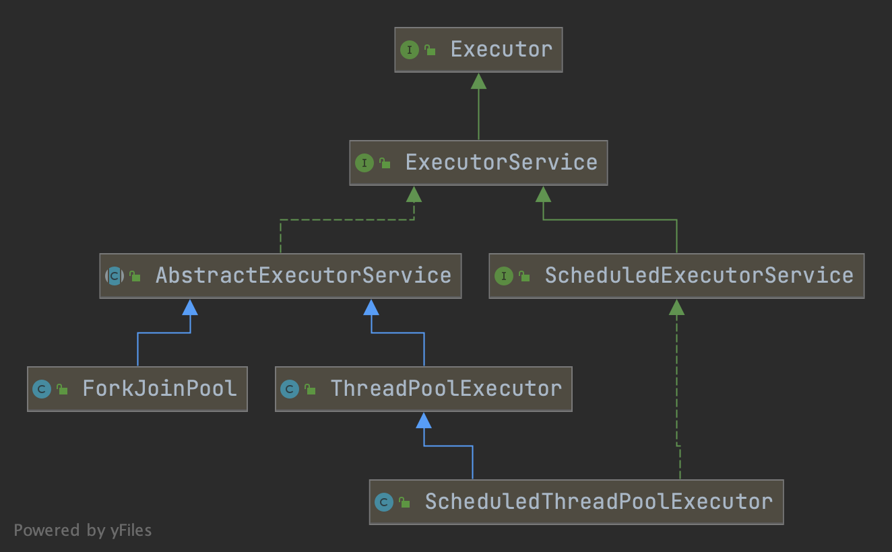

# ExecutorService





```java
package java.util.concurrent;
public interface Executor {
    void execute(Runnable command);
}
```


```java
package java.util.concurrent;
public interface ExecutorService extends Executor {

    /**
     * Initiates an orderly shutdown in which previously submitted
     * tasks are executed, but no new tasks will be accepted.
     * Invocation has no additional effect if already shut down.
     *
     * <p>This method does not wait for previously submitted tasks to
     * complete execution.  Use {@link #awaitTermination awaitTermination}
     * to do that.
     */
    void shutdown();

    /**
     * Attempts to stop all actively executing tasks, halts the
     * processing of waiting tasks, and returns a list of the tasks
     * that were awaiting execution.
     *
     * <p>This method does not wait for actively executing tasks to
     * terminate.  Use {@link #awaitTermination awaitTermination} to
     * do that.
     *
     */
    List<Runnable> shutdownNow();
    
    boolean isShutdown();

    boolean isTerminated();

    /**
     * Blocks until all tasks have completed execution after a shutdown
     * request, or the timeout occurs, or the current thread is
     * interrupted, whichever happens first.
     */
    boolean awaitTermination(long timeout, TimeUnit unit)
        throws InterruptedException;

    
    <T> Future<T> submit(Callable<T> task);

    
    <T> Future<T> submit(Runnable task, T result);

    
    Future<?> submit(Runnable task);

}

```


[线程池中shutdown()和shutdownNow()方法的区别](https://www.cnblogs.com/aspirant/p/10265863.html)


`shutdown`、`shutdownNow`、`awaitTermination`。

三者的区别：

+ `shutdown`: 

线程池的状态则立刻变成SHUTDOWN状态。此时，则不能再往线程池中添加任何任务，空闲的工作线程会被中断从而结束（它们正在`r = workQueue.take()`）；活跃的工作线程继续执行任务（`w.tryLock()`保证任务执行结束之前不中断），但是这个方法的调用并不等待这些任务的完成（换句话说，是异步地）。


+ `shutdownNow`:

  线程池的状态立刻变成STOP状态，并试图停止所有正在执行的线程，不再处理还在池队列中等待的任务，并且它会返回那些未执行的任务。

  （它试图终止线程的方法是通过调用Thread.interrupt()方法来实现的，但是大家知道，这种方法的作用有限，如果线程中没有sleep 、wait、Condition、定时锁等应用, interrupt()方法是无法中断当前的线程的。所以，ShutdownNow()并不代表线程池就一定立即就能退出，它可能必须要等待所有正在执行的任务都执行完成了才能退出。 ）


+ `awaitTermination`:

  此方法的调用会阻塞住，直到所有的任务执行完成或者超时。弥补了上面两个方法的不足。


# AbstractExecutorService

提供ExecutorService执行方法的默认实现。此类使用newTaskFor返回的RunnableFuture（默认为此包中提供的FutureTask类）实现submit、invokeAny和invokeAll方法。例如，submit（Runnable）的实现创建了一个关联的RunnableFuture，它被执行并返回。子类可以重写newTaskFor方法以返回除了FutureTask之外的RunnableFuture实现。


```java
public abstract class AbstractExecutorService implements ExecutorService {

    protected <T> RunnableFuture<T> newTaskFor(Runnable runnable, T value) {
        return new FutureTask<T>(runnable, value);
    }

    protected <T> RunnableFuture<T> newTaskFor(Callable<T> callable) {
        return new FutureTask<T>(callable);
    }

    public Future<?> submit(Runnable task) {
        if (task == null) throw new NullPointerException();
        RunnableFuture<Void> ftask = newTaskFor(task, null);
        execute(ftask);
        return ftask;
    }


    public <T> Future<T> submit(Runnable task, T result) {
        if (task == null) throw new NullPointerException();
        RunnableFuture<T> ftask = newTaskFor(task, result);
        execute(ftask);
        return ftask;
    }

    public <T> Future<T> submit(Callable<T> task) {
        if (task == null) throw new NullPointerException();
        RunnableFuture<T> ftask = newTaskFor(task);
        execute(ftask);
        return ftask;
    }
} 
```


# ThreadPoolExecutor


## 线程池工作的状态表示与转换

线程池有两大控制状态需要表示，

1. workerCount：the effective number of threads
2. runState：whether running, shutting down etc


其中，workerCount表示开启的线程数（这些线程并允许停止），它和实际活着的线程数并不相等，用户视角的workers的数量由`HashSet<Worker> workers`表示。


runState主要用于线程池的生命周期控制。

 * RUNNING:  Accept new tasks and process queued tasks

 * SHUTDOWN: Don't accept new tasks, but process queued tasks

 * STOP:     Don't accept new tasks, don't process queued tasks, and interrupt in-progress tasks

 * TIDYING:  All tasks have terminated, workerCount is zero, the thread transitioning to state TIDYING

   will run the terminated() hook method

 * TERMINATED: terminated() has completed


这些值之间的数字顺序很重要有序比较。runState随时间单调增加时间，但不必命中每个状态。

 * RUNNING -> SHUTDOWN

   On invocation of shutdown(), perhaps implicitly in finalize()

 * (RUNNING or SHUTDOWN) -> STOP

   On invocation of shutdownNow()

 * SHUTDOWN -> TIDYING

   When both queue and pool are empty

 * STOP -> TIDYING

   When pool is empty

 * TIDYING -> TERMINATED

   When the terminated() hook method has completed


此外作者使用了一个小技巧，为了高效率地在多线程环境下改变这两个控制状态，作者将这两个字段打包进一个原子量里，其中高三位存储runState，低29位存储线程数。

```java
private final AtomicInteger ctl = new AtomicInteger(ctlOf(RUNNING, 0));

private static final int COUNT_BITS = Integer.SIZE - 3;
private static final int CAPACITY   = (1 << COUNT_BITS) - 1;

// runState is stored in the high-order bits
private static final int RUNNING    = -1 << COUNT_BITS;
private static final int SHUTDOWN   =  0 << COUNT_BITS;
private static final int STOP       =  1 << COUNT_BITS;
private static final int TIDYING    =  2 << COUNT_BITS;
private static final int TERMINATED =  3 << COUNT_BITS;

// Packing and unpacking ctl
private static int runStateOf(int c)     { return c & ~CAPACITY; }
private static int workerCountOf(int c)  { return c & CAPACITY; }
private static int ctlOf(int rs, int wc) { return rs | wc; }

/*
 * Bit field accessors that don't require unpacking ctl.
 * These depend on the bit layout and on workerCount being never negative.
 */

private static boolean runStateLessThan(int c, int s) {
    return c < s;
}

private static boolean runStateAtLeast(int c, int s) {
    return c >= s;
}

private static boolean isRunning(int c) {
    return c < SHUTDOWN;
}

/**
 * Attempts to CAS-increment the workerCount field of ctl.
 */
private boolean compareAndIncrementWorkerCount(int expect) {
    return ctl.compareAndSet(expect, expect + 1);
}

/**
 * Attempts to CAS-decrement the workerCount field of ctl.
 */
private boolean compareAndDecrementWorkerCount(int expect) {
    return ctl.compareAndSet(expect, expect - 1);
}

/**
 * Decrements the workerCount field of ctl. This is called only on
 * abrupt termination of a thread (see processWorkerExit). Other
 * decrements are performed within getTask.
 */
private void decrementWorkerCount() {
    do {} while (! compareAndDecrementWorkerCount(ctl.get()));
}
```


## 工作线程抽象——Worker

```java
   /**
    *Class Worker主要维护线程运行任务，以及其他次要的记账信息。
    *此类扩展了AbstractQueuedSynchronizer，以简化获取和释放每个任务执行。
    *并且防止在还没有启动loop执行任务时，就被中断
    *此外，要抑制中断直到线程实际上开始运行任务，我们初始化锁将状态设置为负值，并在启动时清除（在
    *runWorker）。
    */
    private final class Worker
        extends AbstractQueuedSynchronizer
        implements Runnable
    {
        
        /** Thread this worker is running in.  Null if factory fails. */
        final Thread thread;
        /** Initial task to run.  Possibly null. */
        Runnable firstTask;
        /** Per-thread task counter */
        volatile long completedTasks;

        /**
         * Creates with given first task and thread from ThreadFactory.
         * @param firstTask the first task (null if none)
         */
        Worker(Runnable firstTask) {
            setState(-1); // 阻止中断直到调用runWorker
            this.firstTask = firstTask;
            this.thread = getThreadFactory().newThread(this); // worker 自身也是一个runnable
        }

        /** 将主运行循环委托给外部的runWorker方法  */
        public void run() {
            runWorker(this);
        }

        // Lock methods
        //
        // The value 0 represents the unlocked state.
        // The value 1 represents the locked state.

        protected boolean isHeldExclusively() {
            return getState() != 0;
        }

        protected boolean tryAcquire(int unused) {
            if (compareAndSetState(0, 1)) {
                setExclusiveOwnerThread(Thread.currentThread());
                return true;
            }
            return false;
        }

        protected boolean tryRelease(int unused) {
            setExclusiveOwnerThread(null);
            setState(0);
            return true;
        }

        public void lock()        { acquire(1); }
        public boolean tryLock()  { return tryAcquire(1); }
        public void unlock()      { release(1); }
        public boolean isLocked() { return isHeldExclusively(); }

        void interruptIfStarted() {
            Thread t;
            if (getState() >= 0 && (t = thread) != null && !t.isInterrupted()) {
                try {
                    t.interrupt();
                } catch (SecurityException ignore) {
                }
            }
        }
    }
```


## 预定义的几种拒绝策略

```java
  /* Predefined RejectedExecutionHandlers */

  
    public static class CallerRunsPolicy implements RejectedExecutionHandler {
        public CallerRunsPolicy() { }

        public void rejectedExecution(Runnable r, ThreadPoolExecutor e) {
            if (!e.isShutdown()) {
                r.run();
            }
        }
    }

    public static class AbortPolicy implements RejectedExecutionHandler {
        public AbortPolicy() { }

        public void rejectedExecution(Runnable r, ThreadPoolExecutor e) {
            throw new RejectedExecutionException("Task " + r.toString() +
                                                 " rejected from " +
                                                 e.toString());
        }
    }

    public static class DiscardPolicy implements RejectedExecutionHandler {

        public DiscardPolicy() { }

        public void rejectedExecution(Runnable r, ThreadPoolExecutor e) {
        }
    }

    public static class DiscardOldestPolicy implements RejectedExecutionHandler {

        public DiscardOldestPolicy() { }
        public void rejectedExecution(Runnable r, ThreadPoolExecutor e) {
            if (!e.isShutdown()) {
                e.getQueue().poll();
                e.execute(r);
            }
        }
    }
```


## 构造器

```java
public ThreadPoolExecutor(int corePoolSize,
                          int maximumPoolSize,
                          long keepAliveTime,
                          TimeUnit unit,
                          BlockingQueue<Runnable> workQueue,
                          ThreadFactory threadFactory,
                          RejectedExecutionHandler handler) {
    if (corePoolSize < 0 ||
        maximumPoolSize <= 0 ||
        maximumPoolSize < corePoolSize ||
        keepAliveTime < 0)
        throw new IllegalArgumentException();
    if (workQueue == null || threadFactory == null || handler == null)
        throw new NullPointerException();
    this.acc = System.getSecurityManager() == null ?
            null :
            AccessController.getContext();
    this.corePoolSize = corePoolSize;
    this.maximumPoolSize = maximumPoolSize;
    this.workQueue = workQueue;
    this.keepAliveTime = unit.toNanos(keepAliveTime);
    this.threadFactory = threadFactory;
    this.handler = handler;
}
```


## 核心原理


### addWorker

```java
    // 新增worker，返回worker的thread是否启动成功
    private boolean addWorker(Runnable firstTask, boolean core) {
        retry:
        for (;;) {
            int c = ctl.get();
            int rs = runStateOf(c); // 运行状态

            // Check if queue empty only if necessary.
            if (rs >= SHUTDOWN &&
                ! (rs == SHUTDOWN &&
                   firstTask == null &&
                   ! workQueue.isEmpty()))
                return false;

            for (;;) {
                int wc = workerCountOf(c); // 工作线程数
                if (wc >= CAPACITY ||
                    wc >= (core ? corePoolSize : maximumPoolSize)) // 超过了则不再创建
                    return false;
                if (compareAndIncrementWorkerCount(c))
                    break retry; // cas成功则break
                c = ctl.get();  // Re-read ctl
                if (runStateOf(c) != rs)
                    continue retry;
                // else CAS failed due to workerCount change; retry inner loop
            }
        }
      
        boolean workerStarted = false; // worker 是否成功启动
        boolean workerAdded = false; // worker 是否成功添加
        Worker w = null;
        try {
            w = new Worker(firstTask);
            final Thread t = w.thread;
            if (t != null) {
                final ReentrantLock mainLock = this.mainLock;
                mainLock.lock();
                try {
                    // Recheck while holding lock.
                    // Back out on ThreadFactory failure or if
                    // shut down before lock acquired.
                    int rs = runStateOf(ctl.get());

                    if (rs < SHUTDOWN ||
                        (rs == SHUTDOWN && firstTask == null)) {
                        if (t.isAlive()) // precheck that t is startable
                            throw new IllegalThreadStateException();
                        workers.add(w); // 添加到工作集
                        int s = workers.size();
                        if (s > largestPoolSize)
                            largestPoolSize = s;
                        workerAdded = true;
                    }
                } finally {
                    mainLock.unlock();
                }
                if (workerAdded) {
                    t.start(); // 启动工作线程的loop
                    workerStarted = true;
                }
            }
        } finally {
            if (! workerStarted)
                addWorkerFailed(w); // 回滚
        }
        return workerStarted;
    }
```


### getTask

```java
/**
*对任务执行阻塞或定时等待，具体取决于当前配置设置，
* 或者如果此工作程序返回null必须退出，原因是：
* 1. 有超过maximumPoolSize个工作线程（由于对setMaximumPoolSize的调用）。
* 2. 池已stop。
* 3. 池已shutdown，队列为空。
* 4. 此工作人员在等待任务时超时，已超时
*
*@return 任务，如果worker必须退出，则返回null，在这种情况下workerCount递减
*/
private Runnable getTask() {
    boolean timedOut = false; // Did the last poll() time out?

    for (;;) {
        int c = ctl.get();
        int rs = runStateOf(c);

        // Check if queue empty only if necessary.
        if (rs >= SHUTDOWN && (rs >= STOP || workQueue.isEmpty())) { // 进入”销毁“阶段
            decrementWorkerCount();
            return null;
        }

        int wc = workerCountOf(c);

        // Are workers subject to culling?
        boolean timed = allowCoreThreadTimeOut || wc > corePoolSize;

        if ((wc > maximumPoolSize || (timed && timedOut))
            && (wc > 1 || workQueue.isEmpty())) {
            if (compareAndDecrementWorkerCount(c))
                return null;
            continue;
        }

        try {
            Runnable r = timed ?
                workQueue.poll(keepAliveTime, TimeUnit.NANOSECONDS) : // 带超时的阻塞
                workQueue.take(); // 无限阻塞
            if (r != null)
                return r;
            timedOut = true;
        } catch (InterruptedException retry) {
            timedOut = false;
        }
    }
}
```


### runWorker

```java
  final void runWorker(Worker w) {
        Thread wt = Thread.currentThread();
        Runnable task = w.firstTask;
        w.firstTask = null;
        w.unlock(); // allow interrupts
        boolean completedAbruptly = true; // 突然完成
        try {
            while (task != null || (task = getTask()) != null) { // loop
                w.lock();
                // If pool is stopping, ensure thread is interrupted;
                // if not, ensure thread is not interrupted.  This
                // requires a recheck in second case to deal with
                // shutdownNow race while clearing interrupt
                if ((runStateAtLeast(ctl.get(), STOP) ||
                     (Thread.interrupted() &&
                      runStateAtLeast(ctl.get(), STOP))) &&
                    !wt.isInterrupted())
                    wt.interrupt();
                try {
                    beforeExecute(wt, task); // 钩子
                    Throwable thrown = null;
                    try {
                        task.run(); // 执行我们提交的任务
                    } catch (RuntimeException x) {
                        thrown = x; throw x; // ???
                    } catch (Error x) {
                        thrown = x; throw x;
                    } catch (Throwable x) {
                        thrown = x; throw new Error(x);
                    } finally {
                        afterExecute(task, thrown); // hook
                    }
                } finally {
                    task = null;
                    w.completedTasks++;
                    w.unlock();
                }
            }
            completedAbruptly = false;
        } finally {
            processWorkerExit(w, completedAbruptly);
        }
    }
```


### execute

```java
// 下面这段代码就对应着向线程池提交一个任务的工作流程了
public void execute(Runnable command) {
    if (command == null)
        throw new NullPointerException();
    int c = ctl.get();
    if (workerCountOf(c) < corePoolSize) { // 小于核心线程数，新开一个线程
        if (addWorker(command, true))
            return;
        c = ctl.get();
    }
    if (isRunning(c) && workQueue.offer(command)) { // 尝试入队
        int recheck = ctl.get();
        // 这里执行一次 double check
        if (! isRunning(recheck) && remove(command))
            reject(command);
        else if (workerCountOf(recheck) == 0)
            addWorker(null, false);
    }
    else if (!addWorker(command, false)) // 入队失败，再尝试开一个线程
        reject(command); // 执行拒绝策略
}
```


## 源码分析

```java
package java.util.concurrent;

public class ThreadPoolExecutor extends AbstractExecutorService {
		// 工作队列，用于保存任务并移交给工作线程
    private final BlockingQueue<Runnable> workQueue;

    // 锁定对工作线程集合和相关记账的访问
    private final ReentrantLock mainLock = new ReentrantLock();

    // 保存所有的工作线程
    private final HashSet<Worker> workers = new HashSet<Worker>();

    /**
     * Wait condition to support awaitTermination
     */
    private final Condition termination = mainLock.newCondition();

    /**
     * 跟踪达到的最大池大小
     */
    private int largestPoolSize;

    /**
     * 已完成的任务的计数器
     */
    private long completedTaskCount;

    /*
     * 线程池的几大参数都被修饰为
     */

    /**
     * 线程工厂
     */
    private volatile ThreadFactory threadFactory;

    /**
     * 拒绝策略
     */
    private volatile RejectedExecutionHandler handler;

    /**
     * 针对核心线程的最大空闲生存时间
     */
    private volatile long keepAliveTime;

    /**
     * 默认为false，也就是说即使核心线程空闲仍然保持存活
     */
    private volatile boolean allowCoreThreadTimeOut;

    /**
     * 核心线程数
     */
    private volatile int corePoolSize;

    /**
     * 最大线程数
     */
    private volatile int maximumPoolSize;

    /**
     * 默认的拒绝策略
     */
    private static final RejectedExecutionHandler defaultHandler =
        new AbortPolicy();

   


    // 用cas的方式递增runState    
    private void advanceRunState(int targetState) {
        for (;;) {
            int c = ctl.get();
            if (runStateAtLeast(c, targetState) ||
                ctl.compareAndSet(c, ctlOf(targetState, workerCountOf(c))))
                break;
        }
    }
    
    // 线程池的预热  
    public boolean prestartCoreThread() {
        return workerCountOf(ctl.get()) < corePoolSize &&
            addWorker(null, true);
    }

    public int prestartAllCoreThreads() {
        int n = 0;
        while (addWorker(null, true))
            ++n;
        return n;
    }

}

```