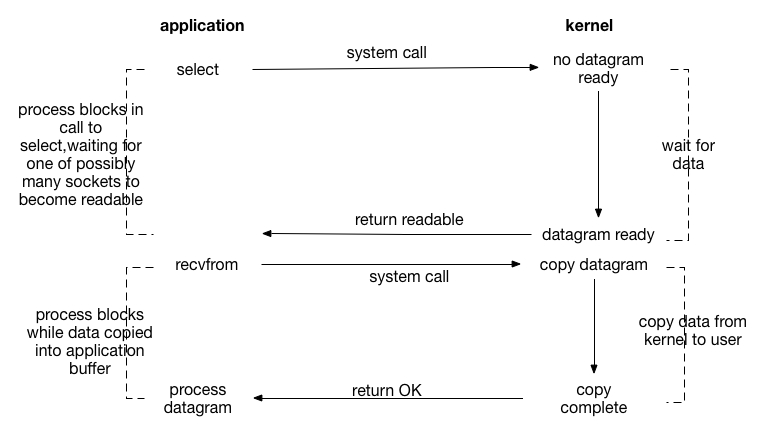

# 前言

IO模型的选择在Linux网络编程中十分重要，在Unix/Linux环境中主要提供了五种不同的IO模型，分别是

1. 阻塞式IO（blocking IO）；
2. 非阻塞式IO（nonblocking IO）；
3. IO多路复用（ IO multiplexing）；
4. 信号驱动式IO（signal driven IO）；
5. 异步IO（asynchronous IO）。

通常一个输入操作包含两个不同阶段：

1. 等待数据准备好
2.  从内核向进程复制数据

对于网络IO而言，对于一个网络套接字上的输入操作，第一步通常涉及到发生系统调用，用户态切换到内核态并等待数据从网络中到达，当所有等待分组到达时，数据被复制到内核中的某个缓冲区。第二步则是将数据从内核缓冲区复制到应用进程缓冲区。

磁盘文件的IO比较特殊，内核采用缓冲区cache加速磁盘IO请求。因而**一旦请求的数据到达内核缓冲区cache，对磁盘的write()操作立即返回**，而不用等待将数据写入磁盘后再返回（除非在打开文件时指定了O_SYNC标志）。与之相对应的read()操作将数据从内核缓冲区cache移动到用户的缓冲区中，如果请求的数据不在内核缓冲区cache中，**内核会让进程休眠**，同时执行对磁盘的读操作。

所以实际上在磁盘IO中，等待阶段是不存在的，因为磁盘文件并不像网络IO那样，需要等待远程传输数据。

# 阻塞式I/O

Linux中，默认情况下所有的socket都是阻塞的。这里有必要辨析以下阻塞和非阻塞这两个概念，这两个概念**描述的是用户线程调用内核I/O操作的方式**，**其中阻塞是指I/O操作需要彻底完成后才返回到用户空间；而非阻塞则是指I/O操作被调用后立即返回给用户一个状态值，不需要等到I/O操作彻底完成**。

除非特别指定，几乎所有的I/O接口都是阻塞型的，即系统调用时不返回调用结果，只有当该系统调用获得结果或者超时出错才返回。这样的机制给网络编程带来了较大的影响，当线程因处理数据而处于阻塞状态时，线程将无法执行任何运算或者相应任何网络请求。

在服务器端使用阻塞I/O模型时结合**多进程/多线程**技术。

让每一个连接都拥有独立的进程/线程，任何一个连接的阻塞都不会影响到其他连接。（选择多进程还是多线程并无统一标准，因为进程的开销大于线程，所以在连接数较大的情况下推荐使用多线程。而进程相较于线程具有更高的安全性，所以如果单个服务执行体需要消耗较多的CPU资源，如需要进行大规模或长时间的数据运算或文件访问推荐使用多进程）。

当连接数规模继续增大，无论使用多线程还是多进程都会严重占据系统资源，降低系统对外界的响应效率，线程或者进程本身也更容易陷入假死。

此时可以采用“线程池”或“连接池”来降低创建和销毁进程/线程的频率，减少系统开销。

总之这里的线程模型实际上是**一个socket对应一个进程/线程。**

# 非阻塞式IO

进程把一个套接字设置成非阻塞是在通知内核：**当请求的I/O操作非得把本进程投入睡眠才能完成时，不要把本进程投入睡眠，而是返回一个错误**。

 因此如果在打开文件时设定了O_NONBLOCK标志，则会以非阻塞方式打开文件。

如果I/O系统调用不能立即完成，则会返回错误而不是阻塞进程。非阻塞式I/O可以**实现周期性检查**（轮询）某个文件描述符是否可执行I/O操作。比如，设定一个输入文件描述符为非阻塞式的，然后周期性的执行非阻塞式读操作。如果需要同时检测多个文件描述符，则将其都设为非阻塞，然后一次轮询。但是这种**轮询的效率不高**，在轮询频率不高的情况下，程序响应I/O事件的延迟将难以接受。换句话说，在一个紧凑的循环中做轮询就是在**浪费CPU时间**，因为多数时间调用会立即出错并返回。

> 对于不能满足非阻塞式I/O操作，System V会返回EAGAIN错误而源于Berkeley的4.3BSD返回EWOULDBLOCK。如今大多数系统都把这两个错误码定义为相同的值。（可查看`<sys/errno.h>`）

# I/O多路复用

I/O多路复用（也叫做事件驱动I/O）通过系统调用`select()`、`poll`、或者`epoll()`实现**进程同时检查多个文件描述符**，以找出其中任何一个是否可执行I/O操作。通过上图可以看出I/O多路复用与阻塞I/O模型差别并不大，事实上还要差一些，因为这里使用了两个系统调用而阻塞I/O只是用了一个系统调用。

但是**I/O多路复用的优势是单个线程/进程可以同时处理多个连接**。因此如果处理的连接数不是特别多的情况下使用I/O多路复用模型的web server不一定比使用多线程技术的阻塞I/O模型好。

**事实上，这种IO多路复用方式实际上也正是各种高性能网络框架以及高性能的网络服务器使用的最多的模式。**所以，这也是我们学习的重点。

# 信号驱动式I/O

信号驱动I/O中，当文件描述符上可执行I/O操作时，进程请求内核为自己发送一个信号，之后进程可以执行其他任务直到I/O就绪为止，此时内核会发送信号给进程。建立一个针对套接字的信号驱动式I/O需要进程执行以下三个步骤：

1. 建立`SIGIO`信号处理函数
2. 设置该套接字的属主，通常使用`fcntl`的`F_SETOWN`命令设置
3. 开启该套接字的信号驱动式I/O，通常通过使用`fcnt`的`F_SETFL`命令打开`O_ASYNC`标志完成

使用信号驱动式I/O模型的主要优点是**在等待数据到达期间，进程不会被阻塞**。

**信号驱动式I/O的应用**

+ 对于UDP上的使用比较简单，`SIGIO`信号只有在数据报到达套接字或者套接字发生异步错误时产生。因此当捕获对于某个UDP套接字的`SIGIO`信号时，我们调用recvfrom或者读入到达的数据报或者获取发生的异步错误。

+ **信号驱动式I/O对于TCP套接字几乎无用**，主要原因是`SIGIO`信号产生会过于频繁，并且其出现并没有告知我们发生了什么事件。比如，当一个进程既读又写一个TCP套接字时，当有数据到达或者当前写出的数据得到确认时，`SIGIO`信号都会产生，而信号处理函数无法区分这两种情况。 **应该只考虑对监听TCP套接字使用`SIGIO`，因为对于监听TCP套接字产生`SIGIO`的唯一条件是某个新连接的完成**。

  

# 异步I/O

对于I/O操作主要有两种分别是异步I/O和同步I/O，对于同步I/O会导致请求进程阻塞，直到I/O操作完成，即必须等待I/O操作完成以后控制权才返回给用户进程；而异步I/O不会导致请求进程阻塞，即无需等待I/O操作完成就将控制权返回给用户进程。

+ 异步I/O模型的工作机制

  告知内核启动某个操作，并让内核在整个操作（包括将数据从内核复制到进程缓冲区）完成后通知我们。主要方式是调用`aio_read`函数向内核传递描述符、缓冲区指针、缓冲区大小（与read相同的三个参数）和文件偏移，并告知内核当整个操作完成时如何通知用户进程。该系统调用立即返回，在等待I/O完成期间进程不被阻塞。

+ 与信号驱动式I/O模型的区别
  信号驱动式I/O是由内核告诉我们**何时可以启动一个I/O操作**，而异步I/O模型则是由内核通知我们**I/O操作何时完成**。

# 总结

5种IO模式的对比：

 

前4中模型的区别主要在于第一阶段，因为它们的第二阶段都是一样的：在数据从内核复制到用户空间的缓冲区期间，进程阻塞于`read`调用。

相反异步模型在这两个阶段都要进行处理，在完成的时候才会通知调用者已经完成。

## 阻塞与非阻塞

阻塞与非阻塞的区分是在第一阶段，也就是等待数据报有没有到的情况。

## 同步与异步

+ 同步I/O会导致请求进程阻塞，直到I/O操作完成，即必须等待I/O操作完成以后控制权才返回给用户进程；

+ 异步I/O不会导致请求进程阻塞，即无需等待I/O操作完成就将控制权返回给用户进程。

## 非阻塞与异步的区别

在non-blocking IO中，虽然进程大部分时间都不会被block，但是它仍然要求进程去主动的check，并且当数据准备完成以后，也需要进程主动的再次调用recvfrom来将数据拷贝到用户内存。而asynchronous IO则完全不同。它就像是用户进程将整个IO操作交给了他人（kernel）完成，然后他人做完后发信号通知。在此期间，用户进程不需要去检查IO操作的状态，也不需要主动的去拷贝数据。

