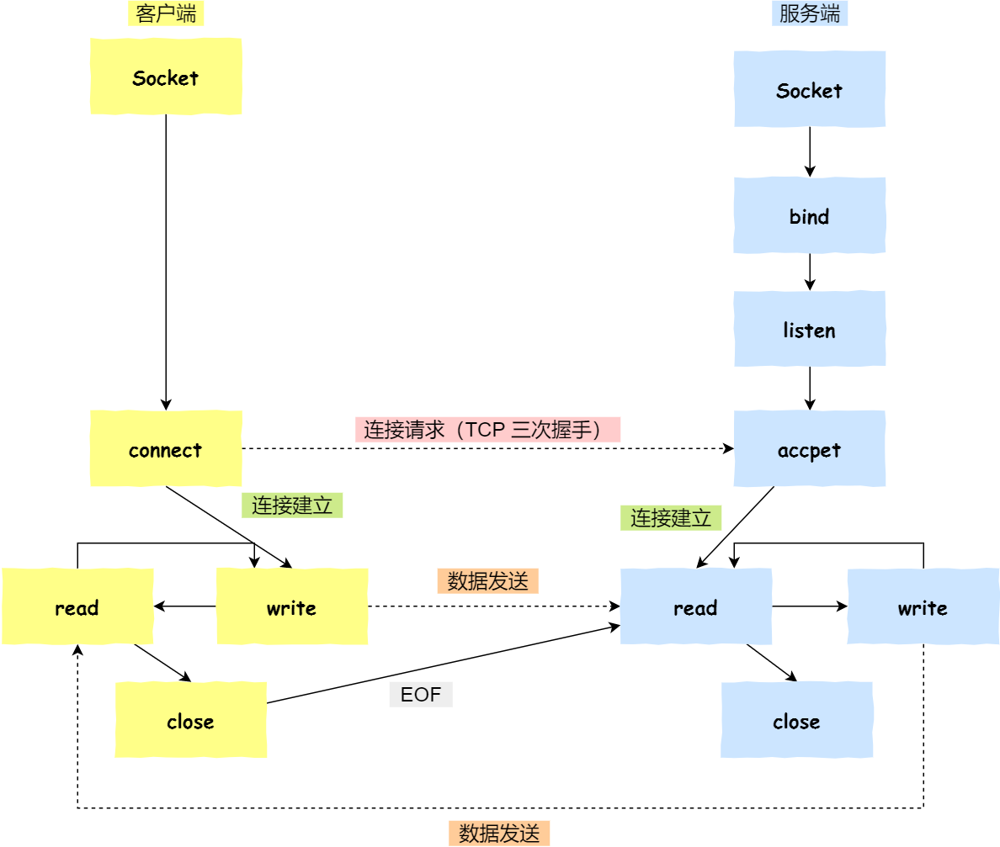
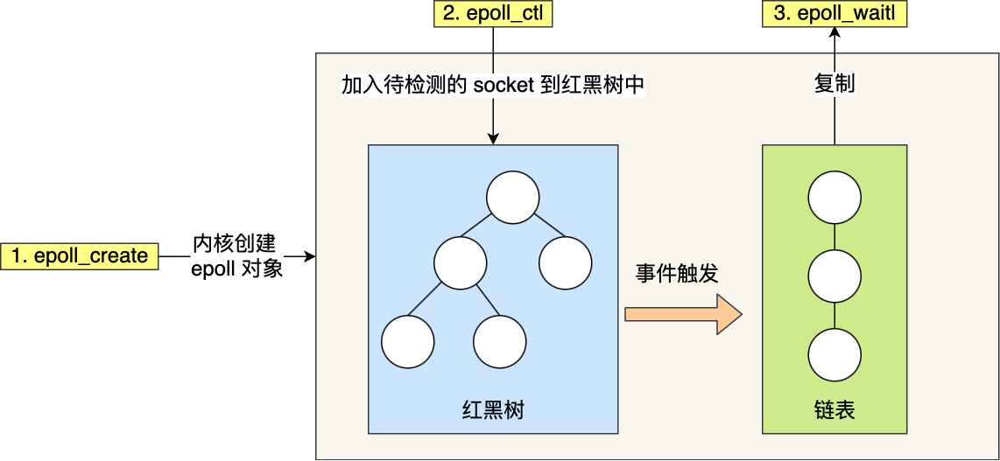

## socket编程




1. 服务端和客户端初始化 socket ，得到⽂件描述符；

2. 服务端调⽤ bind ，将绑定在 IP 地址和端⼝;

3. 服务端调⽤ listen ，进⾏监听；

4. 服务端调⽤ accept ，等待客户端连接；

5. 客户端调⽤ connect ，向服务器端的地址和端⼝发起连接请求；

6. 服务端 accept 返回⽤于传输的 socket 的⽂件描述符；

7. 客户端调⽤ write 写⼊数据；服务端调⽤ read 读取数据；

8. 客户端断开连接时，会调⽤ close ，那么服务端 read 读取数据的时候，就会读取到了 EOF ，待处理完

数据后，服务端调⽤ close ，表示连接关闭。


这⾥需要注意的是，服务端调⽤ accept 时，连接成功了会返回⼀个已完成连接的 socket，后续⽤来传输数据。

所以，监听的 socket 和真正⽤来传送数据的 socket，是两个 socket，⼀个叫作**监听 socket**，⼀个叫作**已完成连接 socket**。

成功连接建⽴之后，双⽅开始通过 read 和 write 函数来读写数据，就像往⼀个⽂件流⾥⾯写东⻄⼀样。


## select函数

select 实现多路复⽤的⽅式是，**将已连接的 Socket 都放到⼀个⽂件描述符集合**，

然后**调⽤ select 函数将⽂件描述符集合拷⻉到内核⾥，让内核来检查是否有⽹络事件产⽣**，检查的⽅式很粗暴，就是通过**遍历⽂件描述符集合的⽅式**，**当检查到有事件产⽣后，将此 Socket 标记为可读或可写， 接着再把整个⽂件描述符集合拷⻉回⽤户态⾥**，然后⽤户态还需要**再通过遍历的⽅法找到可读或可写的 Socke**t，然后再对其处

理。

所以，对**于 select 这种⽅式，需要进⾏ 2 次「遍历」⽂件描述符集合**，⼀次是在内核态⾥，⼀个次是在**⽤户态** ，⽽且还会发⽣ **2** 次「拷⻉」⽂件描述符集合，先从⽤户空间传⼊内核空间，由内核修改后，再传出到⽤户空间中。


select 使⽤固定⻓度的 BitsMap，表示⽂件描述符集合，⽽且**所⽀持的⽂件描述符的个数是有限制的**，在

Linux 系统中，由内核中的 FD_SETSIZE 限制， 默认最⼤值为 1024 ，只能监听 0~1023 的⽂件描述符。


## poll 函数

**poll 不再⽤位图或数组来存储所关注的⽂件描述符，取⽽代之⽤动态数组**，以**链表形式来组织，突破了**

**select 的⽂件描述符个数限制**，当然还会受到系统⽂件描述符限制。

但是 poll 和 select 并没有太⼤的本质区别，都是使⽤「线性结构」存储进程关注的 **Socket** 集合，因此**都需要遍历⽂件描述符集合**来找到可读或可写的 **Socket**，时间复杂度为 **O(n)**，

⽽且**也需要在⽤户态与内核态之间拷⻉⽂件描述符集合**，这种⽅式随着并发数上来，性能的损耗会呈指数级增⻓。


## epoll 函数
epoll 通过两个⽅⾯，很好解决了 select/poll 的问题。

+ 第⼀点，epoll 在内核⾥**使⽤红⿊树来跟踪进程所有待检测的⽂件描述符**，把需要监控的 socket 通过

`epoll_ctl()` 函数加⼊内核中的红⿊树⾥，红⿊树是个⾼效的数据结构，增删查⼀般时间复杂度是

O(logn) ，通过对这棵⿊红树进⾏操作，**这样就不需要像 select/poll 每次操作时都传⼊整个 socket 集合，只需要传⼊⼀个待检测的 socket，减少了内核和⽤户空间⼤量的数据拷⻉和内存分配**。

+ 第⼆点， epoll 使⽤**事件驱动**的机制，**内核⾥维护了⼀个链表来记录就绪事件**，**当某个 socket 有事件发⽣时，通过回调函数内核会将其加⼊到这个就绪事件列表中**，当⽤户调⽤ `epoll_wait() `函数时，**只会返回有事件发⽣的⽂件描述符的个数，不需要像 select/poll 那样轮询扫描整个 socket 集合**，⼤⼤提⾼了检测的效率。


### 相关接口

epoll API是Linux专有的特性，相较于`select`和`poll`，`epoll`更加灵活且**没有描述符限制**。`epoll`设计也与`select`和`poll`不同，主要包含以下三个接口：

```c
int epoll_create(int size);
int epoll_ctl(int epfd, int op, int fd, struct epoll_event *event);
int epoll_wait(int epfd, struct epoll_event * events, int maxevents, int timeout);
```


> 下面依次介绍。


#### epoll_create()

```c
int epoll_create(int size)；//创建一个epoll的句柄，size用来告诉内核这个监听的数目一共有多大
```

创建一个epoll的句柄，size用来告诉内核这个监听的数目一共有多大，这个参数不同于select()中的第一个参数，给出最大监听的fd+1的值，*参数size并不是限制了epoll所能监听的描述符最大个数，只是对内核初始分配内部数据结构的一个建议*。
当创建好epoll句柄后，它就会占用一个fd值，在linux下如果查看/proc/进程id/fd/，是能够看到这个fd的，所以在使用完epoll后，必须调用close()关闭，否则可能导致fd被耗尽。


####  int epoll_ctl()

```c
int epoll_ctl(int epfd, int op, int fd, struct epoll_event *ev); //修改兴趣列表（事件注册函数）
```

该函数是对指定描述符fd执行op操作。

- epfd：是epoll_create()的返回值。
- op：表示op操作，用三个宏来表示：1. `EPOLL_CTL_ADD`注册新的fd到epfd中；2. `EPOLL_CTL_MOD`修改已经注册的fd的监听事件；3. `EPOLL_CTL_DEL`从`epfd`中删除一个fd。
- fd：是需要监听的fd（文件描述符）
- epoll_event：是告诉内核需要监听什么事，struct epoll_event结构如下：


```c
struct epoll_event {
  __uint32_t events;  /* Epoll events */
  epoll_data_t data;  /* User data variable */
};
```

**events可以是以下几个宏的集合**：

1. EPOLLIN ：表示对应的文件描述符可以读（包括对端SOCKET正常关闭）；
2. EPOLLOUT：表示对应的文件描述符可以写；
3. EPOLLPRI：表示对应的文件描述符有紧急的数据可读（这里应该表示有带外数据到来）；
4. EPOLLERR：表示对应的文件描述符发生错误；
5. EPOLLHUP：表示对应的文件描述符被挂断；
6. EPOLLET： bsEPOLL设为边缘触发（Edge Triggered)模式，这是相对于水平触发(Level Triggered）来说的。
7. EPOLLONESHOT：只监听一次事件，当监听完这次事件之后，如果还需要继续监听这个socket的话，需要再次把这个socket加入到EPOLL队列里。


其中`data`的类型为：

```c
typedef union epoll_data {
  void    *ptr; //pointer to user defined data
  int     fd; //file descriptor
  uint_32 u32; //32-bit integer
  uint_64 u64; //64-bit integer
} epoll_data_t;
```

**`data`字段是唯一可以获知同这个事件相关的文件描述符的途径**，因此调用`epoll_ctl()`将文件描述符添加到兴趣列表中时，应该要么将`ev.data.fd`设为文件描述符，要么将`ev.data.ptr`设为指向包含该文件描述的结构体。


####  int epoll_wait()

```c
int epoll_wait(int epfd, struct epoll_event *evlist, int maxevents, int timeout);
```

数组`evlist`的空间由调用者负责申请;


等待epfd上的io事件，最多返回maxevents个事件。
参数evlist用来从内核得到事件的集合，maxevents告之内核这个evlist有多大，这个maxevents的值不能大于创建epoll_create()时的size，参数timeout是超时时间（毫秒，0会立即返回，-1将不确定，也有说法说是永久阻塞）。**该函数返回需要处理的事件数目，如返回0表示已超时**。


### epoll的工作模式

epoll对文件描述符的操作有两种模式：**LT（level trigger）**和**ET（edge trigger）**。LT模式是默认模式，LT模式与ET模式的区别如下：

**LT模式**：当epoll_wait检测到描述符事件发生并将此事件通知应用程序，**应用程序可以不立即处理该事件**。下次调用epoll_wait时，会再次响应应用程序并通知此事件。

**ET模式**：当epoll_wait检测到描述符事件发生并将此事件通知应用程序，**应用程序必须立即处理该事件**。如果不处理，下次调用epoll_wait时，不会再次响应应用程序并通知此事件。


LT模式下，**主要缓冲区数据一次没有处理完，那么下次`epoll_wait`返回时，还会返回这个句柄**；

而ET模式下，缓冲区数据一次没处理结束，那么下次就不会再通知了，只在第一次返回．所以在ET模式下，一般是通过while循环，一次性读完全部数据**．epoll默认使用的是LT**．


#### 1. LT模式

LT(level triggered)是默认的工作方式，并且**同时支持block和no-block** socket.在这种做法中，内核告诉你一个文件描述符是否就绪了，然后你可以对这个就绪的fd进行IO操作。如果你不作任何操作，内核还是会继续通知你的。

#### 2. ET模式

**ET(edge-triggered)是高速工作方式**，只支持no-block socket。在这种模式下，当描述符从未就绪变为就绪时，内核通过epoll告诉你。然后它会假设你知道文件描述符已经就绪，并且不会再为那个文件描述符发送更多的就绪通知，直到你做了某些操作导致那个文件描述符不再为就绪状态了(比如，你在发送，接收或者接收请求，或者发送接收的数据少于一定量时导致了一个EWOULDBLOCK 错误）。但是请注意，如果一直不对这个fd作IO操作(从而导致它再次变成未就绪)，内核不会发送更多的通知(only once)

**ET模式在很大程度上减少了epoll事件被重复触发的次数**，因此效率要比LT模式高。epoll工作在ET模式的时候，**必须使用非阻塞套接口**，以避免由于一个文件句柄的阻塞读/阻塞写操作把处理多个文件描述符的任务饿死。


**假如有这样一个例子：**

1. 我们已经把一个用来从管道中读取数据的文件句柄(RFD)添加到epoll描述符
2. 这个时候从管道的另一端被写入了2KB的数据
3. 调用epoll_wait(2)，并且它会返回RFD，说明它已经准备好读取操作
4. 然后我们读取了1KB的数据
5. 调用epoll_wait(2)（两种工作模式有不同的差别）

**LT模式：**
如果是LT模式，那么在第5步调用epoll_wait(2)之后，仍然能受到通知。

**ET模式：**
只有在监视的文件句柄上发生了某个事件的时候 ET 工作模式才会汇报事件。因此在第5步的时候，调用者可能会放弃等待仍在存在于文件输入缓冲区内的剩余数据。


### epoll的实现原理

在linux，一切皆文件．所以当调用`epoll_create`时，内核给这个`epoll`分配一个文件描述符，但是这个不是普通的文件，而是只服务于epoll。

当内核初始化epoll时，会开辟一块内核高速缓冲区，用于放置我们监听的对端socket，这些socket会以**红黑树节点的形式**保存在内核的`cache`里，以支持快速的查找，插入，删除。

同时，建立了一个**list链表，用于存储准备就绪的事件**．所以调用`epoll_wait`时，在timeout时间内，只是简单的观察这个list链表是否有数据，如果没有，则睡眠至超时时间到返回；如果有数据，则在超时时间到，拷贝至用户态`events`数组中．

*那么，这个准备就绪list链表是怎么维护的呢？*
当我们执行`epoll_ctl()`时，除了把socket_fd放到epoll系统里对应的红黑树上之外，还会**给内核中断处理程序注册一个回调函数**，告诉内核，**如果这个句柄的中断到了，就把它放到准备就绪list链表里**。所以，当一个socket上有数据到了，内核在把网卡上的数据copy到内核中后就来把socket插入到准备就绪链表里了。


epoll主要由两个结构体：eventpoll与epitem。epitem是每一个IO所对应的的事件。比如 `epoll_ctl()`的`EPOLL_CTL_ADD`操作的时候，就需要创建一个`epitem`。`eventpoll`是每一个epoll所对应的。比如`epoll_create`就是创建一个`eventpoll`。如下图所示，`eventpoll` 包含了 `lock`、`mtx`、`wq（等待队列）`与 `rdlist` 等成员，其中 `rdlist` 和 `rbr` 是我们所关心的。