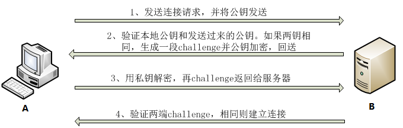

# ssh公钥私钥原理
主要有两种登录方式：第一种为密码口令登录，第二种为公钥登录

 

## 一、密码登录

整个过程是这样的：

1. 远程主机收到用户的登录请求，把自己的公钥发给用户。

2. 用户使用这个公钥，将登录密码加密后，发送到远程主机。（客户端输入密码的过程）

3. 远程主机用自己的私钥，解密登录密码，如果密码正确，就同意用户登录。

这个过程本身是安全的，但是实施的时候存在一个风险：**如果有人截获了登录请求，然后冒充远程主机，将伪造的公钥发给用户，那么用户很难辨别真伪。因为不像https协议，SSH协议的公钥是没有证书中心（CA）公证的，也就是说，都是自己签发的。**


如果你是第一次登录对方主机，系统会出现下面的提示：

```shell
　$ ``ssh` `user@host` `The authenticity of host ``'host (12.18.429.21)'` `can't be established.` `RSA key fingerprint is 98:2e:d7:e0:de:9f:ac:67:28:c2:42:2d:37:16:58:4d.` `Are you sure you want to ``continue` `connecting (``yes``/no``)?
```

这段话的意思是，无法确认host主机的真实性，只知道它的公钥指纹，问你还想继续连接吗？


所谓**公钥指纹**，是指公钥长度较长（这里采用RSA算法，长达1024位），很难比对，所以对其进行MD5计算，将它变成一个128位的指纹。上例中是`98:2e:d7:e0:de:9f:ac:67:28:c2:42:2d:37:16:58:4d`，再进行比较，就容易多了。


很自然的一个问题就是，用户怎么知道远程主机的公钥指纹应该是多少？回答是没有好办法，**远程主机必须在自己的网站上贴出公钥指纹，以便用户自行核对。假定经过风险衡量以后，用户决定接受这个远程主机的公钥。**

当远程主机的公钥被接受以后，它就会被保存在文件`$HOME/.ssh/known_hosts`之中。下次再连接这台主机，系统就会认出它的公钥已经保存在本地了，从而跳过警告部分，直接提示输入密码。

每个SSH用户都有自己的known_hosts文件，此外系统也有一个这样的文件，通常是/etc/ssh/ssh_known_hosts，保存一些对所有用户都可信赖的远程主机的公钥。

 

## 二、公钥登录
**公钥登录是为了解决每次登录服务器都要输入密码的问题，流行使用RSA加密方案**，主要流程包含：

1. 客户端生成RSA公钥和私钥（其实在哪生成是无所谓的）
2. 客户端将自己的公钥存放到服务器（如果是服务端生成，则将）
3. 客户端请求连接服务器，服务器将一个随机字符串发送给客户端（发送一个随机串）
4. 客户端根据自己的私钥加密这个随机字符串之后再发送给服务器（客户端私钥加密）
5. 服务器接受到加密后的字符串之后用公钥解密，如果正确就让客户端登录，否则拒绝。这样就不用使用密码了。





### 公钥和私钥
一个公钥对应一个私钥。密钥对中，让大家都知道的是公钥，不告诉大家，只有自己知道的，是私钥。

1. 私钥用来进行解密和签名，是给自己用的。
2. 公钥由本人公开，用于加密和验证签名，是给别人用的。
3. 当该用户发送信息时，用私钥签名，别人用他给的公钥验证签名，可以保证该信息是由自己发送的（保证信息的不可篡改）；当该用户接受信息时，别人用他的公钥加密，他用私钥解密，可以保证该信息只能由他接收到（保证信息的私密性）。


### RSA算法的作用
#### 1、加密：公钥加密私钥解密
　　**主要用于将数据资料加密不被其他人非法获取，保证数据私密性。**使用公钥将数据资料加密，只有私钥可以解密。即使密文在网络上被第三方获取由于没有私钥则无法解密。从而保证数据安全性。　　　　　

1. A在自己电脑上生成RSA钥匙文件，一个私钥文件一个公钥文件，并将他的公钥传送给B；
2. 此时B要传送信息给A，于是B用A的公钥加密他的消息，然后传送给A。【网络上传输的密文，没有A的私钥无法解密，其他人获取之后也没用】；
3. A用他的私钥解密B的消息。

#### 2、认证：私钥加密公钥解密
主要用于身份验证，判断某个身份的真实性。**使用私钥加密之后，用对应的公钥解密从而验证身份真实性。**

比如【服务端S】要验证【客户端C】是否是真实用户：
1. C将自己公钥给S；
2. C将信息用自己私钥加密传送给S；
3. S根据C的公钥解密，如果成功则为真实身份用户。


**SSH公钥登录则用的是第二种功能。**


>安全性： 这种算法非常可靠，密钥越长，它就越难破解。根据已经披露的文献，目前被破解的最长RSA密钥是768个二进制位。也就是说，长度超过768位的密钥，还无法破解（至少没人公开宣布）。因此可以认为，1024位的RSA密钥基本安全，2048位的密钥极其安全。所以我们在用ssh-keygen命令时候要注意密钥长度，具体参数为：`-b bits`（指定密钥长度。对于RSA密钥，最小要求768位，默认是2048位。DSA密钥必须恰好是1024位(FIPS 186-2 标准的要求)。）
至少不能少于768。一般不用写默认就是2048了。

 

注意：ssh 和 https 协议的区别，ssh 没有CA认证中心的概念。
