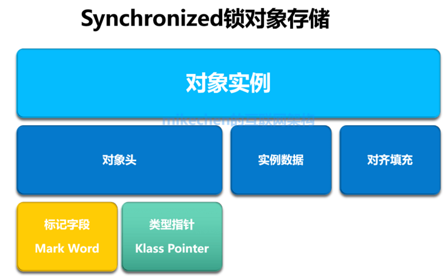

# 使用方式

主要有3种使用方式:

**1.修饰实例方法：作用于当前实例加锁**

```java
public synchronized void method(){
		// 代码
}
```

**2.修饰静态方法：作用于当前类对象加锁**

```java
public static synchronized void method(){
		// 代码
}
```

**3.修饰代码块：指定加锁对象，对给定对象加锁**

```java
synchronized(this){
		//代码                                  
}
```


# 底层实现

synchronized的底层实现是完全依赖JVM虚拟机的,所以谈synchronized的底层实现，就不得不谈数据在JVM内存的存储：Java对象头，以及Monitor对象监视器。


## Java对象头

在JVM虚拟机中，对象在内存中的存储布局，可以分为三个区域:

+ 对象头(Header)
+ 实例数据(Instance Data)
+ 对齐填充(Padding)

**Java对象头主要包括两部分数据：**





**1)类型指针（Klass Pointer）**

是对象指向它的类元数据的指针，虚拟机通过这个指针来确定这个对象是哪个类的实例；


**2)标记字段(Mark Word)**

用于存储对象自身的运行时数据，如哈希码（HashCode）、GC分代年龄、锁状态标志、持有锁的线程、偏向线程 ID、偏向时间戳等等,它是实现轻量级锁和偏向锁的关键.

所以，很明显synchronized使用的锁对象是存储在Java对象头里的标记字段里。


64 位虚拟机 Mark Word 是 64bit 其结构如下：


## Monitor
monitor描述为对象监视器,可以类比为一个特殊的房间，这个房间中有一些被保护的数据，monitor保证每次只能有一个线程能进入这个房间进行访问被保护的数据，进入房间即为持有monitor，退出房间即为释放monitor。

使用syncrhoized加锁的同步代码块在字节码引擎中执行时，主要就是通过锁对象的monitor的取用(monitorenter)与释放(monitorexit)来实现的。（不过 syncrhoized 方法块不是使用到这两个字节码指令）


### 线程状态流转在Monitor上的体现

当多个线程同时请求某个对象监视器时，对象监视器会设置几种状态用来区分请求的线程：

Contention List：所有请求锁的线程将被首先放置到该竞争队列
Entry List：Contention List中那些有资格成为候选人的线程被移到Entry List
Wait Set：那些调用wait方法被阻塞的线程被放置到Wait Set
OnDeck：任何时刻最多只能有一个线程正在竞争锁，该线程称为OnDeck
Owner：获得锁的线程称为Owner
!Owner：释放锁的线程


# 锁升级
在 JDK 6 中虚拟机团队对锁进行了重要改进，优化了其性能引入了 **偏向锁、轻量级锁、适应性自旋、锁消除、锁粗化**等实现，其中**锁消除和锁粗化**本文不做详细讨论其余内容我们将对其进行逐一探究。

锁的4中状态：无锁状态、偏向锁状态、轻量级锁状态、重量级锁状态（级别从低到高）


## 偏向锁

> 为什么要引入偏向锁？

因为经过HotSpot的作者大量的研究发现，**大多数时候是不存在锁竞争的**，**常常是一个线程多次获得同一个锁**，因此如果每次都要竞争锁会增大很多没有必要付出的代价，为了降低获取锁的开销，才引入的偏向锁。


### 偏向锁的升级

**当线程1访问代码块并获取锁对象时，会在java对象头和栈帧中记录偏向的锁的threadID**，因为**偏向锁不会主动释放锁**，因此以后线程1再次获取锁的时候，需要**比较当前线程的threadID和Java对象头中的threadID是否一致**，如果一致（还是线程1获取锁对象），则无需使用CAS来加锁、解锁；如果不一致（其他线程，如线程2要竞争锁对象，而偏向锁不会主动释放因此还是存储的线程1的threadID），那么**需要查看Java对象头中记录的线程1是否存活**，

1. **如果没有存活，那么锁对象被重置为无锁状态**，其它线程（线程2）可以竞争将其设置为偏向锁cas；

2. **如果存活，那么立刻查找该线程（线程1）的栈帧信息**，
    + 如果还是需要继续持有这个锁对象，那么**暂停当前线程1，撤销偏向锁，升级为轻量级锁**，
    + 如果线程 1 不再使用该锁对象，那么**将锁对象状态设为无锁状态，重新偏向新的线程**cas。
    
    

> 偏向锁不会主动释放，只有被动撤销。


### 偏向锁的取消

偏向锁是默认开启的，而且开始时间一般是比应用程序启动慢几秒，如果不想有这个延迟，那么可以使用-XX:BiasedLockingStartUpDelay=0；

如果不想要偏向锁，那么可以通过-XX:-UseBiasedLocking = false来设置；

### 优点

只有一个线程执行同步块时进一步提高性能，适用于一个线程反复获得同一锁的情况。偏向锁可以提高带有同步但无竞争的程序性能。

### 缺点

如果存在竞争会带来额外的锁撤销操作。


## 轻量级锁

> 为什么要引入轻量级锁？

轻量级锁考虑的是**竞争锁对象的线程不多**，而且**线程持有锁的时间也不长**的情景。

因为**阻塞线程需要CPU从用户态转到内核态，代价较大**，如果刚刚阻塞不久这个锁就被释放了，那这个代价就有点得不偿失了，因此这个时候就**干脆不阻塞这个线程，让它自旋这等待锁释放**。

轻量级锁什么时候升级为重量级锁？

线程1获取轻量级锁时会**先把锁对象的对象头MarkWord复制一份到线程1的栈帧中创建的用于存储锁记录的空间（称为DisplacedMarkWord）**，然后**使用CAS把对象头中的内容替换为线程1存储的锁记录（DisplacedMarkWord）的地址**；

如果在线程1复制对象头的同时（在线程1CAS之前），线程2也准备获取锁，复制了对象头到线程2的锁记录空间中，但是在**线程2CAS的时候，发现线程1已经把对象头换了，线程2的CAS失败，那么线程2就尝试使用自旋锁来等待线程1释放锁**。


### 加锁

**多个线程竞争偏向锁导致偏向锁升级为轻量级锁。**

1. JVM 在当前线程的栈帧中创建 Lock Reocrd，并将对象头中的 Mark Word 复制到 Lock Reocrd 中。（Displaced Mark Word）
2. 线程尝试使用 CAS 将对象头中的 Mark Word 替换为指向 Lock Reocrd 的指针。如果成功则获得锁，如果失败则先检查对象的 Mark Word 是否指向当前线程的栈帧，如果是则说明已经获取锁，否则说明其它线程竞争锁则膨胀为重量级锁。

### 解锁

1. 使用 CAS 操作将 Mark Word 还原
2. 如果第 1 步执行成功则释放完成
3. 如果第 1 步执行失败则膨胀为重量级锁（执行失败说明存在竞争）。~~存疑~~


### 优点

其性能提升的依据是对于绝大部分的锁在整个生命周期内都是不会存在竞争。在多线程交替执行同步块的情况下，可以避免重量级锁引起的性能消耗。

### 缺点

在有多线程竞争的情况下轻量级锁增加了额外开销。


但是如果自旋的时间太长也不行，因为自旋是要消耗CPU的，因此自旋的次数是有限制的，比如10次或者100次，如果自旋次数到了线程1还没有释放锁，或者线程1还在执行，线程2还在自旋等待，这时又有一个线程3过来竞争这个锁对象，那么这个时候轻量级锁就会膨胀为重量级锁。这个时候又有了自适应自旋的概念。

 

## 重量级锁

**重量级锁把除了拥有锁的线程都阻塞，防止CPU空转**。

注意：为了避免无用的自旋，**轻量级锁一旦膨胀为重量级锁就不会再降级为轻量级锁了**；

**偏向锁升级为轻量级锁也不能再降级为偏向锁**。

一句话就是锁可以升级不可以降级，但是偏向锁状态可以被重置为无锁状态。


> 但是一旦释放重量级锁，就重新回到上面的流程中了。

在重量级锁中没有竞争到锁的对象会 park 被挂起，退出同步块时 unpark 唤醒后续线程。唤醒操作涉及到操作系统调度会有额外的开销。

`ObjectMonitor` 中包含一个同步队列（由 `_cxq` 和 `_EntryList` 组成）一个等待队列（ `_WaitSet` ）。

+ 被`notify`或 `notifyAll` 唤醒时根据 `policy` 策略选择加入的队列（policy 默认为 0）
+ 退出同步块时根据 `QMode` 策略来唤醒下一个线程（QMode 默认为 0）

这里稍微提及一下**管程**这个概念。synchronized 关键字及 `wait`、`notify`、`notifyAll` 这三个方法都是管程的组成部分。可以说管程就是一把解决并发问题的万能钥匙。有两大核心问题管程都是能够解决的：

+ **互斥**：即同一时刻只允许一个线程访问共享资源；
+ **同步**：即线程之间如何通信、协作。


`synchronized` 的 `monitor`锁机制和 JDK 并发包中的 `AQS` 是很相似的，只不过 `AQS` 中是一个同步队列多个等待队列。熟悉 `AQS` 的同学可以拿来做个对比。


> 在 HotSpot 中 monitor 是由 ObjectMonitor 实现的。


### monitor 竞争过程

1. 通过 CAS 尝试把 monitor 的 owner 字段设置为当前线程。
2. 如果设置之前的 owner 指向当前线程，说明当前线程再次进入 monitor，即重入锁执行 recursions ++ , 记录重入的次数。
3. 如果当前线程是第一次进入该 monitor, 设置 recursions 为 1,_owner 为当前线程，该线程成功获得锁并返回。
4. 如果获取锁失败，则等待锁的释放。

执行 `monitorenter` 指令时会调用cpp编写的代码。


### monitor 释放
当某个持有锁的线程执行完同步代码块时，会释放锁并 `unpark` 后续线程（由于篇幅只保留重要代码）。


> 参考
> https://blog.csdn.net/tongdanping/article/details/79647337
> https://juejin.cn/post/6844903913120874510
> https://juejin.cn/post/6936067917255540767
> https://xiaomi-info.github.io/2020/03/24/synchronized/
