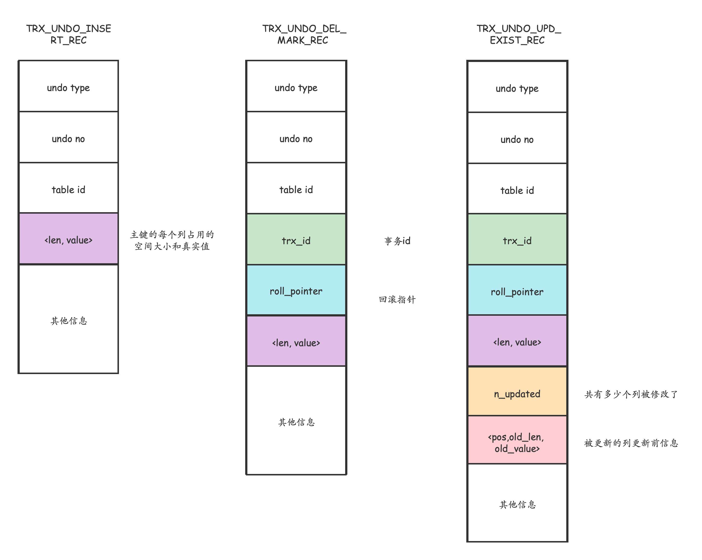

## undo log的作用

为了保证事务的原子性，InnoDB引入了undo日志，undo日志记载了回滚操作所需的内容。

undo是**逻辑日志**，只是将数据库逻辑地恢复到原来的样子；所有修改都被逻辑地取消了，但是数据结构和页本身在回滚之后可能不大相同。

undo log有两个作用：**提供回滚**和**多版本并发控制(MVCC)**。


## 事务id

在事务在对表中的记录进行修改的时候，会为这个事务分配一个唯一的事务id，这个事务id是递增的，所以事务id越小越先执行。未被分配事务id的事务的id默认是0。


## 各种类型的Undo log

InnoDB对不同场景的设计了不同类型的undo日志，比如TRX_UNDO_INSERT_REC, TRX_UNDO_DEL_MARK_REC.

TRX_UNDO_UPD_EXIST_REC等等。

除了insert产生的undo日志中没有roll_pointer字段，其他的一般都有roll_pointer这个字段，这个字段就支撑了回滚和MVCC的功能。





## Undo log 的管理

类型为FIL_PAGE_UNDO_LOG的页面，是专门用来存储undo日志的，不妨称为Undo页面。


一个事务写的undo日志可能在一个页面中放不下，所以MySQL使用链表来组织这些undo页面。

在一个事务执行过程中，最多分配4个页面链表，

分别是

1. 针对普通表的insert undo 链表；
2. 针对普通表的update undo 链表；
3. 针对临时表的insert undo 链表；
4. 针对临时表的update undo 链表；

每个undo页面链表都对应一个Undo Log Segment。Undo页面链表的第一个页中有一个名为Undo Log Segment Header的部分，用来存储关于这个段的信息。

同一个事务向一个undo链表写入的undo日志算是一个组，每个组都以一个Undo Log Header 部分开头。


## undo及redo如何记录事务

### Undo + Redo事务的简化过程
假设有A、B两个数据，值分别为1,2，开始一个事务，事务的操作内容为：把1修改为3，2修改为4，那么实际的记录如下（简化）：

```
A.事务开始.
B.记录A=1到undo log.
C.修改A=3.
D.记录A=3到redo log.
E.记录B=2到undo log.
F.修改B=4.
G.记录B=4到redo log.
H.将redo log写入磁盘。
I.事务提交
```

**注意是先写 undo log，再操作，最后再写redo log**


### 崩溃恢复

前面说到未提交的事务和回滚了的事务也会记录Redo Log，因此在进行恢复时,这些事务要进行特殊的的处理。有2种不同的恢复策略：

+ 进行恢复时，只重做已经提交了的事务。
+ 进行恢复时，**重做所有事务包括未提交的事务和回滚了的事务，然后通过Undo Log回滚那些未提交的事务**。


MySQL数据库InnoDB存储引擎使用了B策略, InnoDB存储引擎中的恢复机制有几个特点：

+ **在重做Redo Log时，并不关心事务性**。 恢复时，没有BEGIN，也没有COMMIT,ROLLBACK的行为。也不关心每个日志是哪个事务的。尽管事务ID等事务相关的内容会记入Redo Log，这些内容只是被当作要操作的数据的一部分。

+ 使用B策略就**必须要将Undo Log持久化**，而且**必须要在写Redo Log之前将对应的Undo Log写入磁盘**。Undo和Redo Log的这种关联，使得持久化变得复杂起来。

  为了降低复杂度，**InnoDB将Undo Log看作数据，因此记录Undo Log的操作也会记录到redo log中**。

  **这样undo log就可以像数据一样缓存起来**，**而不用在redo log之前写入磁盘了**。

  包含Undo Log操作的Redo Log，看起来是这样的：
```shell
     记录1: <trx1, Undo log insert <undo_insert …>> # 记录的 undo-log
     记录2: <trx1, insert …> # 重做日志本身
     记录3: <trx2, Undo log insert <undo_update …>>
     记录4: <trx2, update …>
     记录5: <trx3, Undo log insert <undo_delete …>>
     记录6: <trx3, delete …>
```


到这里，还有一个问题没有弄清楚。既然Redo没有事务性，那岂不是会重新执行被回滚了的事务？
确实是这样。同时Innodb也会将事务回滚时的操作也记录到redo log中。**回滚操作本质上也是对数据进行修改，因此回滚时对数据的操作也会记录到Redo Log中**。

**一个回滚了的事务的Redo Log**，看起来是这样的：

```shell
     记录1: <trx1, Undo log insert <undo_insert …>> # 记录的 undo-log
     记录2: <trx1, insert A…> # 重做日志本身
     记录3: <trx1, Undo log insert <undo_update …>>
     记录4: <trx1, update B…>
     记录5: <trx1, Undo log insert <undo_delete …>>
     记录6: <trx1, delete C…>
     # 下面是对应的回滚操作
     记录7: <trx1, insert C> 
     记录8: <trx1, update B to old value>
     记录9: <trx1, delete A>
```


**一个被回滚了的事务在恢复时的操作就是先redo再undo，因此不会破坏数据的一致性**。


