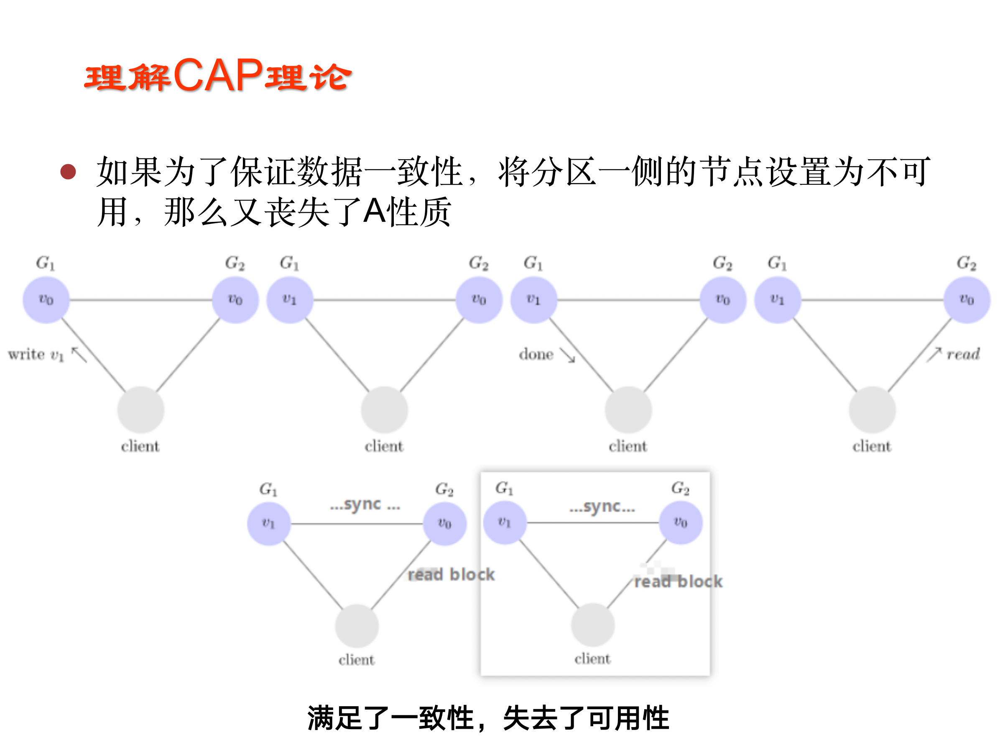
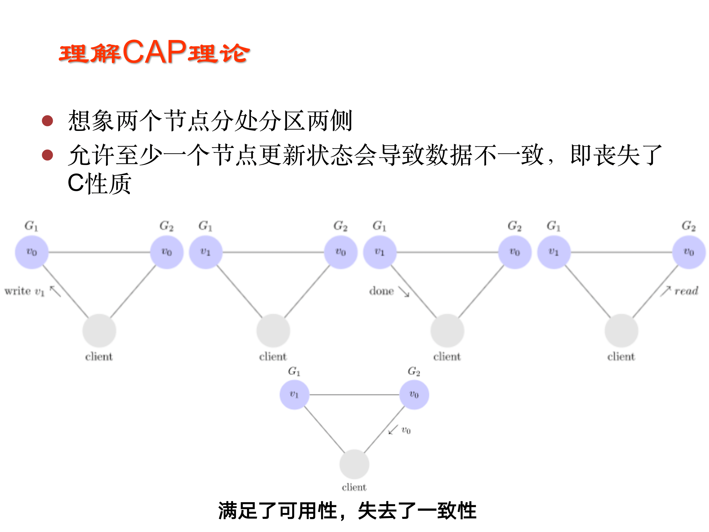

# CAP

CAP定理：一个分布式系统不可能满足**一致性**，**可用性**和**分区容错性**这三个需求，最多只能同时满足两个。

+ 文档系列C: Consistency 一致性

  一致性：在分布式系统完成某写操作后任何读操作，都应该获取到该写操作写入的那个最新的值。相当于要求分布式系统中的各节点时时刻刻保持数据的一致性。

+ A: Availability 可用性

  可用性： 一直可以正常的做读写操作。简单而言就是客户端一直可以正常访问并得到系统的正常响应。用户角度来看就是不会出现系统操作失败或者访问超时等问题。

+ P: Tolerance of network Partition 分区容忍性

  分区容错性：指的分布式系统中的某个节点或者网络分区出现了故障的时候，整个系统仍然能对外提供满足一致性和可用性的服务，也就是说部分故障不影响整体使用。

## CP的实现

## AP的实现

除非两个节点可以互相通信，才能既保证C又保证A，这又会导致丧失P性质。
一般来说，跨区域的系统，无法舍弃P性质，那么就只能在数据一致性和可用性上做一个艰难选择。

CAP三者不可兼得，该如何取舍？

+ CA: 优先保证一致性和可用性，放弃分区容错。 这也意味着放弃系统的扩展性，系统不再是分布式的，有违设计的初衷。

  如关系型数据库。

+ CP: 优先保证一致性和分区容错性，放弃可用性。在数据一致性要求比较高的场合(譬如:zookeeper，Hbase) 是比较常见的做法，一旦发生网络故障或者消息丢失，就会牺牲用户体验，等恢复之后用户才逐渐能访问。

  如一些分布式数据库的实现。

+ AP: 优先保证可用性和分区容错性，放弃一致性。放弃一致性不是说一致性就不保证了，而是逐渐的变得一致。

  如BASE的要求。

# BASE

+ Basically Availble --基本可用
+ Soft-state --软状态/柔性事务
+ Eventual Consistency --最终一致性

## Basically Availble（基本可用）

基本可用是指分布式系统在出现不可预知故障的时候，允许损失部分可用性——但请注意，这绝不等价于系统不可用。

+ **响应时间上的损失**：正常情况下，一个在线搜索引擎需要0.5秒内返回给用户相应的查询结果，但由于出现异常（比如系统部分机房发生断电或断网故障），查询结果的响应时间增加到了1~2秒
+ **功能上的损失**：正常情况下，在一个电子商务网站上进行购物，消费者几乎能够顺利地完成每一笔订单，但是在一些节日大促购物高峰的时候，由于消费者的购物行为激增，为了保护购物系统的稳定性，**部分消费者可能会被引导到一个降级页面**。

## Soft-state（软状态/柔性事务）

软状态，和硬状态相对，是指**允许系统中的数据存在中间状态**，并认为该中间状态的存在不会影响系统的整体可用性，**即允许系统在不同节点的数据副本之间进行数据同步的过程存在延时**。

## Eventual Consistency（最终一致性）

最终一致性强调的是系统中所有的数据副本，在经过一段时间的同步后，最终能够达到一个一致的状态。

因此，最终一致性的本质是需要系统保证最终数据能够达到一致，而不需要实时保证系统数据的强一致性。

最终一致性是一种特殊的弱一致性：系统能够保证在没有其他新的更新操作的情况下，数据最终一定能够达到一致的状态，因此所有客户端对系统的数据访问都能够获取到最新的值。

在没有发生故障的前提下，数据达到一致状态的时间延迟，取决于网络延迟，系统负载和数据复制方案设计等因素

# NWR模型

> NWR模型试图解决多副本的数据一致性问题。

+ N: 复制的节点数量
+ R: 成功读操作的最小节点数
+ W: 成功写操作的最小节点数

只需W + R > N，就可以保证强一致性，**因为读取数据的节点和被同步写入的节点是有重叠的**。

例如：
N=3，W=2, R=2 ，那么表示系统中数据有3个不同的副本，
当进行写操作时，需要等待至少有2个副本完成了该写操作系统才会返回执行成功的状态；
对于读操作，系统有同样的特性。
由于R+ W>N,因此该系统是可以保证强一致性的。

R+ W > N时，读(写)延迟由最慢的R(W)副本决定，有时为了获得较高的性能和较小的延迟，R和w的和可能小于N,这时系统不能保证读操作能获取最新的数据。

配置的几种特殊情况

+ W = 1， R = N ，对写操作要求高性能高可用
+ R = 1 ， W = N ，对读操作要求高性能高可用，比如类似cache之类业务
+ W = Q, R = Q where Q = N / 2 + 1 一般应用适用，读写性能之间取得平衡，如N=3 ， W=2 ， R=2。

# 2PC-XA协议

> 2PC的传统方案是在数据库层面实现的，如Oracle、MySQL都支持2PC协议，为了统一标准减少行业内不必要的对接成本，需要制定标准化的处理模型及接口标准，国际开放标准组织Open Group定义分布式事务处理模型**DTP**（Distributed Transaction Processing Reference Model）。
>
> DTP模型定义TM和RM之间通讯的接口规范叫**XA**，简单理解为数据库提供的2PC接口协议，**基于数据库的XA协议来实现2PC又称为XA方案**。

## 概念

XA 分布式协议主要有两个角色：

+ 事务管理器（Transaction Manager 协调者）
  事务管理器作为全局事务的协调管理者，与每个资源管理器通信，完成分布式事务的管理。
+ 资源管理器 （Resource Manager 参与者）
  资源管理器管理每个参与者的事务资源，其应该具有提交和回滚的能力，如数据库。

> XA事务由一个或多个资源管理器（Resource Managers）、一个事务管理器（Transaction Manager）以及一个应用程序（Application Program）组成。
>
> - 资源管理器（RM）：参与者。提供访问事务资源的方法。通常一个[数据库](https://cloud.tencent.com/solution/database?from=10680)就是一个资源管理器。
> - 事务管理器（TM）：协调者。分配标识符，监视事务的进度，并负责事务完成和故障恢复。
> - 应用程序（AP）：发起者。定义事务的边界，制定全局事务中的操作。

## 算法流程
XA 分布式协议制定的分段提交过程：

+ 第一阶段（ prepare ）
  第一阶段**每个参与者准备执行事务并对需要的资源加锁**，**进入 ready 状态，并通知协调者已经准备就绪**。

+ 第二阶段（ commit ）
  第二阶段当协调者确认**每个参与者都 ready 后，通知参与者进行 commit 操作**；
  
  如果**有参与者 fail ，则发送 rollback 命令，各参与者作回滚。**

> + 投票阶段
>   + 在请求阶段，协调者将通知事务参与者准备提交或取消事务，然后进入表决过程
>   + 在表决过程中，参与者将告知协调者自己的决策：同意（事务参与者本地作业执行成功）或取消（本地作业执行故障）
> + 提交阶段
>   + 协调者将基于第一个阶段的投票结果进行决策：提交或取消。当且仅当所有的参与者同意提交事务协调者才通知所有的参与者提交事务，否则协调者将通知所有的参与者取消事务

>[MySQL XA 介绍](https://www.jianshu.com/p/7003d58ea182)
>
>MySQL XA 的命令集合如下：
>
>1. XA START xid: 开启一个事务，并将事务置于ACTIVE状态，此后执行的SQL语句都将置于该是事务中。
>2. XA END xid: 将事务置于IDLE状态，表示事务内的SQL操作完成。
>3. XA PREPARE xid: 实现事务提交的准备工作，事务状态置于PREPARED状态。事务如果无法完成提交前的准备操作，该语句会执行失败。
>4. XA COMMIT xid: 事务最终提交，完成持久化。
>5. XA ROLLBACK xid: 事务回滚终止。
>6. XA RECOVER: 查看MySQL中存在的PREPARED状态的xa事务。
>
>

## 缺点

基于以上，可以很容易理解 2PC 的执行过程，同时我们也注意到它存在的缺点：

> 1. 对高并发不友好。
>    在分布式事务的执行过程中，存在多次通信，占用时间长，并且**在这个过程中所有节点处于阻塞状态**，**每个参与者持有的资源始终要加锁**。
> 2. 单点故障。由上面可知协调者扮演着非常重要的角色，一旦协调者发生故障，参与者就会一直阻塞下去。尤其在第二阶段，协调者发生故障，那么所有的参与者还都处于锁定事务资源的状态中，而无法继续完成事务操作。
> 3. 数据不一致。在第二阶段中，当协调者向参与者发送 commit 请求之后，发生了局部网络异常或者在发送 commit 请求过程中协调者发生了故障，就会导致**只有一部分参与者接受到了commit 请求**。而在这部分参与者接到 commit 请求之后就会执行 commit 操作，但是其他未接到 commit 请求的机器则无法执行事务提交，就导致了数据的不一致。
> 4. 二阶段无法解决的问题
>    协调者再发出commit消息之后宕机，而唯一接收到这条消息的参与者同时也宕机了。那么即使协调者通过选举协议产生了新的协调者，这条事务的状态也是不确定的，没人知道事务是否被已经提交。

## 例子
> 某班要组织一个同学聚会，前提条件是所有参与者同意则活动举行，任意一人拒绝则活动取消。

**用2PC算法来执行过程如下**

+ Phase 1Prepare: 
  + 组织者(coordinator)打电话给所有参与者(participant) ，同时告知参与者列表
  + Proposal: 提出周六2pm-5pm举办活动
  + Vote: participant需vote结果给coordinator：accept or reject
  + Block: 如果accept, participant锁住周六2pm-5pm的时间，不再接受其他请求（这一步加锁很需要关注）。

+ Phase 2 Commit or Abort
  
  + 如果所有参与者都同意，组织者coodinator通知所有参与者commit, 否则通知abort，participant解除锁定。
  
  
  
  
  

**Failure 典型失败情况分析**

+ Participant failure: 任一参与者无响应，coordinator直接执行abort
+ Coordinator failure:
  1. Takeover: 如果participant一段时间没收到cooridnator确认(commit/abort)，则认为coordinator不在了。这时候可自动成为Coordinator的备份(watchdog)
  2. Query: watchdog根据phase 1接收的participant列表发起query
  3. Vote: 所有participant回复vote结果给watchdog, accept or reject
  4. Commit: 如果所有都同意，则commit, 否则abort

[XA与TCC的区别](https://zhuanlan.zhihu.com/p/270213092)

[TCC与两阶段分布式事务处理的区别](https://juejin.cn/post/6844903951477768205)

# TCC（Try-Confirm-Cancel）

> **XA 协议在架构上与 TCC 模型相比，最大的不同是 XA 直接作用于资源层，而后者作用于服务层。**
>
> **2PC是偏数据库层面的，而TCC是纯业务层面。**
>
> TCC 事务机制相比于上面介绍的XA 事务机制，有以下优点： 性能提升：具体业务来实现控制资源锁的粒度变小，不会锁定整个资源。
> 

TCC是一种比较成熟的分布式事务解决方案，可用于解决跨库操作的数据一致性问题；
TCC是服务化的两阶段编程模型，其Try、Confirm、Cancel 3个方法均由业务编码实现；
其中Try操作作为一阶段，负责资源的检查和预留，Confirm操作作为二阶段提交操作，执行真正的业务，Cancel是预留资源的取消；

TCC 是服务化的二阶段编程模型，采用的补偿机制。（所谓 TCC 模式，是指支持把 **自定义** 的分支事务纳入到全局事务的管理中）

关于 TCC（Try-Confirm-Cancel）的概念，最早是由 Pat Helland 于 2007 年发表的一篇名为《Life beyond Distributed Transactions:an Apostate’s Opinion》的论文提出。
TCC 事务机制相比于上面介绍的 XA，解决了其几个缺点：

1. 解决了协调者单点，由主业务方发起并完成这个业务活动。业务活动管理器也变成多点，引入集群。
2. 同步阻塞：引入超时，超时后进行补偿，并且不会锁定整个资源，将资源转换为业务逻辑形式，粒度变小。
3. 数据一致性，有了补偿机制之后，由业务活动管理器控制一致性

## 前提

1. 需要实现确认和补偿逻辑
2. 需要支持幂等
3. 无需本地数据库事务的支持（所以说它是业务层的）

## 工作机制

### Try 阶段

try 阶段主要是对业务系统做检测及资源预留。
这个阶段主要完成：

完成所有业务检查( 一致性 ) ;

预留必须业务资源( 准隔离性 ) ;

Try 尝试执行业务。

### Confirm 阶段

确认执行真正执行业务，不作任何业务检查，只使用 Try 阶段预留的业务资源，Confirm 操作满足幂等性。要求具备幂等设计，Confirm 失败后需要进行重试。

### Cancel 阶段

取消执行，释放 Try 阶段预留的业务资源 Cancel 操作满足幂等性 Cancel 阶段的异常和 Confirm 阶段异常处理方案基本上一致。

## 实现注意事项
### 1、业务操作分两阶段完成
如下图所示，接入TCC前，业务操作只需要一步就能完成，但是在接入TCC之后，需要考虑如何将其分成2阶段完成，把资源的检查和预留放在一阶段的Try操作中进行，把真正的业务操作的执行放在二阶段的Confirm操作中进行；

**TCC服务要保证第一阶段Try操作成功之后，二阶段Confirm操作一定能成功。**

### 2、允许空回滚
如下图所示，事务协调器在调用TCC服务的一阶段Try操作时，可能会出现因为丢包而导致的网络超时，此时事务协调器会触发二阶段回滚，调用TCC服务的Cancel操作；

TCC服务在未收到Try请求的情况下收到Cancel请求，这种场景被称为空回滚；TCC服务在实现时应当允许空回滚的执行。（为什么要允许空回滚？分支事务有的confirm过，有的try执行过后可能都没有响应，这个时候全部分支事务都需要回滚，所以就要做到那些未confirm的分支事务的空回滚）

### 3、防悬挂控制

如下图所示，事务协调器在调用TCC服务的一阶段Try操作时，可能会出现因网络拥堵而导致的超时，此时事务协调器会触发二阶段回滚，调用TCC服务的Cancel操作；在此之后，拥堵在网络上的一阶段Try数据包被TCC服务收到，出现了二阶段Cancel请求比一阶段Try请求先执行的情况；

用户在实现TCC服务时，应当允许空回滚，但是要拒绝执行空回滚之后到来的一阶段Try请求；

### 4、幂等控制
无论是网络数据包重传，还是异常事务的补偿执行，都会导致TCC服务的Try、Confirm或者Cancel操作被重复执行；用户在实现TCC服务时，需要考虑幂等控制，即Try、Confirm、Cancel 执行一次和执行多次的业务结果是一样的；

### 5、业务数据可见性控制；
TCC服务的一阶段Try操作会做资源的预留，在二阶段操作执行之前，如果其他事务需要读取被预留的资源数据，那么处于中间状态的业务数据该如何向用户展示，需要业务在实现时考虑清楚；通常的设计原则是“宁可不展示、少展示，也不多展示、错展示”；

### 6、业务数据并发访问控制；
TCC服务的一阶段Try操作预留资源之后，在二阶段操作执行之前，预留的资源都不会被释放；如果此时其他分布式事务修改这些业务资源，会出现分布式事务的并发问题；

用户在实现TCC服务时，需要考虑业务数据的并发控制，尽量将逻辑锁粒度降到最低，以最大限度的提高分布式事务的并发性；

## 优缺点

## 优点

- 性能提升：具体业务来实现控制资源锁的粒度变小，不会锁定整个资源。
- 数据最终一致性：基于 Confirm 和 Cancel 的幂等性，保证事务最终完成确认或者取消，保证数据的一致性。
- 可靠性：解决了 XA 协议的协调者单点故障问题，由主业务方发起并控制整个业务活动，业务活动管理器也变成多点，引入集群。

### 缺点

TCC 的 Try、Confirm 和 Cancel 操作功能要按具体业务来实现，业务耦合度较高，提高了开发成本。

> 关于TCC的诸多落地的变种：**异步确保型 TCC 解决方案**、**补偿型 TCC 解决方案**
>
> [XA与TCC的区别——精读](https://zhuanlan.zhihu.com/p/270213092)

# Seata的AT模式

## 前提

+ 基于支持本地 ACID 事务的关系型数据库。
+ Java 应用，通过 JDBC 访问数据库。

## 整体机制

两阶段提交协议的演变：

+ 一阶段：**业务数据和回滚日志记录在同一个本地事务中提交，释放本地锁和连接资源**。
+ 二阶段：
  + 提交异步化，非常快速地完成（如果是commit）。
  + 回滚通过**一阶段的回滚日志**进行反向补偿（如果是rollback）。

## 隔离性

### 写隔离

+ 一阶段**本地事务提交前**，需要确保先拿到 **全局锁** 。
+ 拿不到 **全局锁** ，不能提交本地事务。
+ 拿 **全局锁** 的尝试被限制在一定范围内，超出范围将放弃，并回滚本地事务，释放本地锁。

+ 如果tx1 二阶段全局提交，释放 **全局锁** 。tx2 拿到 **全局锁** 提交本地事务。

+ 如果 tx1 的二阶段全局回滚，则 tx1 需要重新获取该数据的本地锁，进行反向补偿的更新操作，实现分支的回滚。此时，如果 tx2 仍在等待该数据的 **全局锁**，同时持有本地锁，则 tx1 的分支回滚会失败。分支的回滚会一直重试，直到 tx2 的 **全局锁** 等锁超时，放弃 **全局锁** 并回滚本地事务释放本地锁，tx1 的分支回滚最终成功。因为整个过程 **全局锁** 在 tx1 结束前一直是被 tx1 持有的，所以不会发生 **脏写** 的问题。

### 读隔离

在数据库本地事务隔离级别 **读已提交（Read Committed）** 或以上的基础上，Seata（AT 模式）的默认全局隔离级别是 **读未提交（Read Uncommitted）** 。

如果应用在特定场景下，必需要求全局的 **读已提交** ，目前 Seata 的方式是通过 **SELECT FOR UPDATE** 语句的代理。

SELECT FOR UPDATE 语句的执行会申请 **全局锁** ，如果 **全局锁** 被其他事务持有，则释放本地锁（回滚 SELECT FOR UPDATE 语句的本地执行）并重试。这个过程中，查询是被 block 住的，直到 **全局锁** 拿到，即读取的相关数据是 **已提交** 的，才返回。

出于总体性能上的考虑，Seata 目前的方案并没有对所有 SELECT 语句都进行代理，仅针对 FOR UPDATE 的 SELECT 语句。

## 工作机制

### 一阶段

1. **解析 SQL**：得到 SQL 的类型（UPDATE），表（product），条件（where name = 'TXC'）等相关的信息。
2. **查询前镜像**：根据解析得到的条件信息，生成查询语句，定位数据。
3. **执行业务 SQL**：更新这条记录的 name 为 'GTS'。
4. **查询后镜像**：根据前镜像的结果，通过 **主键** 定位数据。
5. **插入回滚日志**：把前后镜像数据以及业务 SQL 相关的信息组成一条回滚日志记录，插入到 `UNDO_LOG` 表中。
6. 提交前，**向 TC 注册分支**：**申请记录的全局锁** 。
7. **本地事务提交**：**业务数据的更新和前面步骤中生成的 UNDO LOG 一并提交**。
8. **将本地事务提交的结果上报给 TC**。

### 二阶段

#### 二阶段-回滚

1. 收到 TC 的分支回滚请求，开启一个本地事务，执行如下操作。
2. 通过 **XID 和 Branch ID** **查找到相应的 UNDO LOG 记录**。
3. **数据校验**：拿 UNDO LOG 中的后镜与当前数据进行比较，如果有不同，说明数据被当前全局事务之外的动作做了修改。这种情况，需要根据配置策略来做处理，详细的说明在另外的文档中介绍。
4. 根据 UNDO LOG 中的前镜像和业务 SQL 的相关信息**生成并执行回滚的语句**；
5. **提交本地的补偿事务**，并把本地事务的执行结果（即分支事务回滚的结果）上报给 TC。

#### 二阶段-提交
1. 收到 TC 的分支提交请求，把请求放入一个异步任务的队列中，马上返回提交成功的结果给 TC。
2. 异步任务阶段的分支提交请求将**异步和批量地删除相应 UNDO LOG 记录**。

# 消息队列的分布式事务解决方案

## 最大努力通知

**最大努力通知是最简单的一种柔性事务**，适用于一些最终一致性时间敏感度低的业务，且被动方处理结果 不影响主动方的处理结果。

这个方案的大致意思就是：

1. 系统 A 本地事务执行完之后，发送个消息到 MQ；
2. 这里会有个专门消费 MQ 的服务，这个服务会消费 MQ 并调用系统 B 的接口；
3. 要是系统 B 执行成功就 ok 了；要是系统 B 执行失败了，那么最大努力通知服务就定时尝试重新调用系统 B, 反复 N 次，最后还是不行就放弃。

## 本地消息表

1. 当系统 A 被其他系统调用发生数据库表更操作，首先会更新数据库的业务表，其次会往相同数据库的消息表中插入一条数据，两个操作发生在同一个事务中
2. 系统 A 的脚本定期轮询本地消息往 mq 中写入一条消息，如果消息发送失败会进行重试
3. 系统 B 消费 mq 中的消息，并处理业务逻辑。如果本地事务处理失败，会在继续消费 mq 中的消息进行重试，如果是**业务上的失败**，可以通知系统 A 进行回滚操作

本地消息表实现的条件：

1. **消费者与生成者的接口都要支持幂等**；
2. **生产者需要额外的创建消息表**；
3. 需要提供**补偿逻辑**，**如果消费者业务失败，需要生产者支持回滚操作** ？；

容错机制：

1. 步骤 1 失败时，事务直接回滚；
2. 步骤 2、3 写 mq 与消费 mq 失败会进行重试；
3. 步骤 3 业务失败系统 B 向**系统 A 发起事务回滚操作**？；

此方案的核心是将需要分布式处理的任务通过消息日志的方式来异步执行。

消息日志可以存储到本地文本、数据库或消息队列，再通过业务规则自动或人工发起重试。人工重试更多的是应用于支付场景，通过对账系统对事后问题的处理。

## 可靠消息最终一致性

1. A 系统先向 mq 发送一条 prepare 消息，如果 prepare 消息发送失败，则直接取消操作
2. 如果消息发送成功，则执行本地事务
3. 如果本地事务执行成功，则想 mq 发送一条 confirm 消息，如果发送失败，则发送回滚消息
4. B 系统消费 mq 中的 confirm 消息，执行本地事务，并发送 ack 消息。如果 B 系统中的本地事务失败，会一直不断重试，如果是**业务上的失败**，会向 A 系统发起回滚请求
5. **mq 会定期轮询所有 prepared 消息调用系统 A 提供的接口查询消息的处理情况**，如果该 prepare 消息本地事务处理成功，则重新发送 confirm 消息，否则直接回滚该消息

该**方案与本地消息最大的不同是去掉了本地消息表**，其次本地消息表依赖消息表重试写入 mq 这一步由本方案中的轮询 prepare 消息状态来重试或者回滚该消息替代。其实现条件与容错方案基本一致。

目前市面上实现该方案的只有阿里的 RocketMq。

## DB与MQ的一致性如何保证？

> 这里的DB不一定指支持ACID的关系型数据库，甚至不一定指数据库，而是指广义上的'数据源'。

在实际场景中，业务系统对本地DB数据变更后会广播对应的消息，消费者消费消息做自己的业务逻辑，按正常逻辑消息会在数据库变更后发出，**如果消息发送超时且失败那么DB和MQ之间就产生了不一致问题**，如何解决呢？使用可靠消息来解决，核心逻辑保证消息从投递到消费的过程中不会丢失。

### 本地消息表+生产者回调确认
(上面这张图对于本地消息表的实现还是有点不清楚，下面的这张图解释的更清楚一点)

工作机制：

1. 本地事务写业务DB的同时，写消息到消息表（一个事务中），初始消息状态标记为'未投递成功'。
2. 本地事务执行成功后，向mq发送消息，消息发送成功回调中，将消息表中的消息状态标记为'投递成功'
3. 本地线程定时轮训消息表中的'未投递成功'的消息，发送到mq，失败不断重试，确保一定到发送到mq。

### RocketMQ的half-message

[RocketMQ4.9.1源码分析_(事务) Half半消息处理](https://juejin.cn/post/7051937718892232734)

上面的方式需要业务系统维护消息状态，这部分可以交给中间件来实现，实现逻辑会变得不一样。

(也就是上面所讲的**可靠消息最终一致性**的那张图，目前市面上只有RocketMQ支持这种功能。阿里内部支持的实际是Notify)

# 对账

这里简单的说出一种解决思路：

所有操作之前，发消息；消费消息端查三个分支事务是否满足原子性，不满足则报警或者自动订正。

# 推荐文章

> [小米-分布式事务，这一篇就够了](https://xiaomi-info.github.io/2020/01/02/distributed-transaction/)
>
> [分布式系统：数据一致性解决方案](https://cloud.tencent.com/developer/article/1763155)
>
> [XA与TCC的区别](https://zhuanlan.zhihu.com/p/270213092)
>
> [Seata 是什么?](https://seata.io/zh-cn/docs/overview/what-is-seata.html)
>
> [本地消息表 （经典的ebay模式）](https://houbb.github.io/2018/09/02/sql-distribute-transaction-mq)

