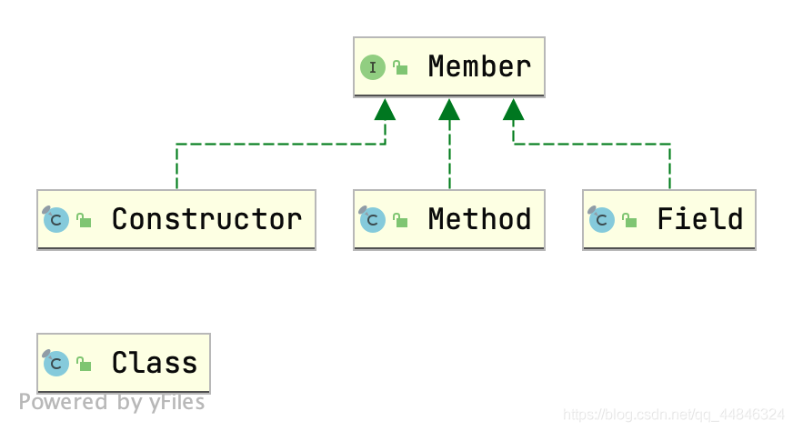

> 简单的介绍一下反射的概念。为框架的学习打下基础。

# 反射概念
反射可以在运行时动态分析类，解析一个类的构造器、字段、方法、接口等等。
反射有何作用，或者说为什么要学习反射？
作为应用程序员，一般情况下，并不直接使用反射，它更多在构建系统级程序时发挥用处，如实现Java的Spring框架、持久层框架Mybatis时，反射的使用处处可见。Java的其他特性或技术也依赖于反射，如代理（Proxy）等等。

所以，学习反射，很大程度上并不是让我们直接使用反射，而是更好地理解框架的实现，更好地操纵框架。


>  Java反射的应用很多，如，JSON的序列化/反序列化，JDK动态代理，AOP等等


# Class 类
我们知道一个类有一些基本要素构成，如
**构造器、成员变量（字段）、成员方法**等等。
那么这些信息如何描述呢？或者说，一个类本身的信息用什么类去描述呢？

**Class类就是用来描述类本身的信息的**。

因为一个类的信息有很多，这里就不把Class类完整的分析一下了。
这里这分析最易理解，也是类的最基本的元素信息。


源码分析。

下面是`Class`类中的一些方法。
```java
// 返回类的名字
public String getName() ;
// 获取类及超类的公共字段、方法、构造器
public Field[] getFields();
public Method[] getMethods();
public Constructor[] getConstructors();
// 返回特定的字段、方法、构造器
public Field getField(String name);
public Method getMethod(String name, Class<?>... parameterTypes);
public Constructor<T> getConstructor(Class<?>... parameterTypes);
```

既然Class是一个类，如何获得它的实例对象。

1. object.getClass()

2. T.class

3. Class.forName(className)

例如：
```java
Student student;
Class studentClass1 = student.getClass();
Class studentClass2 = Student.class;
Class studentClass3 = Class.forName("Student");
```


在`java.lang.reflect`包里，有三个类值得关注，就Class描述类本身信息类似，也许有特定的三个类去描述**构造器、字段、方法**。

而且这三个类具有共性,因为其实都是类的成员。
所以类中的方法都类似。



实现的`Member`接口中的部分方法。
```java
// 返回声明这个字段、构造器、方法的类
public Class<?> getDeclaringClass();
// 返回这个字段、构造器、方法的名字
public String getName();
// 返回这个字段、构造器、方法的修饰符
public int getModifiers();
```

## Field 类
三个很重要的方法。

```java
// 返回字段类型
Class getType();
// 返回字段名字（标识符）
String getName();
// 返回某个对象的这个字段的值。
Object get(obj);
// 给对象赋值
set(Object obj,Object value);
```


```java
import java.lang.reflect.Field;

class Student {
	// 这里必须是public,否则是不可达的（当然也可以强制设置为accessible）
    public String name;
    public int age;

    public Student(String name, int age) {
        this.name = name;
        this.age = age;
    }
}

public class Test2 {
    public static void main(String[] args) {
        Student student = new Student("Mike", 18);
        Class cl = Student.class;
        try {
            Field nameField = cl.getField("name");
            System.out.println("字段名字: " + nameField.getName());
            Class fieldType = nameField.getType();
            System.out.println("字段类型: " + fieldType);
            Object filedValue = nameField.get(student);
            System.out.println("字段的值: " + filedValue);
            nameField.set(student,"Jack");
            System.out.println(student.name);
        } catch (NoSuchFieldException e) {
            e.printStackTrace();
        } catch (IllegalAccessException e) {
            e.printStackTrace();
        }
    }
}
```


在c/c++语言中，有方法指针（其实就是函数的入口地址）传给函数做参数。
但是Java的设计者认为这是不安全的，所以没有显示的方法指针。

Java提供的解决方案是接口和lambda表达式。

但是这里的Method对象，也可以提供像函数指针的效果。
## Method 类

与上面类似，有几个关键的方法值得注意。

```java
// 根据方法名和参数列表获得方法句柄
Method getMethod(String name,Class... parameterTypes);
// 第一个参数为隐式参数，后面的方法的显示参数
// 如果是静态方法，第一个参数为null即可
invoke(Object obj,Object... args);
```
例子：
```java
import java.lang.reflect.InvocationTargetException;
import java.lang.reflect.Method;

class Student {
    public String name;
    public int age;

    public Student(String name, int age) {
        this.name = name;
        this.age = age;
    }

    public void setAge(int age) {
        this.age = age;
    }

    public static void show(){
        System.out.println("show information");
    }
}

public class Test2 {
    public static void main(String[] args) {
        Student student = new Student("Mike", 18);
        Class cl = Student.class;

        try {
            // 实例有参方法
            Method setAgeMethod = cl.getMethod("setAge", int.class) ;
            setAgeMethod.invoke(student,28);
            System.out.println(student.age);
            // 静态无参方法
            Method showMethod = cl.getMethod("show");
            showMethod.invoke(null);

        } catch (NoSuchMethodException e) {
            e.printStackTrace();
        } catch (IllegalAccessException e) {
            e.printStackTrace();
        } catch (InvocationTargetException e) {
            e.printStackTrace();
        }
    }
}
```
这种方法调用的缺点是明显的。
一是，参数和返回值都是Object，需要来回强制转换。
二是，这样调用方法本身就是兜了个圈子，很耗时。


与Method对象类似，Constructor不过是一种特殊的方法。
## Constructor 类

几个重要的方法原型。
```java
// 获取构造器
public Constructor<T> getConstructor(Class<?>... parameterTypes);
// 根据构造器生成实例
public T newInstance(Object ... initargs)
```
举例。
```java
import java.lang.reflect.Constructor;
import java.lang.reflect.InvocationTargetException;

class Student {
    public String name;
    public int age;

    public Student(String name, int age) {
        this.name = name;
        this.age = age;
    }

    @Override
    public String toString() {
        return "Student{" +
                "name='" + name + '\'' +
                ", age=" + age +
                '}';
    }
}

public class Test2 {
    public static void main(String[] args) {
        Class cl = Student.class;
        try {
            Constructor constructor = cl.getConstructor(String.class,int.class);
            Student student = (Student) constructor.newInstance("Jack",18);
            System.out.println(student);
        } catch (NoSuchMethodException | IllegalAccessException | InstantiationException | InvocationTargetException e) {
            e.printStackTrace();
        }

    }
}
```


附：《Java核心技术卷》书上的源代码：

```java
package about_reflect;

import java.lang.reflect.Constructor;
import java.lang.reflect.Field;
import java.lang.reflect.Method;
import java.lang.reflect.Modifier;

public class ClassAnalyzer {
    private Class cl;

    public ClassAnalyzer(Class clazz) {
        this.cl = clazz;
    }
    // 输出所有的构造器（包括 private 、 protected）
    public void printConstructors() {
        Constructor[] constructors = cl.getDeclaredConstructors();
        for(Constructor c:constructors){
            String name = c.getName();
            System.out.print("    ");
            String modifiers = Modifier.toString(c.getModifiers());
            if(modifiers.length()>0) System.out.print(modifiers+" ");
            System.out.print(name+"(");

            Class[] paramTypes = c.getParameterTypes();
            for(int j=0;j<paramTypes.length;j++){
                if(j>0) System.out.print(", ");
                System.out.print(paramTypes[j].getName());
            }

            System.out.println(");");
        }
        System.out.println();
    }

    // 输出在这个类中的所有的方法
    public void printMethods() {
        Method[] methods = cl.getDeclaredMethods();
        for(Method m:methods){
            Class retype = m.getReturnType();
            String methodName = m.getName();
            System.out.print("    ");
            String modifiers = Modifier.toString(m.getModifiers());
            if(modifiers.length()>0){
                System.out.print(modifiers+" ");
            }
            System.out.print(retype.getName()+" "+methodName+"(");
            Class[] params = m.getParameterTypes();
            for(int j=0;j<params.length;j++){
                if(j>0) System.out.print(", ");
                System.out.print(params[j].getName());
            }
            System.out.println(");");
        }
        System.out.println();
    }

    // 输出在这个类中的所有的字段
    public void printFields() {
        Field[] fields = cl.getDeclaredFields();
        for(Field field:fields) {
            System.out.print("    ");
            Class type = field.getType();
            String modifiers = Modifier.toString(field.getModifiers());
            if(modifiers.length()>0) System.out.print(modifiers+" ");
            System.out.println(type.getName()+" "+field.getName()+";");
        }
        System.out.println();
    }

    public void display() {
        Class supercl = cl.getSuperclass();
        String modifiers = Modifier.toString(cl.getModifiers());

        if(modifiers.length()>0) System.out.print(modifiers+" ");
        System.out.print("class "+cl.getName());
        if(supercl != null && supercl != Object.class){
            System.out.print(" extends "+supercl.getName());
        }
        System.out.println(" {\n");

        printFields();

        printConstructors();

        printMethods();

        System.out.println("}");
    }
}

```
测试代码：
```java
import about_reflect.ClassAnalyzer;
import java.util.Scanner;

public class Test {
    public static void main(String[] args) {
        try(var in = new Scanner(System.in)){
            ClassAnalyzer classAnalyzer;
            String classname = in.next();
            try {
                classAnalyzer = new ClassAnalyzer(Class.forName(classname));
            } catch (ClassNotFoundException e) {
                System.out.println("此类未找到");
                return;
            }
            classAnalyzer.display();
        }
    }
}
```

 

 运行结果为：
```java
java.lang.String
public final class java.lang.String {

    private final [B value;
    private final byte coder;
    private int hash;
    private static final long serialVersionUID;
    static final boolean COMPACT_STRINGS;
    private static final [Ljava.io.ObjectStreamField; serialPersistentFields;
    public static final java.util.Comparator CASE_INSENSITIVE_ORDER;
    static final byte LATIN1;
    static final byte UTF16;

    public java.lang.String([B);
    public java.lang.String([B, int, int);
    public java.lang.String([B, java.nio.charset.Charset);
    public java.lang.String([B, java.lang.String);
    public java.lang.String([B, int, int, java.nio.charset.Charset);
    java.lang.String([C, int, int, java.lang.Void);
    java.lang.String(java.lang.AbstractStringBuilder, java.lang.Void);
    public java.lang.String(java.lang.StringBuilder);
    public java.lang.String(java.lang.StringBuffer);
    java.lang.String([B, byte);
    public java.lang.String([C, int, int);
    public java.lang.String([C);
    public java.lang.String(java.lang.String);
    public java.lang.String();
    public java.lang.String([B, int, int, java.lang.String);
    public java.lang.String([B, int);
    public java.lang.String([B, int, int, int);
    public java.lang.String([I, int, int);

    [B value();
    public boolean equals(java.lang.Object);
    public int length();
    public java.lang.String toString();
    public int hashCode();
    public void getChars(int, int, [C, int);
    public int compareTo(java.lang.String);
    public volatile int compareTo(java.lang.Object);
    public int indexOf(java.lang.String, int);
    public int indexOf(int);
    static int indexOf([B, byte, int, java.lang.String, int);
    public int indexOf(int, int);
    public int indexOf(java.lang.String);
    static void checkIndex(int, int);
    public static java.lang.String valueOf(int);
    public static java.lang.String valueOf(float);
    public static java.lang.String valueOf(boolean);
    public static java.lang.String valueOf(long);
    public static java.lang.String valueOf(double);
    public static java.lang.String valueOf(java.lang.Object);
    public static java.lang.String valueOf(char);
    public static java.lang.String valueOf([C);
    public static java.lang.String valueOf([C, int, int);
    byte coder();
    private static java.lang.Void rangeCheck([C, int, int);
    public java.util.stream.IntStream codePoints();
    public boolean isEmpty();
    public char charAt(int);
    public int codePointAt(int);
    public int codePointBefore(int);
    public int codePointCount(int, int);
    public int offsetByCodePoints(int, int);
    public [B getBytes(java.nio.charset.Charset);
    public void getBytes(int, int, [B, int);
    public [B getBytes(java.lang.String);
    public [B getBytes();
    void getBytes([B, int, byte);
    public boolean contentEquals(java.lang.StringBuffer);
    public boolean contentEquals(java.lang.CharSequence);
    private boolean nonSyncContentEquals(java.lang.AbstractStringBuilder);
    public boolean equalsIgnoreCase(java.lang.String);
    public int compareToIgnoreCase(java.lang.String);
    public boolean regionMatches(boolean, int, java.lang.String, int, int);
    public boolean regionMatches(int, java.lang.String, int, int);
    public boolean startsWith(java.lang.String);
    public boolean startsWith(java.lang.String, int);
    public boolean endsWith(java.lang.String);
    public int lastIndexOf(int);
    static int lastIndexOf([B, byte, int, java.lang.String, int);
    public int lastIndexOf(java.lang.String, int);
    public int lastIndexOf(java.lang.String);
    public int lastIndexOf(int, int);
    public java.lang.String substring(int, int);
    public java.lang.String substring(int);
    public java.lang.CharSequence subSequence(int, int);
    public java.lang.String concat(java.lang.String);
    public java.lang.String replace(java.lang.CharSequence, java.lang.CharSequence);
    public java.lang.String replace(char, char);
    public boolean matches(java.lang.String);
    public boolean contains(java.lang.CharSequence);
    public java.lang.String replaceFirst(java.lang.String, java.lang.String);
    public java.lang.String replaceAll(java.lang.String, java.lang.String);
    public [Ljava.lang.String; split(java.lang.String);
    public [Ljava.lang.String; split(java.lang.String, int);
    public static transient java.lang.String join(java.lang.CharSequence, [Ljava.lang.CharSequence;);
    public static java.lang.String join(java.lang.CharSequence, java.lang.Iterable);
    public java.lang.String toLowerCase();
    public java.lang.String toLowerCase(java.util.Locale);
    public java.lang.String toUpperCase(java.util.Locale);
    public java.lang.String toUpperCase();
    public java.lang.String trim();
    public java.lang.String strip();
    public java.lang.String stripLeading();
    public java.lang.String stripTrailing();
    public boolean isBlank();
    private int indexOfNonWhitespace();
    public java.util.stream.Stream lines();
    public java.util.stream.IntStream chars();
    public [C toCharArray();
    public static transient java.lang.String format(java.lang.String, [Ljava.lang.Object;);
    public static transient java.lang.String format(java.util.Locale, java.lang.String, [Ljava.lang.Object;);
    public static java.lang.String copyValueOf([C, int, int);
    public static java.lang.String copyValueOf([C);
    public native java.lang.String intern();
    public java.lang.String repeat(int);
    private boolean isLatin1();
    static void checkOffset(int, int);
    static void checkBoundsOffCount(int, int, int);
    static void checkBoundsBeginEnd(int, int, int);
    static java.lang.String valueOfCodePoint(int);

}

Process finished with exit code 0
```


先介绍这么多，以后再补。

