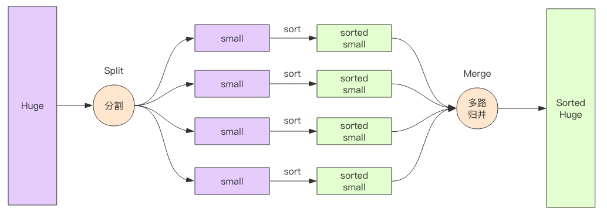

# 分割+多路归并

我们可以将一个很大的文件，切分成很多个小文件，使得每个小文件能够单独的装进内存，并将每个小文件进行内排序（快速排序等等），然后再将多个小文件进行多路归并排序，最终得到一个有序的文件。

多路归并排序在大数据领域也是常用的算法，常用于海量数据排序。当数据量特别大时，这些数据无法被单个机器内存容纳，它需要被切分位多个集合分别由不同的机器进行内存排序（map过程），然后再进行多路归并算法将来自多个不同机器的数据进行排序（reduce 过程），这是流式多路归并排序。


多路归并排序的优势在于内存消耗极低，它的内存占用和输入文件的数量成正比，和数据总量无关，数据总量只会线性正比影响排序的时间。



# 多路归并的几种方案
多路归并排序有3种思路，分别是使用堆、胜者树、败者数。
## 堆

从 K 个序列中各取一个元素，并记录每个元素的来源数组，建立一个含 K 个元素的小根堆。此时堆顶就是最小的元素，取出堆顶元素，并从堆顶元素的来源序列中取下一个元素放入堆顶，然后向下调整。在向下调整过程中需要和其两个子结点比较，需要比较 2 次。

## 胜者树

胜者树在向上调整的时候首先需要获得父结点，然后再获得兄弟结点，然后再比较。比堆少一半的比较次数。

## 败者树

败者树在向上调整的时候，只需要获得父结点并比较即可。相较于胜者树，它不必获取兄弟结点了，减小了访存时间。


# 使用MapReduce解决

```java
import org.apache.hadoop.fs.FileSystem;
import org.apache.hadoop.io.IntWritable;
import org.apache.hadoop.io.LongWritable;
import org.apache.hadoop.mapreduce.Job;
import org.apache.hadoop.conf.Configuration;
import org.apache.hadoop.fs.Path;
import org.apache.hadoop.io.Text;
import org.apache.hadoop.mapreduce.Mapper;
import org.apache.hadoop.mapreduce.Reducer;
import org.apache.hadoop.mapreduce.lib.input.FileInputFormat;
import org.apache.hadoop.mapreduce.lib.input.TextInputFormat;
import org.apache.hadoop.mapreduce.lib.output.FileOutputFormat;
import org.apache.hadoop.mapreduce.lib.output.TextOutputFormat;

import java.io.IOException;
import java.net.URI;

/**
 * @author: SongyangJi
 * @description:
 * @since: 2022/3/20
 */


public class Sort {

    public static class MyMapper extends Mapper<LongWritable, Text, IntWritable, IntWritable> {
        private static final IntWritable data = new IntWritable(); //静态变量了解一下

        public void map(LongWritable key, Text value, Context context)
                throws IOException, InterruptedException {
            String line = value.toString();
            data.set(Integer.parseInt(line));
            context.write(data, new IntWritable(1));
        }
    }

    public static class MyReducer extends Reducer<IntWritable, IntWritable, IntWritable, Text> {
        private final Text word = new Text();

        public void reduce(IntWritable key, Iterable<IntWritable> values, Context context)
                throws IOException, InterruptedException {
            for (IntWritable val : values) {
                context.write(key, new Text());
            }
        }
    }


    public static void main(String[] args) throws Exception {
        Configuration conf = new Configuration();
        Job job = Job.getInstance(conf, "Sort");
        //run jar class 主方法
        job.setJarByClass(Sort.class);
        //设置map
        job.setMapperClass(MyMapper.class);
        job.setMapOutputKeyClass(IntWritable.class);
        job.setMapOutputValueClass(IntWritable.class);
        //设置reduce
        job.setReducerClass(MyReducer.class);
        job.setOutputKeyClass(IntWritable.class);
        job.setOutputValueClass(IntWritable.class);
        //设置input format
        job.setInputFormatClass(TextInputFormat.class);
        //设置output format
        job.setOutputFormatClass(TextOutputFormat.class);
        // 设置输入输出路径
        FileInputFormat.addInputPath(job, new Path(args[0]));
        FileOutputFormat.setOutputPath(job, new Path(args[1]));
        System.exit(job.waitForCompletion(true) ? 0 : 1);
    }
}
```


> 参考
>
> https://cloud.tencent.com/developer/article/1592913
>
> https://luisstruggle.github.io/blog/Large_File_Sorting.html
