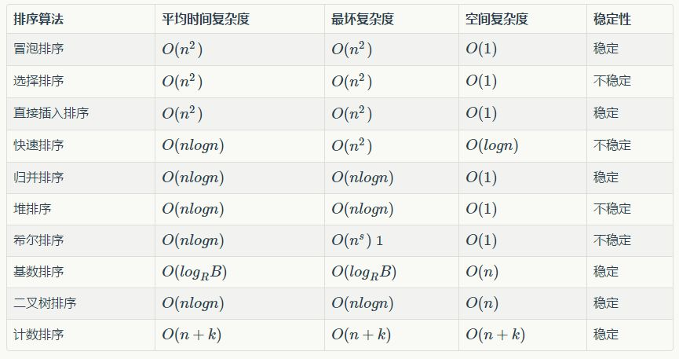

> 这篇博客主要梳理了一些排序算法，为了测试算法的正确性，于是选择了力扣上的一道裸题去测试。算法的正确性相对来讲可以保证。


# 总结




 + [LeetCode912. 排序数组]
 [传送门](https://leetcode-cn.com/problems/sort-an-array/)

## 插入排序


```cpp
class Solution {
public:
    vector<int> insertion_sort(vector<int>& nums) {
        for(int j=1;j<nums.size();j++){
            int i = j-1;
            int key = nums[j];
            while(i>=0 && nums[i]>key){
                nums[i+1] = nums[i];
                i--;
            }
            nums[i+1] = key;
        }
        return nums;
    }
};
```


## 希尔排序
```cpp
class Solution {
public:
    vector<int> shell_sort(vector<int>& nums) {
        int n = nums.size();
        for(int gap = n/2;gap>=1;gap/=2){

            for(int j=gap;j<nums.size();j++){
                int i = j-gap;
                int key = nums[j];
                while(i>=0 && nums[i]>key){
                    nums[i+gap] = nums[i];
                    i -= gap;
                }
                nums[i+gap] = key;
            }

        }
        return nums;   
    }
};
```

## 归并排序
+ **递归写法**
```cpp
class Solution {
public:
    vector<int> sortArray(vector<int>& nums) {
        merge_sort(nums,0,nums.size()-1);
        return nums;
    }
    void merge_sort(vector<int> &nums, int l, int r){
        if(l>=r) return;
        int mid = l+(r-l)/2;
        merge_sort(nums,l,mid);
        merge_sort(nums,mid+1,r);
        helper_merge(nums,l,r);
    }

    void helper_merge(vector<int> &nums, int l, int r){
        vector<int> temp;
        int mid = l+(r-l)/2;
        int i = l;
        int j = mid+1;
        while(i<=mid && j<=r){
            if(nums[i]<=nums[j]) temp.push_back(nums[i++]);
            else temp.push_back(nums[j++]);
        }
        while(i<=mid) temp.push_back(nums[i++]);
        while(j<=r) temp.push_back(nums[j++]);
        for(int i=l;i<=r;i++){
            nums[i] = temp[i-l];
        }
    }

};
```

+  **迭代写法**

```cpp
class Solution {
    int maxIndex;
public:
    vector<int> sortArray(vector<int>& nums) {

        int gap = 1;

        maxIndex = nums.size() - 1;

        while(gap < nums.size()){
            for(int l = 0;l<maxIndex;l += 2*gap){
                int r = maxIndex-l+1;
                // 如果剩下的元素小于等于 gap，那么在上一轮已经排好了，跳过
                if(r <= gap) continue;
                merge(nums,l,gap);
            }
            gap *= 2;
        }
        return nums;
    }


    void merge(vector<int>& nums,int l1,int gap) {

        vector<int> temp;
        int r1 = l1+gap-1;
        int l2 = r1+1;
        int r2 = min(maxIndex,l2+gap-1);


        // 双指针合并
        int i = l1, j = l2;
        while(i <= r1 && j <= r2){
            if(nums[i] < nums[j]){
                temp.push_back(nums[i++]);
            }else{
                temp.push_back(nums[j++]);
            }
        }
        while(i <= r1) temp.push_back(nums[i++]);        
        while(j <= r2) temp.push_back(nums[j++]);


        int pos = l1;
        for(int x:temp){
            nums[pos++] = x;
        }

    }

};
```

## 快速排序

快排的最核心的地方就是如何根据一个基准值将一个数组分成两部分。


yxc 版本

```java
import java.util.*;

public class Solution {
    /**
     * 代码中的类名、方法名、参数名已经指定，请勿修改，直接返回方法规定的值即可
     * 将给定数组排序
     * @param arr int整型一维数组 待排序的数组
     * @return int整型一维数组
     */
    public int[] MySort (int[] arr) {
        // write code here
        qsort(arr, 0 , arr.length - 1);
        return arr;
    }
    
    void qsort(int[] a, int l, int r) {
        if(l >= r) return;
        int i = l - 1, j = r + 1, x = a[(l + r)/2];
        while(i < j) {
            do {i++; } while(a[i] < x);
            do {j--; } while(a[j] > x);
            if(i < j) {
                int temp = a[i];
                a[i] = a[j];
                a[j] = temp;
            }
        }
        // 此时 i == j 或者 i > j, a[j] <= x (基准值)
        // 注意是 j
        qsort(a, l, j);
        qsort(a, j + 1, r);
    }
    
}
```


+ **《啊哈算法》的版本(双向指针)**
```cpp
class Solution {
public:
    vector<int> sortArray(vector<int>& nums) {
        if(nums.size()<=1) return nums;
        quick_sort(nums,0,nums.size()-1);
        return nums;
    }
    void quick_sort(vector<int> &nums,int l,int r){
        if(l>=r) return;
        int base = nums[l];
        int i = l , j = r;
        while(i<j){
            while(i<j && nums[j]>=base) j--;
            while(i<j && nums[i]<=base) i++;
            swap(nums[i],nums[j]);
        }
        // 基准值归位
        // 此时 i==j 并且 nums[i]<base 因为是j指针先移动的
        nums[l] = nums[i];
        nums[i] = base;
        quick_sort(nums,l,i-1);
        quick_sort(nums,i+1,r);
    }
};
```

+ **《算法导论》的版本(同向指针)**
    +  **循环不变量法**
    [l,i] 都小于等于x,
     [i+1,j] 都大于x，
     [j+1,r-1] 尚未处理，
     nums[r] 是基准值。
    
```cpp
class Solution {
public:
    vector<int> sortArray(vector<int>& nums) {
        if(nums.size()<=1) return nums;
        quick_sort(nums,0,nums.size()-1);
        return nums;
    }
    void quick_sort(vector<int> &nums,int l,int r){
        if(l>=r) return;
        int p = partion(nums,l,r);
        quick_sort(nums,l,p-1);
        quick_sort(nums,p+1,r);
    }
    // 循环不变量 [l,i] 都小于等于x,
    // [i+1,j] 都大于x
    // [j+1,r-1] 尚未处理
    // nums[r] 是基准值
    int partion(vector<int> &nums,int l,int r){
        int x = nums[r];
        int i = l-1;
        for(int j=l;j<r;j++){
            if(nums[j]<=x){
            	i++;
            	// 此时nums[i]大于x,而nums[j]小于等于x
            	// 一交换 循环不变量保持
                swap(nums[j],nums[i]);
            }
        }
        swap(nums[i+1],nums[r]);
        return i+1;
    }
};
```


+ **随机化版本也很简单**

```cpp
class Solution {
public:
    vector<int> sortArray(vector<int>& nums) {
        if(nums.size()<=1) return nums;
        srand((unsigned)time(NULL));
        randomed_quick_sort(nums,0,nums.size()-1);
        return nums;
    }

    void randomed_quick_sort(vector<int> &nums,int l,int r) {
        if(l>=r) return;
        int i = rand() % (r - l + 1) + l; // 随机选一个作为我们的主元 [0,r-l]+l = [l,r]
        swap(nums[i],nums[r]);
        int p = partion(nums,l,r);
        randomed_quick_sort(nums,l,p-1);
        randomed_quick_sort(nums,p+1,r);
    }

    // 循环不变量 [l,i] 都小于等于x,
    // [i+1,j] 都大于x
    // [j+1,r-1] 尚未处理
    // nums[r] 是基准值
    int partion(vector<int> &nums,int l,int r) {
        int x = nums[r];
        int i = l-1;
        for(int j=l;j<r;j++){
            if(nums[j]<=x){
            	i++;
            	// 此时nums[i]大于x,而nums[j]小于等于x
            	// 一交换 循环不变量保持
                swap(nums[j],nums[i]);
            }
        }
        swap(nums[i+1],nums[r]);
        return i+1;
    }
};
```

## 堆排序
```cpp
class Solution {
    int heap[50010], size;

    void down(int x){
        int least = x;
        int l = 2*x;
        int r = 2*x+1;
        if(l<=size && heap[l]<heap[least]) least = l;
        if(r<=size && heap[r]<heap[least]) least = r;
        if(least!=x){
            swap(heap[x],heap[least]);
            down(least);
        }
    }

	// 建堆 
    void build_heap(const vector<int>& nums){
        size = nums.size();
        for(int i=0;i<size;i++) heap[i+1] = nums[i];
        for(int i=size/2;i>=1;i--){
            down(i);
        }
    }
	// 依次取出堆顶，然后调整堆。
    void heap_sort(vector<int>& nums){
        int pos = 0;
        while(size){
            nums[pos++] = heap[1];
            heap[1] = heap[size--];
            down(1);
        }
    }

public:
    vector<int> sortArray(vector<int>& nums) {
        build_heap(nums);
        heap_sort(nums);
        return nums;
    }
};
```


## 计数排序
力扣的数据：$[-50000,50000]$，用一个线性函数将所有元素映射到区间$[0,100000]$
```cpp
class Solution {
    static const int N = 100010;
    int bin[N] = {0};
public:
    vector<int> sortArray(vector<int>& nums) {
        vector<int> ans;
        for(int x:nums){
            bin[f(x)] ++;
        }
        for(int i=0;i<N;i++){
            for(int j=0;j<bin[i];j++){
                ans.push_back(g(i));
            }
        }
        return ans;
    }
    int f(int num){
        return num + 50000;
    }
    int g(int id){
        return id - 50000;
    }

};

```

**海量考试分数排序**

一年的全国高考考生人数为500 万，分数使用标准分，最低100 ，最高900 ，没有小数，要求对这500 万元素的数组进行排序。

分析：对500W数据排序，如果基于比较的先进排序，平均比较次数为O(5000000*log5000000)≈1.112亿。但是我们发现，这些数据都有特殊的条件： 100=<score<=900。那么我们就可以考虑桶排序这样一个“投机取巧”的办法、让其在毫秒级别就完成500万排序。

方法：创建801(900-100)个桶。将每个考生的分数丢进f(score)=score-100的桶中。这个过程从头到尾遍历一遍数据只需要500W次。然后根据桶号大小依次将桶中数值输出，即可以得到一个有序的序列。而且可以很容易的得到100分有人，501分有人。

实际上，桶排序对数据的条件有特殊要求，如果上面的分数不是从100-900，而是从0-2亿，那么分配2亿个桶显然是不可能的。所以桶排序有其局限性，适合元素值集合并不大的情况。


## 基数排序

```cpp
class Solution {
    void sortByKth(vector<int>& nums,int k) {
        vector<int> bin[10];
        for(int x:nums){
            bin[ f(x,k) ].push_back(x);
        }
        int pos = 0;  
        for(int i=0;i<10;i++){
            for(int j=0;j<bin[i].size();j++){
                nums[pos++] = bin[i][j];
            }
        }
    }
    
    int f(int num,int k){
        while(k--){
            num /= 10;
        }
        return num % 10;
    } 

public:
    vector<int> sortArray(vector<int>& nums){
        for(int &x:nums) x += 50000;
        for(int k=0;k<=5;k++){
            sortByKth(nums,k);
        }
        vector<int> ans;
        for(int &x:nums) x -= 50000;
        return nums;
    }
};
```


## 桶排序

**桶排序（Bucket sort）**或所谓的**箱排序**，是一个排序算法，工作的原理是将数组分到有限数量的桶里。每个桶再个别排序（有可能再使用别的排序算法或是以递归方式继续使用桶排序进行排序）。当要被排序的数组内的数值是均匀分配的时候，桶排序使用线性时间O(n)。但桶排序并不是比较排序，他不受到O(n log n)下限的影响。

桶排序以下列程序进行：

1. 设置一个定量的数组当作空桶子。
2. 寻访序列，并且把项目一个一个放到对应的桶子去。
3. 对每个不是空的桶子进行排序。
4. 从不是空的桶子里把项目再放回原来的序列中。

### 桶排序的应用

**在一个文件中有10G个整数，乱序排列，要求找出中位数。内存限制为2G。**
只写出思路即可（内存限制为2G意思是可以使用2G空间来运行程序，而不考虑本机上其他软件内存占用情况。）

 关于中位数：数据排序后，位置在最中间的数值。即将数据分成两部分，一部分大于该数值，一部分小于该数值。中位数的位置：当样本数为奇数时，中位数=(N+1)/2 ; 当样本数为偶数时，中位数为N/2与1+N/2的均值（那么10G个数的中位数，就第5G大的数与第5G+1大的数的均值了）。

分析：既然要找中位数，很简单就是排序的想法。那么基于字节的桶排序是一个可行的方法。

思想：将整型的每1byte作为一个关键字，也就是说一个整形可以拆成4个keys，而且最高位的keys越大，整数越大。如果高位keys相同，则比较次高位的keys。整个比较过程类似于字符串的字典序。

第一步:把10G整数每2G读入一次内存，然后一次遍历这536,870,912即（1024*1024*1024）*2 /4个数据。每个数据用位运算">>"取出最高8位(31-24)。这8bits(0-255)最多表示256个桶，那么可以根据8bit的值来确定丢入第几个桶。最后把每个桶写入一个磁盘文件中，同时在内存中统计每个桶内数据的数量NUM[256]。

代价：(1) 10G数据依次读入内存的IO代价(这个是无法避免的，CPU不能直接在磁盘上运算)。(2)在内存中遍历536,870,912个数据，这是一个O(n)的线性时间复杂度。(3)把256个桶写回到256个磁盘文件空间中，这个代价是额外的，也就是多付出一倍的10G数据转移的时间。

第二步：根据内存中256个桶内的数量NUM[256]，计算中位数在第几个桶中。很显然，2,684,354,560个数中位数是第1,342,177,280个。假设前127个桶的数据量相加，发现少于1,342,177,280，把第128个桶数据量加上，大于1,342,177,280。说明，中位数必在磁盘的第128个桶中。而且在这个桶的第1,342,177,280-N(0-127)个数位上。N(0-127)表示前127个桶的数据量之和。然后把第128个文件中的整数读入内存。(若数据大致是均匀分布的，每个文件的大小估计在10G/256=40M左右，当然也不一定，但是超过2G的可能性很小)。注意，变态的情况下，这个需要读入的第128号文件仍然大于2G，那么整个读入仍然可以按照第一步分批来进行读取。

代价：(1)循环计算255个桶中的数据量累加，需要O(M)的代价，其中m<255。(2)读入一个大概80M左右文件大小的IO代价。

第三步：继续以内存中的某个桶内整数的次高8bit（他们的最高8bit是一样的）进行桶排序(23-16)。过程和第一步相同，也是256个桶。

第四步：一直下去，直到最低字节(7-0bit)的桶排序结束。我相信这个时候完全可以在内存中使用一次快排就可以了。

整个过程的时间复杂度在O(n)的线性级别上(没有任何循环嵌套)。但主要时间消耗在第一步的第二次内存-磁盘数据交换上，即10G数据分255个文件写回磁盘上。一般而言，如果第二步过后，内存可以容纳下存在中位数的某一个文件的话，直接快排就可以了（修改者注：我想，继续桶排序但不写回磁盘，效率会更高？）。  


> 参考
>
> [百度百科-桶排序](https://baike.baidu.com/item/%E6%A1%B6%E6%8E%92%E5%BA%8F/4973777)

