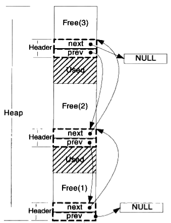
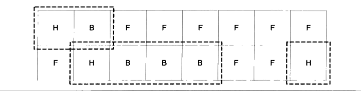

# 进程内存的段式划分


一个由C/C++编译的程序占用的内存分为以下几个部分
（从上到下，**从内存高地址到内存低地址**）
1、栈区（stack） — 由编译器自动分配释放 ，存放函数的参数值，局部变量的值等。其操作方式类似于数据结构中的栈。（高地址）

2、堆区（heap） — 一般由程序员分配释放， 若程序员不释放，程序结束时可能由OS回收 。注意它与数据结构中的堆是两回事，分配方式倒是类似于链表（当然还有其它的管理方式）。

3、全局区（静态区）（static）—全局变量和静态变量的存储是放在一块的，初始化的全局变量和静态变量在一块区域， 未初始化的全局变量和未初始化的静态变量在相邻的另一块区域。程序结束后由系统释放。

4、文字常量区 — 常量字符串就是放在这里的。 程序结束后由系统释放。

5、程序代码区——存放函数体的二进制代码。（低地址）


下面是一个例子：

```c
#include <stdlib.h>

int a = 0; //全局初始化区

char *p1; //全局未初始化区

int main() {

    int b; //栈

    char s[] = "abc"; //s在栈,"abc"在常量区

    char *p2; //栈

    char *p3 = "123456"; // 123456在常量区，p3在栈上。

    static int c = 0; //全局（静态）初始化区

    p1 = (char *) malloc(10);

    p2 = (char *) malloc(20); // 分配的10和20字节的区域就在堆区
    
    return 0;
}
```


# 堆和栈的区别

## 申请方式

**stack:**

由系统自动分配。
例如，声明在函数中一个局部变量 int b; 系统自动在栈中为b开辟空间

**heap:**

需要程序员自己申请，并指明大小，在c中malloc函数

如`p1 = (char *)malloc(10)`;

在C++中用new运算符, 如 `p2 = new char[10]`;

但是注意p1、p2本身是在栈中的。

## 申请后系统的响应

**栈：**只要栈的剩余空间大于所申请空间，系统将为程序提供内存，否则将报异常提示栈溢出。

**堆：**首先应该知道操作系统有一个记录空闲内存地址的链表，当系统收到程序的申请时，会遍历该链表，寻找第一个空间大于所申请空间的堆结点，然后将该结点从空闲结点链表中删除，并将该结点的空间分配给程序，另外，对于大多数系统，会在这块内存空间中的首地址处记录本次分配的大小，这样，代码中的delete语句才能正确的释放本内存空间。
另外，由于找到的堆结点的大小不一定正好等于申请的大小，系统会自动的将多余的那部分重新放入空闲链表中。

## 申请大小的限制
**栈：**栈是**向低地址扩展**的数据结构，是一块连续的内存的区域。这句话的意思是栈顶的地址和栈的最大容量是系统预先规定好的，在WINDOWS下，栈的大小是2M（也有的说是1M，总之是一个编译时就确定的常数），在Linux默认是8M。如果申请的空间超过栈的剩余空间时，将提示overflow。因此，能从栈获得的空间较小。

**堆：**堆是**向高地址扩展**的数据结构，是不连续的内存区域。这是由于系统是用链表（还有其他综合手段）来存储的空闲内存地址的，自然是不连续的，而链表的遍历方向是由低地址向高地址。堆的大小受限于计算机系统中有效的虚拟内存。由此可见，堆获得的空间比较灵活，也比较大。


## 申请效率的比较

**栈**由系统自动分配，速度较快。但程序员是无法控制的。

**堆**是由new分配的内存，一般速度比较慢，而且容易产生内存碎片,不过用起来最方便.另外，在WINDOWS下，最好的方式是用VirtualAlloc分配内存，他不是在堆，也不是在栈是直接在进程的地址空间中保留一块内存，虽然用起来最不方便。但是速度快，也最灵活。


## 堆和栈中的存储内容

**栈：** 在函数调用时，第一个进栈的是主函数中后的下一条指令（函数调用语句的下一条可执行语句）的地址，然后是函数的各个参数，在大多数的C编译器中，参数是由右往左入栈的，然后是函数中的局部变量。注意静态变量是不入栈的。当本次函数调用结束后，局部变量先出栈，然后是参数，最后栈顶指针指向最开始存的地址，也就是主函数中的下一条指令，程序由该点继续运行。

**堆：**一般是在堆的头部用一个字节存放堆的大小。堆中的具体内容由程序员安排。


## 堆和栈中的存储内容
`char s1[] = “aaaaaaaaaaaaaaa”;`

`char *s2 = “bbbbbbbbbbbbbbbbb”;`

aaaaaaaaaaa是在运行时刻赋值的；

而bbbbbbbbbbb是在编译时就确定的；

但是，在以后的存取中，在栈上的数组比指针所指向的字符串(例如堆)快。

比如：

```
int main() {

    char a = 1;

    char c[] = "1234567890";

    char *p = "1234567890";

    a = c[1];

    a = p[1];
    return 0;
}
```

对应的汇编代码

```assembly
10: a = c[1];

00401067 8A 4D F1 mov cl,byte ptr [ebp-0Fh]

0040106A 88 4D FC mov byte ptr [ebp-4],cl

11: a = p[1];

0040106D 8B 55 EC mov edx,dword ptr [ebp-14h]

00401070 8A 42 01 mov al,byte ptr [edx+1]

00401073 88 45 FC mov byte ptr [ebp-4],al
```


第一种在读取时直接就把字符串中的元素读到寄存器cl中，而第二种则要先把指针值读到edx中，再根据edx读取字符串，显然慢了。


# 堆的动态管理


## 如何使用

堆是一块巨大的内存空间，常常占据着整个**虚拟空间**的绝大部分。在这片空间里，程序可以请求一块连续内存，并自由地使用，这块内存在程序主动放弃之前都会一直保持有效。下面是申请空间最简单的例子。　

```c
int main()
{
    char *p = (char*)malloc(1000);
    free (p)'
}
```


**进程的内存管理并没有交给操作系统内核管理**，这样做性能较差，因为每次程序申请或者释放对空间都要进行系统调用。我们知道系统调用的性能开销是很大的，当程序对堆的操作比较频繁时，这样做的结果是会严重影响程序性能的。比较好的做法就是程序向操作系统申请一块适当大小的堆空间，然后由程序自己管理这块空间，而具体来讲，**管理着堆空间分配往往是程序的运行库。**


> 运行库相当于向操作系统批发了一块较大的堆空间，然后“零售”给程序用。当全部“售完”或程序有大量的内存需求时，在根据实际需求向操作系统“进货”。当然运行库在向零售堆空间时，必须管理它批发来的堆空间，不能把同一块地址出售两次，导致地址的冲突。我们首先来了解运行库是怎么向操作系统批发内存的。我们以linux为例。


## Linux进程堆管理

　进程地址空间中，除了可执行文件、共享库和栈之外，剩余的未分配的空间都可以被用来作为堆空间。Linux下的进程管理稍微有些复杂，因为它提供了两种堆分配方式，即两个系统调用：一个是brk()系统调用，另外一个是mmap()。brk()的C语言形式声明如下：

```c
int brk(void* end_data_segment)
```

　　

**brk()的作用实际上就是设置进程数据段的结束地址，即它可以扩大或者缩小数据段**（Linux下数据段和BSS合并在一起统称为数据段）。如果我们将数据段的结束地址向高地址移动，那么扩大的那部分空间就可以被我们使用，把这块空间拿来作为堆空间是最常见的做法之一。Giblic中还有一个函数叫做sbrk，它的功能与brk类似，只不过参数和返回值略有不同。sbrk以一个增量作为参数，即需要增加（负数为减少）的空间大小，返回值是增加（或减少）后数据段结束地址，这个函数实际上是对brk系统调用的包装，它通过brk()实现的。

　　mmap()的作用和Windows系统下的VirtualAlloc很相似，它的作用就是向操作系统申请一段虚拟地址空间，当然这块虚拟地址空间可以映射到某个文件（这也是系统调用的最初的作用），当它不将地址空间映射到某个文件时，我们又称这块空间为匿名空间，匿名空间就可以拿来做堆空间。它的声明如下：

```c
void *mmap{void *start,  size_t length, int prot, int flags, int fd,off_t offset);
```

　　mmap的前两个参数分别用于指定需要申请的空间的起始地址和长度，如果起始地址设置为0，那么linux系统会自动挑选合适的起始地址。prot/flags这两个参数用于设置申请的空间的权限（可读，可写，可执行）以及映像类型（文件映射、匿名空间等），最后两个参数用于文件映射时指定文件描述符和文件偏移的，我们在这里并不关心它们。


**glibc的malloc函数是这样处理用户空间请求的**

1. 对于小于128kb的请求来说，它会在现有的堆空间里面，按照堆分配算法为它分配一块空间并返回；
2. 对于大于128KB的请求来说，它会使用mmap()函数为它分配一块匿名空间，然后再这个匿名空间中为用户分配空间。


当然我们直接使用mmap也可以轻而易举地实现malloc函数：
```c
void *malloc(size_t nbytes)
{
    void *ret = mmap(0, nbytes, PROT_READ | PROT_WRITE,
                               MAP_PRIVATE | MAP_ANONYMOUS, 0, 0);
    if (ret == MAP_FAILED)
        return 0;
    return ret;
}
```


由于mmap()函数与VirtualAlloc()类似，它们都是系统虚拟空间申请函数，它们申请的空间起始地址和大小都必须是系统页的大小的整数倍。


## 堆空间的管理算法

在动态分配内存后，那么我们就要来思考如何管理这块大的内存。主要有三种方法，空闲链表和位图法以及对象池。


### 空闲链表
空闲链表（Free List)的方法实际上就是把堆中各个空闲的块按照链表的方式连接起来，当用户请求一块空间时，可以遍历整个链表，直到找到合适大小的块并且将它拆分；当用户释放空间时将它合并到空闲链表中。


空闲链表是这样一种结构，在堆里的每一个空闲空间的开头（或结尾）有一个头，头结构里记录了上一个和下一个空闲块的地址，也就是说，所有的空闲块形成了一个链表。如下所示：





当按照地址顺序在链表中存放进程和空闲区时，有几种算法可以用来为创建的进程（从磁盘换入的已存在的内存）分配内存。当存储管理器知道要为进程分配多大的内存时，有如下几种算法。

1. **首次适配（first fit)算法**

存储管理器沿着段链表进行搜索，直到找到一个足够大的空闲区，除非空闲区大小和要分配的空间大小正好一样，否则将该空闲去分为两部分，一部分供进程使用，另一部分形成新的空闲区。首次适配算法是一种速度很快的算法，因为它尽可能少地搜索链表节点。

2. **下次适配（next fit）算法**

它的工作方式和首次适配算法不同，不同点是每次找到合适的区间都记录当时的位置。以便在下次寻访空闲区时从上次结束的地方开始搜索，而不是像首次适配算法那样每次从头开始。下次适配算法的性能略低于首次适配算法。

3. **最佳适配（best fit）算法**

最佳适配算法搜索整个链表，找出能够容纳进程的最小的空闲区。最佳适配算法师徒找出最接近实际需要的空闲区，以最好地匹配请求和可用空闲区，而不是先拆分一个以后可能会用到的最大的空闲区。但是它的缺点是产生较多的业内碎片。

4. **最差适配（worst fit）算法**

总是分配最大的可用空闲区。

5. **快速适配（quick fit）算法**

它为那些常用大小的空闲区维护单独的链表。例如，有一个n项的链表，该表的第一项指向大小为4KB的空闲区链表表头的指针，第二项是指向大小为8KB的空闲区链表表头的指针，第三项是指向大小为12KB的空闲区链表表头的指针，以此类推。像21KB这样的空闲区即可以放在20KB的链表中也可以放在一个专门存放大小比较特别的空闲区的链表中。

快速适配算法寻找一个指定大小的空闲区是十分快速的，但它和所有将空闲区按大小排序的方案一样都有一个共同的缺点，即在一个进程终止或被换出时，寻找它的邻块，查看是否可以合并的过程是非常耗时的。如果不进行合并，内存将会很快分裂出大量的进程无法利用的小空闲区。


### 位图

位图的核心思想是**将整个堆划分为大量的块**，**每个块的大小相同**。

当用户请求内存的时候，总是分配整数个块的空间给用户，第一个块我们称之为已分配区域的头，其余的称为已分配区域的主体。而我们可以使用一个整数数组来记录块的使用情况。由于每个块只有头/主体/空闲三种状态，因此仅仅需要两位即可表示一个块，因此称为位图。假设堆的大小为1MB，那么让一个块大小为128字节，那么总共就有1M/128=8k个块，可以用8k/（32/2）=512个int来存储。这有512个int的数组就是一个位图，其中每两位代表一个块。当用户请求300字节的内存时，堆分配给用户3个块，并将相应的位图的相应位置标记为头或躯体。




这个堆分配了3片内存，分别有2/4/1个块，用虚线标出。其对应的位图将是：

(HIGH) 11 00 00 10 10 10 11 00 00 00 00 00 00 00 10 11 (LOW）

其中11表示H(头），10表示主体（Body），00表示空闲（Free）。


### 对象池
以上介绍的堆管理方法是最为基本的两种，实际上在一些场合，被分配对象的大小是较为固定的几个值，这时候我们可以针对这样的特征设计一个更为高效的堆算法，称为对象池。
对象池的思路很简单，如果每一次分配的空间大小都一样，那么就可以按照这个每次请求分配的大小作为一个单位，把整个堆空间划分为大量的小块，每次请求的时候只需要找到一个小块就可以了。
对象池的管理方法可以采用空闲链表，也可以采用位图，与它们的区别仅仅在于它假定了每次请求的都是一个固定的大小，因此实现起来比较容易。由于每次总是只请求一个单位的内存，因此请求得到满足的速度非常快，无须查找一个足够大的空间。


### 综合运用多种算法
实际上很多实际应用中，**堆的分配算法往往是采用多种算法复合而成**。

比如对于glibc来说，

它对于小于64字节的空间申请时采用类似于对象池的方法；

对于大于512字节的空间申请采用的是最佳适配算法；

对于大于64字节而小于512字节的，它会根据情况采用上述方法中的折中策略；

对于大于128KB的申请，它会使用mmap机制直接向操作系统申请空间。                                                           


> 参考链接
>
> [堆和动态内存管理](https://www.cnblogs.com/vincently/p/4671739.html)

