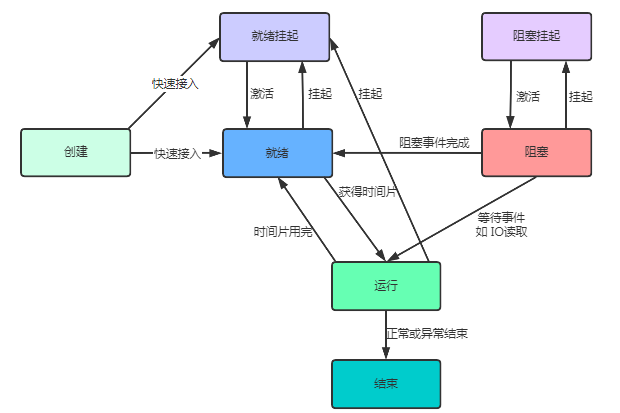

## 进程状态机

1. 阻塞一般是当系统执行IO操作时，此时进程进入阻塞状态，等待某个事件的返回。
2. 挂起是指进程没有占有物理内存，被写到磁盘上了。这时进程状态是挂起状态。

> 1. `阻塞挂起`：进程被写入硬盘并等待某个事件的出现。
> 2. `就绪挂起`：进程被写入硬盘，进入内存可直接进入就绪状态。

## PCB——进程控制块

为了描述跟控制进程的运行，系统为每个进程定义了一个数据结构——`进程控制块 Process Control Block`，它是进程实体的一部分，是操作系统中最重要的记录型数据结构。

PCB 的作用是**使一个在多道程序环境下不能独立运行的程序，成为一个能独立运行的基本单位，一个能与其它进程并发执行的进程** :

1. 作为独立运行基本单位的标志；
2. 实现间断性的运行方式；
3. 提供进程管理所需要的信息；
4. 提供进程调度所需要的信息；
5. 实现与其他进程的同步与通信；

### PCB 信息

1. **进程标识符**：用于唯一地标识一个进程，一个进程通常有两种标识符：

> 1. `内部进程标识符`：标识各个进程，每个进程都有一个并且唯一的标识符，设置内部标识符主要是为了方便系统使用。
> 2. `外部进程标识符`：它由创建者提供，可设置用户标识，以指示拥有该进程的用户。往往是由用户进程在访问该进程时使用。一般为了描述进程的家族关系，还应设置父进程标识及子进程标识。

2. **处理机状态**：由各种寄存器组成。包含许多信息都放在寄存器中，方便程序restart。

> 1. 通用寄存器、指令计数器、程序状态字PSW、用户栈指针等信息。

3. **进程调度信息**

> 1. 进程状态：指明进程的当前状态，作为进程调度和对换时的依据。
> 2. 进程优先级：用于描述进程使用处理机的优先级别的一个整数，优先级高的进程应优先获得处理机
> 3. 进程调度所需的其它信息：与所采用的进程调度算法有关，如进程已等待CPU的时间总和、进程已执行的时间总和等。
> 4. 事件：指进程由执行状态转变为阻塞状态所等待发生的事件，即阻塞原因。

4. **资源清单**

> 有关内存地址空间或虚拟地址空间的信息，所打开文件的列表和所使用的 I/O 设备信息。

## 进程调度

[Linux进程调度那些事](https://songyangji.gitee.io/2021/10/17/Linux%E8%BF%9B%E7%A8%8B%E8%B0%83%E5%BA%A6%E9%82%A3%E4%BA%9B%E4%BA%8B/)

### 进程调度原则

1. **CPU 利用率**

> 1. CPU利用率 = 工作时间 / 总时间。
> 2. 调度程序应该尽量让 CPU 始终处于忙碌的状态，这可提高 CPU 的利用率。比如当发生IO读取时候，不要傻傻等待，去执行下别的进程。

2. **系统吞吐量**

> 1. 系统吞吐量 = 总共完成多少个作业 / 总共花费时间。
> 2. 长作业的进程会占用较长的 CPU 资源导致降低吞吐量，相反短作业的进程会提升系统吞吐量。

3. **周转时间**

> 1. 周转时间 = 作业完成时间 - 作业提交时间。
> 2. 平均周转时间 = 各作业周转时间和 / 作业数
> 3. 带权周转时间 = 作业周转时间 / 作业实际运行时间
> 4. 平均带权周转时间 = 各作业带权周转时间之和 / 作业数
> 5. 尽可能使周转时间降低。

4. **等待时间**

> 1. 指的是进程在等待队列中等待的时间，一般也需要尽可能短。

5. **响应时间**

> 响应时间 = 系统第一次响应时间 - 用户提交时间，在交互式系统中响应时间是衡量调度算法好坏的主要标准。

### 调度算法

*FCFS 算法**

1. First Come First Severd 先来先服务算法，遵循先来后端原则，每次从就绪队列拿等待时间最久的，运行完毕后再拿下一个。
2. 该模式对长作业有利，适用 CPU 繁忙型作业的系统，不适用 I/O 型作业，因为会导致进程CPU利用率很低。

**SJF 算法**

1. Shortest Job First 最短作业优先算法，该算法会优先选择运行所需时间最短的进程执行，可提高吞吐量。
2. 跟FCFS正好相反，对长作业很不利。

> 最短无法实际衡量，只能估计，很难实际应用。

**RR 算法**

1. Round Robin 时间片轮转算法，操作系统设定了个时间片Quantum，时间片导致每个进程只有在该时间片内才可以运行，这种方式导致每个进程都会均匀的获得执行权。
2. 时间片一般20ms~50ms，如果太小会导致系统频繁进行上下文切换，太大又可能引起对短的交互请求的响应变差。

## 进程与线程的区别
### 线程定义

> 早期操作系统是没有线程概念的，线程是后来加进来的。为啥会有线程呢？那是因为以前在多进程阶段，经常会涉及到进程之间如何通讯，如何共享数据的问题。并且进程关联到PCB的生命周期，管理起来开销较大。为了解决这个问题引入了线程。

线程是进程当中的一个执行流程。**同一个进程内的多个线程之间可以共享进程的代码段、数据段、打开的文件等资源。**同时**每个线程又都有一套独立的寄存器和栈来确保线程的控制流是独立的**。

在早期的操作系统中都是以**进程作为独⽴运⾏的基本单位**，直到后⾯，计算机科学家们⼜提出了更⼩的能独⽴运⾏的基本单位，也就是线程。

**线程与进程的⽐较如下**：

**进程**：

1. 是系统进行资源分配和调度的一个独立单位.
2. 是程序的一次执行，每个进程都有自己的地址空间、内存、数据栈及其他辅助记录运行轨迹的数据

**线程**：

1. 是进程的一个实体，是CPU调度和分派的基本单位,它是比进程更小的能独立运行的基本单位
2. 所有的线程运行在同一个进程中，共享相同的运行资源和环境
3. 线程一般是并发执行的，使得实现了多任务的并行和数据共享。

**进程线程区别**：

1. 一个线程只能属于一个进程，而一个进程可以有多个线程，但至少有一个线程。
2. 线程的划分尺度小于进程(资源比进程少)，使得多线程程序的并发性高。
3. 进程在执行过程中拥有独立的内存单元，而多个线程共享内存，从而极大地提高了程序的运行效率。
4. 资源分配给进程，同一进程的所有线程共享该进程的所有资源。
5. CPU分配资源给进程，但真正在CPU上运行的是线程。
6. 线程不能够独立执行，必须依存在进程中。

**Linux特性**：

1. Linux中没有真正的线程，因为Linux并没有为线程准备特定的数据结构。在内核看来只有进程而没有线程，在调度时也是当做进程来调度。Linux所谓的线程其实是与其他进程共享资源的进程。但windows中确实有线程。
2. Linux中没有的线程，线程是由进程来模拟实现的。
3. 所以在Linux中在CPU角度看，进程被称作轻量级进程LWP。

