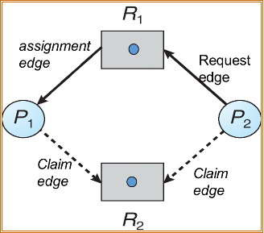

# 死锁的基本概念
## 死锁与饥饿
+ **死锁**：一组处于等待（阻塞）状态的进程，每一个进程持有其他进程所需要的资源，而又等待使用其他进程所拥有的资源，致使这组进程互相等待，均无法向前推进。另一种定义：当一组进程中每个进程都在等待一个事件，而这一事件只能由这一组进程的另一个进程引起时，这组进程处于死锁状态。
+ **饥饿**：就绪进程长时间得不到调度是处于等待状态，而不是死锁中的互相等待。若信号量的等待队列按照LIFO或优先级管理，则可能导致饥饿。


## 死锁形成的条件

如果以下四个条件同时满足，就会引起死锁：

+ mutual exclusion互斥：至少一个资源要求互斥地共享；
+ hold and wait占有并等待：一个进程至少占有一个资源并等待另一资源，该资源为其它进程所占有；
+ no preemption非抢占：资源不能被抢占，只能进程完成任务后自动释放；
+ circular wait循环等待：互相等待形成一个环。


## 死锁的处理方法

从大的方面来讲有四种解决方案：

+ **使用协议预防死锁**
  死锁预防是指一组方法，需要确定至少一个必要条件不成立。
  
  预防的特点是**保证一定不会死锁，但是会降低资源利用率和系统吞吐量**，属于静态的处理方法。
  
+ **使用动态追踪技术避免死锁**

  死锁避免要求操作系统事先得到有关进程申请使用资源的额外信息。当进程申请资源时，若发现满足该资源的请求可能导致死锁发生，则拒绝该申请。

  死锁避免算法会因为**追踪当前资源分配成本增加运行成本**，但是**相对于静态的死锁预防方法它允许更多的并发使用资源，所以系统吞吐量大于死锁预防**。

+ **允许进入死锁状态，检测并加以恢复**

+ **忽视死锁问题**
  大多数系统使用，因为死锁发生并不频繁，预防、避免和恢复耗费太大。


# 死锁预防
死锁预防是指实现破坏死锁的形成条件，预防的特点是一定不会死锁，但是会降低资源利用率和系统吞吐量。


### 1. 互斥

非共享资源必须互斥，共享资源不要求互斥所以不会死锁。无法从互斥条件下手避免死锁。

### 2. 占有并等待

+ 拥有不等待：资源静态分配策略，要求一个进程在执行前获得所有资源

+ 等待不拥有：进程在申请其他资源的时候必须释放已分配的资源。

缺点：资源利用率低，分配以后可能很久不被使用；产生饥饿，对于第一种协议，如果有进程需要多个常用资源，就可能会永久等待。

### 3. 非抢占

如果一个进程占有一些资源并在申请一些无法立刻分配到的资源，那么它占有的这些资源就都可以被抢占。该进程将会在它重新获得原有的资源以及原本要申请的资源的时候重启。

用于状态可保存和恢复的资源如CPU，memory等，不适用于打印机等。

### 4. 循环等待

对所有资源类型进行完全排序，要求每个进程按递增顺序申请资源。

如哲学家就餐问题，桌上的五根筷子分别编号，所有人只能按照从小到大的顺序申请筷子，所以永远不会出现每个人获得一只筷子的情况。

再比如，当一个进程对资源的使用顺序为5→2→4→3→1的时候，它的申请顺序仍然是12345，也就是说即使1是最后使用，也要先申请。这种浪费在程序越大、申请资源越多的时候越是明显。


# 死锁避免


## 安全状态(safe state)
如果系统能按照某个顺序为每个进程分配资源并能避免死锁，系统状态就是安全的。或者说，**如果存在一个安全序列safe sequence<P0,P1,P2,…,Pn>，使得前面的进程能够得到足够的资源完成，同时它释放的资源又能满足后面的进程的话，就是安全的**。


下面给出一个简单的例子：

| process | maximum | allocation | need | available |
| ------- | ------- | ---------- | ---- | --------- |
| p0      | 10      | 5          | 5    | 3         |
| p1      | 4       | 2          | 2    | 3         |
| p2      | 9       | 2          | 7    | 3         |

现在给出一个安全序列<P1,P0,P2>，之所以说它是安全序列，可以这样分析：P1分配到2个资源以后可以完成任务释放4个资源，那么总共可用资源变成5个，分配给P0以后待其完成任务释放10个资源可以让P2使用，这个分配顺序能确保不会产生死锁，所以系统状态是安全的。


但是，**不安全状态并不一定会导致死锁**。因为我们这里的最大资源需求量很有可能会超出真正需求量，反之，死锁状态一定是不安全状态。

**有了安全状态的概念，就可以定义避免算法以确保系统不会死锁，其思想就是简单的确保系统始终处于安全状态。**


## 单实例——资源分配图(RAG——resource-allocation graph)

使用具有claim边的RAG，适用于每种资源类型有单个实例的资源分配系统。



有如下重要概念：

1. 虚边：将要请求或可能使用claim edge;
2. 实边：请求边和分配边request，assignment

规定：
如果没有环，就是安全状态；
如果有环，即使环中有虚边，也是不安全状态，在避免算法里面是不允许出现的；
如果出现了实边环，就是死锁。


## 多实例——银行家算法(Banker's Algorithm)

> 在银行中，客户申请贷款的数量是有限的，每个客户在第一次申请贷款时要声明完成该项目所需的最大资金量，在满足所有贷款要求时，客户应及时归还。银行家在客户申请的贷款数量不超过自己拥有的最大值时，都应尽量满足客户的需要。在这样的描述中，银行家就好比操作系统，资金就是资源，客户就相当于要申请资源的进程。


> 上面的算法针对的是每个资源都只有单实例的情况。

当新进程进入系统时，必须说明其可能需要的每种类型资源实例的最大数量。用户申请一组资源时，系统必须确保这些资源分配后系统仍处于安全状态。


设系统中共有n个进程和m种资源类型

+ 安全性算法：确定计算机系统是否处于安全状态
  + 向量finish[n]存储进程是否已经完成，初始状态为false；
  + 向量available[m]存储当前每种资源的剩余可用量，初始值为资源总量；
  + 向量need[n] [m]存储每个进程的所需要的每种资源的数量(need即max——最多需要多少资源)；
  + 寻找是否存在finish=false且所需资源need[i] ≤ available的进程，如果存在，让这个进程获得所需要的资源执行结束，然后释放资源，这个时候它的finish=true，而总的available也要加上该进程原来占有的资源；
  + 循环执行上一步直到没有符合条件的进程。这时候如果finish全部为true，那么系统处于安全状态，我们就能获得一个安全序列。

+ 资源请求算法：判断是否可安全允许请求
  + 确定request≤need，否则出错；request≤available，否则等待
  + 按照请求假分配，修改系统当前的available、need，然后判断假分配以后系统状态是否安全。如果安全，该分配得到允许。


### 伪代码


**P - 进程的集合**
**Mp - 进程p的最大的请求数目**
**Cp - 进程p当前被分配的资源**
**A - 当前可用的资源**

```c
while (P != ∅) {
    found = FALSE;
    foreach (p ∈ P) {
        if (Mp − Cp ≤ A) {
             /* p可以獲得他所需的資源。假設他得到資源後執行；執行終止，並釋放所擁有的資源。*/
             A = A + Cp ;
             P = P − {p};
             found = TRUE;
        }
    }
    if (! found) return FAIL;
}
return OK;
```


> [银行家算法](https://zh.wikipedia.org/wiki/%E9%93%B6%E8%A1%8C%E5%AE%B6%E7%AE%97%E6%B3%95)

