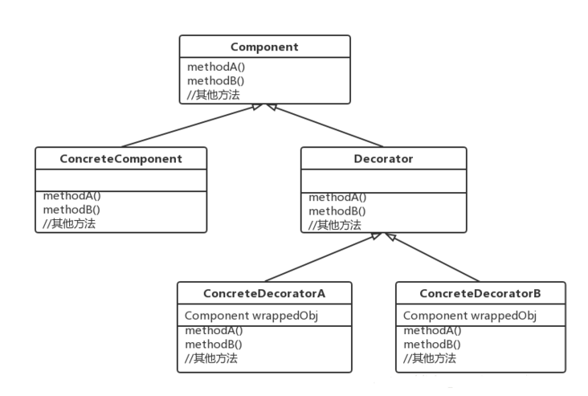

## 1.1 什么是装饰者模式

**装饰者模式指的是在不必改变原类文件和使用继承的情况下，动态地扩展一个对象的功能**。

它是通过创建一个包装对象，也就是装饰者来包裹真实的对象。
所以装饰者可以动态地将责任附加到对象上。若要扩展功能，装饰者提供了比继承更有弹性的方案。

> 装饰者模式，就是在原有的基类的基础上，给对象添加一些额外的职能，对对象进行包装和修饰，以此来展示出一个更为复杂的、功能更为齐全的新对象。装饰者模式跟子类继承的方式非常类似，都是在基类的基础上拓展功能，但是比基类更加的灵活，也符合多组合、少继承的设计原则，避免对象之间的耦合。

## 1.2 装饰者模式组成结构

+ 抽象构件 (Component)：给出抽象接口或抽象类，以规范准备接收附加功能的对象。
+ 具体构件 (ConcreteComponent)：定义将要接收附加功能的类。
+ 抽象装饰 (Decorator)：装饰者共同要实现的接口，也可以是抽象类。
+ 具体装饰 (ConcreteDecorator)：持有一个 Component 对象，负责给构件对象“贴上”附加的功能。

## 1.3 装饰者模式 UML 图解

## 1.4 装饰者模式应用场景

+ 需要扩展一个类的功能，或给一个类添加附加职责。
+ 需要动态的给一个对象添加功能，这些功能可以再动态的撤销。
+ **需要增加由一些基本功能的排列组合而产生的非常大量的功能，从而使继承关系变的不现实。**
+ **当不能采用生成子类的方法进行扩充时。可能有大量独立的扩展，为支持每一种组合将产生大量的子类，使得子类数目呈爆炸性增长。**

## 1.5 装饰者模式特点

+ **装饰者对象和具体构件有相同的接口**。这样客户端对象就能以和真实对象相同的方式和装饰对象交互。
+ **可以使用一个或多个装饰对象包装一个对象**。
+ 装饰者对象包含一个具体构件的引用（reference）。
+ 装饰者对象接受所有来自客户端的请求。它把这些请求转发给具体构件。
+ 装饰者对象可以在转发这些请求以前或以后动态增加一些功能。

## 1.6 装饰者模式的优缺点
装饰者模式与继承关系的目的都是要扩展对象的功能，但是 Decorator 可以提供比继承更多的灵活性。
通过使用不同的具体装饰类以及这些装饰类的排列组合，设计者可以创造出很多不同行为的组合。
缺点

这种比继承更加灵活机动的特性，也同时意味着更加多的复杂性。
装饰模式会导致设计中出现许多小类 (I/O 类中就是这样)，如果过度使用，会使程序变得很复杂。
装饰模式是针对抽象组件（Component）类型编程。但是，如果你要针对具体组件编程时，就应该重新思考你的应用架构，以及装饰者是否合适。

## 装饰器和代理模式的区别

> 对装饰器模式来说，装饰者（Decorator）和被装饰者（Decoratee）都实现一个接口。对代理模式来说，代理类（Proxy Class）和真实处理的类（Real Class）都实现同一个接口。此外，不论我们使用哪一个模式，都可以很容易地在真实对象的方法前面或者后面加上自定义的方法。
>
> 
>
> 在上面的例子中，装饰器模式是使用的调用者从外部传入的被装饰对象（coffee），调用者只想要你把他给你的对象装饰（加强）一下。而代理模式使用的是代理对象在自己的构造方法里面new的一个被代理的对象，不是调用者传入的。调用者不知道你找了其他人，他也不关心这些事，只要你把事情做对了即可。
>
> 
>
> 装饰器模式关注于在一个对象上动态地添加方法，而代理模式关注于控制对对象的访问。换句话说，**用代理模式，代理类可以对它的客户隐藏一个对象的具体信息。因此当使用代理模式的时候，我们常常在一个代理类中创建一个对象的实例；当使用装饰器模式的时候，我们通常的做法是将原始对象作为一个参数传给装饰器的构造器。**
>
> 
>
> 装饰器模式和代理模式的使用场景不一样，
>
> 比如IO流使用的是**装饰者模式，可以层层增加功能**；而代理模式则**一般是用于增加特殊的功能，有些动态代理不支持多层嵌套**。
>
> 
>
> 代理和装饰其实从另一个角度更容易去理解两个模式的区别：代理更多的是强调对对象的访问控制，比如说，访问A对象的查询功能时，访问B对象的更新功能时，访问C对象的删除功能时，都需要判断对象是否登陆，那么我需要将判断用户是否登陆的功能抽提出来，并对A对象、B对象和C对象进行代理，使访问它们时都需要去判断用户是否登陆，简单地说就是将某个控制访问权限应用到多个对象上；而装饰器更多的强调给对象加强功能，比如说要给只会唱歌的A对象添加跳舞功能，添加说唱功能等，简单地说就是将多个功能附加在一个对象上。
>
> 所以，**代理模式注重的是对对象的某一功能的流程把控和辅助**，它可以控制对象做某些事，重心是为了借用对象的功能完成某一流程，而非对象功能如何。而**装饰模式注重的是对对象功能的扩展，不关心外界如何调用，只注重对对象功能加强，装饰后还是对象本身**。

> **总结**
>
> 对于代理类，如何调用对象的某一功能是思考重点，而不需要兼顾对象的所有功能；对于装饰类，如何扩展对象的某一功能是思考重点，同时也需要兼顾对象的其他功能，因为再怎么装饰，本质也是对象本身，要担负起对象应有的职责，被装饰者的职责一旦增加，作为装饰类也需要有相应的扩展，必然会造成编码的负担。
>
> 设计模式本身是为了提升代码的可扩展性，灵活应用即可，不必生搬硬套，非要分出个所以然来，装饰器模式和代理模式的区别也是如此。

> 参考
>
> https://juejin.cn/post/6844904205723910151
>
> https://blog.csdn.net/hustzw07/article/details/80795855
>
> https://segmentfault.com/a/1190000016508992
