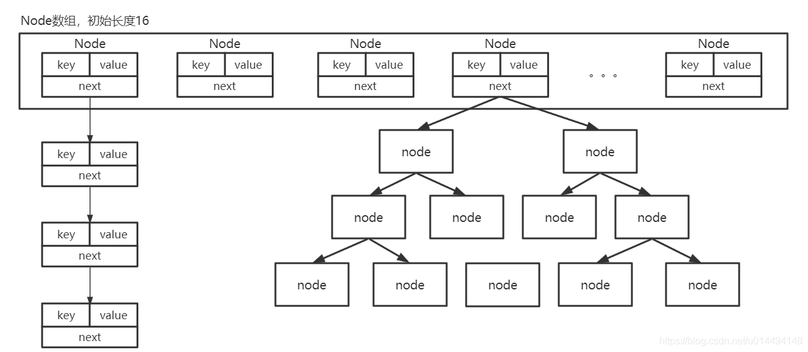
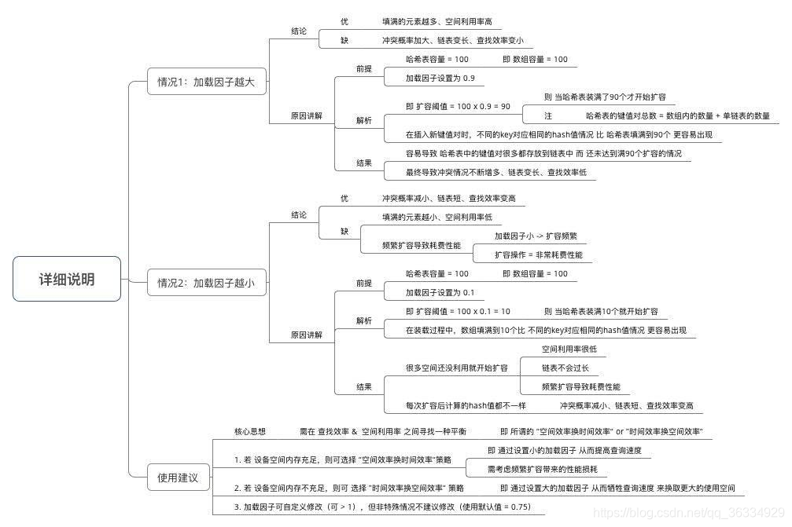
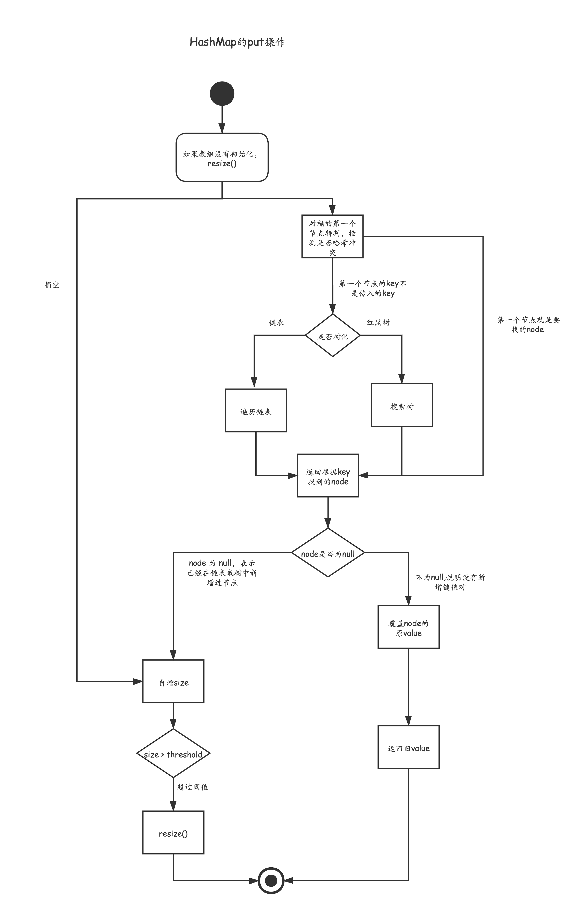
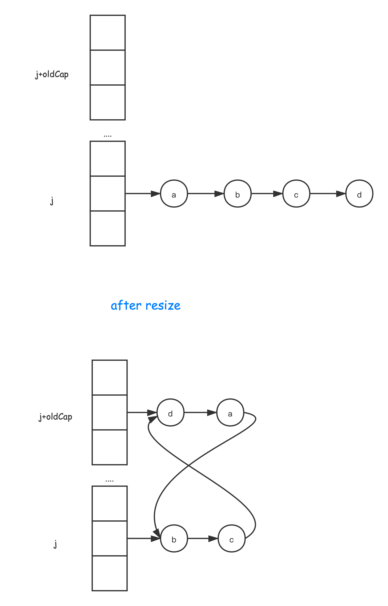
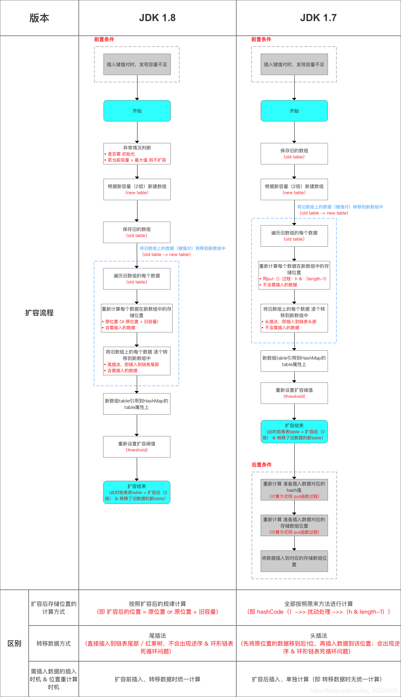
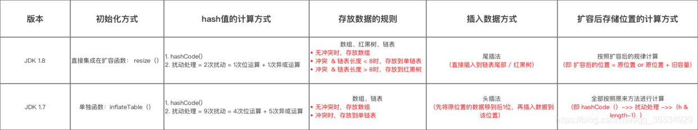

---

title: 这次彻底解决HashMap!
date: 2021-08-03
categories: Java集合类
tags: 
  - Java集合类
  - 数据结构
  - 源码系列
---


> 前言，这篇文章着眼于JDK中HashMap的实现，源码解析，以及常见的面试问题。
>
> 对于一般的哈希表的实现，各种散列算法以及解决哈希冲突的方案本文并不完全介绍。
>
> 而且，关于红黑树的部分，本篇文章也不设计，只是直接调用api。


# HashMap 文档
以下来自 HashMap 文档。

重点已加粗，并且增加了自己的批注。

>基于哈希表的Map接口的实现。
>
>此实现提供所有可选的映射操作，并**允许空值和空键**。 
>
>HashMap类与Hashtable底层都是hash表，不同之处在于**HashMap线程不安全**，并且允许 null。
>
>该实现为**基本操作（ get和put ）提供了常量时间的性能**，假设哈希函数将元素正确地分散在存储桶中。 
>
>集合视图上的迭代所需的时间与HashMap实例的“capacity”（存储桶数）及其 size（键-值映射数）成正比。 因此，如果迭代性能很重要，则不要将初始容量设置得过高（或负载因子过低），这一点非常重要。（**否则会产生大量空桶,影响遍历效率**）
>
>HashMap的实例具有两个影响其性能的参数：**初始容量（ initial capacity ）和负载因子（ load factor）**。
>
>**容量是哈希表中存储桶的数量**，初始容量是创建哈希表时的容量。 
>
>**负载因子是散列表的容量自动增加之前允许其填充的完整程度的度量**。 当哈希表中的条目数超过**负载因子和当前容量的乘积**时，哈希表将被重新哈希（rehashed）（即内部数据结构将被重建）。
>
>通常，**默认负载因子（0.75）**在时间和空间成本之间提供了一个很好的折衷方案。 较高的值会减少空间开销，但会增加查找成本（在HashMap类的大多数操作中都得到了体现，包括get和put ）。 设置其初始容量时，应考虑映射中的预期条目数及其负载因子，以最大程度地减少重新哈希操作的次数。 如果初始容量大于最大条目数除以负载因子，则将不会进行任何哈希操作。
>
>如果将许多映射存储在HashMap实例中，则创建具有足够大容量的映射将比让其根据需要增长表的自动重新哈希处理更有效地存储映射（**即如果确定在创建时就有大量映射存入HashMap,为了避免反复扩容，应确保足够大的初始容量**）。 请注意，在具有大量相同hashCode()的键会降低哈希表性能， 为了改善影响，**当键为Comparable** ，此类可以使用键之间的比较顺序来帮助打破平局（**即链表转红黑树**）。
>
>请注意，HashMap未实现同步。 如果多个线程同时访问一个哈希映射，并且至少有一个线程在结构上修改该映射，则必须在外部进行同步。 （**结构修改是添加或删除一个或多个映射的任何操作；仅更改已经包含的键相关联的值不是结构修改**。）


# HashMap

## 数据组织结构

**数组+链表+红黑树—— 一般的哈希表 + 红黑树**

如下图：




## HashMap的核心参数

+ `capacity`：HashMap的容量，即Node[]数组的size，HashMap会强制的将容量设置为2的幂，这样在对key取hash值的时候可以直接使用位运算来代替一般的取模。（比如容量为16时，只取key对象hash值的后4位，其值肯定在0~15的范围内，不会造成数组越界）

+ `initialCapacity`：初始容量（默认为16），在使用HashMap的构造器实例化对象的时候，可以根据数据量设置map的初始化容量，来避免HashMap的频繁扩容

+ `MAXIMUM_CAPACITY`：HashMap的最大容量（常量：2^30），当HashMap的容量达到MAXIMUM_CAPACITY后，将不再会扩容

+ `loadFactor`：加载因子（默认为0.75），用来确定什么时候需要扩容。用于避免Node[]数组中有过多的链表或树形结构。加载因子越大，空间利用率越高，但是数组中的链表结构可能就越长，查找效率越小。下图是关于加载因子大小的分析。




+ `threshold`：阈值（默认为16*0.75），其值等于capacity×loadFactor，当HashMap中的键值对数量达到这个阈值时，就需要扩容了（JDK1.7还会判断当前的数组位置是否为空）

+ `TREEIFY_THRESHOLD`：桶的树化阈值（常量，值为8），即链表转为红黑树的阈值，当某一链表的长度**大于**该值时，就考虑转化成红黑树了（还需要考虑最小树形化容量阈值MIN_TREEIFY_CAPACITY）

+ `MIN_TREEIFY_CAPACITY`：最小树形化容量阈值（常量，值为64），当某一链表的长度大于8（桶的树化阈值）时，如果此时HashMap的容量不大于64，则此时不会将链表转化为红黑树，而是对HashMap进行扩容，只有容量大于64时，才对链表转化成红黑树。

+ `UNTREEIFY_THRESHOLD`：桶的链表还原阈值（常量，值为6），即红黑树转化成链表的阈值，当在扩容（resize()）时，HashMap中数据的储存位置会发生改变，在重新计算过储存位置后，如果红黑树中元素的数量小于6，那么将会把红黑树结构转化成链表结构。


## 构造器

如下，为HashMap提供的三种构造器，值得注意的是无论哪一种，都没有初始化数组，都只会在第一次添加元素的时候，惰性地去将`table数组`扩容，也就是一个空的HashMap没有浪费太多空间。


```java
// 可以指定初始容量、负载因子
public HashMap(int initialCapacity, float loadFactor) {
    if (initialCapacity < 0)
        throw new IllegalArgumentException("Illegal initial capacity: " +
                                           initialCapacity);
    if (initialCapacity > MAXIMUM_CAPACITY)
        initialCapacity = MAXIMUM_CAPACITY;
    if (loadFactor <= 0 || Float.isNaN(loadFactor))
        throw new IllegalArgumentException("Illegal load factor: " +
                                           loadFactor);
    this.loadFactor = loadFactor;
    this.threshold = tableSizeFor(initialCapacity); // 大于等于 initialCapacity 的最小2的整数次幂
}

public HashMap(int initialCapacity) {
    this(initialCapacity, DEFAULT_LOAD_FACTOR);
}

// 注意此时 threshold = 0， 表示下次扩容时应扩展至 DEFAULT_INITIAL_CAPACITY 
public HashMap() {
    this.loadFactor = DEFAULT_LOAD_FACTOR; // all other fields defaulted
}
```


## put 操作

根据源码的put操作即可绘制下面的流程图：




```java
// onlyIfAbsent 的作用是为 putIfAbsent等 API提供服务
// 调用了 newNode()、resize()、putTreeVal()、treeifyBin()

// afterNodeAccess()、afterNodeInsertion （LinkedMap的性质维护）
final V putVal(int hash, K key, V value, boolean onlyIfAbsent,
               boolean evict) {
    Node<K,V>[] tab; Node<K,V> p; int n, i;
  
    // 1. tab 为空时，需要初始化一下
    if ((tab = table) == null || (n = tab.length) == 0)
        n = (tab = resize()).length;
    
    if ((p = tab[i = (n - 1) & hash]) == null)
        // 2.1 桶现在是空
        tab[i] = newNode(hash, key, value, null);
    else {
        Node<K,V> e; K k;
        // 判断第一个节点的性质———— 1.key相同（key相同的前提是hash相等）2. rb树的根， 3. 链表的表头
        // 2.2.1 找到一个 key 对应的节点
        if (p.hash == hash &&
            ((k = p.key) == key || (key != null && key.equals(k))))
            e = p;
        // 2.2.2 已经树化了，p 此时为 树根，调用它的 putTreeVal 
        else if (p instanceof TreeNode)
            e = ((TreeNode<K,V>)p).putTreeVal(this, tab, hash, key, value);
        else {
            // 2.2.3 遍历链表
            for (int binCount = 0; ; ++binCount) {
                //整体逻辑是 先判空，后判相等
              
                if ((e = p.next) == null) {
                    // 链表走到头了
                    p.next = newNode(hash, key, value, null);
                    // 检查是否可以树化
                    // treeifyBin 里面会验证是否超过了 MIN_TREEIFY_CAPACITY
                    if (binCount >= TREEIFY_THRESHOLD - 1) // -1 for 1st
                        treeifyBin(tab, hash);
                    // 进入这个逻辑即要退出循环
                    break;
                }
                // 和上面的key的判定是一样的
                if (e.hash == hash &&
                    ((k = e.key) == key || (key != null && key.equals(k))))
                    break;
                // 链表节点后移
                p = e;
            }
        }
        // 已经存在这个映射，用新值代替旧值
        if (e != null) { // existing mapping for key
            V oldValue = e.value;
            if (!onlyIfAbsent || oldValue == null)
                e.value = value; // 替换旧值
            // ...
            afterNodeAccess(e);
            return oldValue; // 返回旧值
        }
    }
    ++modCount; // fast-fail 机制
  
    // 先插入后检查是否要扩容
    if (++size > threshold)
        // 调用扩容方法
        resize();
    // ...
    afterNodeInsertion(evict);
    return null;
}
```


## get 操作

get操作比较简单。

在数组不为空的情况下，hash值与数组长度取模（实际上是位于运算）定位到桶的位置。

一样的，先检查桶中的第一个节点，如果key匹配，返回。

如果第一个不匹配，要么在树中搜寻，要么在链表中遍历（根据节点的 instance 判断）。


```java
// 传入 key 的哈希吗以及key， 且 hash = hash(key)
final Node<K,V> getNode(int hash, Object key) {
    Node<K,V>[] tab; Node<K,V> first, e; int n; K k;
    if ((tab = table) != null && (n = tab.length) > 0 &&
        (first = tab[(n - 1) & hash]) != null) {
        
        // 总是先检查第一个节点，因为第一个节点既有可能是链表节点，也有可能是红黑树的树根
        if (first.hash == hash && // always check first node
            // 注意这里的 k 是可能为 null 的（HashMap允许为空）
            ((k = first.key) == key || (key != null && key.equals(k))))
            return first;
        
        if ((e = first.next) != null) {
            // 如果Node已经树化，则调用树的 getTreeNode 的 方法
            if (first instanceof TreeNode)
                return ((TreeNode<K,V>)first).getTreeNode(hash, key);
            do {
                // 判断顺序 hash（最快） -> key的==比较 -> key 的equals比较
                if (e.hash == hash &&
                    ((k = e.key) == key || (key != null && key.equals(k))))
                    return e;
            } while ((e = e.next) != null);
        }
    }
    return null;
}
```


## resize（扩容操作）


> jdk 1.8 以来，rehash 的过程也进行了改动，基于复制的算法思想,不直接操作原链，而是定义了两条链表分别完成对原链的结点分离操作，即使是多线程的情况下也是安全的。


扩容操作分为两个部分：

### 确定新的容量和阈值 

具体的：

1. 如果调用的是无参构造参数，在第一次扩容时，容量默认是16，扩容阈值为12（16*0.75）

2. 如果调用的是有参构造函数，在第一次扩容时，容量为大于等于`initialCapacity`的最小二次幂，

   阈值为容量*负载因子。

3. 其他情况下，如果旧容量已经大于`MAXIMUM_CAPACITY`不选择扩容，直接返回；否则容量double一下, 阈值为容量*负载因子。

   

```java
// 初始化或double容量
// 由于在capacity为2的整数次幂的情况下，取模具有这样的特点：
// 某个Node在扩容之后要么在table[index](aka 原位置)，要么在table[index + oldCap]
final Node<K,V>[] resize() {
    Node<K,V>[] oldTab = table;
    int oldCap = (oldTab == null) ? 0 : oldTab.length;
    int oldThr = threshold;
    int newCap, newThr = 0;
    
    // old容量大于0
    if (oldCap > 0) {
        // 原来的容量已经超过最大值， 此时无法扩容，直接返回
        if (oldCap >= MAXIMUM_CAPACITY) {
            threshold = Integer.MAX_VALUE;
            return oldTab;
        }
      
        // double old容量
        else if ((newCap = oldCap << 1) < MAXIMUM_CAPACITY &&  // oldCap 最大为 (2**30-1)*2
                 oldCap >= DEFAULT_INITIAL_CAPACITY)
            newThr = oldThr << 1; // double threshold
    }
    // old容量等于0，并且old“下次调整值”大于0 （也就是说用户指定了initialCapacity）
    else if (oldThr > 0) // 由用户初始化的容量（不过还要经过tableSizeFor方法）经 threshold 保存
        newCap = oldThr;
    // old容量等于0，并且old“下次调整值”等于0
    else {               // 用户用无参构造器时的第一次初始化
        newCap = DEFAULT_INITIAL_CAPACITY;
        newThr = (int)(DEFAULT_LOAD_FACTOR * DEFAULT_INITIAL_CAPACITY);
    }
  
    if (newThr == 0) {
        float ft = (float)newCap * loadFactor;
        newThr = (newCap < MAXIMUM_CAPACITY && ft < (float)MAXIMUM_CAPACITY ?
                  (int)ft : Integer.MAX_VALUE); // 赋值为 newCap * loadFactor， 除非超出最大值
    }
    threshold = newThr; // 更新 threshold 
  
    @SuppressWarnings({"rawtypes","unchecked"})
    // 分配内存，创建新数组
    Node<K,V>[] newTab = (Node<K,V>[])new Node[newCap];
    table = newTab;
   
    return newTab;
}
```


### 元素的再散列

再散列的逻辑，

遍历旧数组的每一个桶，若桶为空，跳过；

若不为空，如果是树，调用TreeNode的split方法将一棵树分裂开来（如果树的节点个数小于`UNTREEIFY_THRESHOLD`）将树链表化；

如果是链表，在遍历这条链表的时候，构造两条链表，一条称为"低链表"，第二条称为“高链表”。

分别在遍历完链表后，一条放在原位置，一条放在（原位置+oldCap）的位置上。


```java
// 如果oldTab为null，也无需移动元素了
if (oldTab != null) {
    // 遍历每一个桶
    for (int j = 0; j < oldCap; ++j) {
        Node<K,V> e;
        // 链表为空就continue
        if ((e = oldTab[j]) != null) {
            oldTab[j] = null; // help GC
          
            if (e.next == null) // 此时只有一个节点
                newTab[e.hash & (newCap - 1)] = e;
            else if (e instanceof TreeNode) // 已经树化，则调用红黑树的方法，
                // 注意 split 方法中，可能将树链表化
                ((TreeNode<K,V>)e).split(this, newTab, j, oldCap);
            else { // 维护原顺序（“尾插法”）
                
                Node<K,V> loHead = null, loTail = null; // table[index]对应的链表 
                Node<K,V> hiHead = null, hiTail = null; // table[index + oldLen]对应的链表
                Node<K,V> next;
                do {
                    next = e.next;
                    // e 是当前要处理的元素
                    if ((e.hash & oldCap) == 0) { // 注意此位运算的含义
                        if (loTail == null)
                            loHead = e;
                        else
                            loTail.next = e;
                        loTail = e;
                    }
                    else {
                        if (hiTail == null)
                            hiHead = e;
                        else
                            hiTail.next = e;
                        hiTail = e;
                    }
                } while ((e = next) != null); // 遍历链表
              
                // 一条链经过resize后分裂成两条链
                if (loTail != null) {
                    loTail.next = null; // 必须去除这个冗余的节点引用
                    newTab[j] = loHead; 
                }
                if (hiTail != null) {
                    hiTail.next = null; // 必须去除这个冗余的节点引用
                    newTab[j + oldCap] = hiHead;
                }
            }
        }
    }
}
```


# 面试常见问题


## JDK1.7与JDK1.8的区别

### 头插法改尾插法
JDK1.7时的头插法的导致的死循环问题：



头插法改为尾插法：



### 引入红黑树




# 源码解析

## 哈希表核心逻辑

```java
package java.util;


public class HashMap<K,V> extends AbstractMap<K,V>
    implements Map<K,V>, Cloneable, Serializable {

    private static final long serialVersionUID = 362498820763181265L;

   
    // 默认初始容量
    static final int DEFAULT_INITIAL_CAPACITY = 1 << 4; // aka 16

    //  最大容量
    static final int MAXIMUM_CAPACITY = 1 << 30;

    // 默认负载因子
    static final float DEFAULT_LOAD_FACTOR = 0.75f;

    // 链表树化的最小阈值
    static final int TREEIFY_THRESHOLD = 8;

    // 红黑树链表化的最小阈值
    static final int UNTREEIFY_THRESHOLD = 6;

    // 树化的最小容量值（即如果容量小于 MIN_TREEIFY_CAPACITY ，即使链表长度大于 TREEIFY_THRESHOLD 也不会树化，这时会优先选择扩容）
    static final int MIN_TREEIFY_CAPACITY = 64;

    // 内部 Node
    static class Node<K,V> implements Map.Entry<K,V> {
        final int hash;
        final K key;
        V value;
        // 由于是链表结构, 所以有 next
        Node<K,V> next;

        Node(int hash, K key, V value, Node<K,V> next) {
            this.hash = hash;
            this.key = key;
            this.value = value;
            this.next = next;
        }

        public final K getKey()        { return key; }
        public final V getValue()      { return value; }
        public final String toString() { return key + "=" + value; }


        public final int hashCode() {
            return Objects.hashCode(key) ^ Objects.hashCode(value);
        }

        public final V setValue(V newValue) {
            V oldValue = value;
            value = newValue;
            return oldValue;
        }
      
        public final boolean equals(Object o) {
            if (o == this)
                return true;
            if (o instanceof Map.Entry) {
                Map.Entry<?,?> e = (Map.Entry<?,?>)o;
                if (Objects.equals(key, e.getKey()) &&
                    Objects.equals(value, e.getValue()))
                    return true;
            }
            return false;
        }
    }

    /* ---------------- Static utilities -------------- */


    // 由于使用了长度为 2 的整数次幂的模长，为了避免hashCode高位的失效，
    // 通过让hashCode的高16位与低16位进行异或，达到尽可能使用hashCode的全部
    // 当然，如果hashCode已经分散的足够好，此方法的增益也没有多大
    static final int hash(Object key) {
        int h;
        return (key == null) ? 0 : (h = key.hashCode()) ^ (h >>> 16);
    }

		// 返回 x 的类，如果它是“类 C 实现 Comparable”的形式  "，否则为空。
    // 但必须是直接实现了 Comparable 接口
    static Class<?> comparableClassFor(Object x) {
        if (x instanceof Comparable) {
            Class<?> c; Type[] ts, as; Type t; ParameterizedType p;
          	// String 使用的很频繁，所以直接先检查一下
            if ((c = x.getClass()) == String.class) // bypass checks
                return c;
            // 返回表示由该对象表示的类或接口直接实现的接口的type
            if ((ts = c.getGenericInterfaces()) != null) {
                // 遍历它实现的接口
                for (int i = 0; i < ts.length; ++i) {
                    if (((t = ts[i]) instanceof ParameterizedType) &&
                        ((p = (ParameterizedType)t).getRawType() ==
                         Comparable.class) &&
                        (as = p.getActualTypeArguments()) != null &&
                        as.length == 1 && as[0] == c) // type arg is c
                        return c;
                }
            }
        }
        return null;
    }

    /**
     * Returns k.compareTo(x) if x matches kc (k's screened comparable
     * class), else 0.
     */
    @SuppressWarnings({"rawtypes","unchecked"}) // for cast to Comparable
    static int compareComparables(Class<?> kc, Object k, Object x) {
        return (x == null || x.getClass() != kc ? 0 :
                ((Comparable)k).compareTo(x));
    }

    // 计算 大于等于 cap 的最小的2的整数次幂
    static final int tableSizeFor(int cap) {
        int n = cap - 1;
        n |= n >>> 1;
        n |= n >>> 2;
        n |= n >>> 4;
        n |= n >>> 8;
        n |= n >>> 16;
        return (n < 0) ? 1 : (n >= MAXIMUM_CAPACITY) ? MAXIMUM_CAPACITY : n + 1;
    }

    /* ---------------- Fields -------------- */

    // 存储 Node 的数组，len 为 2^n
    // 此时取模运算 index = hash % len = hash & (n - 1) 
    transient Node<K,V>[] table;

    // 也是视图性质的”集合“
    transient Set<Map.Entry<K,V>> entrySet;

    // 键值对的数目
    transient int size;

    // 修改的次数，支持 fast-fail 机制
    transient int modCount;

    // 要调整大小的下一个大小值（容量 * 负载因子）cap*loadFactor 。 
    int threshold;

    final float loadFactor;

  
    /* ---------------- Public operations -------------- */


    // 构造方法见上


    public int size() {
        return size;
    }

    public boolean isEmpty() {
        return size == 0;
    }


    public V get(Object key) {
        Node<K,V> e;
        return (e = getNode(hash(key), key)) == null ? null : e.value;
        // 源码解析见上
    }


    public boolean containsKey(Object key) {
        // 有无 key 对应的 entry
        return getNode(hash(key), key) != null;
    }

    
    
    public V put(K key, V value) {
        return putVal(hash(key), key, value, false, true);
        // 源码解析见上
    }

    


    
    // 链表树化方法
    // 调用 TreeNode.treeify()
    final void treeifyBin(Node<K,V>[] tab, int hash) {
        int n, index; Node<K,V> e;
        if (tab == null || (n = tab.length) < MIN_TREEIFY_CAPACITY) // 如果table调小，优先扩容
            resize();
        else if ((e = tab[index = (n - 1) & hash]) != null) {
            TreeNode<K,V> hd = null, tl = null; // 根、前驱
            do {
                TreeNode<K,V> p = replacementTreeNode(e, null);
                if (tl == null)
                    hd = p;
                else {
                    p.prev = tl;
                    tl.next = p;
                }
                tl = p;
            } while ((e = e.next) != null);  // 遍历链表
            
            // 树化
            if ((tab[index] = hd) != null)
                hd.treeify(tab);
        }
    }

 

    public V remove(Object key) {
        Node<K,V> e;
        return (e = removeNode(hash(key), key, null, false, true)) == null ?
            null : e.value;
    }

  
    // 调用 getTreeNode()、removeTreeNode()
    // 调用回调方法 afterNodeRemoval()
    // matchValue、movable这两个控制变量主要是为了支持其他api方法
    final Node<K,V> removeNode(int hash, Object key, Object value,
                               boolean matchValue, boolean movable) {
        Node<K,V>[] tab; Node<K,V> p; int n, index;
        if ((tab = table) != null && (n = tab.length) > 0 &&
            (p = tab[index = (n - 1) & hash]) != null) {
            Node<K,V> node = null, e; K k; V v;  // node 维护为要删除的node
            
            // 找到 node
            if (p.hash == hash &&
                ((k = p.key) == key || (key != null && key.equals(k)))) // 只有一个节点
                node = p;
            else if ((e = p.next) != null) { 
                if (p instanceof TreeNode)
                    node = ((TreeNode<K,V>)p).getTreeNode(hash, key);  // 调用树的getNode方法
                 else {
                    do {
                        if (e.hash == hash &&
                            ((k = e.key) == key ||
                             (key != null && key.equals(k)))) {
                            node = e;
                            break;
                        }
                        p = e;
                    } while ((e = e.next) != null);
                }
            }
            // node 是要删除的节点、p是前驱
            if (node != null && (!matchValue || (v = node.value) == value ||
                                 (value != null && value.equals(v)))) {
                if (node instanceof TreeNode)
                    ((TreeNode<K,V>)node).removeTreeNode(this, tab, movable);
                else if (node == p) // node 刚好是第一个节点
                    tab[index] = node.next;
                else
                    p.next = node.next;
                ++modCount;
                --size;
                afterNodeRemoval(node); // 钩子函数善后
                return node;
            }
        }
        return null;
    }

    // 注意 capacity 并没有发生变化
    public void clear() {
        Node<K,V>[] tab;
        modCount++;
        if ((tab = table) != null && size > 0) {
            size = 0;
            for (int i = 0; i < tab.length; ++i)
                tab[i] = null;
        }
    }

    // 此时间复杂度：O(n)
    public boolean containsValue(Object value) {
        Node<K,V>[] tab; V v;
        if ((tab = table) != null && size > 0) {
            for (int i = 0; i < tab.length; ++i) {
                for (Node<K,V> e = tab[i]; e != null; e = e.next) {
                    if ((v = e.value) == value ||
                        (value != null && value.equals(v)))
                        return true;
                }
            }
        }
        return false;
    }

  
    /*
      下面是 keySet()、values、entrySet() 的代码部分：都是缓存性质的“视图集合”。
      实现方式也是一样，采用内部类继承抽象集合类（使用迭代器访问真实数据，自身不存储数据）
    */
    
    public Set<K> keySet() {
        Set<K> ks = keySet;
        if (ks == null) {
            ks = new KeySet();
            keySet = ks;
        }
        return ks;
    }
    final class KeySet extends AbstractSet<K> {
				// 
    }
    public Collection<V> values() {
        Collection<V> vs = values;
        if (vs == null) {
            vs = new Values();
            values = vs;
        }
        return vs;
    }
    final class Values extends AbstractCollection<V> {
    }
    public Set<Map.Entry<K,V>> entrySet() {
        Set<Map.Entry<K,V>> es;
        return (es = entrySet) == null ? (entrySet = new EntrySet()) : es;
    }

    final class EntrySet extends AbstractSet<Map.Entry<K,V>> {
        //
    }
 

}
```


## 链表树化的具体实现类

```java
/* ------------------------------------------------------------ */
// Tree bins

// 树箱的entry。 扩展 LinkedHashMap.Entry（进而扩展Node），因此可以用作常规链表节点的扩展。
static final class TreeNode<K,V> extends LinkedHashMap.Entry<K,V> {
   
    // 和标准红黑树字段设计相比，多了前项、后向引用
    
    TreeNode<K,V> parent;  // red-black tree links
    TreeNode<K,V> left;
    TreeNode<K,V> right;
    TreeNode<K,V> prev; 
    boolean red;
    TreeNode(int hash, K key, V val, Node<K,V> next) {
        super(hash, key, val, next);
    }

    /**
     * Returns root of tree containing this node.
     */
    final TreeNode<K,V> root() {
        for (TreeNode<K,V> r = this, p;;) {
            if ((p = r.parent) == null)
                return r;
            r = p;
        }
    }

    /**
     * Ensures that the given root is the first node of its bin.
     */
    static <K,V> void moveRootToFront(Node<K,V>[] tab, TreeNode<K,V> root) {
        int n;
        if (root != null && tab != null && (n = tab.length) > 0) {
            int index = (n - 1) & root.hash;
            TreeNode<K,V> first = (TreeNode<K,V>)tab[index];
            if (root != first) {
                Node<K,V> rn;
                tab[index] = root;
                TreeNode<K,V> rp = root.prev;
                if ((rn = root.next) != null)
                    ((TreeNode<K,V>)rn).prev = rp;
                if (rp != null)
                    rp.next = rn;
                if (first != null)
                    first.prev = root;
                root.next = first;
                root.prev = null;
            }
            assert checkInvariants(root);
        }
    }

    /**
     * Finds the node starting at root p with the given hash and key.
     * The kc argument caches comparableClassFor(key) upon first use
     * comparing keys.
     */
    final TreeNode<K,V> find(int h, Object k, Class<?> kc) {
        TreeNode<K,V> p = this;
        do {
            int ph, dir; K pk;
            TreeNode<K,V> pl = p.left, pr = p.right, q;
            if ((ph = p.hash) > h)
                p = pl;
            else if (ph < h)
                p = pr;
            else if ((pk = p.key) == k || (k != null && k.equals(pk)))
                return p;
            else if (pl == null)
                p = pr;
            else if (pr == null)
                p = pl;
            else if ((kc != null ||
                      (kc = comparableClassFor(k)) != null) &&
                     (dir = compareComparables(kc, k, pk)) != 0)
                p = (dir < 0) ? pl : pr;
            else if ((q = pr.find(h, k, kc)) != null)
                return q;
            else
                p = pl;
        } while (p != null);
        return null;
    }

    /**
     * Calls find for root node.
     */
    final TreeNode<K,V> getTreeNode(int h, Object k) {
        return ((parent != null) ? root() : this).find(h, k, null);
    }

    /**
     * Tie-breaking utility for ordering insertions when equal
     * hashCodes and non-comparable. We don't require a total
     * order, just a consistent insertion rule to maintain
     * equivalence across rebalancings. Tie-breaking further than
     * necessary simplifies testing a bit.
     */
    static int tieBreakOrder(Object a, Object b) {
        int d;
        if (a == null || b == null ||
            (d = a.getClass().getName().
             compareTo(b.getClass().getName())) == 0)
            d = (System.identityHashCode(a) <= System.identityHashCode(b) ?
                 -1 : 1);
        return d;
    }

    /**
     * Forms tree of the nodes linked from this node.
     */
    final void treeify(Node<K,V>[] tab) {
        TreeNode<K,V> root = null;
        for (TreeNode<K,V> x = this, next; x != null; x = next) {
            next = (TreeNode<K,V>)x.next;
            x.left = x.right = null;
            if (root == null) {
                x.parent = null;
                x.red = false;
                root = x;
            }
            else {
                K k = x.key;
                int h = x.hash;
                Class<?> kc = null;
                for (TreeNode<K,V> p = root;;) {
                    int dir, ph;
                    K pk = p.key;
                    if ((ph = p.hash) > h)
                        dir = -1;
                    else if (ph < h)
                        dir = 1;
                    else if ((kc == null &&
                              (kc = comparableClassFor(k)) == null) ||
                             (dir = compareComparables(kc, k, pk)) == 0)
                        dir = tieBreakOrder(k, pk);

                    TreeNode<K,V> xp = p;
                    if ((p = (dir <= 0) ? p.left : p.right) == null) {
                        x.parent = xp;
                        if (dir <= 0)
                            xp.left = x;
                        else
                            xp.right = x;
                        root = balanceInsertion(root, x);
                        break;
                    }
                }
            }
        }
        moveRootToFront(tab, root);
    }

    /**
     * Returns a list of non-TreeNodes replacing those linked from
     * this node.
     */
    final Node<K,V> untreeify(HashMap<K,V> map) {
        Node<K,V> hd = null, tl = null;
        for (Node<K,V> q = this; q != null; q = q.next) {
            Node<K,V> p = map.replacementNode(q, null);
            if (tl == null)
                hd = p;
            else
                tl.next = p;
            tl = p;
        }
        return hd;
    }

    /**
     * Tree version of putVal.
     */
    final TreeNode<K,V> putTreeVal(HashMap<K,V> map, Node<K,V>[] tab,
                                   int h, K k, V v) {
        Class<?> kc = null;
        boolean searched = false;
        TreeNode<K,V> root = (parent != null) ? root() : this;
        for (TreeNode<K,V> p = root;;) {
            int dir, ph; K pk;
            if ((ph = p.hash) > h)
                dir = -1;
            else if (ph < h)
                dir = 1;
            else if ((pk = p.key) == k || (k != null && k.equals(pk)))
                // 如果找到直接返回
                return p;
            else if ((kc == null &&
                      (kc = comparableClassFor(k)) == null) ||
                     (dir = compareComparables(kc, k, pk)) == 0) {
                if (!searched) {
                    TreeNode<K,V> q, ch;
                    searched = true;
                    if (((ch = p.left) != null &&
                         (q = ch.find(h, k, kc)) != null) ||
                        ((ch = p.right) != null &&
                         (q = ch.find(h, k, kc)) != null))
                        return q;
                }
                dir = tieBreakOrder(k, pk);
            }

            TreeNode<K,V> xp = p;
            if ((p = (dir <= 0) ? p.left : p.right) == null) {
                Node<K,V> xpn = xp.next;
                TreeNode<K,V> x = map.newTreeNode(h, k, v, xpn);
                if (dir <= 0)
                    xp.left = x;
                else
                    xp.right = x;
                xp.next = x;
                x.parent = x.prev = xp;
                if (xpn != null)
                    ((TreeNode<K,V>)xpn).prev = x;
                moveRootToFront(tab, balanceInsertion(root, x));
                // 如果是新插入的节点，返回 null
                return null;
            }
        }
    }

    /**
     * Removes the given node, that must be present before this call.
     * This is messier than typical red-black deletion code because we
     * cannot swap the contents of an interior node with a leaf
     * successor that is pinned by "next" pointers that are accessible
     * independently during traversal. So instead we swap the tree
     * linkages. If the current tree appears to have too few nodes,
     * the bin is converted back to a plain bin. (The test triggers
     * somewhere between 2 and 6 nodes, depending on tree structure).
     */
    final void removeTreeNode(HashMap<K,V> map, Node<K,V>[] tab,
                              boolean movable) {
        int n;
        if (tab == null || (n = tab.length) == 0)
            return;
        int index = (n - 1) & hash;
        TreeNode<K,V> first = (TreeNode<K,V>)tab[index], root = first, rl;
        TreeNode<K,V> succ = (TreeNode<K,V>)next, pred = prev;
        if (pred == null)
            tab[index] = first = succ;
        else
            pred.next = succ;
        if (succ != null)
            succ.prev = pred;
        if (first == null)
            return;
        if (root.parent != null)
            root = root.root();
        if (root == null
            || (movable
                && (root.right == null
                    || (rl = root.left) == null
                    || rl.left == null))) {
            tab[index] = first.untreeify(map);  // too small
            return;
        }
        TreeNode<K,V> p = this, pl = left, pr = right, replacement;
        if (pl != null && pr != null) {
            TreeNode<K,V> s = pr, sl;
            while ((sl = s.left) != null) // find successor
                s = sl;
            boolean c = s.red; s.red = p.red; p.red = c; // swap colors
            TreeNode<K,V> sr = s.right;
            TreeNode<K,V> pp = p.parent;
            if (s == pr) { // p was s's direct parent
                p.parent = s;
                s.right = p;
            }
            else {
                TreeNode<K,V> sp = s.parent;
                if ((p.parent = sp) != null) {
                    if (s == sp.left)
                        sp.left = p;
                    else
                        sp.right = p;
                }
                if ((s.right = pr) != null)
                    pr.parent = s;
            }
            p.left = null;
            if ((p.right = sr) != null)
                sr.parent = p;
            if ((s.left = pl) != null)
                pl.parent = s;
            if ((s.parent = pp) == null)
                root = s;
            else if (p == pp.left)
                pp.left = s;
            else
                pp.right = s;
            if (sr != null)
                replacement = sr;
            else
                replacement = p;
        }
        else if (pl != null)
            replacement = pl;
        else if (pr != null)
            replacement = pr;
        else
            replacement = p;
        if (replacement != p) {
            TreeNode<K,V> pp = replacement.parent = p.parent;
            if (pp == null)
                root = replacement;
            else if (p == pp.left)
                pp.left = replacement;
            else
                pp.right = replacement;
            p.left = p.right = p.parent = null;
        }

        TreeNode<K,V> r = p.red ? root : balanceDeletion(root, replacement);

        if (replacement == p) {  // detach
            TreeNode<K,V> pp = p.parent;
            p.parent = null;
            if (pp != null) {
                if (p == pp.left)
                    pp.left = null;
                else if (p == pp.right)
                    pp.right = null;
            }
        }
        if (movable)
            moveRootToFront(tab, r);
    }

    /**
     * Splits nodes in a tree bin into lower and upper tree bins,
     * or untreeifies if now too small. Called only from resize;
     * see above discussion about split bits and indices.
     *
     * @param map the map
     * @param tab the table for recording bin heads
     * @param index the index of the table being split
     * @param bit the bit of hash to split on
     */
    final void split(HashMap<K,V> map, Node<K,V>[] tab, int index, int bit) {
        TreeNode<K,V> b = this;
        // Relink into lo and hi lists, preserving order
        TreeNode<K,V> loHead = null, loTail = null;
        TreeNode<K,V> hiHead = null, hiTail = null;
        int lc = 0, hc = 0;
        for (TreeNode<K,V> e = b, next; e != null; e = next) {
            next = (TreeNode<K,V>)e.next;
            e.next = null;
            if ((e.hash & bit) == 0) {
                if ((e.prev = loTail) == null)
                    loHead = e;
                else
                    loTail.next = e;
                loTail = e;
                ++lc;
            }
            else {
                if ((e.prev = hiTail) == null)
                    hiHead = e;
                else
                    hiTail.next = e;
                hiTail = e;
                ++hc;
            }
        }

        if (loHead != null) {
            if (lc <= UNTREEIFY_THRESHOLD)
                tab[index] = loHead.untreeify(map);
            else {
                tab[index] = loHead;
                if (hiHead != null) // (else is already treeified)
                    loHead.treeify(tab);
            }
        }
        if (hiHead != null) {
            if (hc <= UNTREEIFY_THRESHOLD)
                tab[index + bit] = hiHead.untreeify(map);
            else {
                tab[index + bit] = hiHead;
                if (loHead != null)
                    hiHead.treeify(tab);
            }
        }
    }

    /* ------------------------------------------------------------ */
    // 红黑树的算法，全部来自于《算法导论》，省略代码

    static <K,V> TreeNode<K,V> rotateLeft(TreeNode<K,V> root,
                                          TreeNode<K,V> p) {
    }

    static <K,V> TreeNode<K,V> rotateRight(TreeNode<K,V> root,
                                           TreeNode<K,V> p) {
    }

    static <K,V> TreeNode<K,V> balanceInsertion(TreeNode<K,V> root,
                                                TreeNode<K,V> x) {
    }

    static <K,V> TreeNode<K,V> balanceDeletion(TreeNode<K,V> root,
    }
    
    static <K,V> boolean checkInvariants(TreeNode<K,V> t) {
    }
}
```


## 迭代器实现


```java
/* ------------------------------------------------------------ */
// iterators

abstract class HashIterator {
    Node<K,V> next;        // 下一个返回的节点
    Node<K,V> current;     // 当前节点
    int expectedModCount;  // fast-fail 机制 
    int index;             // current slot

    HashIterator() {
        expectedModCount = modCount;
        Node<K,V>[] t = table;
        current = next = null;
        index = 0;
        if (t != null && size > 0) { // 找第一个不为null的entry
            do {} while (index < t.length && (next = t[index++]) == null);
        }
    }

    public final boolean hasNext() {
        return next != null;
    }

    final Node<K,V> nextNode() {
        Node<K,V>[] t;
        Node<K,V> e = next;
        // 先检查 expectedModCount
        if (modCount != expectedModCount)
            throw new ConcurrentModificationException();
        if (e == null)
            throw new NoSuchElementException();
        
      	// 先遍历链表或者
        if ((next = (current = e).next) == null && (t = table) != null) {
            do {} while (index < t.length && (next = t[index++]) == null); 
        }
        return e;
    }

    // 调用 final removeNode的方法
    public final void remove() {
        Node<K,V> p = current;
        if (p == null)
            throw new IllegalStateException();
        if (modCount != expectedModCount) // 检查 expectedModCount
            throw new ConcurrentModificationException();
        current = null;
        K key = p.key;
        removeNode(hash(key), key, null, false, false);
        expectedModCount = modCount;
    }
}

/*
 keySet、values、entrySet的迭代器直接继承 HashIterator 即可
*/ 
  
final class KeyIterator extends HashIterator
    implements Iterator<K> {
    public final K next() { return nextNode().key; }
}

final class ValueIterator extends HashIterator
    implements Iterator<V> {
    public final V next() { return nextNode().value; }
}

final class EntryIterator extends HashIterator
    implements Iterator<Map.Entry<K,V>> {
    public final Map.Entry<K,V> next() { return nextNode(); }
}
```


[Java学习笔记——HashMap底层源码分析](https://blog.csdn.net/qq_36334929/article/details/117913430)

[散列算法](https://zhuanlan.zhihu.com/p/40515974)

